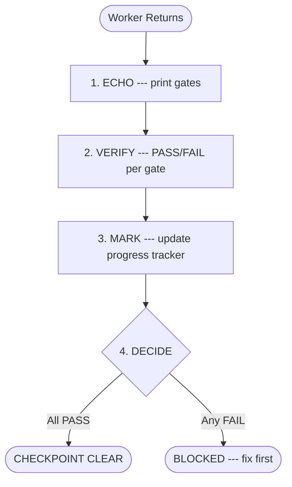

# AGENTS.md --- idea-to-mvp Template

## Current Phase & State

**Phase**: Capture --- project initialized from template. No idea captured yet.
**Sub-state**: Pre-Capture --- no artifacts exist.

To begin: describe the idea, problem, and target audience. The orchestrator guides
the pipeline from here.

> The orchestrator updates this section after every phase transition and batch
> completion. Format: `**Phase**: {name}` + `**Sub-state**: {detail with pointer to
> active batch-progress file}`.

## Architecture Map

This template provides a documentation-first pipeline from idea to MVP. All planning
artifacts live under `docs/`, organized by lifecycle phase. See `docs/INDEX.md` for the
full map of deliverables and their completion status.

All framework knowledge (pipeline, protocols, artifact formats, DOR, DOD) lives in this
file. The `docs/` directory starts empty and is populated with real artifacts as the
pipeline executes.

| Path | Purpose | Created By |
| ---- | ------- | ---------- |
| `docs/INDEX.md` | Project dashboard — tracks all artifacts and completion | Capture phase |
| `docs/project-brief.md` | Vision, problem, deliverables, constraints | Capture phase |
| `docs/domain-glossary.md` | Ubiquitous language, entity relationships | Discover phase |
| `docs/architecture/` | Tech stack, testing strategy, contracts | Architect phase |
| `docs/epics/` | Epic definitions with user story lists | Discover phase |
| `docs/user-stories/` | User stories with ACs, DOR, DOD, test plans | Refine phase |
| `docs/subtasks/` | Batch plans and handoff files | Plan phase |

## Ownership & Context Recovery

This framework is designed so that ANY agent can acquire full project ownership in any
session --- even on the first encounter, even after context loss, even if a different agent
worked on it before. The committed artifacts ARE the project's memory.

### Context Recovery Protocol

At the start of every session (or after context compaction), the agent MUST:

1. **Read this file** --- understand framework rules and current phase (top of file)
2. **Read `docs/INDEX.md`** --- understand what exists, what is done, what remains
   - If `docs/INDEX.md` does not exist --- project is in pre-Capture state. Skip to step 4
   - **INDEX reconciliation**: scan `docs/` for `.md` files not listed in INDEX.md.
     If orphans found, add them to INDEX.md before proceeding
3. **Read current phase artifacts** --- whatever documents the current phase requires
4. **Only then act** --- no work begins until context is loaded

This is not optional. An agent that starts working without reading INDEX.md is operating
blind and will produce drift.

### Why Artifacts Are Persistent

Every artifact in `docs/` is a committed file because:

- **Cross-session continuity**: the next session picks up exactly where the last left off
- **Agent-agnostic**: any AI tool can read these files and acquire full context
- **Auditable**: git history shows who decided what and when
- **Traceable**: every decision, requirement, and constraint has a document trail
- **Anti-drift**: the agent cannot "forget" a constraint that is written in a committed file

Ephemeral state (`.tmp-*` files, scratchpad notes) is for in-progress drafts ONLY and
MUST NOT be relied upon for ownership transfer between sessions.

### The INDEX.md Contract

`docs/INDEX.md` is the agent's entry point for project state. It answers:

- What is this project? (one-line description)
- What artifacts exist? (document map with links)
- What is done? (checked boxes)
- What remains? (unchecked boxes)
- What is the dependency order? (Mermaid graph)

The orchestrator MUST update INDEX.md after every story completion, every phase transition,
and every artifact creation. An INDEX.md that does not reflect reality is a critical defect.

### Ownership Depth Levels

| Level | Agent reads | Sufficient for |
| ----- | ----------- | -------------- |
| L0 | `AGENTS.md` only | Understanding the framework rules |
| L1 | + `docs/INDEX.md` | Project overview, status, what exists |
| L2 | + current phase artifacts | Active work with full context |
| L3 | + all `docs/` artifacts | Deep ownership, cross-cutting decisions |

The orchestrator operates at L2 minimum. Workers operate at L0 + their handoff file
(the handoff contains all context they need). For phase transitions and architectural
decisions, L3 is required.

## Pipeline Phases

Every project created from this template follows this pipeline. Each phase produces
artifacts that gate the next. No phase may be skipped without explicit human approval.


| Phase | Produces | Gate to Next | MIM Required |
| ----- | -------- | ------------ | ------------ |
| **Capture** | Problem statement, value proposition, success metrics | Human approves the "why" before exploration begins | Yes |
| **Discover** | User personas, journey maps, competitive analysis, feature list | Human validates that the problem and audience are understood | Yes |
| **Architect** | Tech stack decision (`docs/architecture/tech-stack.md`), system design, API contracts, testing strategy | Architecture review with human; tech stack baselined (changes via ADR process) | Yes |
| **Refine** | Groomed user stories with DOR satisfied, engineering addenda, MVP cut | Every story in the batch passes the Definition of Ready | No (automated) |
| **Plan** | Handoff files per sub-task, batch execution order, dependency graph | Handoff files pass pre-flight validation | No (automated) |
| **Build** | Working code, tests, committed increments | All quality gates pass per handoff; PDC completed | Per handoff |
| **Verify** | Full regression pass, DOD satisfied for all stories in the batch | Zero failing tests, all ACs verified with evidence | No (automated) |
| **Accept** | Human sign-off on the delivered increment | Human reviews working software and approves or requests changes | Yes |

**MIM (Manual Inspection Milestone)**: a phase boundary where human approval is required
before proceeding. The orchestrator presents results and waits --- it does not continue
until the human responds. Visual and UX decisions always require MIM regardless of phase.

### Optional Phases

- **Discover** may be compressed when the problem space is well-understood (the human
  decides, not the agent).
- **Refine** and **Plan** may merge for small projects with fewer than 5 user stories.

### Lightweight Mode

For projects with fewer than 3 epics or a well-understood problem space, phases may
compress:

- **Capture + Discover**: merge into a single combined brief-and-discovery document
- **Refine + Plan**: merge into a single pass --- stories decompose directly into handoffs
- **Architect**: may reduce to a single tech-stack decision paragraph within the brief

Lightweight Mode requires explicit human approval at its single MIM gate. The agent
MUST NOT self-select Lightweight Mode --- only the human decides.

### Phase Regression Protocol

The pipeline allows backward movement when new information invalidates prior decisions.

| Trigger | Regression To | Required |
| ------- | ------------- | -------- |
| Build reveals architectural flaw | Architect | Human approval (MIM) |
| Implementation uncovers missing requirements | Discover or Refine | Human approval (MIM) |
| Human changes direction or scope | Any earlier phase | Human directive |

When regressing:

1. The orchestrator marks all downstream artifacts as `STALE` in INDEX.md
2. The phase being re-entered produces updated artifacts
3. Stale artifacts are either updated or regenerated --- never left stale
4. A phase regression ALWAYS triggers a MIM before resuming forward progress

## Agent Roles

This template uses the **orchestrator-worker pattern**: a single orchestrator coordinates
all work by delegating to stateless sub-agents (workers). The orchestrator maintains the
execution plan and global context; workers know nothing beyond their current assignment.

### Orchestrator

The orchestrator is a **pure coordinator**. It decomposes work, delegates, validates
results, and manages phase transitions. It does NOT execute substantive work itself.

| Action | Orchestrator (inline) | Delegate to worker |
| ------ | --------------------- | ------------------ |
| Read to decide/verify (1-3 files) | Yes | --- |
| Read to explore/understand (4+ files) | --- | Yes |
| Read as preparation for writing | --- | Yes, together with the write |
| Write any project file | --- | Yes |
| Run state commands (git status, file listing) | Yes | --- |
| Run execution commands (test, build, install) | --- | Yes |
| Architecture/design decisions (no artifacts) | Yes | --- |
| Present results to human (MIM) | Yes | --- |

**Self-detection rule**: if the orchestrator finds itself editing files, writing code, or
running builds, it is in violation. It must stop, delegate the task, and resume as
coordinator.

### Workers (Sub-Agents)

Workers are stateless --- they retain no memory between invocations. All context arrives in
the handoff. Workers:

- Receive a self-contained handoff (see [Delegation Contract](#delegation-contract))
- Execute autonomously within the boundaries defined by the handoff
- Return structured status (see [Status Protocol](#status-protocol))
- Follow compact rules injected by the orchestrator (see [Compact Rules](#compact-rules-for-sub-agent-injection))

### Single-Agent Mode

When the runtime does not support multi-agent orchestration (no sub-agent spawning),
the framework degrades gracefully:

- The **human acts as orchestrator** --- reads handoff files and assigns them manually
- The **agent acts as worker** --- receives one handoff at a time and executes it
- The artifact-based design (committed files as source of truth) works identically
- PDC is performed by the human after each task completion
- MIM gates remain unchanged

All artifact formats, DOR/DOD, commit conventions, and quality gates apply in
Single-Agent Mode. Only the delegation mechanism changes.

### Expert Personas (optional)

Workers MAY receive an **expertise persona** that sets the communication style and
technical lens. Personas do NOT override compact rules or project conventions.

**Selection rules**:

- Describe the expertise domain relevant to the task (e.g., "testing architecture
  specialist focused on AAA pattern", "component design expert")
- Personas are chosen at planning time based on the project's tech stack
- Using real expert names is permitted but not required --- some AI providers may decline
  persona impersonation

> **Example:** A testing task receives "Testing Architecture Specialist" with expertise
> in test design and AAA pattern. A frontend task receives "Component Design Expert"
> with expertise in state management and accessibility.

### Model Assignment Policy

Before launching a worker, ask: does this task need to SEARCH, IMPLEMENT, or REASON?

| Level | Model Tier | Use When |
| ----- | ---------- | -------- |
| Search | light | Grep, read docs, lint checks, exploratory reads, formatting |
| Implement | standard | Write code, tests, reviews, verify quality gates |
| Architect | reasoning | Design decisions, conflict resolution, multi-source synthesis |

With 6+ concurrent agents, tier discipline multiplies savings. Never burn a reasoning-tier
model on a grep task. The handoff file metadata carries the assigned model tier.

## Delegation Contract

Every worker receives a **handoff file** as its contract. The handoff is the single source
of truth for the unit of work. No ad-hoc prompts. No improvisation.

### Handoff Structure

Each handoff file MUST contain these elements:

| Element | Description |
| ------- | ----------- |
| Metadata | Task ID, batch, epic, persona, priority |
| Objective | 1-3 sentence north star for this task |
| Pre-conditions | Checkable conditions that must be true before work begins |
| Context bundle | All data the worker needs, fully resolved (no references to chase) |
| Deliverables | Files to create/modify with expected outputs |
| Quality gates | Ordered verification commands with pass criteria (copy-pasteable) |
| Boundaries | Explicit OUT OF SCOPE list (minimum 1 item) |
| Anti-patterns | Common mistakes: what / why it fails / do instead |
| Rollback guidance | Recovery path if things go wrong |
| Compact rules | Injected PROJECT-* blocks from this file (inline text, not paths) |
| Status protocol | Machine-readable status block format |
| Progress tracker | Checkbox per deliverable and per quality gate, updated during execution |

**Rules**:
- If a handoff exceeds 300 lines, the task is too large --- split it.
- Workers receive rules as **inline text**, never as file paths to read.
- The orchestrator runs the pre-flight checklist before every delegation.

### Pre-Flight Checklist

The orchestrator MUST verify ALL items before launching any worker. A failed check means
the handoff is defective --- fix it before delegating.

| # | Check | If Failed |
| - | ----- | --------- |
| 1 | All `{placeholders}` are filled --- no template variables remain | Worker will hallucinate missing values |
| 2 | Every context bundle file exists at the specified path | Worker will report BLOCKED or read wrong files |
| 3 | Every quality gate command can be run from the repo root | Gate becomes uncheckable, PDC fails |
| 4 | Pre-conditions have been independently verified | Worker builds on broken foundation |
| 5 | Boundaries explicitly name at least 3 things OUT of scope | Scope creep will occur |
| 6 | Compact rules are pasted inline, not referenced by path | Worker cannot read external files not in bundle |
| 7 | The handoff is under 300 lines (excluding compact rules) | Task is too large --- split it |
| 8 | Deliverables list every file to create AND modify | Worker omits files or creates unexpected ones |
| 9 | No deliverable file appears in more than one handoff within the same parallel wave | Merge conflicts between parallel workers |

### Delegation Launch Contract

Every delegation prompt MUST include these two elements alongside the handoff:

- **Scope hint**: one sentence delimiting the boundaries of what the worker should touch
- **Verifiable objective**: one sentence the orchestrator can evaluate as binary PASS/FAIL
  against the result

These enable lightweight post-delegation assessment. If the result is coherent with the
scope hint and verifiable objective, the orchestrator accepts with zero additional
verification overhead. If incoherent, the circuit breaker activates.

### MIM Response Protocol

When the orchestrator presents results at a Manual Inspection Milestone, the human
responds with one of:

| Response | Agent Action |
| -------- | ------------ |
| **APPROVED** | Proceed to the next phase |
| **APPROVED WITH CHANGES** | Apply the specified changes, then proceed without re-presenting |
| **REJECTED** | Incorporate feedback, redo the phase output, re-present at MIM |

Partial approval ("looks good but change X") is treated as APPROVED WITH CHANGES.
If unclear, the orchestrator asks: "Should I treat this as approved with changes, or
do you want a full re-presentation?"

### Handoff Files

Handoff files live under `docs/subtasks/{epic}/` following the naming convention
`{task-id}-{slug}.md`. They are persistent, committed artifacts that serve as the
contract trail for every unit of work. They are created during the Plan phase and remain
in the repository as part of the project's documentation.

### Post-Delegation Checkpoint (PDC)

After EVERY worker returns, the orchestrator runs these 4 steps sequentially. No other
action (delegation, human response, tool invocation) is permitted until all 4 complete.



1. **ECHO** --- Print the acceptance gates from the handoff: `GATES: [gate1] | [gate2] | [gate3]`
2. **VERIFY** --- For each gate: `GATE [name]: PASS|FAIL --- [evidence]`. Evidence must reference a file, line, or command output. "Looks correct" is NOT evidence.
3. **MARK** --- Update the progress tracker in the handoff file NOW. Mark checkboxes with evidence. If step 3 is not completed, the orchestrator CANNOT proceed.
4. **DECIDE** --- Any FAIL: no advance, re-delegate or correct. All PASS: print `CHECKPOINT CLEAR` and proceed.

### Circuit Breaker


| Failure Count | Action |
| ------------- | ------ |
| 1st | Specific feedback with evidence; worker corrects |
| 2nd | Kill worker, clean relaunch with error context |
| 3rd | Diagnose root cause, relaunch with reduced scope or escalate to human |

### Status Protocol

Every worker MUST include this block in its final response:

```text
Status: [IN_PROGRESS | BLOCKED | DONE | FAILED]
Progress: X/Y items
Blocker: (if applicable --- describe exactly what blocks)
```

| Condition | Action |
| --------- | ------ |
| No status block returned | STALLED --- kill and relaunch |
| BLOCKED > 1 iteration | Kill, reassign with blocker context |
| FAILED | Diagnose root cause before relaunch |

### Anti-Stall Design Principles

These principles prevent the failure modes that cause workers to stall, loop, or drift.
The orchestrator enforces them structurally through the handoff, not by hoping the worker
behaves.

| Principle | Failure Mode Prevented | How |
| --------- | ---------------------- | --- |
| Self-containment | Context overflow / hallucination | Worker reads ONLY the handoff + referenced files |
| Deterministic verification | Subjective self-assessment | Every quality gate is a shell command returning exit 0 |
| Explicit boundaries | Scope creep | OUT OF SCOPE list prevents "helpful" refactoring |
| Context budget | Context window exhaustion | Context bundle lists exact files with line ranges |
| Rollback safety | Compounding errors | 3-failure circuit breaker prevents infinite fix loops |
| Structured status | Unparseable responses | Machine-readable status block forces binary state |
| Zero-read briefings | Wasted tokens on exploration | Refinement sub-agents receive all context pre-digested in the prompt; they never search for their own context |

### Context Resilience

Workers are stateless and expendable. The system is designed so that context loss (session
end, compaction, crash) does NOT lose project progress. Resilience comes from three
mechanisms:

**1. Artifacts are the memory** --- all decisions, requirements, and plans are committed
files in `docs/`. If the agent loses context, it recovers by reading the artifacts
(see [Ownership & Context Recovery](#ownership--context-recovery)).

**2. Rules travel as text, not references** --- compact rules and context bundles are
pasted directly into worker prompts. Even if the orchestrator loses its context, every
active worker already has the rules it needs.

**3. Skill resolution feedback** --- workers MUST report their skill resolution status in
their return:

| Status | Meaning | Orchestrator action |
| ------ | ------- | ------------------- |
| `injected` | Received compact rules from orchestrator | None --- ideal path |
| `self-loaded` | No rules received, loaded from project files | Re-read AGENTS.md, re-inject in all subsequent delegations |
| `none` | No rules loaded at all | Critical --- stop and re-inject before next delegation |

If any worker reports anything other than `injected`, the orchestrator MUST treat it as a
context loss signal and re-read this file immediately.

## Definition of Ready (DOR)

A user story MUST meet every condition below before any worker may start implementation.
If any box is unchecked, the story is NOT ready --- send it back to refinement.

- [ ] All acceptance criteria are in Given/When/Then format
- [ ] Dependencies on other stories are identified and resolved or explicitly deferred
- [ ] Architecture decisions relevant to this story are documented
- [ ] No blocking questions remain; remaining uncertainties are documented with proposed default behaviors
- [ ] Test plan exists (test names mapped to acceptance criteria)

> **CONDITIONAL** (include when the project has an API):
- [ ] API contract endpoints touched by this story are defined in `docs/architecture/api-contract.md`

## Definition of Done (DOD)

A user story MUST meet every condition below before it can be marked complete.

- [ ] All acceptance criteria pass, verified by test evidence (not by inspection alone)
- [ ] Tests written and passing for all code paths introduced by this story
- [ ] No regressions --- the full test suite passes, not just the new tests
- [ ] Code reviewed via adversarial worker (separate agent with different persona and mandate to find flaws)
- [ ] Changes committed using conventional commit format
- [ ] Corresponding checkbox in `docs/INDEX.md` is marked done

> **CONDITIONAL** (include when defined in tech-stack.md):
- [ ] Performance: response time under threshold defined in tech-stack.md
- [ ] Security: no new vulnerabilities from static analysis
- [ ] No dead code: unused exports, unreachable branches, and orphan files removed
- [ ] No unused dependencies: every installed package is imported somewhere in the codebase

## Commit Convention

Every commit message follows [Conventional Commits](https://www.conventionalcommits.org/).

### Format

```text
type(scope): description

Optional body with details.

- Change detail 1
- Change detail 2
```

### Types

| Type | When to Use |
| ---- | ----------- |
| `feat` | New features or capabilities |
| `fix` | Bug fixes |
| `chore` | Tooling, config, dependencies, CI |
| `task` | Changes to existing functionality |
| `spike` | Research or exploration (no production code) |
| `docs` | Documentation only |
| `test` | Adding or updating tests only |
| `refactor` | Code restructuring with no behavior change |

### Rules

- Subject line: imperative mood, lowercase, no trailing period, max 72 characters
- Body: brief description followed by bullet points listing each concrete change
- No AI attribution lines (no `Co-Authored-By` or similar)
- One logical change per commit (atomic commits)

## Compact Rules for Sub-Agent Injection

Orchestrators MUST inject these rules as literal text into every worker prompt. Workers
receive the text directly --- never file paths or references to read.

### PROJECT-DOCS

- All planning docs are business-first, technology-agnostic until Architecture phase
- User stories follow standard format: persona, action, value
- Acceptance criteria use Given/When/Then format exclusively
- No implementation details in user stories --- stories describe WHAT and WHY, never HOW
- Documentation language: English for all repository artifacts

### PROJECT-TEST

- All tests must pass before any commit
- New features require corresponding tests
- TDD (Red/Green/Refactor) is the default when the project supports it
- Breaking an existing test is a blocking issue --- fix before proceeding
- Tests map directly to user story acceptance criteria
- Test evidence (command output, screenshots) is required for DOD --- "it works" is not evidence

### PROJECT-ANTI-DRIFT

- Respect the current phase --- do not jump ahead in the pipeline
- Capture/Discover phases: NO code, NO technology choices, NO architecture diagrams
- Every decision must trace back to a requirement or acceptance criterion
- Version pinning: when dependencies are introduced, use exact versions (no floating ranges)
- Scope is defined by the handoff --- work outside the handoff boundaries is a violation
- Dead code and unused dependencies MUST be removed --- never conserved "just in case"
- Prefer technologies and tooling that enable static dead code detection (tree-shaking,
  unused export analysis, dependency audit). This preference is declared during the
  Architect phase in `docs/architecture/tech-stack.md`

### PROJECT-PIPELINE

- The build pipeline is defined in `docs/architecture/tech-stack.md` after the Architecture phase
- Pipeline stages are sequential and gated --- a failing stage STOPS the pipeline
- The pipeline order is sacred: it cannot be reordered, only individual stages can be skipped with documented justification
- Same pipeline in every environment (local, CI, production) --- no environment-specific shortcuts
- Build artifacts go to `./artifacts/` (gitignored)

> **Example (interpreted stack):** `install -> build -> lint -> test:unit -> test:e2e`

> **Example (compiled stack):** `install -> compile -> lint -> test:unit -> test:integration -> test:e2e`

## Anti-Rationalization Protocol

All protocols in this document are mandatory. The agent cannot grant itself exceptions.

- **Cite or comply**: before omitting any rule, cite the exact text that authorizes it.
  No exact text → not authorized
- **Rationalization signals**: phrases like "this doesn't warrant", "given the simplicity",
  "an exception for" indicate the agent is rationalizing. Stop and comply as written
- **Ambiguity → compliance**: ambiguity resolves in favor of MORE compliance, not less
- **Scale, don't skip**: "scale to the work" means reduce content volume, never omit
  required structural elements
- **Human override only**: only an explicit human directive overrides a rule. The agent
  repeats the override back for confirmation before acting
- **Burden of proof**: rests on the agent, not on this document

### Discretionary Judgment

When this document is SILENT on a procedural matter (no protocol exists for the
situation), the agent MAY exercise professional judgment and MUST:

1. Document the judgment call in the resulting artifact
2. Flag it for human review at the next MIM
3. If the situation recurs, propose an AGENTS.md amendment via the Retrospective protocol

## Process Protocols

### Refinement (Grooming)

Refines user stories before implementation begins. Bridges Discovery (the what/why) and
Build (the how). Produces DOR-satisfied stories with technical approach, test plan, and
deliverables.

**Process**:

1. Orchestrator reads source docs (epic, user stories, architecture docs) --- inline, not delegated
2. Orchestrator condenses into a single briefing (written to scratchpad, never committed)
3. Launch review team in parallel (minimum 3 reviewers):
   - **Domain reviewer** --- validates business logic and acceptance criteria
   - **Technical reviewer** --- validates feasibility, technical approach, deliverables
   - **QA reviewer** --- validates testability, edge cases, test plan completeness
   - Additional reviewers for security, performance, or UX when the story touches those
4. Synthesis agent merges all perspectives, resolves conflicts conservatively
5. Orchestrator writes refined stories to the repository

**Zero-read principle**: refinement sub-agents receive the FULL briefing text injected in
their prompt. They get a role-specific lens (what to focus on) and return structured
output. Sub-agents in refinement perform ZERO file reads --- all context is pre-digested
by the orchestrator. This eliminates wasted tokens on exploration and ensures every
reviewer works from identical context.

**Guard**: refinement produces stories that satisfy DOR. If DOR is not met after
refinement, the story cycles back for another pass.

**MVP Cut**: after refinement, the orchestrator produces an MVP cut --- marking which
stories are IN the MVP (v1) and which are deferred (v2+). Only MVP-in stories proceed
to Plan. The cut is recorded in INDEX.md under each epic's story list. The human
approves the cut at MIM.

### Capture

Elicits the core idea from the human and produces the project foundation documents.

**Process**:

1. Ask the human to describe the idea, the problem it solves, and who it serves
2. Probe with follow-up questions until these are clear:
   - What pain or gap does this address?
   - Who are the primary users or beneficiaries?
   - What does success look like? (measurable criteria)
   - What constraints exist? (time, budget, technology, compliance)
   - What is the MVP scope? (what is IN v1, what is deferred)
3. Draft `docs/project-brief.md` following the Project Brief format
4. Create `docs/INDEX.md` with Header and Project Overview populated; all other sections
   as placeholders marked `TBD --- populated during {phase name}`
5. Present both documents at MIM for human approval

**Project type classification**: during Capture, classify the project as one of:
`product` | `library` | `tool` | `extension` | `bot` | `other`. This classification
determines which Discover artifacts are required vs. optional (see Discover protocol).

### Discover

Explores the problem domain and defines what to build.

**Process**:

1. Read the approved project-brief.md
2. Research the problem domain (competitive analysis, prior art, technical landscape)
3. Draft `docs/domain-glossary.md` following the Domain Glossary format
4. Draft epics in `docs/epics/EP{NN}-{slug}.md` with user story lists (MoSCoW priority)
5. Update `docs/INDEX.md` with new artifacts
6. Present at MIM for human validation

**Project type adaptations**:

| Artifact | Product | Library/Tool | Extension/Bot |
| -------- | ------- | ------------ | ------------- |
| User personas | Required | Optional (developer persona assumed) | Optional |
| Journey maps | Required | Replace with API usage flows | Replace with integration flows |
| Competitive analysis | Required | Required (existing solutions) | Required (existing plugins) |
| Domain glossary --- Domain Events | Required | Optional | Optional |
| Domain glossary --- State lifecycles | Required | Optional | Optional |

### Architect

Makes technology decisions and locks the technical foundation.

**Process**:

1. Read project-brief.md, domain-glossary.md, and all epics
2. Evaluate technology options against project constraints and type
3. Draft `docs/architecture/tech-stack.md` with:
   - Chosen stack with rationale and alternatives considered
   - Build pipeline stages (install → build → lint → test → etc.)
   - Test strategy (unit, integration, e2e --- which apply)
   - `{test_command}` and `{build_command}` --- the actual shell commands
4. Draft additional architecture docs as needed (API contracts, system design)
5. Update `docs/INDEX.md`
6. Present at MIM for human review --- tech stack is **baselined** after approval

**ADR (Architecture Decision Record) process**: if during Build phase a technical
decision needs to change, create `docs/architecture/ADR-{NNN}-{slug}.md` with:
Context, Decision, Rationale, Consequences. This requires human approval (MIM).

### Sprint Planning

Takes refined (DOR-satisfied) user stories and decomposes them into handoff files. Each
handoff is a self-contained contract for autonomous worker execution.

**Guard**: planning MUST NOT start unless every story in scope has a Definition of Done
section. Missing DOD means the story needs refinement first.

**Process**:

1. Verify DOD exists for every story in scope
2. Decompose stories into atomic tasks
3. Generate handoff files following the template
4. Validate: every AC maps to at least one handoff, no file overlap between handoffs
5. Write handoff files to `docs/subtasks/{epic}/{task-id}-{slug}.md`

**Batch sizing heuristics**:
- Target 3-5 stories per batch
- Group stories that share domain entities or modify the same files
- A batch should be completable in one focused session
- Stories with no cross-dependencies can be parallelized within a batch

### Story Completion

When a worker reports DONE, the orchestrator runs this checklist:

1. Run PDC (all 4 steps: ECHO, VERIFY, MARK, DECIDE)
2. Verify every acceptance criterion against test evidence
3. Run the full test suite --- confirm no regressions
4. Update `docs/INDEX.md` --- mark the story checkbox as done
5. If all stories in an epic are done, mark the epic as done
6. Commit with conventional commit format

### Batch Status Reporting

After every 3 task completions (or when a task reports BLOCKED/FAILED), the orchestrator
produces a batch-level summary for human visibility:

```text
BATCH STATUS: {epic} Batch {N}
Done: X/Y tasks | Blocked: N | Failed: N
Active wave: {wave number}
Test health: {pass/fail count}
Next: {what happens next}
```

This surfaces problems between MIM checkpoints. The human can intervene at any time.

### Phase Transition

- The orchestrator verifies DOR/DOD for the transition boundary
- Updates the Current Phase section in this file
- Commits the phase transition
- Context is passed explicitly --- it is never assumed to carry over between phases

### Retrospective

After each batch completion or phase transition, the orchestrator conducts a lightweight
retrospective:

1. **What went well** --- patterns to keep
2. **What went wrong** --- friction, failures, process gaps
3. **Action items** --- concrete changes, including proposed AGENTS.md amendments

If an action item proposes changing this file, it requires human approval before taking
effect. The retrospective is committed as `docs/retro-{date}-{batch}.md` (optional ---
only when there are meaningful findings).

This is the ONLY sanctioned path for evolving the framework. Without it, the
Anti-Rationalization Protocol prevents all process adaptation.

## Artifact Formats

This section defines the format for every artifact the pipeline produces. The orchestrator
and workers MUST follow these formats. Each artifact begins with a breadcrumb linking back
to the index: `> [INDEX](path/to/INDEX.md) / [Parent] / Document Title`.

### INDEX.md --- Project Dashboard

File: `docs/INDEX.md`. Created during Capture phase. This is the agent's primary
reference for project state --- read it to understand what exists and what remains.

Sections:

1. **Header** --- project name, one-line description
2. **Document Map** --- Mermaid flowchart showing relationships between all artifacts
3. **Project Overview** --- checkboxes for project-brief.md and domain-glossary.md
4. **Epics** --- checkboxes for each epic, nested with their user stories
5. **Architecture** --- checkboxes for tech-stack, testing-strategy, and other arch docs
6. **Sprint Planning** --- checkboxes for batch plans and handoff files
7. **Navigation Notes** --- how documents cross-reference each other

Checkbox convention: `- [ ]` not started, `- [x]` complete. The orchestrator updates
INDEX.md after every story completion (see Story Completion protocol).

### Project Brief

File: `docs/project-brief.md`. Created during Capture phase.

Sections:

1. **Vision** --- one paragraph describing the desired future state
2. **Problem Statement** --- what pain or gap this project addresses
3. **Deliverable Map** --- Mermaid flowchart of high-level deliverable dependencies
4. **Deliverables** --- checkbox list, each linking to its epic
5. **Constraints** --- time, budget, technology, compliance, or other limitations
6. **Evaluation Criteria** --- table: Criterion | Weight (High/Medium/Low) | Description
7. **Related Documents** --- links to domain glossary, architecture, epics

### Domain Glossary

File: `docs/domain-glossary.md`. Created during Discover phase.

Sections:

1. **Entities** --- table: Entity | Description | Key Attributes | Relationships | Rationale
2. **Value Objects** --- table: Name | Description | Constraints
3. **Domain Events** --- table: Event | Trigger | Outcome
4. **Status/State Values** --- allowed states for entities with lifecycles (Mermaid state diagram)
5. **Entity Relationships** --- Mermaid ER diagram
6. **Conventions** --- naming, casing, date/time formats

### Epic

File: `docs/epics/EP{NN}-{slug}.md`. Created during Discover phase, refined during Refine.

Sections:

1. **Summary** --- 2-3 sentences describing the epic's scope
2. **Business Value** --- why this epic matters to the user/stakeholder
3. **Domain Flow** --- Mermaid diagram showing the domain-level flow this epic enables
4. **User Stories** --- checkbox list with priority labels (`Must Have`, `Should Have`, `Could Have`)
5. **Acceptance Boundaries** --- constraints that apply to ALL stories in this epic
6. **Related Architecture** --- links to relevant architecture docs
7. **Related Documents**

### User Story

File: `docs/user-stories/US-{NNN}-{slug}.md`. Created during Refine phase. This is the
most detailed artifact --- it is the contract between planning and implementation.

Sections (all required unless marked optional):

1. **Metadata** --- epic link, priority (`Must Have` | `Should Have` | `Could Have`), status
2. **Story** --- `As a {persona}, I want {action}, so that {value}`
3. **Definition of Ready** --- checkbox list. Items:
   - Domain entity contract frozen (fields, types, nullability, constraints)
   - Interface or API contract frozen (request/response shapes, error formats)
   - Input validation rules enumerated with exact boundaries
   - Edge cases identified with boundary behavior defined
   - Dependencies identified and resolved or deferred
   - Test plan exists with test names mapped to ACs
   - Out-of-scope items listed
4. **Acceptance Criteria** --- numbered with story prefix (AC-{NNN}.1, AC-{NNN}.2, etc.).
   Each criterion MUST use Given/When/Then format:
   ```
   - [ ] **AC-{NNN}.1: {title}**
     - **Given** {precondition}
     - **When** {action}
     - **Then** {expected outcome}
   ```
5. **Definition of Done** --- checkbox list. Items:
   - All ACs pass with automated test evidence
   - Unit tests green for domain logic and validation
   - Integration tests green against real dependencies (when applicable)
   - No regressions in existing test suite
   - Error responses conform to agreed shape
   - Code reviewed
   - INDEX.md updated
6. **Deliverables** --- two tables:
   - Files to Create: File Path | Contents
   - Files to Modify: File Path | Change
7. **Test Plan** --- table: Test Name | AC | Assertion
   Every AC must be covered by at least one test. Each test states the specific assertion.
8. **Validation Rules** --- enumerated constraints per input field with exact boundaries
   (min, max, required, format, edge cases)
9. **Risks** --- table: Severity | Risk | Mitigation
   Severities: `CRITICAL` | `HIGH` | `MEDIUM` | `LOW`
10. **Out of Scope** --- bullet list of explicit exclusions to prevent scope creep
11. **Notes** (optional) --- implementation hints, open questions, team decisions
12. **Related Documents** --- links to epic, architecture, related stories
13. **Handoff Files** (populated during Plan) --- links to handoff files implementing this story
14. **Change Log** --- date, change, reason for each modification after initial creation

### Batch Plan

File: `docs/subtasks/{epic}/batch-{N}-plan.md`. Created during Plan phase.

Sections:

1. **Scope** --- what this batch delivers, referencing the engineering addenda
2. **Task List** --- table: Task ID | Task Name | Persona | Model Tier | Depends On
3. **Dependency Graph** --- Mermaid DAG showing task dependencies. Solid arrows for hard
   dependencies, dashed arrows for soft dependencies
4. **Execution Order** --- numbered waves (parallel wave 1, sequential step 2, etc.)
5. **Definition of Done --- Batch** --- checkboxes for batch-level completion criteria
6. **Related Documents**

### Handoff File

File: `docs/subtasks/{epic}/{task-id}-{slug}.md`. Created during Plan phase. The
11-section structure is defined in the Delegation Contract section above.

Additional rules:

- Quality gates MUST be copy-pasteable shell commands. Use the project's actual commands
  from `docs/architecture/tech-stack.md` (not placeholders)
- Context bundle lists EXACT files with line ranges and justification for each
- Boundaries section lists at least 3 things explicitly OUT OF SCOPE
- Compact rules are pasted as inline text, never referenced by file path
- Maximum 300 lines. If exceeded, split the task

### Engineering Addenda

File: `docs/epics/{epic}-batch-{N}-refinement.md`. Created during Refine phase as the
output of the grooming/refinement ceremony.

Sections:

1. **Batch Info** --- batch number, scope, who refined it
2. **Prerequisites** --- checkbox list of items that must be resolved before implementation
3. **Dependencies** --- table: Package/Tool | Version | Target Project/File
4. **Implementation Order** --- numbered list of files/components in dependency order. When
   TDD is active, this becomes the test-first order
5. **Risks** --- subsections by severity (CRITICAL, HIGH, MEDIUM, LOW). Each risk states the
   problem, why it matters, and the mitigation
6. **Related Documents**

### Batch Progress

File: `docs/subtasks/{epic}/batch-{N}-progress.md`. Created when the first task in a
batch is delegated. Updated atomically before and after each delegation.

Sections:

1. **Batch Reference** --- link to batch plan
2. **Task Status** --- table: Task ID | Status (NOT_STARTED/IN_PROGRESS/DONE/FAILED) | Worker | Evidence
3. **Active Wave** --- which wave is currently executing
4. **Blockers** --- any active blockers with context
5. **Last Updated** --- timestamp of last status change

This artifact solves crash recovery: a new session reads this file to know exactly
where execution stopped and which tasks need re-delegation.

## Quality Gates Framework

Every task in a handoff file MUST define acceptance criteria as a gates table:

```markdown
| Gate | Verification | Command/Check | Type |
| ---- | ------------ | ------------- | ---- |
```

Gate types:

- `EXE` --- deterministic command, auto-verifiable (copy-pasteable shell command)
- `DOC` --- file inspection, verifiable without shell access (check file exists, content matches)
- `MAN` --- requires human judgment or visual inspection (always triggers MIM)

When the agent lacks shell access, `EXE` gates degrade to `DOC` equivalents where
possible. Gates that cannot degrade require human verification (escalate to `MAN`).

Minimum gates required for ANY task (additional gates are added per task):

| Gate | Verification | Type |
| ---- | ------------ | ---- |
| Handoff exists | `docs/subtasks/{epic}/{task-id}-*.md` present for this work | EXE |
| Tests pass | `{test_command}` exits 0 | EXE |
| No side effects | `git diff --stat` shows only expected files | EXE |

> The `{test_command}` placeholder is resolved from `docs/architecture/tech-stack.md`
> during the Plan phase. The orchestrator MUST substitute actual commands before writing
> handoff files.

## Git Branching Model

```text
task/{name} --> feature/{epic} --> main
```

- Feature branches: `feature/{epic_or_scope}` (one per epic or logical group)
- Task branches: `task/{descriptive_name}` (one per handoff, branched from feature branch)
- When a feature branch is complete, merge into `main` (squash merge recommended)
- Delete feature branches after merge
- No direct commits to `main`

The `{name}` in `task/{name}` MUST correspond to an existing handoff file. No handoff, no
branch.

Before delegating the first task in an epic, the orchestrator creates the feature branch
`feature/{epic}` from `main`. Workers branch their task branches from the feature branch.
