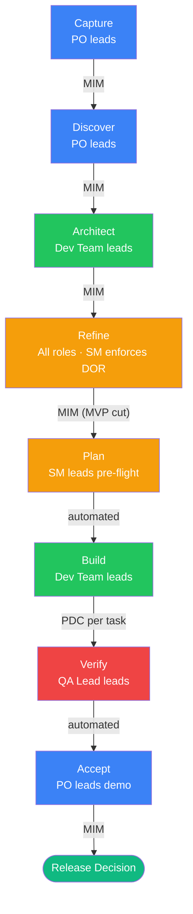
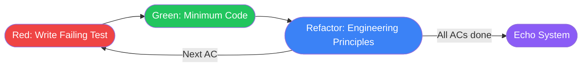
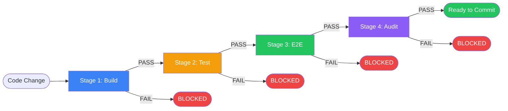

# AGENTS.md --- idea-to-mvp Template

## Current Phase & State

**Phase**: Capture --- project initialized from template. No idea captured yet.
**Sub-state**: Pre-Capture --- no artifacts exist.

To begin: describe the idea, problem, and target audience. The orchestrator guides
the pipeline from here.

> The orchestrator updates this section after every phase transition and batch
> completion. Format: `**Phase**: {name}` + `**Sub-state**: {detail with pointer to
> active batch-progress file}`.

## Execution Axioms

These five axioms gate EVERY action in the framework. They are binary (pass/fail),
mechanically verifiable, and non-negotiable. No protocol, no phase, no role is exempt.
The agent evaluates these BEFORE each action, not after.

**AXIOM-HANDOFF**: Zero lines of code or configuration without an approved handoff file. No handoff = no code.
No exceptions. No "quick fix". No "simple change". No "while I'm here". If a
handoff file does not exist for the work, the work does not happen. If the platform
supports scoped tool permissions: restrict Write/Edit tools for code and configuration
files in phases prior to Plan. Planning artifacts under `docs/` are exempt --- they are
the expected output of pre-Plan phases. A handoff file on disk is the unlock signal.
See [Delegation Contract](#delegation-contract).

**AXIOM-ORCHESTRATOR**: The orchestrator coordinates ONLY. If it finds itself writing
code, running builds, or executing tests --- it is in violation. Stop immediately,
delegate the task to a worker, and resume as coordinator. Runtime enforcement: if the
platform supports scoped tool permissions, the orchestrator session MUST exclude Write,
Edit, and execution tools. Where scoping is unavailable, the orchestrator MUST run a
self-check before every tool call: "Am I about to write code, run a build, or execute
tests? If yes, delegate instead." This axiom elevates the
[self-detection rule](#orchestrator) to a top-level gate.

**AXIOM-ECHO**: Every code change triggers the full [Echo System](#echo-system) before
commit. No commit without a green echo. The Echo System is sequential and gated --- a
failure at any stage blocks the commit.

**AXIOM-TDD**: Red → Green → Refactor is the execution methodology, not a suggestion.
Each phase has entry and exit criteria defined in the [TDD Cycle](#tdd-cycle) protocol.
No phase may be skipped. No commit mid-cycle.

**AXIOM-NATIVE**: Use the native, idiomatic capabilities of the declared stack and
version. Reimplementing what the stack already solves, or using patterns from older
versions when the declared version supersedes them, is technical debt --- requiring
documented justification with a remediation path, not a scope decision. This axiom
applies to ALL solution types (web, CLI, TUI, mobile, desktop, embedded) and ALL
technology choices without exception.

These axioms are referenced by compact rules ([PROJECT-ANTI-DRIFT](#project-anti-drift),
[PROJECT-TEST](#project-test), [PROJECT-TDD](#project-tdd)) and enforced through the
[Anti-Rationalization Protocol](#anti-rationalization-protocol).

**Condensed Anti-Rationalization**: cite verbatim text from this file or comply as
written. Ambiguity resolves toward MORE compliance. The agent cannot grant itself
exceptions. Only explicit human directives override rules.

## Architecture Map

This template provides a documentation-first pipeline from idea to MVP. All planning
artifacts live under `docs/`, organized by lifecycle phase. See `docs/INDEX.md` for the
full map of deliverables and their completion status.

All framework knowledge (pipeline, protocols, artifact formats, DOR, DOD) lives in this
file. The `docs/` directory starts empty and is populated with real artifacts as the
pipeline executes.

| Path | Purpose | Created By |
| ---- | ------- | ---------- |
| `docs/INDEX.md` | Project dashboard — tracks all artifacts and completion | Capture phase |
| `docs/project-brief.md` | Vision, problem, deliverables, constraints | Capture phase |
| `docs/domain-glossary.md` | Ubiquitous language, entity relationships | Discover phase |
| `docs/architecture/` | Tech stack, testing strategy, contracts | Architect phase |
| `docs/epics/` | Epic definitions with user story lists | Discover phase |
| `docs/user-stories/` | User stories with ACs, DOR, DOD, test plans | Refine phase |
| `docs/subtasks/` | Batch plans and handoff files | Plan phase |

### Artifact Governance

The pipeline produces artifacts beyond documentation. This section defines the taxonomy
and governance rules at template level. Concrete artifact definitions are resolved during
the Architect phase in `docs/architecture/tech-stack.md`.

| Category | Description | Resolved During |
| -------- | ----------- | --------------- |
| Build outputs | Results of compilation, transpilation, bundling, containerization | Architect phase |
| Test evidence | Coverage reports, test result summaries, assertion logs | Architect phase |
| Generated docs | API documentation, library docs, type docs | Architect phase |
| Derived assets | Optimized images, compiled styles, generated types | Architect phase |

**Governance rules**:

- All artifact categories output to `./artifacts/{category}/` (gitignored)
- DOD evidence: test evidence artifacts are referenced by path or command output in
  handoff progress trackers, but the artifacts themselves are NOT committed
- Documentation artifacts (`docs/`) are committed; build/test/derived artifacts
  (`./artifacts/`) are gitignored
- Reproducibility: any artifact in `./artifacts/` must be reproducible from source via
  a documented command in `docs/architecture/tech-stack.md`
- Concrete artifact definitions (commands, paths, formats) are declared during the
  Architect phase --- at template time only the taxonomy and rules exist

## Ownership & Context Recovery

This framework is designed so that ANY agent can acquire full project ownership in any
session --- even on the first encounter, even after context loss, even if a different agent
worked on it before. The committed artifacts ARE the project's memory.

### Context Recovery Protocol

At the start of every session (or after context compaction), the agent MUST:

1. **Read this file** --- understand framework rules and current phase (top of file)
2. **Read `docs/INDEX.md`** --- understand what exists, what is done, what remains
   - If `docs/INDEX.md` does not exist --- project is in pre-Capture state. Skip to step 4
   - **INDEX reconciliation**: scan `docs/` for `.md` files not listed in INDEX.md.
     If orphans found, add them to INDEX.md before proceeding
3. **Read current phase artifacts** --- whatever documents the current phase requires
4. **Only then act** --- no work begins until context is loaded

This is not optional. An agent that starts working without reading INDEX.md is operating
blind and will produce drift.

### Why Artifacts Are Persistent

Every artifact in `docs/` is a committed file because:

- **Cross-session continuity**: the next session picks up exactly where the last left off
- **Agent-agnostic**: any AI tool can read these files and acquire full context
- **Auditable**: git history shows who decided what and when
- **Traceable**: every decision, requirement, and constraint has a document trail
- **Anti-drift**: the agent cannot "forget" a constraint that is written in a committed file

Ephemeral state (`.tmp-*` files, scratchpad notes) is for in-progress drafts ONLY and
MUST NOT be relied upon for ownership transfer between sessions.

### The INDEX.md Contract

`docs/INDEX.md` is the agent's entry point for project state. It answers:

- What is this project? (one-line description)
- What artifacts exist? (document map with links)
- What is done? (checked boxes)
- What remains? (unchecked boxes)
- What is the dependency order? (Mermaid graph)
- Deferred Backlog status (what was deferred and why)

The orchestrator MUST update INDEX.md after every story completion, every phase transition,
and every artifact creation. An INDEX.md that does not reflect reality is a critical defect.

### Ownership Depth Levels

| Level | Agent reads | Sufficient for |
| ----- | ----------- | -------------- |
| L0 | `AGENTS.md` only | Understanding the framework rules |
| L1 | + `docs/INDEX.md` | Project overview, status, what exists |
| L2 | + current phase artifacts | Active work with full context |
| L3 | + all `docs/` artifacts | Deep ownership, cross-cutting decisions |

The orchestrator operates at L2 minimum. Workers operate at L0 + their handoff file
(the handoff contains all context they need). For phase transitions and architectural
decisions, L3 is required.

## Pipeline Phases

Every project created from this template follows this pipeline. Each phase produces
artifacts that gate the next. No phase may be skipped without explicit human approval.

### Dependency Resolution Pipeline

The planning phases (Capture through Plan) progressively surface and resolve
dependencies. Each phase adds a layer of dependency analysis that feeds the next.
Unresolved dependencies at Plan time produce incorrect execution order and missed
parallelization opportunities.


The three red decision points are dependency gates:

| Gate | Phase | Produces | Risk if Skipped |
| ---- | ----- | -------- | --------------- |
| Dependency Identification | Discover | Entity relationships, domain events, data flows in the glossary | Stories created without understanding which entities depend on which |
| Dependency Mapping | Architect | Epic-and-capability-level dependency links, shared entity contracts, API boundaries | Tech stack locked without mapping how stories share infrastructure |
| Dependency Ordering | Refine/Plan | DAG per batch, parallel waves, file-overlap validation | Wrong execution order, workers blocked on each other, merge conflicts |

Each gate produces a progressive artifact consumed by the next gate:

| Gate | Artifact Produced | Location |
| ---- | ------------------ | -------- |
| Dependency Identification | Entity-relationship list with dependency annotations | Domain glossary |
| Dependency Mapping | Epic-and-capability-level dependency DAG + shared entity contracts | `docs/architecture/tech-stack.md` |
| Dependency Ordering | Execution DAG per batch with parallel waves | Batch plan |

Each gate's artifact feeds the next. The graph starts coarse (entities) and refines to
atomic tasks. At Plan time, the DAG is immutable --- changes during Build require a
re-plan.

See the dependency-annotated diagram above for the linear phase sequence.

| Phase | Produces | Gate to Next | MIM Required |
| ----- | -------- | ------------ | ------------ |
| **Capture** | Problem statement, value proposition, success metrics | Human approves the "why" before exploration begins | Yes |
| **Discover** | User personas, journey maps, competitive analysis, feature list | Human validates that the problem and audience are understood | Yes |
| **Architect** | Tech stack decision (`docs/architecture/tech-stack.md`), system design, API contracts, testing strategy | Architecture review with human; tech stack baselined (changes via ADR process) | Yes |
| **Refine** | Groomed user stories with DOR satisfied, engineering addenda, MVP cut | Every story in the batch passes the Definition of Ready | MVP cut only |
| **Plan** | Handoff files per sub-task, batch execution order, dependency graph | Handoff files pass pre-flight validation | No (automated) |
| **Build** | Working code, tests, committed increments | All quality gates pass per handoff; PDC completed | Per handoff |
| **Verify** | Full regression pass, DOD satisfied for all stories in the batch | Zero failing tests, all ACs verified with evidence | No (automated) |
| **Accept** | Human sign-off on the delivered increment | Human reviews working software and approves or requests changes | Yes |

**MIM (Manual Inspection Milestone)**: a phase boundary where human approval is required
before proceeding. The orchestrator presents results and waits --- it does not continue
until the human responds.

**MIM Conflict Resolution**: when role perspectives disagree at a MIM, apply this
precedence: PO breaks scope and priority ties, Dev Team breaks technical and feasibility
ties, UX Advocate breaks interaction design and accessibility ties, QA Lead breaks
quality certification and test strategy ties, DevSecOps Lead breaks security and
infrastructure ties, SM escalates process deadlocks to the human. If no precedence
applies, the disagreement is escalated to human. This generalizes Refinement's synthesis
step to all phases.

### Scrum Team Matrix

The Scrum Team Matrix defines two dimensions of team engagement per phase: what each role
DOES (participation) and what each role CHECKS at the MIM gate (validation). Phase
protocols reference this matrix instead of embedding local copies.

**Matrix 1 --- Participation**:

| Phase | PO | Dev Team | SM | UX Advocate | QA Lead | DevSecOps Lead |
| ----- | -- | -------- | -- | ----------- | ------- | -------------- |
| Capture | Leads stakeholder conversation, defines value proposition | Provides feasibility signals, flags technical risks early | Guards scope, ensures constraints are captured | Identifies interaction surfaces and solution-type UX constraints | Identifies testability requirements, flags unmeasurable success metrics | Identifies deployment constraints, data sensitivity, security requirements |
| Discover | Validates user needs, assigns MoSCoW priorities | Builds domain model, identifies entity dependencies | Verifies INVEST compliance, flags story coupling | Defines interaction patterns per solution type, maps user flows, identifies accessibility requirements | Evaluates story testability, identifies edge cases and rabbit holes, maps risk zones | Identifies security-sensitive flows, maps infrastructure dependencies, flags trust boundary crossings |
| Architect | Validates NFR coverage, approves API contracts | Leads tech decisions, maps epic-level dependencies | Verifies Echo System config, ensures process gates exist | Reviews tech for interaction-layer impact, validates accessibility support, creates PROJECT-UX block | Co-owns testing strategy, validates Contract Truth Gate achievability, defines coverage thresholds | Co-owns Echo System commands, pre-commit hook, deployment strategy, security audit, threat model |
| Refine | Defends MVP Cut with rationale, completes ACs | Estimates, validates dependency DAG, authors addenda | Enforces DOR, ensures no blocked stories enter batch | Conditional reviewer: interaction completeness, error/empty/loading states, accessibility ACs | QA reviewer: test plan validation, boundary conditions, rabbit holes, Contract Truth Gate prerequisites | Conditional reviewer: security implications, security ACs for trust boundary stories |
| Plan | Confirms batch scope vs. capacity | Validates handoffs, runs file-overlap check | Runs pre-flight checklist, verifies delegation readiness | Validates user-facing handoffs include interaction specs and UX quality gates | Validates quality gates are falsifiable, every critical AC has EXE-type gate | Validates Scaffold Readiness Gate, security handoffs reference threat model |
| Build | (absent --- per-handoff MIM only) | Leads implementation via TDD | Runs PDC after every worker return | Absent from execution; available for UX clarification via orchestrator | Absent from Build (structural independence for Verify) | Co-owns T-001 scaffolding validation; monitors Echo Stage 4 results |
| Verify | Reviews AC evidence against original intent | Available for technical questions | Validates DOD compliance, flags process gaps | Validates interfaces match interaction contract, runs accessibility verification | **LEADS**: independent quality certification, Contract Truth Gate, tautological test detection | Dependency vulnerability scan, secrets detection, deployment readiness validation |
| Accept | Demos to stakeholder, validates success metrics | Available for technical questions and live fixes | Facilitates review, captures feedback for retrospective | Leads usability walkthrough segment, highlights interaction and accessibility compliance | Presents quality certification summary: coverage, risk assessment, quality compromises | Confirms deployment readiness, rollback plan, security posture summary |

**Matrix 2 --- MIM Validation**:

| Phase | PO gate | Dev Team gate | SM gate | UX Advocate gate | QA Lead gate | DevSecOps Lead gate |
| ----- | ------- | -------------- | ------- | ---------------- | ------------ | ------------------- |
| Capture | Real pain addressed? Value proposition falsifiable? | No known technical blockers? Feasibility not ruled out? | Scope bounded? All constraints captured in project brief? | Interaction surfaces identified? Success metrics include UX dimension? | Success metrics measurable and testable? Quality constraints captured? | Deployment constraints captured? Security-sensitive data domains identified? |
| Discover | All user needs captured? MoSCoW priorities defensible? | Domain model covers all entities? Entity dependencies annotated? | Every story passes INVEST? No hidden coupling between stories? | User flows cover primary tasks? Interaction patterns defined for solution type? Accessibility documented? | Every story testable as written? Edge cases identified? Risk-based test priority drafted? | Security-sensitive flows identified and tagged? Trust boundary crossings annotated? |
| Architect | NFRs have measurable targets? API contracts cover all user flows? | Tech stack justified per criterion? Dependency DAG covers all epics? | Echo System stages configured? All process gates have owners? | Tech supports declared interaction patterns? Accessibility mapped to stack? PROJECT-UX exists? | Testing strategy covers all quality dimensions? Coverage thresholds achievable? Contract Truth Gate implementable? | Echo System fully specified with executable commands? Pre-commit hook complete? Deployment strategy documented? PROJECT-INFRA exists? |
| Refine | Every AC testable? MVP cut has value justification per story? | Estimates calibrated? Dependency DAG acyclic and complete? | Every story passes DOR checklist? No blocked stories in batch? | User-facing stories have interaction-level ACs? Error states specified? | Every AC has mapped test with boundary values? Rabbit holes documented? Test plan risk-prioritized? | Security-sensitive stories have security ACs? Infrastructure dependencies accounted for? |
| Plan | Batch scope fits capacity? No low-priority stories displacing higher? | Every handoff has all 12 elements? File-overlap check passes? | Pre-flight checklist green? All delegation prerequisites met? | User-facing handoffs reference interaction specs? UX quality gates defined? | Every critical AC has EXE-type gate? Assertions genuinely falsifiable? | Scaffold Readiness Gate achievable? Echo Stage 4 command verified as executable? |
| Verify | Every AC has evidence matching original intent? No scope drift? | All tests pass? Coverage meets threshold? No regressions? | DOD checklist complete? Echo System green? All evidence recorded? | Interfaces match interaction contract? Accessibility checks pass? Error/empty states implemented? | Every AC has verified falsifiable assertion with counter-example? No tautological tests? Coverage qualified? **[LEADS]** | Dependency vulnerability scan passes? No secrets in committed code? Deployment-ready with rollback? |
| Accept | Increment delivers promised value? Success metrics met or on track? | No tech debt without ADR? Performance within NFR bounds? | Process followed? Retrospective items captured? | Interaction patterns consistent? Accessibility met? UX debt documented? | Quality certification complete? Risks documented? Quality debt recorded? | Deployment procedure tested? Security posture summary complete? Monitoring configured? |

**Phase Leadership and Gate Flow**:

The following diagram shows who leads each phase, what type of gate separates
phases, and how human checkpoints distribute across the pipeline. Colors indicate
the leading role. Details per role are in Matrix 1 and Matrix 2 above.



Legend: 🟦 PO-led | 🟩 Dev Team-led | 🟧 SM-led or shared | 🟥 QA-led

- **MIM** = Manual Inspection Milestone — human approval required before proceeding
- **PDC** = Post-Delegation Checkpoint — mechanical 4-step verification after every task
- **automated** = gate is verified mechanically, no human intervention required

### Optional Phases

- **Discover** may be compressed when the problem space is well-understood (the human
  decides, not the agent).
- **Refine** and **Plan** may merge for small projects with fewer than 5 user stories.

### Lightweight Mode

For projects with fewer than 3 epics or a well-understood problem space, phases may
compress:

- **Capture + Discover**: merge into a single combined brief-and-discovery document
- **Refine + Plan**: merge into a single pass --- stories decompose directly into handoffs
- **Architect**: may reduce to a single tech-stack decision paragraph within the brief

Lightweight Mode requires explicit human approval at its single MIM gate. The agent
MUST NOT self-select Lightweight Mode --- only the human decides.

**Governance in Lightweight Mode**: MIM may use single-reviewer instead of full role
panel. PDC compresses to async verification (no separate checkpoint message). Phase
time-box: 2 iterations of orchestrator work per phase before mandatory human escalation.
Axioms, Circuit Breaker, and Anti-Rationalization remain invariant --- they are safety
mechanisms, not ceremony.

**Role compression in Lightweight Mode**: when Lightweight Mode is active, the 6-role
team compresses to the original 3 roles with absorbed responsibilities:

| Full Role | Merges Into | Absorbed Concerns |
| --------- | ----------- | ------------------ |
| UX Advocate | PO | Interaction-specific ACs, accessibility requirements, interaction contract as inline story notes |
| QA Lead | SM | Test plan review during DOR enforcement, Contract Truth Gate enforcement during Verify |
| DevSecOps Lead | Dev Team | Echo Stage 4 ownership, security scan, infrastructure setup via T-001, compliance checks |

Absorbed DOR/DOD items remain active but are verified by the merge-target role.

**Invariant gates in Lightweight Mode**: regardless of ceremony reduction, these
gates survive intact:

- AC-to-assertion traceability ([Contract Truth Gate](#contract-truth-gate))
- Mock shape and contract validation
- Pre-commit hook enforcement (Build + Test stages minimum)
- [Scaffold Readiness Gate](#scaffold-readiness-gate)
- Verify phase independence (no shared Build context)
- T0 security practices (see [Activation Tiers](#activation-tiers))

These are quality mechanisms, not ceremony. Removing them re-introduces the failure
modes the framework exists to prevent.

### Phase Regression Protocol

The pipeline allows backward movement when new information invalidates prior decisions.

| Trigger | Regression To | Required |
| ------- | ------------- | -------- |
| Build reveals architectural flaw | Architect | Human approval (MIM) |
| Implementation uncovers missing requirements | Discover or Refine | Human approval (MIM) |
| Human changes direction or scope | Any earlier phase | Human directive |

When regressing:

1. The orchestrator marks all downstream artifacts as `STALE` in INDEX.md
2. The phase being re-entered produces updated artifacts
3. Stale artifacts are either updated or regenerated --- never left stale
4. A phase regression ALWAYS triggers a MIM before resuming forward progress

### Re-Plan Protocol

Triggered when a dependency changes or a blocker is discovered during Build that
invalidates the batch DAG. Unlike Phase Regression, Re-Plan operates within the current
phase.

1. Worker reports the invalidation via BLOCKED status with the specific dependency
2. Orchestrator freezes new handoff delegations for the affected batch
3. Orchestrator re-runs Dependency Ordering gate on the affected subgraph only
4. Updated DAG replaces the batch plan; affected handoffs re-validated against
   pre-flight checklist
5. Human MIM required if re-plan changes batch scope (adds or removes stories)
6. Unaffected in-progress handoffs continue without interruption

## Agent Roles

This template uses the **orchestrator-worker pattern**: a single orchestrator coordinates
all work by delegating to stateless sub-agents (workers). The orchestrator maintains the
execution plan and global context; workers know nothing beyond their current assignment.

### Orchestrator

The orchestrator is a **pure coordinator**. It decomposes work, delegates, validates
results, and manages phase transitions. It does NOT execute substantive work itself.

| Action | Orchestrator (inline) | Delegate to worker |
| ------ | --------------------- | ------------------ |
| Read to decide/verify (1-3 files) | Yes | --- |
| Read to explore/understand (4+ files) | --- | Yes |
| Read as preparation for writing | --- | Yes, together with the write |
| Write any project file | --- | Yes |
| Run state commands (VCS status, file listing) | Yes | --- |
| Run execution commands (test, build, install) | --- | Yes |
| Architecture/design decisions (single-step, no research) | Yes | --- |
| Architecture research or multi-source synthesis | --- | Yes |
| Present results to human (MIM) | Yes | --- |

**Self-detection rule**: if the orchestrator finds itself editing files, writing code, or
running builds, it is in violation. It must stop, delegate the task, and resume as
coordinator. (See also: AXIOM-ORCHESTRATOR in [Execution Axioms](#execution-axioms).)

### Workers (Sub-Agents)

Workers are stateless --- they retain no memory between invocations. All context arrives in
the handoff. Workers:

- Receive a self-contained handoff (see [Delegation Contract](#delegation-contract))
- Execute autonomously within the boundaries defined by the handoff
- Return structured status (see [Status Protocol](#status-protocol))
- Follow compact rules injected by the orchestrator (see [Compact Rules](#compact-rules-for-sub-agent-injection))

### Single-Agent Mode

When the runtime does not support multi-agent orchestration (no sub-agent spawning),
the framework degrades gracefully:

- The **human acts as orchestrator** --- reads handoff files and assigns them manually
- The **agent acts as worker** --- receives one handoff at a time and executes it
- The artifact-based design (committed files as source of truth) works identically
- PDC is performed by the human after each task completion
- MIM gates remain unchanged

All artifact formats, DOR/DOD, commit conventions, and quality gates apply in
Single-Agent Mode. Only the delegation mechanism changes.

In Single-Agent Mode, approximate Verify independence by starting a fresh context
(new session or explicit context reset) before the Verify phase. The Verify agent
receives the spec, task list, and committed code --- not the Build session's
reasoning or self-assessments.

### Expert Personas (optional)

Workers MAY receive an **expertise persona** that sets the communication style and
technical lens. Personas do NOT override compact rules or project conventions.

**Selection rules**:

- Describe the expertise domain relevant to the task (e.g., "testing architecture
  specialist focused on AAA pattern", "component design expert")
- Personas are chosen at planning time based on the project's tech stack
- Using real expert names is permitted but not required --- some AI providers may decline
  persona impersonation

> **Example:** A testing task receives "Testing Architecture Specialist" with expertise
> in test design and AAA pattern. A frontend task receives "Component Design Expert"
> with expertise in state management and accessibility.

### UX Advocate

The UX Advocate owns the user's experience across ALL solution types. Every solution has
users and every user has an experience: web users navigate layouts, CLI users parse
command grammar, TUI users flow between screens, mobile users gesture, desktop users
manage windows, library users consume APIs. The UX Advocate ensures that information
architecture, interaction patterns, feedback mechanisms, error communication, and
accessibility are intentionally designed rather than accidentally inherited from
implementation decisions. UX owns HOW IT FEELS TO USE IT --- distinct from PO (WHAT
to build) and Dev Team (HOW to build it). UX produces interaction models at "fat marker
sketch" altitude: places, affordances, and connections --- never pixel-perfect
specifications.

**Solution-type interaction models**:

| Solution Type | Interaction Model Artifact | Key Concerns |
| ------------- | -------------------------- | ------------ |
| Web | Page flow diagram with affordances | Responsive breakpoints, WCAG, keyboard navigation, semantic HTML |
| CLI | Command tree with argument shapes | stdout/stderr discipline, help text, exit codes, shell completion |
| TUI | Screen state diagram | Focus management, keyboard shortcuts, resize behavior, terminal compatibility |
| Mobile | Screen flow with gesture annotations | Touch targets (44x44pt min), platform conventions, offline handling |
| Desktop | Window state diagram + shortcut map | Multi-monitor, high-DPI, native dialog usage, keyboard design |
| Embedded | I/O mapping table | Physical constraints, sub-100ms feedback, error recovery without screen |
| Library | API surface sketch with usage examples | Method naming, error types, time-to-first-call, type-level UX |

### QA Lead

The QA Lead owns independent quality certification. QA does NOT write tests --- the Dev
Team writes and executes tests via TDD. QA owns quality STRATEGY: test architecture,
risk-based prioritization, boundary condition identification, and independent
verification that delivered software meets its contract. The QA Lead is the structural
fix for the fox-guarding-the-henhouse problem: the entity that builds the code must
not certify it. QA validates that tests are MEANINGFUL (not tautological), that coverage
targets the RIGHT code paths (risk-based, not percentage-based), and that the Contract
Truth Gate is genuinely falsifiable. During Refine, QA surfaces rabbit holes --- edge
cases, boundary conditions, and failure modes that consume cycle time if not caught
early. During Verify, QA LEADS independent certification with no shared context from
Build.

### DevSecOps Lead

The DevSecOps Lead owns the infrastructure that makes the pipeline real: CI/CD
implementation, environment provisioning, deployment strategy, security posture, and
the operational health of the Echo System. The Echo System exists as an abstract
pipeline definition --- DevSecOps converts it into concrete, executable commands. This
role bridges "we have a 4-stage pipeline specification" to "the pipeline actually runs,
catches failures, and deploys safely." DevSecOps also owns security: threat awareness
during Architect, security-specific AC review during Refine, dependency vulnerability
monitoring via Echo Stage 4, and deployment security. When the project's activation
tier includes compliance (T2), DevSecOps additionally manages the Compliance Standards
Registry and formal threat model (see [Activation Tiers](#activation-tiers)).

### Activation Tiers

Role depth scales with project needs. The Capture phase classifies the project's
activation tier based on concrete questions. Higher tiers include all lower-tier
requirements.

| Tier | Scope | Trigger | Security | UX | QA |
| ---- | ----- | ------- | -------- | -- | -- |
| **T0 --- Invariant** | Non-negotiable even in spikes | Always | No secrets in code, hash passwords, input validation, OWASP basics, dependency audit (Stage 4) | Error states visible, no silent failures | Tests falsifiable, Red phase evidence |
| **T1 --- MVP** | Default for this framework | Capture declares it (default) | Threat awareness, security ACs for trust boundaries, deployment security, secrets management | Interaction contract, accessibility per solution type, interaction model artifact | Contract Truth Gate, boundary tests, QA leads Verify, rabbit hole analysis |
| **T2 --- Compliance** | Formal regulatory requirements | Capture identifies applicable regulations | Compliance Standards Registry (`docs/architecture/compliance-registry.md`), formal threat model (`docs/architecture/threat-model.md`), Risk Acceptance Register, regulatory evidence trail | Formal accessibility certification per applicable standard | Risk-based test strategy with formal traceability, quality metrics tracking |

**T0 rules are injected into EVERY handoff regardless of project tier or Lightweight
Mode.** They are prohibitions, not recommendations.

**T2 activation** is mechanical: during Capture, the orchestrator asks: "Does this
project handle health data, payment data, personal data under privacy regulations,
or data subject to industry-specific compliance?" A yes answer activates T2 and
requires the Compliance Standards Registry and threat model as Architect-phase
deliverables. T2 artifacts follow the same lazy-load policy as other architecture
documents.

### Model Assignment Policy

Before launching a worker, ask: does this task need to SEARCH, IMPLEMENT, or REASON?

| Level | Model Tier | Use When |
| ----- | ---------- | -------- |
| Search | light | Grep, read docs, lint checks, exploratory reads, formatting |
| Implement | standard | Write code, tests, reviews, verify quality gates |
| Architect | reasoning | Design decisions, conflict resolution, multi-source synthesis |

With 6+ concurrent agents, tier discipline multiplies savings. Never burn a reasoning-tier
model on a grep task. The handoff file metadata carries the assigned model tier.

## Delegation Contract

Every worker receives a **handoff file** as its contract. The handoff is the single source
of truth for the unit of work. No ad-hoc prompts. No improvisation.

### Handoff Structure

Each handoff file MUST contain these elements:

| Element | Description |
| ------- | ----------- |
| Metadata | Task ID, batch, epic, persona, priority |
| Objective | 1-3 sentence north star for this task |
| Pre-conditions | Checkable conditions that must be true before work begins |
| Context bundle | Pointers to exact files with line ranges; the orchestrator verifies existence and currency at pre-flight. Workers MUST read these files before starting work and cite relevant constraints in their first status report |
| Deliverables | Files to create/modify with expected outputs |
| Quality gates | Ordered verification commands with pass criteria (copy-pasteable) |
| Boundaries | Explicit OUT OF SCOPE list (minimum 3 task-relevant items with exclusion rationale) |
| Anti-patterns | Common mistakes: what / why it fails / do instead |
| Rollback guidance | Recovery path if things go wrong |
| Compact rules | Injected PROJECT-* blocks from this file (inline text, not paths) |
| Status protocol | Machine-readable status block format |
| Progress tracker | Checkbox per deliverable and per quality gate, updated during execution |

**Rules**:
- **Canonical line budget**: if a handoff exceeds 300 lines (excluding compact rules
  pasted inline), the task is too large --- split it. This line budget applies to
  handoff files --- units of delegated work. It does not apply to this framework
  specification document, and it does not apply to `ARTIFACT-TEMPLATES.md`. All other
  references to a 300-line handoff limit in this document defer to this rule.
- Workers receive rules as **inline text**, never as file paths to read.
- The orchestrator runs the pre-flight checklist before every delegation.

### Pre-Flight Checklist

The SM role initiates the pre-flight review; the orchestrator mechanically verifies all
items. In single-agent mode, both functions are the agent's responsibility. A failed
check means the handoff is defective --- fix it before delegating.

| # | Check | If Failed |
| - | ----- | --------- |
| 1 | All `{placeholders}` are filled --- no template variables remain | Worker will hallucinate missing values |
| 2 | Every context bundle file exists at the specified path | Worker will report BLOCKED or read wrong files |
| 3 | Every quality gate command can be run from the repo root | Gate becomes uncheckable, PDC fails |
| 4 | Pre-conditions have been independently verified | Worker builds on broken foundation |
| 5 | Boundaries explicitly name at least 3 task-relevant things OUT of scope, each with a one-line rationale for exclusion | Scope creep will occur |
| 6 | Compact rules are pasted inline, not referenced by path | Worker cannot read external files not in bundle |
| 7 | The handoff satisfies the canonical line budget ([Handoff Structure](#handoff-structure)) | Task is too large --- split it |
| 8 | Deliverables list every file to create AND modify | Worker omits files or creates unexpected ones |
| 9 | No deliverable file appears in more than one handoff within the same parallel wave | Merge conflicts between parallel workers |
| 10 | Objective section is present and states a binary PASS/FAIL verifiable goal | Worker has no north star |
| 11 | Anti-patterns section lists at least 2 items | Worker repeats known mistakes |
| 12 | Rollback guidance section is present | No recovery path on failure |
| 13 | Status protocol format is specified | Orchestrator cannot parse worker response |
| 14 | Progress tracker has one checkbox per deliverable and per gate | PDC step 3 (MARK) cannot execute |
| 15 | **PROJECT-{DOMAIN} compact rules present**: if `docs/architecture/tech-stack.md` documents stack-specific conventions (required patterns, prohibited API usage, mandatory idioms), at least one `PROJECT-{DOMAIN}` block distinct from the generic blocks exists and is injected into relevant handoffs. Absence requires an explicit "no stack-specific conventions apply" note | Workers default to generic patterns and drift from stack conventions |
| 16 | **AC-to-gate forwarding**: every acceptance criterion containing a verb + specific pattern/approach reference has a corresponding quality-gate row in the handoff. Every anti-pattern not backed by an EXE gate carries a written rationale for why it is non-critical | Guidance without enforcement --- workers repeat known mistakes with no mechanical check |
| 17 | **Context bundle citation**: at least one file from the context bundle was opened and a specific constraint from it is cited in the handoff's quality gates or compact rules (not generic acknowledgment) | Context bundle is decorative, not load-bearing |
| 18 | **UX context forwarding**: for user-facing tasks, interaction contract reference exists in context bundle and the referenced artifact is current (not STALE). Absence requires explicit "no user-facing output" note in the handoff | Worker implements without interaction constraints, UX drift |
| 19 | **QA gate presence**: every AC marked CRITICAL in the risk-based test priority has a corresponding EXE-type quality gate with a falsifiable assertion. Contract Truth Gate prerequisites are satisfiable: typed contract artifacts exist for every external interface | Quality gates are not falsifiable, tautological tests pass uncaught |
| 20 | **Security context forwarding**: handoffs crossing security boundaries reference the threat model in the context bundle. Absence requires explicit "no security boundaries crossed" note | Security concerns not encoded in handoff, missed in Build |
| 21 | **Echo Stage 4 readiness**: Echo Stage 4 (Audit) command is verified as executable before any Build-phase delegation. T-001 scaffolding handoff includes all Scaffold Readiness Gate deliverables | Audit command fails at commit time, blocking pipeline |

### Delegation Launch Contract

Every delegation prompt MUST include these two elements alongside the handoff:

- **Scope hint**: one sentence delimiting the boundaries of what the worker should touch
- **Verifiable objective**: one sentence the orchestrator can evaluate as binary PASS/FAIL
  against the result

These enable lightweight post-delegation assessment. If the result is coherent with the
scope hint and verifiable objective, the orchestrator accepts with zero additional
verification overhead. If incoherent, the circuit breaker activates.

### MIM Response Protocol

When the orchestrator presents results at a Manual Inspection Milestone, the human
responds with one of:

| Response | Agent Action |
| -------- | ------------ |
| **APPROVED** | Proceed to the next phase |
| **APPROVED WITH CHANGES** | Apply the specified changes, then proceed without re-presenting |
| **REJECTED** | Incorporate feedback, redo the phase output, re-present at MIM |

Partial approval ("looks good but change X") is treated as APPROVED WITH CHANGES.
If unclear, the orchestrator asks: "Should I treat this as approved with changes, or
do you want a full re-presentation?"

### Handoff Files

Handoff files live under `docs/subtasks/{epic}/` following the naming convention
`{task-id}-{slug}.md`. They are persistent, committed artifacts that serve as the
contract trail for every unit of work. They are created during the Plan phase and remain
in the repository as part of the project's documentation.

### Post-Delegation Checkpoint (PDC)

After EVERY worker returns, the orchestrator runs these 4 steps sequentially. No other
action (delegation, human response, tool invocation) is permitted until all 4 complete.


1. **REPORT** --- Print the acceptance gates from the handoff: `GATES: [gate1] | [gate2] | [gate3]`
2. **VERIFY** --- For each acceptance criterion: `AC [id]: PASS|FAIL --- [test name] | [quoted assertion from source]`. The orchestrator MUST open the cited test file and confirm the quoted text exists. "Looks correct" is NOT evidence. A suite-level exit code is NOT AC-level evidence. See [Contract Truth Gate](#contract-truth-gate) for the required mapping format.
3. **MARK** --- Update the progress tracker in the handoff file NOW. Mark checkboxes with evidence. If step 3 is not completed, the orchestrator CANNOT proceed.
4. **DECIDE** --- Any FAIL: no advance, re-delegate or correct. Any MAN gate: route to human at MIM, print
   `PENDING_HUMAN` and wait. All PASS (no pending MAN): print `CHECKPOINT CLEAR` and proceed.

### Circuit Breaker


| Failure Count | Action |
| ------------- | ------ |
| 1st | Specific feedback with evidence; worker corrects |
| 2nd | Kill worker, clean relaunch with error context |
| 3rd | Diagnose root cause, relaunch with reduced scope or escalate to human |

Failure counts are scoped per (handoff, gate) pair and reset to zero when the gate passes. Counts persist in the
handoff file's progress tracker --- they survive compaction and session boundaries.

Counter scope: each (handoff, gate) pair has its own independent counter. A PASS on gate X does not reset the
counter for gate Y within the same handoff.

### Status Protocol

Every worker MUST include this block in its final response:

```text
Status: [IN_PROGRESS | BLOCKED | DONE | FAILED]
Progress: X/Y items
Blocker: (if applicable --- describe exactly what blocks)
```

| Condition | Action |
| --------- | ------ |
| No status block returned | STALLED --- kill and relaunch |
| BLOCKED > 1 iteration | Kill, reassign with blocker context |
| FAILED | Diagnose root cause before relaunch |

### Remediation Handoff Protocol

AXIOM-HANDOFF applies to ALL code modifications, including bug fixes, remediations,
and corrections found during review. A code change without a handoff is a "quick
fix" --- explicitly prohibited.

**Threshold**: a remediation handoff (REM-NNN) is REQUIRED when the fix:

- Touches more than one file, OR
- Reverts or changes a previously-DONE task's deliverable

If the same root cause requires changes across multiple files --- whether delivered
as one handoff or split across several --- the full REM-NNN format is required for
all of them. Splitting a multi-file fix into sequential single-file lightweight
handoffs to evade this threshold is itself a violation.

A single-file, single-line fix (typo, off-by-one in one location) may use a
lightweight format (minimum 10 lines) but MUST still exist as a tracked file under
`docs/subtasks/`. Lightweight REM handoffs are exempt from Pre-Flight Checklist items
5 (Boundaries ≥3), 11 (Anti-patterns ≥2), and 12 (Rollback guidance). All other
Pre-Flight items apply.

| Element | Required |
| ------- | -------- |
| Bug description | What is broken and how it manifests |
| Root cause | Why it happened --- not just what to change |
| Affected files | Every file to be modified |
| Correction strategy | How the fix addresses the root cause |
| Regression test | Test that would have caught this bug originally |

Remediation handoffs may be shorter than feature handoffs but MUST exist as
committed files. A commit message is NOT a substitute for a handoff file.

### Anti-Stall Design Principles

These principles prevent the failure modes that cause workers to stall, loop, or drift.
The orchestrator enforces them structurally through the handoff, not by hoping the worker
behaves.

| Principle | Failure Mode Prevented | How |
| --------- | ---------------------- | --- |
| Self-containment | Context overflow / hallucination | Worker reads ONLY the handoff + referenced files |
| Deterministic verification | Subjective self-assessment | Every quality gate is a shell command returning exit 0 |
| Explicit boundaries | Scope creep | OUT OF SCOPE list prevents "helpful" refactoring |
| Context budget | Context window exhaustion | Context bundle lists exact files with line ranges |
| Rollback safety | Compounding errors | 3-failure circuit breaker prevents infinite fix loops |
| Structured status | Unparseable responses | Machine-readable status block forces binary state |
| Zero-read briefings | Wasted tokens on exploration | Refinement sub-agents receive all context pre-digested in the prompt; they never search for their own context |

### Context Resilience

Workers are stateless and expendable. The system is designed so that context loss (session
end, compaction, crash) does NOT lose project progress. Resilience comes from three
mechanisms:

**1. Artifacts are the memory** --- all decisions, requirements, and plans are committed
files in `docs/`. If the agent loses context, it recovers by reading the artifacts
(see [Ownership & Context Recovery](#ownership--context-recovery)).

**2. Rules travel as text, not references** --- compact rules are pasted directly into
worker prompts; context bundles are file pointers validated at pre-flight. Even if the
orchestrator loses its context, every active worker already has the rules it needs.

**3. Skill resolution feedback** --- workers MUST report their skill resolution status in
their return:

| Status | Meaning | Orchestrator action |
| ------ | ------- | ------------------- |
| `injected` | Received compact rules from orchestrator | None --- ideal path |
| `self-loaded` | No rules received, loaded from project files | Re-read AGENTS.md, re-inject in all subsequent delegations |
| `none` | No rules loaded at all | Critical --- stop and re-inject before next delegation |

If any worker reports anything other than `injected`, the orchestrator MUST treat it as a
context loss signal and re-read this file immediately.

## Definition of Ready (DOR)

A user story MUST meet every condition below before any worker may start implementation.
If any box is unchecked, the story is NOT ready --- send it back to refinement.

- [ ] All acceptance criteria are in Given/When/Then format
- [ ] Dependencies on other stories are identified and resolved or explicitly deferred
- [ ] Architecture decisions relevant to this story are documented
- [ ] No blocking questions remain; remaining uncertainties are documented with proposed default behaviors
- [ ] Test plan exists (test names mapped to acceptance criteria)
- [ ] Dependency gate artifacts exist for this story's dependencies (identification, mapping, or ordering as applicable)
- [ ] Team participation and role-gate review completed for the originating phase

> **CONDITIONAL** (include when the project has an API):
- [ ] API contract endpoints touched by this story are defined in `docs/architecture/api-contract.md`

> **CONDITIONAL — UX** (include when the story produces user-facing output):
- [ ] Interaction-level acceptance criteria describe observable user behavior (error states, feedback mechanisms, empty states) appropriate to the declared solution type
- [ ] Accessibility requirements documented for the story's solution type (WCAG for web, keyboard navigation for TUI, help text for CLI, touch targets for mobile, API ergonomics for library)
- [ ] Interaction contract from Discover phase referenced for all user-facing flows touched by this story

> **CONDITIONAL — QA** (always included):
- [ ] Test plan includes boundary conditions, negative scenarios, and error paths --- not just happy-path ACs. At minimum one boundary test per numeric or string-length constraint
- [ ] Rabbit holes (edge cases, failure modes) identified and either mitigated in ACs or documented as deferred with rationale
- [ ] Contract Truth Gate prerequisites identified: typed contract artifacts listed for every external interface the story touches

> **CONDITIONAL — DevSecOps** (include when the story handles sensitive data or crosses security boundaries):
- [ ] Security-sensitive stories have explicit security acceptance criteria (input validation, authentication, authorization as applicable)
- [ ] Infrastructure dependencies identified and provisioning approach documented (or explicitly deferred with rationale)
- [ ] Deployment impact assessed: infrastructure changes, environment variables, database migrations, or security policy updates required are documented

> The User Story artifact template ([User Story](ARTIFACT-TEMPLATES.md#user-story))
> extends this base DOR with story-specific items (domain contracts, interface contracts,
> validation rules, edge cases). Both checklists must be satisfied.

## Definition of Done (DOD)

A user story MUST meet every condition below before it can be marked complete.

- [ ] All acceptance criteria pass, verified by test evidence (not by inspection alone)
- [ ] Tests written and passing for all code paths introduced by this story
- [ ] No regressions --- the full test suite passes, not just the new tests
- [ ] Dependency audit passes --- Echo System Stage 4 (Audit) exits clean
- [ ] Code reviewed via adversarial worker (separate agent with different persona and mandate to find flaws)
- [ ] Changes committed using conventional commit format
- [ ] Corresponding checkbox in `docs/INDEX.md` is marked done
- [ ] No dead code: unused exports, unreachable branches, and orphan files removed
- [ ] No unused dependencies: every installed package is imported somewhere in the codebase
- [ ] AXIOM-NATIVE spot-check: at least one implementation decision is verified
      against the Architect-phase native-capability audit table. Deviations from native
      capabilities have documented justification with a remediation path

> **CONDITIONAL** (include when defined in tech-stack.md):
- [ ] Performance: response time under threshold defined in tech-stack.md
- [ ] Security: no new vulnerabilities from static analysis

> **CONDITIONAL — UX** (include when the story produces user-facing output):
- [ ] Implemented interfaces match the interaction contract defined during Discover --- deviations documented with rationale
- [ ] Solution-type-appropriate accessibility verification passes (automated scan for web, keyboard navigation test for TUI, help output inspection for CLI, touch target audit for mobile)
- [ ] Error states, empty states, and loading states implemented per documented ACs --- no silent failures in user-facing flows

> **CONDITIONAL — QA** (always included):
- [ ] Independent quality certification completed by QA (separate agent context from Build): Contract Truth Gate satisfied, AC-to-assertion mapping complete with counter-examples, no tautological tests
- [ ] AC-to-assertion mapping verified as genuinely falsifiable --- each test would FAIL if its AC were violated (Red phase evidence exists)
- [ ] Coverage qualified: coverage percentage accompanied by AC-to-assertion mapping evidence --- coverage number alone is insufficient
- [ ] Boundary-value and edge-case tests exist for every in-scope rabbit hole --- absence requires citation of rationale that moved it out of scope

> **CONDITIONAL — DevSecOps** (always included):
- [ ] Echo System Stage 4 (Audit) passes clean --- no known critical or high vulnerabilities (documented exceptions require mitigation timeline)
- [ ] No secrets (API keys, tokens, credentials, private keys) detected in committed code via automated scan or manual inspection
- [ ] Security acceptance criteria verified by test evidence for stories tagged as security-sensitive --- not by inspection alone
- [ ] Deployment procedure documented and rollback plan verified as viable

> The User Story artifact template ([User Story](ARTIFACT-TEMPLATES.md#user-story))
> extends this base DOD with story-specific items. Both checklists must be satisfied.

## Commit Convention

The commit message format is resolved during the Architect phase in
`docs/architecture/tech-stack.md`. The Architect defines the convention (e.g.,
Conventional Commits, Angular convention, or a project-specific format) and the
enforcement mechanism (commit-msg hook, linter, or manual review).

**Default recommendation** (override in tech-stack.md if the project requires a
different convention):

### Format

```text
type(scope): description

Optional body with details.

- Change detail 1
- Change detail 2
```

### Types

| Type | When to Use |
| ---- | ----------- |
| `feat` | New features or capabilities |
| `fix` | Bug fixes |
| `chore` | Tooling, config, dependencies, CI |
| `task` | Changes to existing functionality |
| `spike` | Research or exploration (no production code). Spike code MUST be deleted before TDD cycle begins --- it cannot be repurposed as Green-phase implementation. Test commits must precede implementation commits in version-control history |
| `docs` | Documentation only |
| `test` | Adding or updating tests only |
| `refactor` | Code restructuring with no behavior change |

### Rules

- Subject line: imperative mood, lowercase, no trailing period, max 72 characters
- Scope = epic or module name when applicable
- Body: brief description followed by bullet points listing each concrete change
- No AI attribution lines (no `Co-Authored-By` or similar)
- One logical change per commit (atomic commits)

## Compact Rules for Sub-Agent Injection

Orchestrators MUST inject these rules as literal text into every worker prompt. Workers
receive the text directly --- never file paths or references to read.

### PROJECT-DOCS

- All planning docs are business-first, technology-agnostic until Architecture phase
- User stories follow standard format: persona, action, value
- Acceptance criteria use Given/When/Then format exclusively
- No implementation details in user stories --- stories describe WHAT and WHY, never HOW
- Documentation language: English for all repository artifacts

### PROJECT-TEST

- AXIOM-ECHO: every code change runs the Echo System before commit --- no commit without green echo (see [Echo System](#echo-system))
- All tests must pass before any commit
- New features require corresponding tests
- TDD Cycle (Red/Green/Refactor) is mandatory --- see [TDD Cycle](#tdd-cycle) for entry/exit criteria per phase
- Breaking an existing test is a blocking issue --- fix before proceeding
- Tests map directly to user story acceptance criteria
- Test evidence (command output, screenshots) is required for DOD --- "it works" is not evidence
- Mock shapes MUST derive from typed contract artifacts --- never from design intent or prose (see [Contract Truth Gate](#contract-truth-gate))
- Test evidence requires AC-level assertion mapping, not suite-level exit codes
- Disabled or skipped tests MUST include a tracking reference --- untracked skips are treated as missing tests

### PROJECT-TDD

- Red: write test for AC → run → MUST fail → verify failure is the assertion, not syntax/import
- Green: write MINIMUM code → run → MUST pass → full suite → no regressions
- Refactor: apply SOLID/KISS/DRY/YAGNI/OWASP/Clean/Hexagonal → after EACH refactor: full suite → if fail: REVERT
- Cycle applies PER acceptance criterion --- each AC gets its own Red/Green/Refactor
- No commit mid-cycle --- only commit after Refactor exits green + Echo System passes
- If test passes without implementation code, the test is tautological --- rewrite it
- If refactor breaks tests, the refactor is wrong --- revert, do NOT fix tests to match refactor
- Full cycle protocol with entry/exit criteria: [TDD Cycle](#tdd-cycle)

### PROJECT-ANTI-DRIFT

- AXIOM-HANDOFF: no code without an approved handoff file --- no exceptions, no "quick fix" (see [Execution Axioms](#execution-axioms))
- AXIOM-ORCHESTRATOR: the orchestrator coordinates only --- if it writes code or runs builds, it is in violation (see [Execution Axioms](#execution-axioms))
- AXIOM-NATIVE: use the stack's native, idiomatic capabilities for the declared version --- reimplementing solved problems or using deprecated/superseded patterns is drift (see [Execution Axioms](#execution-axioms))
- Respect the current phase --- do not jump ahead in the pipeline
- Capture/Discover phases: NO code, NO technology choices, NO architecture diagrams
- Every decision must trace back to a requirement or acceptance criterion
- Version pinning: ALL dependencies use exact versions --- no floating or range specifiers. Use the ecosystem's
  exact-version syntax as defined in `docs/architecture/tech-stack.md`. Use LTS runtime versions when available.
  The Architect phase defines the version policy and lockfile enforcement mechanism. The Echo System Stage 4
  (Audit) verifies compliance
- Scope is defined by the handoff --- work outside the handoff boundaries is a violation
- Dead code and unused dependencies MUST be removed --- never conserved "just in case"
- Prefer technologies and tooling that enable static dead code detection (tree-shaking,
  unused export analysis, dependency audit). This preference is declared during the
  Architect phase in `docs/architecture/tech-stack.md`

### PROJECT-PIPELINE

- The build pipeline is the [Echo System](#echo-system) --- defined abstractly here, resolved in
  `docs/architecture/tech-stack.md` after the Architecture phase
- Pipeline stages are sequential and gated --- a failing stage STOPS the pipeline
- The pipeline order is sacred: it cannot be reordered. Stage 1 (Build), Stage 2 (Test), and Stage 4 (Audit) can
  NEVER be skipped. Stage 3 (E2E) may be skipped only with documented justification recorded in
  `docs/architecture/tech-stack.md`
- Same pipeline in every environment (local, CI, production) --- no environment-specific shortcuts
- Build artifacts go to `./artifacts/` (gitignored) --- see [Artifact Governance](#artifact-governance) for
  taxonomy and rules

> **Note:** Echo System defines 4 stages (Build, Test, E2E, Audit). The concrete commands and stage composition for
> your project are declared in `docs/architecture/tech-stack.md` during the Architect phase.

### PROJECT-UX

- Every user-facing surface has an interaction contract defined during Discover/Architect --- implement within its boundaries
- Error states, empty states, and loading states are REQUIRED for user-facing flows --- silent failures are prohibited
- Accessibility requirements are solution-type-specific: WCAG for web, keyboard navigation for TUI, help text for CLI, touch targets for mobile, API ergonomics for library
- UX decisions follow the interaction model's fat-marker-sketch boundaries --- details are resolved during Build, not prescribed upfront
- User-facing output must match the solution type's conventions: CLI respects stdout/stderr discipline, web respects semantic HTML, mobile respects platform guidelines
- When an interaction decision is ambiguous, escalate via orchestrator --- do not default to developer convenience over user experience

### PROJECT-QA

- Every acceptance criterion MUST have a falsifiable test --- a test that would FAIL if the AC were violated
- Boundary-value tests are required for every numeric, length, or format constraint in ACs
- Mock shapes MUST derive from typed contract artifacts --- never from design intent or prose (Contract Truth Gate)
- Coverage percentage alone is not quality evidence --- AC-to-assertion mapping is the required proof
- Tautological tests (tests that pass regardless of implementation) are treated as missing tests
- Red phase evidence must show the RIGHT failure (assertion failure, not syntax/import error)
- Test isolation: each test must be independently runnable --- no implicit ordering dependencies

### PROJECT-INFRA

- Echo System commands MUST resolve to concrete, executable commands --- placeholder commands are a DevSecOps failure
- Pre-commit hook MUST be active and wired to the platform's hook mechanism --- passive hooks are equivalent to no hooks
- Echo Stage 4 (Audit) is non-waivable: dependency vulnerability scan + version policy compliance on every commit
- No secrets (API keys, tokens, credentials, private keys) in committed code --- enforce via automated scan or pre-commit check
- Security-sensitive flows (user input, auth, sensitive data) require security-specific ACs and test evidence
- Deployment procedure and rollback plan MUST be documented before Accept --- deployment is not an afterthought
- Version policy: exact versions only, no floating ranges, LTS runtime versions --- enforced by Stage 4 audit command

## Anti-Rationalization Protocol

All protocols in this document are mandatory. The agent cannot grant itself exceptions.

- **Cite or comply**: before omitting any rule, cite the exact text that authorizes it.
  No exact text → not authorized. The citation must be a verbatim substring of this
  document --- paraphrased or approximate citations do not satisfy the requirement
- **Rationalization signals**: phrases like "this doesn't warrant", "given the simplicity",
  "an exception for", "[inferior pattern] is simpler than [native capability]",
  "we can add [native capability] later", "for this scope [workaround] is sufficient"
  indicate the agent is rationalizing. Stop and comply as written
- **Ambiguity → compliance**: ambiguity resolves in favor of MORE compliance, not less
- **Scale, don't skip**: "scale to the work" means reduce content volume, never omit
  required structural elements
- **Human override only**: only an explicit human directive overrides a rule. The agent
  repeats the override back for confirmation before acting
- **Burden of proof**: rests on the agent, not on this document

### Discretionary Judgment and Mandatory Actions

Actions governed by MUST in this document execute automatically --- the agent does
not ask permission. Asking "should I run the tests?" when tests are mandatory is
itself a violation.

| Category | Examples | Agent Behavior |
| -------- | -------- | --------------- |
| Mandatory (MUST) | Echo System, PDC, TDD cycle, pre-commit hook, Scaffold Readiness Gate, AXIOM-NATIVE (native capability is the default) | Execute without asking. Scope and thoroughness are also non-discretionary --- if Echo System means Build + Test + Audit, all three stages run every time |
| Discretionary (human decides) | Phase transitions, MIM responses, MVP cut selection (which stories qualify, not the scoring formula), commit timing, Lightweight Mode selection | Present options and wait for human response |

Separately, when this document is SILENT on a procedural matter (no protocol exists
for the situation --- distinct from the named Discretionary category above), the
agent MAY exercise professional judgment and MUST:

1. Document the judgment call in the resulting artifact
2. Flag it for human review at the next MIM
3. If the situation recurs, propose an AGENTS.md amendment via the Retrospective protocol

This silence-driven judgment NEVER applies to: Execution Axioms, DOD requirements,
Echo System stages, MVP Cut scoring methodology, or the Anti-Rationalization
Protocol itself. These are governed by explicit rules and are never "silent."

**Additional rationalization signals** (extend the list in the Anti-Rationalization
Protocol above):

- "Should I run [mandatory action]?"
- "Do you want the full [mandatory action] or just [subset]?"
- "Given the simplicity, we can skip [mandatory action]"

These phrases convert a non-discretionary gate into a discretionary choice. Stop
and execute the full mandatory action as specified.

## Process Protocols

### Refinement (Grooming)

Refines user stories before implementation begins. Bridges Discovery (the what/why) and
Build (the how). Produces DOR-satisfied stories with technical approach, test plan, and
deliverables.

**Process**:

1. Orchestrator reads source docs (epic, user stories, architecture docs) --- inline, not delegated
2. Orchestrator condenses into a single briefing (written to scratchpad, never committed)
3. Pre-filter stories by MoSCoW priority --- `Won't Have` stories are excluded from the review team. Only
   `Must Have`, `Should Have`, and `Could Have` proceed to review
4. Launch review team in parallel (minimum 3 reviewers):
   - **Domain reviewer** --- validates business logic and acceptance criteria
   - **Technical reviewer** --- validates feasibility, technical approach, deliverables
   - **QA reviewer** --- validates testability, edge cases, boundary conditions, test plan
     completeness, rabbit holes, Contract Truth Gate satisfiability
   - **UX reviewer** (conditional) --- validates interaction completeness, error states,
     accessibility criteria. Required when the story touches user-facing interfaces
   - **Security reviewer** (conditional) --- validates security implications, input
     validation, trust boundary crossings. Required when the story handles sensitive
     data or crosses security boundaries
   - Additional reviewers for performance when the story touches performance-sensitive paths

   Reviewer mapping: Domain reviewer = PO perspective, Technical reviewer = Dev Team
   perspective, QA reviewer = QA Lead perspective, UX reviewer = UX Advocate perspective,
   Security reviewer = DevSecOps Lead perspective. SM enforces DOR compliance as a process
   gate, not as a reviewer perspective. The same agent may fill multiple reviewer
   roles in small teams.
5. Synthesis agent merges all perspectives, resolves conflicts conservatively
6. Orchestrator writes refined stories to the repository

**Zero-read principle**: refinement sub-agents receive the FULL briefing text injected in
their prompt. They get a role-specific lens (what to focus on) and return structured
output. Sub-agents in refinement perform ZERO file reads --- all context is pre-digested
by the orchestrator. This eliminates wasted tokens on exploration and ensures every
reviewer works from identical context.

**Guard**: refinement produces stories that satisfy DOR. If DOR is not met after
refinement, the story cycles back for another pass.

Team roles and MIM gates for this phase: see [Scrum Team Matrix](#scrum-team-matrix).

**Retry cap**: if a story fails DOR after 2 refinement passes, it is escalated to the
human with the specific failing DOR items. The agent does not attempt a third pass.

**MVP Cut**: after refinement, the orchestrator produces an MVP cut --- marking which
stories are IN the MVP (v1) and which are deferred (v2+). Only MVP-in stories proceed
to Plan. The cut is recorded in INDEX.md under each epic's story list. Deferred stories
MUST also be recorded in `docs/deferred-backlog.md` with category and rationale --- an
INDEX.md OUT marker alone is insufficient. The human approves the cut at MIM.

**MVP Cut criteria**: Must Have stories are always IN. Should Have stories enter if
remaining capacity allows, ordered by value. Could Have and Won't Have are recorded in
the Deferred Backlog with category and rationale. The PO presents the cut with an
explicit value justification per story --- "rationale" means a documented reason, not a
subjective judgment.

### Capture

Elicits the core idea from the human and produces the project foundation documents.

**Process**:

1. Ask the human to describe the idea, the problem it solves, and who it serves
2. Probe with follow-up questions until these are clear:
   - What pain or gap does this address?
   - Who are the primary users or beneficiaries?
   - What does success look like? (measurable criteria)
   - What constraints exist? (time, budget, technology, compliance)
   - What is the MVP scope? (what is IN v1, what is deferred)
   - **UX discovery**: What are the interaction surface types (web, CLI, TUI, mobile,
     desktop, embedded, library)? What is the primary interaction modality?
   - **Quality constraints**: What quality attributes matter (reliability, performance,
     data integrity)? Are success metrics mechanically verifiable?
   - **Infrastructure and security**: Where will this run (deployment target)? Are there
     compliance requirements? Does the solution handle sensitive data?
3. Draft `docs/project-brief.md` following the Project Brief format
4. Create `docs/INDEX.md` with Header and Project Overview populated; all other sections
   as placeholders marked `TBD --- populated during {phase name}`
5. Present both documents at MIM for human approval
6. Initialize `docs/deferred-backlog.md` with header and empty table (see Deferred Backlog format)

Team roles and MIM gates for this phase: see [Scrum Team Matrix](#scrum-team-matrix).

**Project type classification**: during Capture, classify the project as one of:
`product` | `library` | `tool` | `extension` | `bot` | `other`. This classification
determines which Discover artifacts are required vs. optional (see Discover protocol).

### Discover

Explores the problem domain and defines what to build.

**Process**:

1. Read the approved project-brief.md
2. Research the problem domain (competitive analysis, prior art, technical landscape)
3. Draft `docs/domain-glossary.md` following the Domain Glossary format

   > The domain glossary MUST include dependency annotations between entities --- this
   > is the Dependency Identification gate output (see Dependency Resolution Pipeline).
4. Draft epics in `docs/epics/EP{NN}-{slug}.md` with user story lists (MoSCoW priority)
5. Update `docs/INDEX.md` with new artifacts
6. Present at MIM for human validation
7. Update `docs/deferred-backlog.md` with features identified but excluded from scope

**Project type adaptations**:

| Artifact | Product | Library/Tool | Extension/Bot |
| -------- | ------- | ------------ | ------------- |
| User personas | Required | Optional (developer persona assumed) | Optional |
| Journey maps | Required | Replace with API usage flows | Replace with integration flows |
| Competitive analysis | Required | Required (existing solutions) | Required (existing plugins) |
| Domain glossary --- Domain Events | Required | Optional | Optional |
| Domain glossary --- State lifecycles | Required | Optional | Optional |

Team roles and MIM gates for this phase: see [Scrum Team Matrix](#scrum-team-matrix).

### Architect

Makes technology decisions and locks the technical foundation.

**Process**:

1. Read project-brief.md, domain-glossary.md, and all epics
2. Evaluate technology options against project constraints and type
3. Draft `docs/architecture/tech-stack.md` with:
   - Chosen stack with rationale and alternatives considered
   - Build pipeline stages (install → build → lint → test → etc.)
   - Test strategy (unit, integration, e2e --- which apply)
   - Echo System commands: `{build_command}`, `{lint_command}`, `{test_command}`, `{e2e_command}`, `{audit_command}`
   - Version policy: exact versions only (no `^`, no `~`, no `latest`), LTS runtime versions, lockfile enforcement mechanism
   - Pre-commit hook specification: the hook MUST run the Echo System and exit non-zero on failure (structural
     enforcement of AXIOM-ECHO)
   - Artifact definitions: what each Echo System stage produces and where it lands in `./artifacts/`
   - Health check and startup specification: `{health_check_url}` or
     `{health_check_command}` (type-appropriate for the project),
     `{startup_timeout}` --- consumed by the [Scaffold Readiness Gate](#scaffold-readiness-gate)
   - Smoke test command: `{smoke_test_command}` --- consumed by the
     [Autonomous Execution Safeguard](#autonomous-execution-safeguard)
   - Native capability audit: for each major technical decision, document the
     stack's native solution for the problem. AXIOM-NATIVE requires that native
     capabilities are the default --- alternatives carry the burden of proof.
     Record as a table: `| Problem | Native Capability | Decision | Justification |`
   - Project-specific compact rule blocks: extract stack conventions that workers
     MUST follow as `PROJECT-{DOMAIN}` compact rule blocks (e.g., required
     architectural patterns, prohibited API usage, mandatory idioms for the
     declared version). These blocks are injected into handoffs alongside the
     generic PROJECT-* rules --- conventions that exist only in prose are not enforced
   - **DevSecOps co-ownership**: the DevSecOps Lead co-owns the following subsections
     within `docs/architecture/tech-stack.md`: Echo System command specification
     (resolving placeholder commands into concrete tooling), pre-commit hook implementation
     specification, security audit command for Stage 4, deployment strategy and environment
     provisioning approach, secrets management approach, and threat model for
     security-sensitive flows (STRIDE or equivalent, scaled to project complexity).
     Dev Team retains overall Architect phase leadership. Disagreements between Dev Team
     and DevSecOps on these subsections follow the MIM Conflict Resolution protocol
   - **UX interaction contracts**: the UX Advocate defines interaction contracts during
     Architect for the chosen solution type --- the set of user-facing behaviors the
     solution promises. Interaction contracts define places, affordances, and connections
     at fat-marker-sketch altitude. They are recorded in `docs/architecture/` and
     referenced by user-facing stories during Refine
4. Produce the epic-and-capability-level dependency DAG (refined to story-level at the
   Dependency Ordering gate during Refine/Plan) (Dependency Mapping gate output) and
   record it in `docs/architecture/tech-stack.md`
5. Draft additional architecture docs as needed (API contracts, system design)
6. Update `docs/INDEX.md`
7. Present at MIM for human review --- tech stack is **baselined** after approval

Team roles and MIM gates for this phase: see [Scrum Team Matrix](#scrum-team-matrix).

**ADR (Architecture Decision Record) process**: if during Build phase a technical
decision needs to change, create `docs/architecture/ADR-{NNN}-{slug}.md` with:
Context, Decision, Rationale, Consequences. This requires human approval (MIM).

### Sprint Planning

Takes refined (DOR-satisfied) user stories and decomposes them into handoff files. Each
handoff is a self-contained contract for autonomous worker execution.

**Guard**: planning MUST NOT start unless every story in scope has a Definition of Ready
section. Missing DOR means the story needs refinement first.

**Process**:

1. Verify DOD exists for every story in scope
2. Decompose stories into atomic tasks
3. Generate handoff files following the template
4. Validate: every AC maps to at least one handoff, no file overlap between handoffs
   and no compilation dependency between parallel handoffs (if handoff B imports from
   files that handoff A modifies, they are sequential by definition --- even if they
   touch different files).
   Additionally: ACs that specify an implementation approach MUST be forwarded as
   quality gates in the handoff (not as anti-patterns --- anti-patterns are guidance,
   gates are enforcement). Every critical anti-pattern MUST have a corresponding
   EXE-type quality gate with a verifiable command.

   A critical anti-pattern is one whose occurrence would violate an acceptance
   criterion, break a typed contract, or introduce a security/data-integrity defect.
   Severity is not a discretionary label --- these three conditions define it
   objectively.
5. Write handoff files to `docs/subtasks/{epic}/{task-id}-{slug}.md`

Team roles and MIM gates for this phase: see [Scrum Team Matrix](#scrum-team-matrix).

**Batch sizing heuristics**:
- Target 3-5 stories per batch
- Group stories that share domain entities or modify the same files
- A batch should be completable in one focused session
- Stories with no cross-dependencies can be parallelized within a batch
- **Parallel worker isolation**: when delegating multiple tasks concurrently, the
  orchestrator MUST ensure workers operate in isolated environments (separate
  worktrees, branches, or sessions). Workers sharing a single working directory
  see each other's intermediate states and produce compilation conflicts. If
  the platform does not support worktree isolation, parallel tasks MUST execute
  sequentially. After parallel workers return, the orchestrator runs
  `{build_command}` on the merged result BEFORE PDC --- a combined build failure
  means at least one worker's output is incompatible and requires remediation

### Scaffold Readiness Gate

Before the first feature task (T-002+) in any batch may begin, scaffolding
deliverables MUST be verified as ACTIVE --- not just documented, not just committed,
but mechanically functional. This gate is part of T-001 DOD.

**Required scaffolding deliverables**:

| Deliverable | Verification | If Blocked |
| ----------- | ------------ | ---------- |
| Environment boots | `{startup_command}` exits 0 within `{startup_timeout}`; service health checks return expected responses | Report BLOCKED with exact manual steps for human |
| Pre-commit hook ACTIVE | Hook file exists AND is wired to the platform's hook mechanism + a synthetic bad commit is rejected | Report BLOCKED --- without an active hook, AXIOM-ECHO has no mechanical enforcement |
| Echo System commands resolve | Each `{x_command}` from `docs/architecture/tech-stack.md` runs without "command not found" | Report BLOCKED with missing command and install instruction |

**Generalized capability existence rule**: any `{x_command}` or named mechanism
declared in `docs/architecture/tech-stack.md` receives an existence check at this
gate. If the architecture doc defines `{e2e_command}`, at least one E2E test file
must exist (a skipped test with a tracking reference is acceptable; an absent test
file is not). This generalizes to ALL named capabilities --- not just E2E.

**Enforcement**: the orchestrator MUST NOT delegate T-002 until this gate passes.
If the agent cannot satisfy a deliverable due to platform restrictions (e.g.,
cannot create a required environment file), it reports BLOCKED immediately with
exact instructions for the human. Silent skip is a violation.

### TDD Cycle

The TDD Cycle is the execution methodology for the Build phase. It applies PER acceptance
criterion --- each AC gets its own Red → Green → Refactor cycle. See AXIOM-TDD.



**Red Phase**:

Entry: AC identified, test name assigned from the test plan.

1. Write the test for the acceptance criterion
2. Run the test --- it MUST fail
3. Verify the failure reason is the actual assertion, not a syntax error, missing import, or wrong path
4. If the test passes without implementation code, the test is tautological --- rewrite it
5. Persist the failing test output in the progress tracker --- this evidence is required before Green phase may
   begin
6. The orchestrator (or a second worker in parallel execution) independently re-runs the test to confirm the
   failure --- self-attested Red is insufficient

Exit: test exists, fails for the right reason, failing output recorded in progress tracker.

**Green Phase**:

Entry: Red phase exit criteria met.

1. Write the MINIMUM code that makes the test pass
2. No optimization, no cleanup, no premature abstraction, no "while I'm here" changes
3. Run the test --- it MUST pass
4. Run the full suite --- no regressions

Exit: new test passes, full suite green.

**Refactor Phase**:

Entry: Green phase exit criteria met.

1. Apply the engineering principles checklist:

   | Principle | Focus |
   | --------- | ----- |
   | SOLID | Single responsibility, open/closed, Liskov, interface segregation, dependency inversion |
   | KISS | Simplest solution that satisfies the requirement |
   | DRY | Eliminate duplication only when the abstraction is justified |
   | YAGNI | Remove speculative code that serves no current AC |
   | OWASP | Input validation, injection prevention, secure defaults |
   | Clean Architecture | Dependency direction, layer separation, domain isolation |
   | Hexagonal Architecture | Ports and adapters, infrastructure at the edges |
   | Design Patterns | Apply when they reduce complexity, not for ceremony |

2. After EACH refactor operation: run the full suite
3. If any test fails: REVERT the refactor and investigate --- the refactor is wrong, not the tests

Exit: suite green, code satisfies engineering principles.

**Guard**: no commit mid-cycle. Only commit after the Refactor phase exits green AND the
Echo System passes (see below). The progress tracker MUST record the current TDD phase
(Red/Green/Refactor) per AC. A commit is structurally permitted only when the tracker
shows Refactor-complete for all ACs in the current handoff. The Echo System pre-commit
hook verifies this state.

### Echo System

The Echo System is a sequential, gated verification pipeline that runs after every code
change and before any commit. It is THE verification mechanism --- it replaces ad-hoc
"run tests" instructions. See AXIOM-ECHO.



| Stage | Name | Scope | Command Placeholder |
| ----- | ---- | ----- | ------------------- |
| 1 | Build | Compile/transpile + derived artifacts --- see [Artifact Governance](#artifact-governance) for output taxonomy | `{build_command}` |
| 2 | Test | Static analysis (`{lint_command}`) + dynamic tests (`{test_command}`) | `{lint_command}` + `{test_command}` |
| 3 | E2E | End-to-end tests (conditional --- only if project defines them) | `{e2e_command}` |
| 4 | Audit | Dependency security audit + version policy compliance | `{audit_command}` |

**Rules** (stage sequencing and gating per PROJECT-PIPELINE):

- The echo runs BEFORE any commit, not after
- Stage 3 (E2E) is conditional --- if the Architect phase omits `{e2e_command}`, the omission must include
  documented justification in `docs/architecture/tech-stack.md`
- Stage 4 (Audit) runs `{audit_command}` to detect known vulnerabilities and verify version policy compliance.
  Stage 4 is NON-WAIVABLE --- every project must define `{audit_command}` during the Architect phase
- Template defines the structure; the Architect phase fills concrete commands in `docs/architecture/tech-stack.md`
- A "green echo" means all applicable stages pass

**Relationship to PDC**: the Echo System is what the **worker** runs during execution
(before committing). The PDC is what the **orchestrator** runs after a worker returns.
They are complementary. Note: the PDC step named "REPORT" (in the Post-Delegation
Checkpoint) is a display action (print the gates), not an invocation of this system ---
these are distinct concepts.

> All command placeholders (`{build_command}`, `{lint_command}`, `{test_command}`,
> `{e2e_command}`, `{audit_command}`) are resolved from `docs/architecture/tech-stack.md`
> during the Architect phase. The `{audit_command}` must also verify version policy
> compliance (exact versions, no floating ranges, LTS runtime).

### Story Completion

When a worker reports DONE, the orchestrator runs this checklist:

1. Run PDC (all 4 steps: REPORT, VERIFY, MARK, DECIDE)
2. Verify every acceptance criterion against test evidence
3. Confirm the worker's Echo System run was green (verify evidence in the progress tracker)
4. **Doc-code reconciliation**: for files touched by this story, scan `README.md`
   and architecture docs (`docs/architecture/*.md`) for verifiable technical claims
   --- algorithm names, data types and column definitions, middleware order, library
   names and versions, configuration values. Each claim found is checked against
   actual source code. A claim that contradicts source MUST be corrected before the
   story is marked done
5. Update `docs/INDEX.md` --- mark the story checkbox as done
6. If all stories in an epic are done, mark the epic as done
7. Commit with conventional commit format

### Verify

Runs full regression and validates that the batch meets DOD. The Verify phase MUST
be executed by an agent with no shared context from the Build workers or
orchestrator that reported DONE --- this prevents the self-grading failure mode
where the entity that built the code also certifies it.

**Phase leadership**: QA Lead. The QA Lead owns the independent quality
certification decision. Dev Team remains available for technical questions but
does not lead or certify the verification outcome. This separation ensures that
the entity that builds the code is never the same entity that certifies it.

**Process**:

1. Run the complete Echo System pipeline (all 4 stages)
2. Walk every story's acceptance criteria using the [Contract Truth Gate](#contract-truth-gate)
   AC-to-assertion mapping --- verify each AC has a test with a quoted, falsifiable assertion
3. Validate that boundary-value and edge-case tests exist for all in-scope rabbit holes
   identified during Refine
4. Run security verification: dependency vulnerability scan, secrets detection scan,
   threat model mitigation check (DevSecOps concerns)
5. Validate user-facing deliverables against interaction contracts and run
   solution-type-appropriate accessibility verification (UX concerns)
6. Run DOD checklist --- every item must be checked with observable evidence
7. Compile verification report: per-story AC status, quality certification,
   security findings, UX compliance, test coverage qualification, Echo System output

**Independent review requirement**: the Verify agent receives the spec, the task
list, and the committed code. It does NOT receive Build workers' reasoning,
self-assessments, or prior PDC outputs. Its mandate is to find what Build missed,
not to confirm what Build claimed. When the platform supports parallel reviewers,
use two independent blind reviewers with a synthesis pass for higher confidence.

Team roles and MIM gates for this phase: see [Scrum Team Matrix](#scrum-team-matrix).

### Accept

Human reviews the delivered increment and decides whether to approve.

**Process**:

1. Orchestrator presents working software to the human (demo or access to running instance)
2. **PO** walks through each story with its AC evidence, reconciles delivered increment
   against success criteria from the project brief
3. **UX Advocate** presents the usability walkthrough: interaction pattern compliance,
   accessibility verification results, and any UX debt with rationale
4. **QA Lead** presents quality certification summary: AC-to-assertion coverage analysis,
   Contract Truth Gate compliance, risk assessment (what was tested deeply, what tested
   minimally), residual quality risks, and any quality compromises with documented rationale
5. **DevSecOps Lead** confirms deployment readiness: environment status, deployment
   procedure, rollback plan viability, security posture summary (vulnerabilities addressed,
   audit results, residual security risks), monitoring status
6. Human provides MIM response (APPROVED / APPROVED WITH CHANGES / REJECTED)

Team roles and MIM gates for this phase: see [Scrum Team Matrix](#scrum-team-matrix).

**REJECTED semantics**: human REJECTED at Accept revokes the batch's DOD status. Affected
stories re-enter Build with specific feedback recorded as new acceptance criteria.

### Batch Status Reporting

After every task completion (or BLOCKED/FAILED). The orchestrator may batch reports when
tasks complete in rapid succession, but the minimum cadence is one report per task. The
orchestrator produces a batch-level summary for human visibility:

```text
BATCH STATUS: {epic} Batch {N}
Done: X/Y tasks | Blocked: N | Failed: N
Active wave: {wave number}
Test health: {pass/fail count}
Next: {what happens next}
```

This surfaces problems between MIM checkpoints. The human can intervene at any time.

### Autonomous Execution Safeguard

During unattended execution (no human actively reviewing each task), drift
compounds silently between MIM gates. This safeguard adds a periodic integration
check within the Build phase.

**Rule**: every 4 completed tasks, the orchestrator runs `{smoke_test_command}`
(defined during the Architect phase in `docs/architecture/tech-stack.md`). This is
a hard gate --- the number 4 is fixed, not a range or suggestion.

| Smoke Result | Action |
| ------------ | ------ |
| Pass | Continue to next task |
| Fail | STOP. Report BLOCKED with failure output. Do not delegate further tasks |
| Command undefined | Fall back to Echo System pipeline: `{build_command}` + `{test_command}` |

**Scope**: this safeguard activates based on a mechanical count: tasks completed
since the last INBOUND human message (not outbound status reports). If 4+ tasks
complete without an explicit human response between them, the safeguard is active.
An orchestrator's own status report never counts as human presence --- only
messages originating from the human deactivate the counter.

### Phase Transition

- The orchestrator verifies DOR/DOD for the transition boundary
- Updates the Current Phase section in this file
- Commits the phase transition
- Context is passed explicitly --- it is never assumed to carry over between phases

### Retrospective

After each batch completion or phase transition, the orchestrator conducts a lightweight
retrospective:

1. **What went well** --- patterns to keep
2. **What went wrong** --- friction, failures, process gaps
3. **Action items** --- concrete changes, including proposed AGENTS.md amendments
4. **Velocity check** --- compare estimated sizes (S/M/L) against actual effort; adjust future estimates
5. **Quality and security review** --- QA reports test effectiveness (false positives,
   missed defects, tautological test patterns). DevSecOps reports pipeline health
   (Stage 4 findings, infrastructure issues, security posture changes). UX reports
   interaction debt accumulated during the batch
6. **Consolidation review** --- when proposing a new rule or gate for this
   document, identify one existing rule it subsumes or renders redundant. If no
   consolidation candidate exists, document why the new rule is genuinely net-new.
   Periodic consolidation passes (every 3 batches or at phase transitions) review
   the full rule set for redundancy, merging overlapping rules and retiring
   obsolete ones. The framework specification must not grow monotonically ---
   every addition carries a corresponding obligation to simplify

If an action item proposes changing this file, it requires human approval before taking
effect. The retrospective is committed as `docs/retro-{date}-{batch}.md` (optional ---
only when there are meaningful findings).

This is the ONLY sanctioned path for evolving the framework. Without it, the
Anti-Rationalization Protocol prevents all process adaptation.

## Artifact Formats and Templates

All artifact templates live in [`ARTIFACT-TEMPLATES.md`](ARTIFACT-TEMPLATES.md).
Agents read only the template for the artifact being created, not the entire file.

This selective-read rule applies during artifact creation. The full framework read
at session start ([Context Recovery Protocol](#context-recovery-protocol)) covers
this file (AGENTS.md) only --- ARTIFACT-TEMPLATES.md is loaded on demand.

## Quality Gates Framework

Every task in a handoff file MUST define acceptance criteria as a gates table:

```markdown
| Gate | Verification | Command/Check | Type |
| ---- | ------------ | ------------- | ---- |
```

Gate types:

- `EXE` --- deterministic command, auto-verifiable (copy-pasteable shell command)
- `DOC` --- file inspection, verifiable without shell access (check file exists, content matches)
- `MAN` --- requires human judgment or visual inspection (always triggers MIM)

When the agent lacks shell access, `EXE` gates degrade to `DOC` equivalents where
possible. Gates that cannot degrade require human verification (escalate to `MAN`).

Minimum gates required for ANY task (additional gates are added per task):

| Gate | Verification | Command/Check | Type |
| ---- | ------------- | -------------- | ---- |
| Handoff exists | Handoff file present for this work | `docs/subtasks/{epic}/{task-id}-*.md` exists | EXE |
| Tests pass | All tests pass | `{test_command}` exits 0 | EXE |
| No side effects | No unintended file changes | `{vcs_diff_command}` (VCS diff showing changed files) shows only expected files | EXE |
| Echo System green | All applicable Echo stages pass | `{echo_command}` or sequential: `{build_command}` + `{lint_command}` + `{test_command}` + `{e2e_command}` + `{audit_command}` | EXE |
| Deliverables produced | Changed-files listing includes every file listed in handoff Deliverables section | `{vcs_changed_files_command}` (VCS changed-files listing) | EXE |
| Red evidence recorded | TDD Red phase log exists for each AC | Test failure output saved in handoff evidence | DOC |
| No disabled tests | No skipped or pending tests without tracking reference | Scan test files for disabled-test markers (as defined in `docs/architecture/tech-stack.md`); each match must include a tracking reference in its description | EXE |

> The `{test_command}` placeholder is resolved from `docs/architecture/tech-stack.md`
> during the Plan phase. The orchestrator MUST substitute actual commands before writing
> handoff files.

### Contract Truth Gate

Tests that verify acceptance criteria and spec constraints MUST be grounded in a
verifiable contract artifact --- not in ad-hoc mock shapes, prose descriptions, or
design intent.

**Contract artifact requirement**: before implementation begins, a typed contract
must exist for every external interface the story touches (API schema, database
migration, shared type definition, or equivalent machine-parseable artifact).
Prose-only contracts do not satisfy this requirement.

**AC-to-assertion mapping**: PDC Step 2 (VERIFY) MUST produce an AC-level mapping
table, not a gate-level summary. For each acceptance criterion:

| AC ID | Test Name | Assertion (quoted from source) | Counter-example (input that would fail if AC violated) | Falsifiable (YES/NO) |
| ----- | --------- | ------------------------------ | ------------------------------------------------------- | --------------------- |

The orchestrator MUST open the cited test file and confirm the quoted assertion text
exists and is semantically relevant to the AC. "Falsifiable" means: would this test
FAIL if the AC were violated? If NO, the test is tautological and does not satisfy
the gate. A suite-level exit code is NOT AC-level evidence.

The counter-example column is mandatory: state the specific input or state that
would cause this assertion to fail if the AC were violated. If the orchestrator
cannot articulate a counter-example, the row is FAIL by default.

**Mock shape rule**: when tests use mocks or stubs representing responses from
another system or layer, the mock shape MUST derive from or validate against the
same typed contract the producer uses at runtime (shared schema, type export,
migration file, or equivalent). If the full stack is owned and runs locally, prefer
integration tests against real infrastructure over mocks. A mock whose shape
diverges from the contract produces tautological tests --- the test verifies the
mock, not the feature. At minimum, one contract test or schema validation test must
exist that would FAIL if mock shape diverges from contract.

**Spec constraint verification**: for each declared constraint in the user story
(field types, length limits, nullability, numeric precision), at least one
boundary-value test must exist that would FAIL if the constraint were violated.

**Coverage qualification**: coverage percentage alone is not DOD evidence. High
coverage with wrong mock shapes, tautological assertions, or tests that never fail
produces false confidence. The AC-to-assertion mapping above is the required DOD
evidence --- not the coverage number.

## Version Control Model

The version control strategy is resolved during the Architect phase in
`docs/architecture/tech-stack.md`. The Architect defines:

- Branch naming convention (e.g., `feature/{epic}`, `task/{name}`)
- Merge strategy (squash, rebase, merge commit)
- Main/trunk branch name
- Branch protection rules (if the platform supports them)

**Default recommendation** (override in tech-stack.md if the project's VCS or
workflow requires a different model):

- One main integration branch
- Feature branches per epic or story
- Task branches per handoff (short-lived, merged on completion)
- Squash merge recommended for clean history
