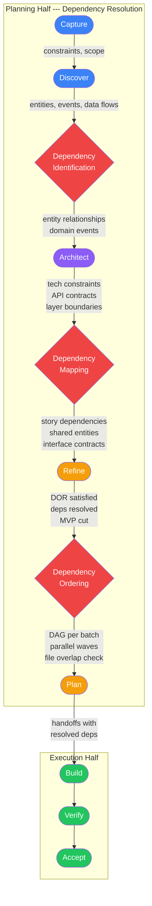
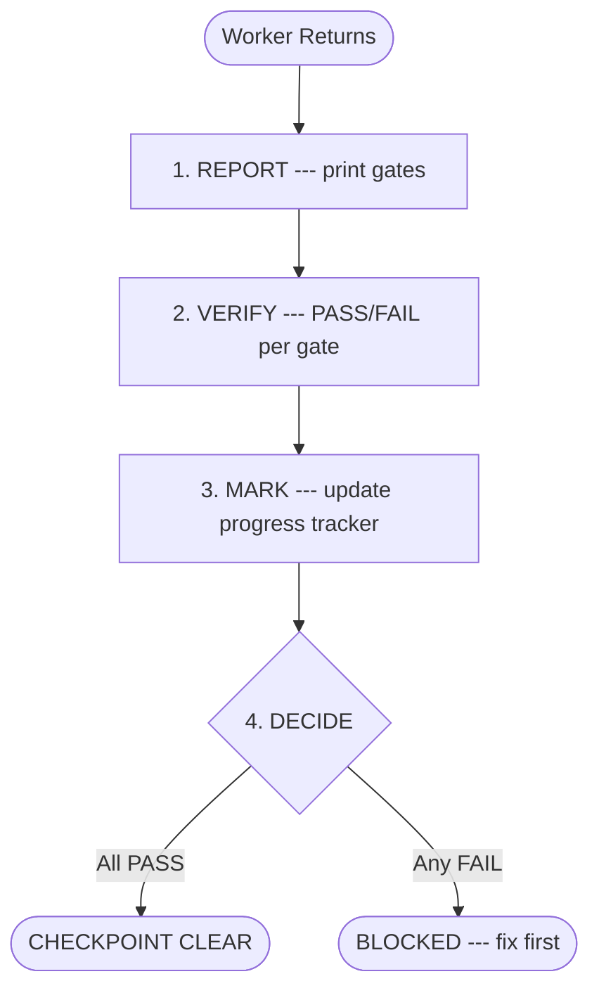
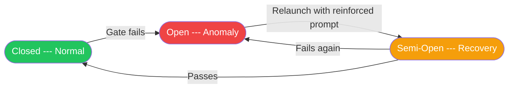

# AGENTS.md --- idea-to-mvp Template

## Current Phase & State

**Phase**: Capture --- project initialized from template. No idea captured yet.
**Sub-state**: Pre-Capture --- no artifacts exist.

To begin: describe the idea, problem, and target audience. The orchestrator guides
the pipeline from here.

> The orchestrator updates this section after every phase transition and batch
> completion. Format: `**Phase**: {name}` + `**Sub-state**: {detail with pointer to
> active batch-progress file}`.

## Execution Axioms

These four axioms gate EVERY action in the framework. They are binary (pass/fail),
mechanically verifiable, and non-negotiable. No protocol, no phase, no role is exempt.
The agent evaluates these BEFORE each action, not after.

**AXIOM-HANDOFF**: Zero lines of code or configuration without an approved handoff file. No handoff = no code.
No exceptions. No "quick fix". No "simple change". No "while I'm here". If a
handoff file does not exist for the work, the work does not happen. If the platform
supports scoped tool permissions: restrict Write/Edit tools in phases prior to Plan.
A handoff file on disk is the unlock signal.
See [Delegation Contract](#delegation-contract).

**AXIOM-ORCHESTRATOR**: The orchestrator coordinates ONLY. If it finds itself writing
code, running builds, or executing tests --- it is in violation. Stop immediately,
delegate the task to a worker, and resume as coordinator. Runtime enforcement: if the
platform supports scoped tool permissions, the orchestrator session MUST exclude Write,
Edit, and execution tools. Where scoping is unavailable, the orchestrator MUST run a
self-check before every tool call: "Am I about to write code, run a build, or execute
tests? If yes, delegate instead." This axiom elevates the
[self-detection rule](#orchestrator) to a top-level gate.

**AXIOM-ECHO**: Every code change triggers the full [Echo System](#echo-system) before
commit. No commit without a green echo. The Echo System is sequential and gated --- a
failure at any stage blocks the commit.

**AXIOM-TDD**: Red → Green → Refactor is the execution methodology, not a suggestion.
Each phase has entry and exit criteria defined in the [TDD Cycle](#tdd-cycle) protocol.
No phase may be skipped. No commit mid-cycle.

These axioms are referenced by compact rules ([PROJECT-ANTI-DRIFT](#project-anti-drift),
[PROJECT-TEST](#project-test), [PROJECT-TDD](#project-tdd)) and enforced through the
[Anti-Rationalization Protocol](#anti-rationalization-protocol).

**Condensed Anti-Rationalization**: cite verbatim text from this file or comply as
written. Ambiguity resolves toward MORE compliance. The agent cannot grant itself
exceptions. Only explicit human directives override rules.

## Architecture Map

This template provides a documentation-first pipeline from idea to MVP. All planning
artifacts live under `docs/`, organized by lifecycle phase. See `docs/INDEX.md` for the
full map of deliverables and their completion status.

All framework knowledge (pipeline, protocols, artifact formats, DOR, DOD) lives in this
file. The `docs/` directory starts empty and is populated with real artifacts as the
pipeline executes.

| Path | Purpose | Created By |
| ---- | ------- | ---------- |
| `docs/INDEX.md` | Project dashboard — tracks all artifacts and completion | Capture phase |
| `docs/project-brief.md` | Vision, problem, deliverables, constraints | Capture phase |
| `docs/domain-glossary.md` | Ubiquitous language, entity relationships | Discover phase |
| `docs/architecture/` | Tech stack, testing strategy, contracts | Architect phase |
| `docs/epics/` | Epic definitions with user story lists | Discover phase |
| `docs/user-stories/` | User stories with ACs, DOR, DOD, test plans | Refine phase |
| `docs/subtasks/` | Batch plans and handoff files | Plan phase |

### Artifact Governance

The pipeline produces artifacts beyond documentation. This section defines the taxonomy
and governance rules at template level. Concrete artifact definitions are resolved during
the Architect phase in `docs/architecture/tech-stack.md`.

| Category | Description | Resolved During |
| -------- | ----------- | --------------- |
| Build outputs | Results of compilation, transpilation, bundling, containerization | Architect phase |
| Test evidence | Coverage reports, test result summaries, assertion logs | Architect phase |
| Generated docs | API documentation, library docs, type docs | Architect phase |
| Derived assets | Optimized images, compiled styles, generated types | Architect phase |

**Governance rules**:

- All artifact categories output to `./artifacts/{category}/` (gitignored)
- DOD evidence: test evidence artifacts are referenced by path or command output in
  handoff progress trackers, but the artifacts themselves are NOT committed
- Documentation artifacts (`docs/`) are committed; build/test/derived artifacts
  (`./artifacts/`) are gitignored
- Reproducibility: any artifact in `./artifacts/` must be reproducible from source via
  a documented command in `docs/architecture/tech-stack.md`
- Concrete artifact definitions (commands, paths, formats) are declared during the
  Architect phase --- at template time only the taxonomy and rules exist

## Ownership & Context Recovery

This framework is designed so that ANY agent can acquire full project ownership in any
session --- even on the first encounter, even after context loss, even if a different agent
worked on it before. The committed artifacts ARE the project's memory.

### Context Recovery Protocol

At the start of every session (or after context compaction), the agent MUST:

1. **Read this file** --- understand framework rules and current phase (top of file)
2. **Read `docs/INDEX.md`** --- understand what exists, what is done, what remains
   - If `docs/INDEX.md` does not exist --- project is in pre-Capture state. Skip to step 4
   - **INDEX reconciliation**: scan `docs/` for `.md` files not listed in INDEX.md.
     If orphans found, add them to INDEX.md before proceeding
3. **Read current phase artifacts** --- whatever documents the current phase requires
4. **Only then act** --- no work begins until context is loaded

This is not optional. An agent that starts working without reading INDEX.md is operating
blind and will produce drift.

### Why Artifacts Are Persistent

Every artifact in `docs/` is a committed file because:

- **Cross-session continuity**: the next session picks up exactly where the last left off
- **Agent-agnostic**: any AI tool can read these files and acquire full context
- **Auditable**: git history shows who decided what and when
- **Traceable**: every decision, requirement, and constraint has a document trail
- **Anti-drift**: the agent cannot "forget" a constraint that is written in a committed file

Ephemeral state (`.tmp-*` files, scratchpad notes) is for in-progress drafts ONLY and
MUST NOT be relied upon for ownership transfer between sessions.

### The INDEX.md Contract

`docs/INDEX.md` is the agent's entry point for project state. It answers:

- What is this project? (one-line description)
- What artifacts exist? (document map with links)
- What is done? (checked boxes)
- What remains? (unchecked boxes)
- What is the dependency order? (Mermaid graph)
- Deferred Backlog status (what was deferred and why)

The orchestrator MUST update INDEX.md after every story completion, every phase transition,
and every artifact creation. An INDEX.md that does not reflect reality is a critical defect.

### Ownership Depth Levels

| Level | Agent reads | Sufficient for |
| ----- | ----------- | -------------- |
| L0 | `AGENTS.md` only | Understanding the framework rules |
| L1 | + `docs/INDEX.md` | Project overview, status, what exists |
| L2 | + current phase artifacts | Active work with full context |
| L3 | + all `docs/` artifacts | Deep ownership, cross-cutting decisions |

The orchestrator operates at L2 minimum. Workers operate at L0 + their handoff file
(the handoff contains all context they need). For phase transitions and architectural
decisions, L3 is required.

## Pipeline Phases

Every project created from this template follows this pipeline. Each phase produces
artifacts that gate the next. No phase may be skipped without explicit human approval.

### Dependency Resolution Pipeline

The planning phases (Capture through Plan) progressively surface and resolve
dependencies. Each phase adds a layer of dependency analysis that feeds the next.
Unresolved dependencies at Plan time produce incorrect execution order and missed
parallelization opportunities.



The three red decision points are dependency gates:

| Gate | Phase | Produces | Risk if Skipped |
| ---- | ----- | -------- | --------------- |
| Dependency Identification | Discover | Entity relationships, domain events, data flows in the glossary | Stories created without understanding which entities depend on which |
| Dependency Mapping | Architect | Epic-and-capability-level dependency links, shared entity contracts, API boundaries | Tech stack locked without mapping how stories share infrastructure |
| Dependency Ordering | Refine/Plan | DAG per batch, parallel waves, file-overlap validation | Wrong execution order, workers blocked on each other, merge conflicts |

Each gate produces a progressive artifact consumed by the next gate:

| Gate | Artifact Produced | Location |
| ---- | ------------------ | -------- |
| Dependency Identification | Entity-relationship list with dependency annotations | Domain glossary |
| Dependency Mapping | Epic-and-capability-level dependency DAG + shared entity contracts | `docs/architecture/tech-stack.md` |
| Dependency Ordering | Execution DAG per batch with parallel waves | Batch plan |

Each gate's artifact feeds the next. The graph starts coarse (entities) and refines to
atomic tasks. At Plan time, the DAG is immutable --- changes during Build require a
re-plan.


| Phase | Produces | Gate to Next | MIM Required |
| ----- | -------- | ------------ | ------------ |
| **Capture** | Problem statement, value proposition, success metrics | Human approves the "why" before exploration begins | Yes |
| **Discover** | User personas, journey maps, competitive analysis, feature list | Human validates that the problem and audience are understood | Yes |
| **Architect** | Tech stack decision (`docs/architecture/tech-stack.md`), system design, API contracts, testing strategy | Architecture review with human; tech stack baselined (changes via ADR process) | Yes |
| **Refine** | Groomed user stories with DOR satisfied, engineering addenda, MVP cut | Every story in the batch passes the Definition of Ready | MVP cut only |
| **Plan** | Handoff files per sub-task, batch execution order, dependency graph | Handoff files pass pre-flight validation | No (automated) |
| **Build** | Working code, tests, committed increments | All quality gates pass per handoff; PDC completed | Per handoff |
| **Verify** | Full regression pass, DOD satisfied for all stories in the batch | Zero failing tests, all ACs verified with evidence | No (automated) |
| **Accept** | Human sign-off on the delivered increment | Human reviews working software and approves or requests changes | Yes |

**MIM (Manual Inspection Milestone)**: a phase boundary where human approval is required
before proceeding. The orchestrator presents results and waits --- it does not continue
until the human responds. Visual and UX decisions always require MIM regardless of phase.

**MIM Conflict Resolution**: when role perspectives disagree at a MIM, apply this
precedence: PO breaks scope and priority ties, Dev Lead breaks technical and feasibility
ties, SM escalates process deadlocks to the human. If no precedence applies, the
disagreement is escalated to human. This generalizes Refinement's synthesis step to all
phases.

### Scrum Team Matrix

The Scrum Team Matrix defines two dimensions of team engagement per phase: what each role
DOES (participation) and what each role CHECKS at the MIM gate (validation). Phase
protocols reference this matrix instead of embedding local copies.

**Matrix 1 --- Participation**:

| Phase | PO | Dev Team | SM |
| ----- | -- | -------- | -- |
| Capture | Leads stakeholder conversation, defines value proposition | Provides feasibility signals, flags technical risks early | Guards scope, ensures constraints are captured |
| Discover | Validates user needs, assigns MoSCoW priorities | Builds domain model, identifies entity dependencies | Verifies INVEST compliance, flags story coupling |
| Architect | Validates NFR coverage, approves API contracts | Leads tech decisions, maps epic-level dependencies | Verifies Echo System config, ensures process gates exist |
| Refine | Defends MVP Cut with rationale, completes ACs | Estimates, validates dependency DAG, authors addenda | Enforces DOR, ensures no blocked stories enter batch |
| Plan | Confirms batch scope vs. capacity | Validates handoffs, runs file-overlap check | Runs pre-flight checklist, verifies delegation readiness |
| Verify | Reviews AC evidence against original intent | Runs regression, checks coverage thresholds | Validates DOD compliance, flags process gaps |
| Accept | Demos to stakeholder, validates success metrics | Available for technical questions and live fixes | Facilitates review, captures feedback for retrospective |

**Matrix 2 --- MIM Validation**:

| Phase | PO gate | Dev Team gate | SM gate |
| ----- | ------- | -------------- | ------- |
| Capture | Real pain addressed? Value proposition falsifiable? | No known technical blockers? Feasibility not ruled out? | Scope bounded? All constraints captured in project brief? |
| Discover | All user needs captured? MoSCoW priorities defensible? | Domain model covers all entities? Entity dependencies annotated? | Every story passes INVEST? No hidden coupling between stories? |
| Architect | NFRs have measurable targets? API contracts cover all user flows? | Tech stack justified per criterion? Dependency DAG covers all epics? | Echo System stages configured? All process gates have owners? |
| Refine | Every AC testable? MVP cut has value justification per story? | Estimates calibrated? Dependency DAG acyclic and complete? | Every story passes DOR checklist? No blocked stories in batch? |
| Plan | Batch scope fits capacity? No low-priority stories displacing higher? | Every handoff has all 12 elements? File-overlap check passes? | Pre-flight checklist green? All delegation prerequisites met? |
| Verify | Every AC has evidence matching original intent? No scope drift? | All tests pass? Coverage meets threshold? No regressions? | DOD checklist complete? Echo System green? All evidence recorded? |
| Accept | Increment delivers promised value? Success metrics met or on track? | No tech debt without ADR? Performance within NFR bounds? | Process followed? Retrospective items captured? |

### Optional Phases

- **Discover** may be compressed when the problem space is well-understood (the human
  decides, not the agent).
- **Refine** and **Plan** may merge for small projects with fewer than 5 user stories.

### Lightweight Mode

For projects with fewer than 3 epics or a well-understood problem space, phases may
compress:

- **Capture + Discover**: merge into a single combined brief-and-discovery document
- **Refine + Plan**: merge into a single pass --- stories decompose directly into handoffs
- **Architect**: may reduce to a single tech-stack decision paragraph within the brief

Lightweight Mode requires explicit human approval at its single MIM gate. The agent
MUST NOT self-select Lightweight Mode --- only the human decides.

**Governance in Lightweight Mode**: MIM may use single-reviewer instead of full role
panel. PDC compresses to async verification (no separate checkpoint message). Phase
time-box: 2 iterations of orchestrator work per phase before mandatory human escalation.
Axioms, Circuit Breaker, and Anti-Rationalization remain invariant --- they are safety
mechanisms, not ceremony.

### Phase Regression Protocol

The pipeline allows backward movement when new information invalidates prior decisions.

| Trigger | Regression To | Required |
| ------- | ------------- | -------- |
| Build reveals architectural flaw | Architect | Human approval (MIM) |
| Implementation uncovers missing requirements | Discover or Refine | Human approval (MIM) |
| Human changes direction or scope | Any earlier phase | Human directive |

When regressing:

1. The orchestrator marks all downstream artifacts as `STALE` in INDEX.md
2. The phase being re-entered produces updated artifacts
3. Stale artifacts are either updated or regenerated --- never left stale
4. A phase regression ALWAYS triggers a MIM before resuming forward progress

### Re-Plan Protocol

Triggered when a dependency changes or a blocker is discovered during Build that
invalidates the batch DAG. Unlike Phase Regression, Re-Plan operates within the current
phase.

1. Worker reports the invalidation via BLOCKED status with the specific dependency
2. Orchestrator freezes new handoff delegations for the affected batch
3. Orchestrator re-runs Dependency Ordering gate on the affected subgraph only
4. Updated DAG replaces the batch plan; affected handoffs re-validated against
   pre-flight checklist
5. Human MIM required if re-plan changes batch scope (adds or removes stories)
6. Unaffected in-progress handoffs continue without interruption

## Agent Roles

This template uses the **orchestrator-worker pattern**: a single orchestrator coordinates
all work by delegating to stateless sub-agents (workers). The orchestrator maintains the
execution plan and global context; workers know nothing beyond their current assignment.

### Orchestrator

The orchestrator is a **pure coordinator**. It decomposes work, delegates, validates
results, and manages phase transitions. It does NOT execute substantive work itself.

| Action | Orchestrator (inline) | Delegate to worker |
| ------ | --------------------- | ------------------ |
| Read to decide/verify (1-3 files) | Yes | --- |
| Read to explore/understand (4+ files) | --- | Yes |
| Read as preparation for writing | --- | Yes, together with the write |
| Write any project file | --- | Yes |
| Run state commands (git status, file listing) | Yes | --- |
| Run execution commands (test, build, install) | --- | Yes |
| Architecture/design decisions (single-step, no research) | Yes | --- |
| Architecture research or multi-source synthesis | --- | Yes |
| Present results to human (MIM) | Yes | --- |

**Self-detection rule**: if the orchestrator finds itself editing files, writing code, or
running builds, it is in violation. It must stop, delegate the task, and resume as
coordinator. (See also: AXIOM-ORCHESTRATOR in [Execution Axioms](#execution-axioms).)

### Workers (Sub-Agents)

Workers are stateless --- they retain no memory between invocations. All context arrives in
the handoff. Workers:

- Receive a self-contained handoff (see [Delegation Contract](#delegation-contract))
- Execute autonomously within the boundaries defined by the handoff
- Return structured status (see [Status Protocol](#status-protocol))
- Follow compact rules injected by the orchestrator (see [Compact Rules](#compact-rules-for-sub-agent-injection))

### Single-Agent Mode

When the runtime does not support multi-agent orchestration (no sub-agent spawning),
the framework degrades gracefully:

- The **human acts as orchestrator** --- reads handoff files and assigns them manually
- The **agent acts as worker** --- receives one handoff at a time and executes it
- The artifact-based design (committed files as source of truth) works identically
- PDC is performed by the human after each task completion
- MIM gates remain unchanged

All artifact formats, DOR/DOD, commit conventions, and quality gates apply in
Single-Agent Mode. Only the delegation mechanism changes.

### Expert Personas (optional)

Workers MAY receive an **expertise persona** that sets the communication style and
technical lens. Personas do NOT override compact rules or project conventions.

**Selection rules**:

- Describe the expertise domain relevant to the task (e.g., "testing architecture
  specialist focused on AAA pattern", "component design expert")
- Personas are chosen at planning time based on the project's tech stack
- Using real expert names is permitted but not required --- some AI providers may decline
  persona impersonation

> **Example:** A testing task receives "Testing Architecture Specialist" with expertise
> in test design and AAA pattern. A frontend task receives "Component Design Expert"
> with expertise in state management and accessibility.

### Model Assignment Policy

Before launching a worker, ask: does this task need to SEARCH, IMPLEMENT, or REASON?

| Level | Model Tier | Use When |
| ----- | ---------- | -------- |
| Search | light | Grep, read docs, lint checks, exploratory reads, formatting |
| Implement | standard | Write code, tests, reviews, verify quality gates |
| Architect | reasoning | Design decisions, conflict resolution, multi-source synthesis |

With 6+ concurrent agents, tier discipline multiplies savings. Never burn a reasoning-tier
model on a grep task. The handoff file metadata carries the assigned model tier.

## Delegation Contract

Every worker receives a **handoff file** as its contract. The handoff is the single source
of truth for the unit of work. No ad-hoc prompts. No improvisation.

### Handoff Structure

Each handoff file MUST contain these elements:

| Element | Description |
| ------- | ----------- |
| Metadata | Task ID, batch, epic, persona, priority |
| Objective | 1-3 sentence north star for this task |
| Pre-conditions | Checkable conditions that must be true before work begins |
| Context bundle | Pointers to exact files with line ranges; the orchestrator verifies existence and currency at pre-flight. Workers open and read only these files |
| Deliverables | Files to create/modify with expected outputs |
| Quality gates | Ordered verification commands with pass criteria (copy-pasteable) |
| Boundaries | Explicit OUT OF SCOPE list (minimum 3 task-relevant items with exclusion rationale) |
| Anti-patterns | Common mistakes: what / why it fails / do instead |
| Rollback guidance | Recovery path if things go wrong |
| Compact rules | Injected PROJECT-* blocks from this file (inline text, not paths) |
| Status protocol | Machine-readable status block format |
| Progress tracker | Checkbox per deliverable and per quality gate, updated during execution |

**Rules**:
- If a handoff exceeds 300 lines, the task is too large --- split it.
- Workers receive rules as **inline text**, never as file paths to read.
- The orchestrator runs the pre-flight checklist before every delegation.

### Pre-Flight Checklist

The SM role initiates the pre-flight review; the orchestrator mechanically verifies all
items. In single-agent mode, both functions are the agent's responsibility. A failed
check means the handoff is defective --- fix it before delegating.

| # | Check | If Failed |
| - | ----- | --------- |
| 1 | All `{placeholders}` are filled --- no template variables remain | Worker will hallucinate missing values |
| 2 | Every context bundle file exists at the specified path | Worker will report BLOCKED or read wrong files |
| 3 | Every quality gate command can be run from the repo root | Gate becomes uncheckable, PDC fails |
| 4 | Pre-conditions have been independently verified | Worker builds on broken foundation |
| 5 | Boundaries explicitly name at least 3 task-relevant things OUT of scope, each with a one-line rationale for exclusion | Scope creep will occur |
| 6 | Compact rules are pasted inline, not referenced by path | Worker cannot read external files not in bundle |
| 7 | The handoff is under 300 lines (excluding compact rules) | Task is too large --- split it |
| 8 | Deliverables list every file to create AND modify | Worker omits files or creates unexpected ones |
| 9 | No deliverable file appears in more than one handoff within the same parallel wave | Merge conflicts between parallel workers |
| 10 | Objective section is present and states a binary PASS/FAIL verifiable goal | Worker has no north star |
| 11 | Anti-patterns section lists at least 2 items | Worker repeats known mistakes |
| 12 | Rollback guidance section is present | No recovery path on failure |
| 13 | Status protocol format is specified | Orchestrator cannot parse worker response |
| 14 | Progress tracker has one checkbox per deliverable and per gate | PDC step 3 (MARK) cannot execute |

### Delegation Launch Contract

Every delegation prompt MUST include these two elements alongside the handoff:

- **Scope hint**: one sentence delimiting the boundaries of what the worker should touch
- **Verifiable objective**: one sentence the orchestrator can evaluate as binary PASS/FAIL
  against the result

These enable lightweight post-delegation assessment. If the result is coherent with the
scope hint and verifiable objective, the orchestrator accepts with zero additional
verification overhead. If incoherent, the circuit breaker activates.

### MIM Response Protocol

When the orchestrator presents results at a Manual Inspection Milestone, the human
responds with one of:

| Response | Agent Action |
| -------- | ------------ |
| **APPROVED** | Proceed to the next phase |
| **APPROVED WITH CHANGES** | Apply the specified changes, then proceed without re-presenting |
| **REJECTED** | Incorporate feedback, redo the phase output, re-present at MIM |

Partial approval ("looks good but change X") is treated as APPROVED WITH CHANGES.
If unclear, the orchestrator asks: "Should I treat this as approved with changes, or
do you want a full re-presentation?"

### Handoff Files

Handoff files live under `docs/subtasks/{epic}/` following the naming convention
`{task-id}-{slug}.md`. They are persistent, committed artifacts that serve as the
contract trail for every unit of work. They are created during the Plan phase and remain
in the repository as part of the project's documentation.

### Post-Delegation Checkpoint (PDC)

After EVERY worker returns, the orchestrator runs these 4 steps sequentially. No other
action (delegation, human response, tool invocation) is permitted until all 4 complete.



1. **REPORT** --- Print the acceptance gates from the handoff: `GATES: [gate1] | [gate2] | [gate3]`
2. **VERIFY** --- For each gate: `GATE [name]: PASS|FAIL --- [evidence]`. Evidence must reference a file, line, or command output. "Looks correct" is NOT evidence.
3. **MARK** --- Update the progress tracker in the handoff file NOW. Mark checkboxes with evidence. If step 3 is not completed, the orchestrator CANNOT proceed.
4. **DECIDE** --- Any FAIL: no advance, re-delegate or correct. Any MAN gate: route to human at MIM, print
   `PENDING_HUMAN` and wait. All PASS (no pending MAN): print `CHECKPOINT CLEAR` and proceed.

### Circuit Breaker



| Failure Count | Action |
| ------------- | ------ |
| 1st | Specific feedback with evidence; worker corrects |
| 2nd | Kill worker, clean relaunch with error context |
| 3rd | Diagnose root cause, relaunch with reduced scope or escalate to human |

Failure counts are scoped per (handoff, gate) pair and reset to zero when the gate passes. Counts persist in the
handoff file's progress tracker --- they survive compaction and session boundaries.

Counter scope: each (handoff, gate) pair has its own independent counter. A PASS on gate X does not reset the
counter for gate Y within the same handoff.

### Status Protocol

Every worker MUST include this block in its final response:

```text
Status: [IN_PROGRESS | BLOCKED | DONE | FAILED]
Progress: X/Y items
Blocker: (if applicable --- describe exactly what blocks)
```

| Condition | Action |
| --------- | ------ |
| No status block returned | STALLED --- kill and relaunch |
| BLOCKED > 1 iteration | Kill, reassign with blocker context |
| FAILED | Diagnose root cause before relaunch |

### Anti-Stall Design Principles

These principles prevent the failure modes that cause workers to stall, loop, or drift.
The orchestrator enforces them structurally through the handoff, not by hoping the worker
behaves.

| Principle | Failure Mode Prevented | How |
| --------- | ---------------------- | --- |
| Self-containment | Context overflow / hallucination | Worker reads ONLY the handoff + referenced files |
| Deterministic verification | Subjective self-assessment | Every quality gate is a shell command returning exit 0 |
| Explicit boundaries | Scope creep | OUT OF SCOPE list prevents "helpful" refactoring |
| Context budget | Context window exhaustion | Context bundle lists exact files with line ranges |
| Rollback safety | Compounding errors | 3-failure circuit breaker prevents infinite fix loops |
| Structured status | Unparseable responses | Machine-readable status block forces binary state |
| Zero-read briefings | Wasted tokens on exploration | Refinement sub-agents receive all context pre-digested in the prompt; they never search for their own context |

### Context Resilience

Workers are stateless and expendable. The system is designed so that context loss (session
end, compaction, crash) does NOT lose project progress. Resilience comes from three
mechanisms:

**1. Artifacts are the memory** --- all decisions, requirements, and plans are committed
files in `docs/`. If the agent loses context, it recovers by reading the artifacts
(see [Ownership & Context Recovery](#ownership--context-recovery)).

**2. Rules travel as text, not references** --- compact rules are pasted directly into
worker prompts; context bundles are file pointers validated at pre-flight. Even if the
orchestrator loses its context, every active worker already has the rules it needs.

**3. Skill resolution feedback** --- workers MUST report their skill resolution status in
their return:

| Status | Meaning | Orchestrator action |
| ------ | ------- | ------------------- |
| `injected` | Received compact rules from orchestrator | None --- ideal path |
| `self-loaded` | No rules received, loaded from project files | Re-read AGENTS.md, re-inject in all subsequent delegations |
| `none` | No rules loaded at all | Critical --- stop and re-inject before next delegation |

If any worker reports anything other than `injected`, the orchestrator MUST treat it as a
context loss signal and re-read this file immediately.

## Definition of Ready (DOR)

A user story MUST meet every condition below before any worker may start implementation.
If any box is unchecked, the story is NOT ready --- send it back to refinement.

- [ ] All acceptance criteria are in Given/When/Then format
- [ ] Dependencies on other stories are identified and resolved or explicitly deferred
- [ ] Architecture decisions relevant to this story are documented
- [ ] No blocking questions remain; remaining uncertainties are documented with proposed default behaviors
- [ ] Test plan exists (test names mapped to acceptance criteria)
- [ ] Dependency gate artifacts exist for this story's dependencies (identification, mapping, or ordering as applicable)
- [ ] Team participation and role-gate review completed for the originating phase

> **CONDITIONAL** (include when the project has an API):
- [ ] API contract endpoints touched by this story are defined in `docs/architecture/api-contract.md`

> The User Story artifact template ([User Story](#user-story)) extends this base DOR with
> story-specific items (domain contracts, interface contracts, validation rules, edge cases).
> Both checklists must be satisfied.

## Definition of Done (DOD)

A user story MUST meet every condition below before it can be marked complete.

- [ ] All acceptance criteria pass, verified by test evidence (not by inspection alone)
- [ ] Tests written and passing for all code paths introduced by this story
- [ ] No regressions --- the full test suite passes, not just the new tests
- [ ] Dependency audit passes --- Echo System Stage 4 (Audit) exits clean
- [ ] Code reviewed via adversarial worker (separate agent with different persona and mandate to find flaws)
- [ ] Changes committed using conventional commit format
- [ ] Corresponding checkbox in `docs/INDEX.md` is marked done

> **CONDITIONAL** (include when defined in tech-stack.md):
- [ ] Performance: response time under threshold defined in tech-stack.md
- [ ] Security: no new vulnerabilities from static analysis
- [ ] No dead code: unused exports, unreachable branches, and orphan files removed
- [ ] No unused dependencies: every installed package is imported somewhere in the codebase

> The User Story artifact template ([User Story](#user-story)) extends this base DOD with
> story-specific items. Both checklists must be satisfied.

## Commit Convention

Every commit message follows [Conventional Commits](https://www.conventionalcommits.org/).

### Format

```text
type(scope): description

Optional body with details.

- Change detail 1
- Change detail 2
```

### Types

| Type | When to Use |
| ---- | ----------- |
| `feat` | New features or capabilities |
| `fix` | Bug fixes |
| `chore` | Tooling, config, dependencies, CI |
| `task` | Changes to existing functionality |
| `spike` | Research or exploration (no production code). Spike code MUST be deleted before TDD cycle begins --- it cannot be repurposed as Green-phase implementation. Test commits must precede implementation commits in git history |
| `docs` | Documentation only |
| `test` | Adding or updating tests only |
| `refactor` | Code restructuring with no behavior change |

### Rules

- Subject line: imperative mood, lowercase, no trailing period, max 72 characters
- Body: brief description followed by bullet points listing each concrete change
- No AI attribution lines (no `Co-Authored-By` or similar)
- One logical change per commit (atomic commits)

## Compact Rules for Sub-Agent Injection

Orchestrators MUST inject these rules as literal text into every worker prompt. Workers
receive the text directly --- never file paths or references to read.

### PROJECT-DOCS

- All planning docs are business-first, technology-agnostic until Architecture phase
- User stories follow standard format: persona, action, value
- Acceptance criteria use Given/When/Then format exclusively
- No implementation details in user stories --- stories describe WHAT and WHY, never HOW
- Documentation language: English for all repository artifacts

### PROJECT-TEST

- AXIOM-ECHO: every code change runs the Echo System before commit --- no commit without green echo (see [Echo System](#echo-system))
- All tests must pass before any commit
- New features require corresponding tests
- TDD Cycle (Red/Green/Refactor) is mandatory --- see [TDD Cycle](#tdd-cycle) for entry/exit criteria per phase
- Breaking an existing test is a blocking issue --- fix before proceeding
- Tests map directly to user story acceptance criteria
- Test evidence (command output, screenshots) is required for DOD --- "it works" is not evidence

### PROJECT-TDD

- Red: write test for AC → run → MUST fail → verify failure is the assertion, not syntax/import
- Green: write MINIMUM code → run → MUST pass → full suite → no regressions
- Refactor: apply SOLID/KISS/DRY/YAGNI/OWASP/Clean/Hexagonal → after EACH refactor: full suite → if fail: REVERT
- Cycle applies PER acceptance criterion --- each AC gets its own Red/Green/Refactor
- No commit mid-cycle --- only commit after Refactor exits green + Echo System passes
- If test passes without implementation code, the test is tautological --- rewrite it
- If refactor breaks tests, the refactor is wrong --- revert, do NOT fix tests to match refactor
- Full cycle protocol with entry/exit criteria: [TDD Cycle](#tdd-cycle)

### PROJECT-ANTI-DRIFT

- AXIOM-HANDOFF: no code without an approved handoff file --- no exceptions, no "quick fix" (see [Execution Axioms](#execution-axioms))
- AXIOM-ORCHESTRATOR: the orchestrator coordinates only --- if it writes code or runs builds, it is in violation (see [Execution Axioms](#execution-axioms))
- Respect the current phase --- do not jump ahead in the pipeline
- Capture/Discover phases: NO code, NO technology choices, NO architecture diagrams
- Every decision must trace back to a requirement or acceptance criterion
- Version pinning: ALL dependencies use exact versions --- no floating or range specifiers (e.g., `^`, `~`, `*`,
  `latest` in npm; `>=` in pip; `~>` in Gemfile) --- use the ecosystem's exact-version syntax. Use LTS runtime
  versions when available. The Architect phase defines the version policy and lockfile enforcement in
  `docs/architecture/tech-stack.md`. The Echo System Stage 4 (Audit) verifies compliance
- Scope is defined by the handoff --- work outside the handoff boundaries is a violation
- Dead code and unused dependencies MUST be removed --- never conserved "just in case"
- Prefer technologies and tooling that enable static dead code detection (tree-shaking,
  unused export analysis, dependency audit). This preference is declared during the
  Architect phase in `docs/architecture/tech-stack.md`

### PROJECT-PIPELINE

- The build pipeline is the [Echo System](#echo-system) --- defined abstractly here, resolved in
  `docs/architecture/tech-stack.md` after the Architecture phase
- Pipeline stages are sequential and gated --- a failing stage STOPS the pipeline
- The pipeline order is sacred: it cannot be reordered. Stage 1 (Build), Stage 2 (Test), and Stage 4 (Audit) can
  NEVER be skipped. Stage 3 (E2E) may be skipped only with documented justification recorded in
  `docs/architecture/tech-stack.md`
- Same pipeline in every environment (local, CI, production) --- no environment-specific shortcuts
- Build artifacts go to `./artifacts/` (gitignored) --- see [Artifact Governance](#artifact-governance) for
  taxonomy and rules

> **Note:** Echo System defines 4 stages (Build, Test, E2E, Audit). The concrete commands and stage composition for
> your project are declared in `docs/architecture/tech-stack.md` during the Architect phase.

## Anti-Rationalization Protocol

All protocols in this document are mandatory. The agent cannot grant itself exceptions.

- **Cite or comply**: before omitting any rule, cite the exact text that authorizes it.
  No exact text → not authorized. The citation must be a verbatim substring of this
  document --- paraphrased or approximate citations do not satisfy the requirement
- **Rationalization signals**: phrases like "this doesn't warrant", "given the simplicity",
  "an exception for" indicate the agent is rationalizing. Stop and comply as written
- **Ambiguity → compliance**: ambiguity resolves in favor of MORE compliance, not less
- **Scale, don't skip**: "scale to the work" means reduce content volume, never omit
  required structural elements
- **Human override only**: only an explicit human directive overrides a rule. The agent
  repeats the override back for confirmation before acting
- **Burden of proof**: rests on the agent, not on this document

### Discretionary Judgment

When this document is SILENT on a procedural matter (no protocol exists for the
situation), the agent MAY exercise professional judgment and MUST:

Discretionary Judgment NEVER applies to: Execution Axioms, DOD requirements, Echo System
stages, MVP Cut scoring methodology, or the Anti-Rationalization Protocol itself. These
are governed by explicit rules and are never "silent."

1. Document the judgment call in the resulting artifact
2. Flag it for human review at the next MIM
3. If the situation recurs, propose an AGENTS.md amendment via the Retrospective protocol

## Process Protocols

### Refinement (Grooming)

Refines user stories before implementation begins. Bridges Discovery (the what/why) and
Build (the how). Produces DOR-satisfied stories with technical approach, test plan, and
deliverables.

**Process**:

1. Orchestrator reads source docs (epic, user stories, architecture docs) --- inline, not delegated
2. Orchestrator condenses into a single briefing (written to scratchpad, never committed)
3. Pre-filter stories by MoSCoW priority --- `Won't Have` stories are excluded from the review team. Only
   `Must Have`, `Should Have`, and `Could Have` proceed to review
4. Launch review team in parallel (minimum 3 reviewers):
   - **Domain reviewer** --- validates business logic and acceptance criteria
   - **Technical reviewer** --- validates feasibility, technical approach, deliverables
   - **QA reviewer** --- validates testability, edge cases, test plan completeness
   - Additional reviewers for security, performance, or UX when the story touches those

   Reviewer mapping: Domain reviewer = PO perspective, Technical reviewer = Dev Team
   perspective, QA reviewer = SM perspective. The same person may fill multiple reviewer
   roles in small teams.
5. Synthesis agent merges all perspectives, resolves conflicts conservatively
6. Orchestrator writes refined stories to the repository

**Zero-read principle**: refinement sub-agents receive the FULL briefing text injected in
their prompt. They get a role-specific lens (what to focus on) and return structured
output. Sub-agents in refinement perform ZERO file reads --- all context is pre-digested
by the orchestrator. This eliminates wasted tokens on exploration and ensures every
reviewer works from identical context.

**Guard**: refinement produces stories that satisfy DOR. If DOR is not met after
refinement, the story cycles back for another pass.

Team roles and MIM gates for this phase: see [Scrum Team Matrix](#scrum-team-matrix).

**Retry cap**: if a story fails DOR after 2 refinement passes, it is escalated to the
human with the specific failing DOR items. The agent does not attempt a third pass.

**MVP Cut**: after refinement, the orchestrator produces an MVP cut --- marking which
stories are IN the MVP (v1) and which are deferred (v2+). Only MVP-in stories proceed
to Plan. The cut is recorded in INDEX.md under each epic's story list. Deferred stories
MUST also be recorded in `docs/deferred-backlog.md` with category and rationale --- an
INDEX.md OUT marker alone is insufficient. The human approves the cut at MIM.

**MVP Cut criteria**: Must Have stories are always IN. Should Have stories enter if
remaining capacity allows, ordered by value. Could Have and Won't Have are recorded in
the Deferred Backlog with category and rationale. The PO presents the cut with an
explicit value justification per story --- "rationale" means a documented reason, not a
subjective judgment.

### Capture

Elicits the core idea from the human and produces the project foundation documents.

**Process**:

1. Ask the human to describe the idea, the problem it solves, and who it serves
2. Probe with follow-up questions until these are clear:
   - What pain or gap does this address?
   - Who are the primary users or beneficiaries?
   - What does success look like? (measurable criteria)
   - What constraints exist? (time, budget, technology, compliance)
   - What is the MVP scope? (what is IN v1, what is deferred)
3. Draft `docs/project-brief.md` following the Project Brief format
4. Create `docs/INDEX.md` with Header and Project Overview populated; all other sections
   as placeholders marked `TBD --- populated during {phase name}`
5. Present both documents at MIM for human approval
6. Initialize `docs/deferred-backlog.md` with header and empty table (see Deferred Backlog format)

Team roles and MIM gates for this phase: see [Scrum Team Matrix](#scrum-team-matrix).

**Project type classification**: during Capture, classify the project as one of:
`product` | `library` | `tool` | `extension` | `bot` | `other`. This classification
determines which Discover artifacts are required vs. optional (see Discover protocol).

### Discover

Explores the problem domain and defines what to build.

**Process**:

1. Read the approved project-brief.md
2. Research the problem domain (competitive analysis, prior art, technical landscape)
3. Draft `docs/domain-glossary.md` following the Domain Glossary format

   > The domain glossary MUST include dependency annotations between entities --- this
   > is the Dependency Identification gate output (see Dependency Resolution Pipeline).
4. Draft epics in `docs/epics/EP{NN}-{slug}.md` with user story lists (MoSCoW priority)
5. Update `docs/INDEX.md` with new artifacts
6. Present at MIM for human validation
7. Update `docs/deferred-backlog.md` with features identified but excluded from scope

**Project type adaptations**:

| Artifact | Product | Library/Tool | Extension/Bot |
| -------- | ------- | ------------ | ------------- |
| User personas | Required | Optional (developer persona assumed) | Optional |
| Journey maps | Required | Replace with API usage flows | Replace with integration flows |
| Competitive analysis | Required | Required (existing solutions) | Required (existing plugins) |
| Domain glossary --- Domain Events | Required | Optional | Optional |
| Domain glossary --- State lifecycles | Required | Optional | Optional |

Team roles and MIM gates for this phase: see [Scrum Team Matrix](#scrum-team-matrix).

### Architect

Makes technology decisions and locks the technical foundation.

**Process**:

1. Read project-brief.md, domain-glossary.md, and all epics
2. Evaluate technology options against project constraints and type
3. Draft `docs/architecture/tech-stack.md` with:
   - Chosen stack with rationale and alternatives considered
   - Build pipeline stages (install → build → lint → test → etc.)
   - Test strategy (unit, integration, e2e --- which apply)
   - Echo System commands: `{build_command}`, `{lint_command}`, `{test_command}`, `{e2e_command}`, `{audit_command}`
   - Version policy: exact versions only (no `^`, no `~`, no `latest`), LTS runtime versions, lockfile enforcement mechanism
   - Pre-commit hook specification: the hook MUST run the Echo System and exit non-zero on failure (structural
     enforcement of AXIOM-ECHO)
   - Artifact definitions: what each Echo System stage produces and where it lands in `./artifacts/`
4. Produce the epic-and-capability-level dependency DAG (refined to story-level at the
   Dependency Ordering gate during Refine/Plan) (Dependency Mapping gate output) and
   record it in `docs/architecture/tech-stack.md`
5. Draft additional architecture docs as needed (API contracts, system design)
6. Update `docs/INDEX.md`
7. Present at MIM for human review --- tech stack is **baselined** after approval

Team roles and MIM gates for this phase: see [Scrum Team Matrix](#scrum-team-matrix).

**ADR (Architecture Decision Record) process**: if during Build phase a technical
decision needs to change, create `docs/architecture/ADR-{NNN}-{slug}.md` with:
Context, Decision, Rationale, Consequences. This requires human approval (MIM).

### Sprint Planning

Takes refined (DOR-satisfied) user stories and decomposes them into handoff files. Each
handoff is a self-contained contract for autonomous worker execution.

**Guard**: planning MUST NOT start unless every story in scope has a Definition of Ready
section. Missing DOR means the story needs refinement first.

**Process**:

1. Verify DOD exists for every story in scope
2. Decompose stories into atomic tasks
3. Generate handoff files following the template
4. Validate: every AC maps to at least one handoff, no file overlap between handoffs
5. Write handoff files to `docs/subtasks/{epic}/{task-id}-{slug}.md`

Team roles and MIM gates for this phase: see [Scrum Team Matrix](#scrum-team-matrix).

**Batch sizing heuristics**:
- Target 3-5 stories per batch
- Group stories that share domain entities or modify the same files
- A batch should be completable in one focused session
- Stories with no cross-dependencies can be parallelized within a batch

### TDD Cycle

The TDD Cycle is the execution methodology for the Build phase. It applies PER acceptance
criterion --- each AC gets its own Red → Green → Refactor cycle. See AXIOM-TDD.


**Red Phase**:

Entry: AC identified, test name assigned from the test plan.

1. Write the test for the acceptance criterion
2. Run the test --- it MUST fail
3. Verify the failure reason is the actual assertion, not a syntax error, missing import, or wrong path
4. If the test passes without implementation code, the test is tautological --- rewrite it
5. Persist the failing test output in the progress tracker --- this evidence is required before Green phase may
   begin
6. The orchestrator (or a second worker in parallel execution) independently re-runs the test to confirm the
   failure --- self-attested Red is insufficient

Exit: test exists, fails for the right reason, failing output recorded in progress tracker.

**Green Phase**:

Entry: Red phase exit criteria met.

1. Write the MINIMUM code that makes the test pass
2. No optimization, no cleanup, no premature abstraction, no "while I'm here" changes
3. Run the test --- it MUST pass
4. Run the full suite --- no regressions

Exit: new test passes, full suite green.

**Refactor Phase**:

Entry: Green phase exit criteria met.

1. Apply the engineering principles checklist:

   | Principle | Focus |
   | --------- | ----- |
   | SOLID | Single responsibility, open/closed, Liskov, interface segregation, dependency inversion |
   | KISS | Simplest solution that satisfies the requirement |
   | DRY | Eliminate duplication only when the abstraction is justified |
   | YAGNI | Remove speculative code that serves no current AC |
   | OWASP | Input validation, injection prevention, secure defaults |
   | Clean Architecture | Dependency direction, layer separation, domain isolation |
   | Hexagonal Architecture | Ports and adapters, infrastructure at the edges |
   | Design Patterns | Apply when they reduce complexity, not for ceremony |

2. After EACH refactor operation: run the full suite
3. If any test fails: REVERT the refactor and investigate --- the refactor is wrong, not the tests

Exit: suite green, code satisfies engineering principles.

**Guard**: no commit mid-cycle. Only commit after the Refactor phase exits green AND the
Echo System passes (see below). The progress tracker MUST record the current TDD phase
(Red/Green/Refactor) per AC. A commit is structurally permitted only when the tracker
shows Refactor-complete for all ACs in the current handoff. The Echo System pre-commit
hook verifies this state.

### Echo System

The Echo System is a sequential, gated verification pipeline that runs after every code
change and before any commit. It is THE verification mechanism --- it replaces ad-hoc
"run tests" instructions. See AXIOM-ECHO.


| Stage | Name | Scope | Command Placeholder |
| ----- | ---- | ----- | ------------------- |
| 1 | Build | Compile/transpile + derived artifacts --- see [Artifact Governance](#artifact-governance) for output taxonomy | `{build_command}` |
| 2 | Test | Static analysis (`{lint_command}`) + dynamic tests (`{test_command}`) | `{lint_command}` + `{test_command}` |
| 3 | E2E | End-to-end tests (conditional --- only if project defines them) | `{e2e_command}` |
| 4 | Audit | Dependency security audit + version policy compliance | `{audit_command}` |

**Rules** (stage sequencing and gating per PROJECT-PIPELINE):

- The echo runs BEFORE any commit, not after
- Stage 3 (E2E) is conditional --- if the Architect phase omits `{e2e_command}`, the omission must include
  documented justification in `docs/architecture/tech-stack.md`
- Stage 4 (Audit) runs `{audit_command}` to detect known vulnerabilities and verify version policy compliance.
  Stage 4 is NON-WAIVABLE --- every project must define `{audit_command}` during the Architect phase
- Template defines the structure; the Architect phase fills concrete commands in `docs/architecture/tech-stack.md`
- A "green echo" means all applicable stages pass

**Relationship to PDC**: the Echo System is what the **worker** runs during execution
(before committing). The PDC is what the **orchestrator** runs after a worker returns.
They are complementary. Note: the PDC step named "REPORT" (in the Post-Delegation
Checkpoint) is a display action (print the gates), not an invocation of this system ---
these are distinct concepts.

> All command placeholders (`{build_command}`, `{lint_command}`, `{test_command}`,
> `{e2e_command}`, `{audit_command}`) are resolved from `docs/architecture/tech-stack.md`
> during the Architect phase. The `{audit_command}` must also verify version policy
> compliance (exact versions, no floating ranges, LTS runtime).

### Story Completion

When a worker reports DONE, the orchestrator runs this checklist:

1. Run PDC (all 4 steps: REPORT, VERIFY, MARK, DECIDE)
2. Verify every acceptance criterion against test evidence
3. Confirm the worker's Echo System run was green (verify evidence in the progress tracker)
4. Update `docs/INDEX.md` --- mark the story checkbox as done
5. If all stories in an epic are done, mark the epic as done
6. Commit with conventional commit format

### Verify

Runs full regression and validates that the batch meets DOD.

**Process**:

1. Run the complete Echo System pipeline (all 4 stages)
2. Walk every story's acceptance criteria and verify each has test evidence
3. Run DOD checklist --- every item must be checked with observable evidence
4. Compile verification report: per-story AC status, test coverage, Echo System output

Team roles and MIM gates for this phase: see [Scrum Team Matrix](#scrum-team-matrix).

### Accept

Human reviews the delivered increment and decides whether to approve.

**Process**:

1. Orchestrator presents working software to the human (demo or access to running instance)
2. Walk through each story with its AC evidence
3. Reconcile delivered increment against success criteria from the project brief
4. Human provides MIM response (APPROVED / APPROVED WITH CHANGES / REJECTED)

Team roles and MIM gates for this phase: see [Scrum Team Matrix](#scrum-team-matrix).

**REJECTED semantics**: human REJECTED at Accept revokes the batch's DOD status. Affected
stories re-enter Build with specific feedback recorded as new acceptance criteria.

### Batch Status Reporting

After every task completion (or BLOCKED/FAILED). The orchestrator may batch reports when
tasks complete in rapid succession, but the minimum cadence is one report per task. The
orchestrator produces a batch-level summary for human visibility:

```text
BATCH STATUS: {epic} Batch {N}
Done: X/Y tasks | Blocked: N | Failed: N
Active wave: {wave number}
Test health: {pass/fail count}
Next: {what happens next}
```

This surfaces problems between MIM checkpoints. The human can intervene at any time.

### Phase Transition

- The orchestrator verifies DOR/DOD for the transition boundary
- Updates the Current Phase section in this file
- Commits the phase transition
- Context is passed explicitly --- it is never assumed to carry over between phases

### Retrospective

After each batch completion or phase transition, the orchestrator conducts a lightweight
retrospective:

1. **What went well** --- patterns to keep
2. **What went wrong** --- friction, failures, process gaps
3. **Action items** --- concrete changes, including proposed AGENTS.md amendments
4. **Velocity check** --- compare estimated sizes (S/M/L) against actual effort; adjust future estimates

If an action item proposes changing this file, it requires human approval before taking
effect. The retrospective is committed as `docs/retro-{date}-{batch}.md` (optional ---
only when there are meaningful findings).

This is the ONLY sanctioned path for evolving the framework. Without it, the
Anti-Rationalization Protocol prevents all process adaptation.

## Artifact Formats

Artifact templates are reference material loaded when producing a specific artifact.
Agents should read only the template for the artifact being created, not the entire
section. Phase execution does not require these templates --- they are consumed at
artifact-creation time.

This section defines the format for every artifact the pipeline produces. The orchestrator
and workers MUST follow these formats. Each artifact begins with a breadcrumb linking back
to the index: `> [INDEX](path/to/INDEX.md) / [Parent] / Document Title`.

### INDEX.md --- Project Dashboard

File: `docs/INDEX.md`. Created during Capture phase. This is the agent's primary
reference for project state --- read it to understand what exists and what remains.

Sections:

1. **Header** --- project name, one-line description
2. **Document Map** --- Mermaid flowchart showing relationships between all artifacts
3. **Project Overview** --- checkboxes for project-brief.md and domain-glossary.md
4. **Epics** --- checkboxes for each epic, nested with their user stories
5. **Architecture** --- checkboxes for tech-stack, testing-strategy, and other arch docs
6. **Sprint Planning** --- checkboxes for batch plans and handoff files
7. **Navigation Notes** --- how documents cross-reference each other

Checkbox convention: `- [ ]` not started, `- [x]` complete. The orchestrator updates
INDEX.md after every story completion (see Story Completion protocol).

### Project Brief

File: `docs/project-brief.md`. Created during Capture phase.

Sections:

1. **Vision** --- one paragraph describing the desired future state
2. **Problem Statement** --- what pain or gap this project addresses
3. **Deliverable Map** --- Mermaid flowchart of high-level deliverable dependencies
4. **Deliverables** --- checkbox list, each linking to its epic
5. **Constraints** --- time, budget, technology, compliance, or other limitations
6. **Evaluation Criteria** --- table: Criterion | Weight (High/Medium/Low) | Description
7. **Related Documents** --- links to domain glossary, architecture, epics

### Domain Glossary

File: `docs/domain-glossary.md`. Created during Discover phase.

Sections:

1. **Entities** --- table: Entity | Description | Key Attributes | Relationships | Rationale
2. **Value Objects** --- table: Name | Description | Constraints
3. **Domain Events** --- table: Event | Trigger | Outcome
4. **Status/State Values** --- allowed states for entities with lifecycles (Mermaid state diagram)
5. **Entity Relationships** --- Mermaid ER diagram
6. **Conventions** --- naming, casing, date/time formats

**Competitive Landscape** (populated during Discover):

| Competitor/Alternative | Approach | Strengths | Weaknesses | Relevance |
| ---------------------- | -------- | --------- | ---------- | --------- |

### Epic

File: `docs/epics/EP{NN}-{slug}.md`. Created during Discover phase, refined during Refine.

Sections:

1. **Summary** --- 2-3 sentences describing the epic's scope
2. **Business Value** --- why this epic matters to the user/stakeholder
3. **Domain Flow** --- Mermaid diagram showing the domain-level flow this epic enables
4. **User Stories** --- checkbox list with priority labels (`Must Have`, `Should Have`, `Could Have`)
5. **Acceptance Boundaries** --- constraints that apply to ALL stories in this epic
6. **Related Architecture** --- links to relevant architecture docs
7. **Related Documents**

### User Story

File: `docs/user-stories/US-{NNN}-{slug}.md`. Created during Refine phase. This is the
most detailed artifact --- it is the contract between planning and implementation.

Sections (all required unless marked optional):

1. **Metadata** --- epic link, priority (`Must Have` | `Should Have` | `Could Have`), estimation
   (`S` | `M` | `L`), status
2. **Story** --- `As a {persona}, I want {action}, so that {value}`
3. **Definition of Ready** --- checkbox list. Items:
   - Domain entity contract frozen (fields, types, nullability, constraints)
   - Interface or API contract frozen (request/response shapes, error formats)
   - Input validation rules enumerated with exact boundaries
   - Edge cases identified with boundary behavior defined
   - Dependencies identified and resolved or deferred
   - Test plan exists with test names mapped to ACs
   - Out-of-scope items listed

   > Items referencing API contracts or request/response shapes apply only when the story
   > touches an API boundary. For non-API stories, mark these as N/A with justification.

4. **Acceptance Criteria** --- numbered with story prefix (AC-{NNN}.1, AC-{NNN}.2, etc.).
   Each criterion MUST use Given/When/Then format:
   ```
   - [ ] **AC-{NNN}.1: {title}**
     - **Given** {precondition}
     - **When** {action}
     - **Then** {expected outcome}
   ```
5. **Definition of Done** --- checkbox list. Items:
   - All ACs pass with automated test evidence
   - Unit tests green for domain logic and validation
   - Integration tests green against real dependencies (when applicable)
   - No regressions in existing test suite
   - Error responses conform to agreed shape
   - Code reviewed
   - INDEX.md updated
6. **Deliverables** --- two tables:
   - Files to Create: File Path | Contents
   - Files to Modify: File Path | Change
7. **Test Plan** --- table: Test Name | AC | Assertion
   Every AC must be covered by at least one test. Each test states the specific assertion.
8. **Validation Rules** --- enumerated constraints per input field with exact boundaries
   (min, max, required, format, edge cases)
9. **Risks** --- table: Severity | Risk | Mitigation
   Severities: `CRITICAL` | `HIGH` | `MEDIUM` | `LOW`
10. **Out of Scope** --- bullet list of explicit exclusions to prevent scope creep
11. **Notes** (optional) --- implementation hints, open questions, team decisions
12. **Related Documents** --- links to epic, architecture, related stories
13. **Handoff Files** (populated during Plan) --- links to handoff files implementing this story
14. **Change Log** --- date, change, reason for each modification after initial creation

### Batch Plan

File: `docs/subtasks/{epic}/batch-{N}-plan.md`. Created during Plan phase.

Sections:

1. **Scope** --- what this batch delivers, referencing the engineering addenda
2. **Task List** --- table: Task ID | Task Name | Persona | Model Tier | Depends On
3. **Dependency Graph** --- Mermaid DAG showing task dependencies. Solid arrows for hard
   dependencies, dashed arrows for soft dependencies
4. **Execution Order** --- numbered waves (parallel wave 1, sequential step 2, etc.)
5. **Definition of Done --- Batch** --- checkboxes for batch-level completion criteria
6. **Related Documents**

### Handoff File

File: `docs/subtasks/{epic}/{task-id}-{slug}.md`. Created during Plan phase. The
12-section structure is defined in the Delegation Contract section above.

Additional rules:

- Quality gates MUST be copy-pasteable shell commands. Use the project's actual commands
  from `docs/architecture/tech-stack.md` (not placeholders)
- Context bundle lists EXACT files with line ranges and justification for each
- Boundaries section lists at least 3 things explicitly OUT OF SCOPE
- Compact rules are pasted as inline text, never referenced by file path
- Maximum 300 lines. If exceeded, split the task

### Engineering Addenda

File: `docs/epics/{epic}-batch-{N}-refinement.md`. Created during Refine phase as the
output of the grooming/refinement ceremony.

Sections:

1. **Batch Info** --- batch number, scope, who refined it
2. **Prerequisites** --- checkbox list of items that must be resolved before implementation
3. **Dependencies** --- table: Package/Tool | Version | Target Project/File
4. **Implementation Order** --- numbered list of files/components in dependency order. When
   TDD is active, this becomes the test-first order
5. **Risks** --- subsections by severity (CRITICAL, HIGH, MEDIUM, LOW). Each risk states the
   problem, why it matters, and the mitigation
6. **Related Documents**

### Batch Progress

File: `docs/subtasks/{epic}/batch-{N}-progress.md`. Created when the first task in a
batch is delegated. Updated atomically before and after each delegation.

Sections:

1. **Batch Reference** --- link to batch plan
2. **Task Status** --- table: Task ID | Status (NOT_STARTED/IN_PROGRESS/BLOCKED/DONE/FAILED) | Worker | Evidence
3. **Active Wave** --- which wave is currently executing
4. **Blockers** --- any active blockers with context
5. **Last Updated** --- timestamp of last status change

This artifact solves crash recovery: a new session reads this file to know exactly
where execution stopped and which tasks need re-delegation.

### Deferred Backlog

File: `docs/deferred-backlog.md`

Persistent artifact capturing ideas and stories excluded from the current iteration with
rationale. Initialized during Capture, updated during Discover and Refine, consumed during
the next iteration's Capture phase.

| Column | Description |
| ------ | ----------- |
| ID | Sequential identifier (DF-001, DF-002) |
| Item | Story or feature title |
| Originating Phase | Phase where the deferral decision was made |
| Reason | Human-readable explanation |
| Category | `time` · `dependency` · `risk` · `low-value` · `scope-creep` |
| Reconsider When | Condition that would make this item a candidate again |
| Related Deps | Links to dependency DAG nodes (if category is `dependency`) |

Categories:

- `time` --- valuable but does not fit in this iteration
- `dependency` --- requires something that does not exist yet
- `risk` --- requires investigation or spike first
- `low-value` --- does not justify the cost now
- `scope-creep` --- not part of the original problem statement

When a blocking dependency is resolved, items with `dependency` category and matching
`Related Deps` become candidates for the next iteration automatically.

## Quality Gates Framework

Every task in a handoff file MUST define acceptance criteria as a gates table:

```markdown
| Gate | Verification | Command/Check | Type |
| ---- | ------------ | ------------- | ---- |
```

Gate types:

- `EXE` --- deterministic command, auto-verifiable (copy-pasteable shell command)
- `DOC` --- file inspection, verifiable without shell access (check file exists, content matches)
- `MAN` --- requires human judgment or visual inspection (always triggers MIM)

When the agent lacks shell access, `EXE` gates degrade to `DOC` equivalents where
possible. Gates that cannot degrade require human verification (escalate to `MAN`).

Minimum gates required for ANY task (additional gates are added per task):

| Gate | Verification | Command/Check | Type |
| ---- | ------------- | -------------- | ---- |
| Handoff exists | Handoff file present for this work | `docs/subtasks/{epic}/{task-id}-*.md` exists | EXE |
| Tests pass | All tests pass | `{test_command}` exits 0 | EXE |
| No side effects | No unintended file changes | `git diff --stat` shows only expected files | EXE |
| Echo System green | All applicable Echo stages pass | `{echo_command}` or sequential: `{build_command}` + `{lint_command}` + `{test_command}` + `{e2e_command}` + `{audit_command}` | EXE |
| Deliverables produced | `git diff --name-only` includes every file listed in handoff Deliverables section | `git diff --name-only` | EXE |
| Red evidence recorded | TDD Red phase log exists for each AC | Test failure output saved in handoff evidence | DOC |

> The `{test_command}` placeholder is resolved from `docs/architecture/tech-stack.md`
> during the Plan phase. The orchestrator MUST substitute actual commands before writing
> handoff files.

## Git Branching Model

```text
task/{name} --> feature/{epic} --> main
```

- Feature branches: `feature/{epic_or_scope}` (one per epic or logical group)
- Task branches: `task/{descriptive_name}` (one per handoff, branched from feature branch)
- When a feature branch is complete, merge into `main` (squash merge recommended)
- Delete feature branches after merge
- No direct commits to `main`

The `{name}` in `task/{name}` MUST correspond to an existing handoff file. No handoff, no
branch.

Before delegating the first task in an epic, the orchestrator creates the feature branch
`feature/{epic}` from `main`. Workers branch their task branches from the feature branch.
