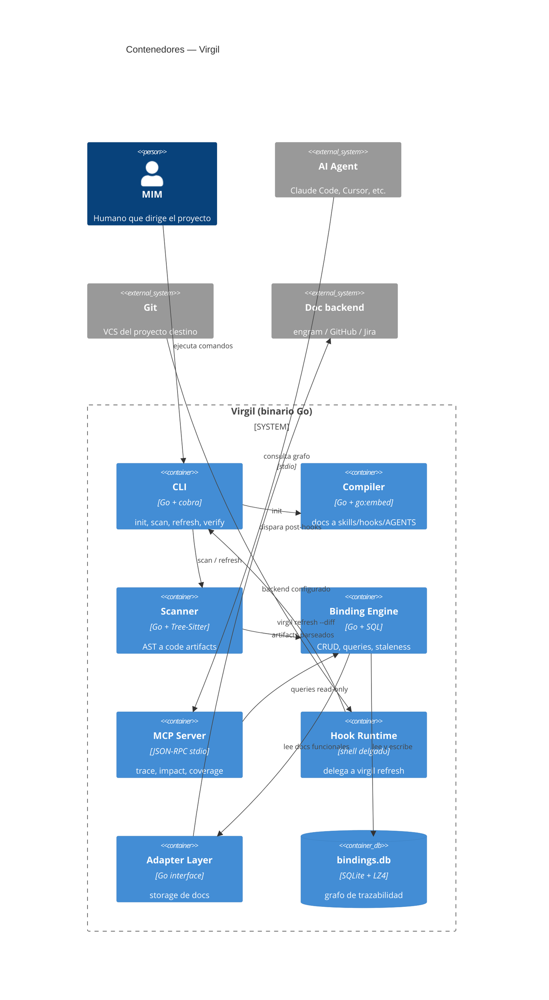
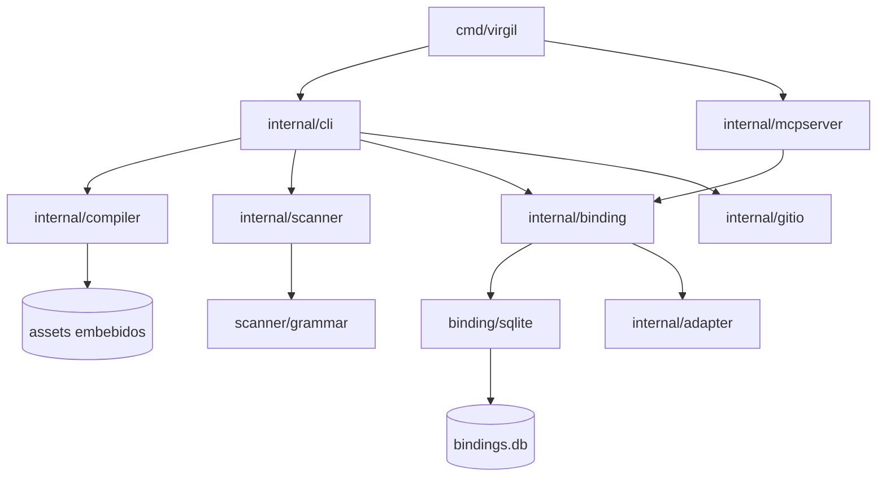
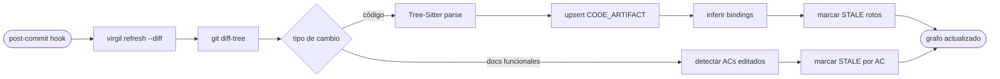
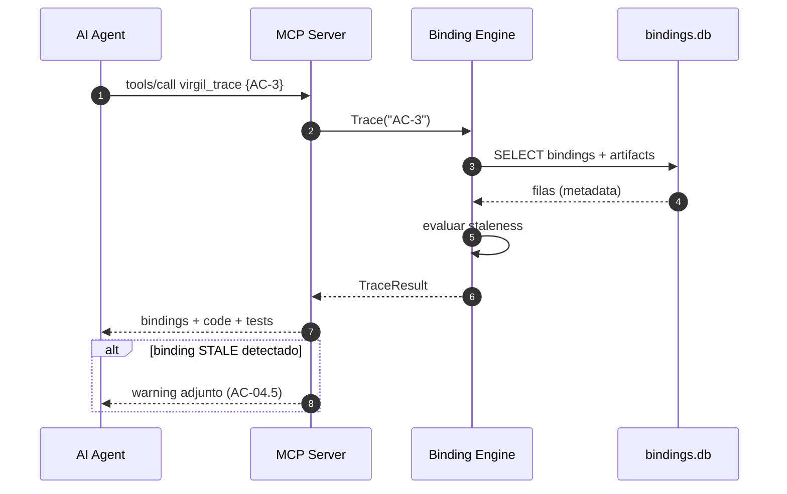
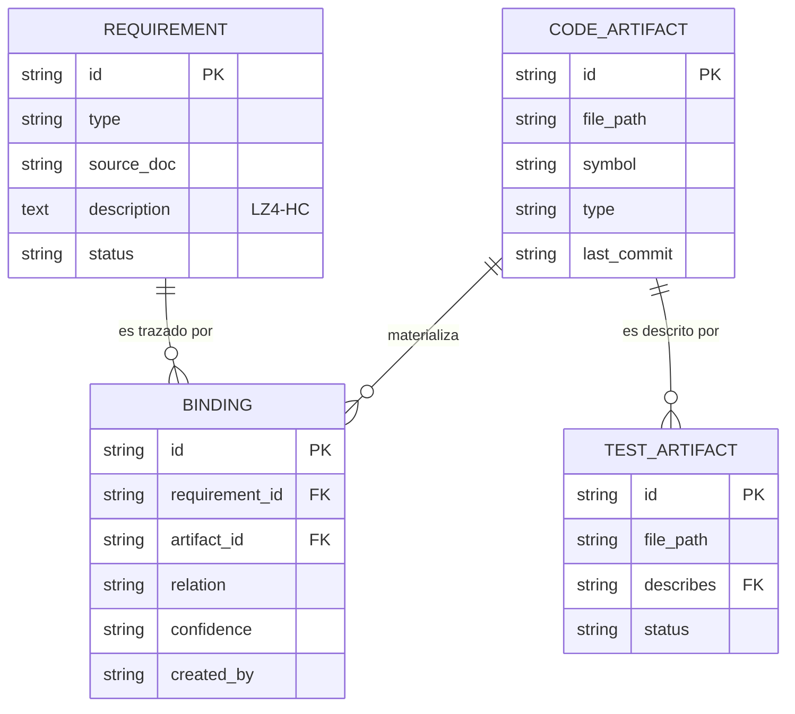

# Design: Virgil

Descripción de arquitectura conforme a ISO/IEC/IEEE 42010 + IEEE 1016 para Virgil:
herramienta de metodología + ownership para proyectos asistidos por IA. Este documento
deriva de `spec-virgil.md` y cada decisión traza a un requisito (RF-XX / RNF-XX).

Alcance: CLI en Go distribuido como binario estático que provee bootstrap de proyectos
(`virgil init`), flujo greenfield (`/virgil-idea`), flujo brownfield (`/virgil-takeover`),
binding layer (grafo SQLite requisito ↔ código ↔ test), MCP server para agentes y hooks
de git para refresh incremental.

Fuera de alcance (Won't Have de la spec): UI web, generación de código desde specs,
ejecución de tests y gestión de branches/PRs.

## Stack tecnológico

| Componente | Elección | Justificación | Traza |
|------------|----------|---------------|-------|
| Lenguaje | Go 1.23+ | Binario estático sin runtime, cross-compile trivial, `go:embed` para los 31 docs de metodología. Restricción explícita: no Python | RNF-02, Restricción 1 |
| CLI framework | `spf13/cobra` | Estándar de facto en Go (kubectl, gh, hugo). Subcomandos, flags tipados, autocompletado shell, help generado | RF-01, RNF-04 |
| Parsing de código | GoTreeSitter (`odvcencio/gotreesitter`) v0.49+ | Reimplementación pure Go de Tree-Sitter. 205 grammars embebidas, sin CGo. Incremental edits 90x más rápido que CGo bindings. Full parse ~5x más lento que C nativo pero dentro del target RNF-01. Ver ADR-002 | RF-03, AC-04.6 |
| Storage de bindings | SQLite via `modernc.org/sqlite` v1.56+ | Transpilación pure Go del amalgamation de SQLite. Sin CGo, sin driver C. Soporta WAL, FTS5, user_version. ~75% velocidad de mattn/go-sqlite3, suficiente para workload read-heavy post-población. Ver ADR-001 | RF-04, RNF-02 |
| Compresión | `pierrec/lz4/v4` (modo HC) | Compresión de columnas de metadata voluminosa (descripciones, firmas). Pure Go, sin dependencia externa | RF-04, RNF-01 |
| MCP | `modelcontextprotocol/go-sdk` | SDK oficial del protocolo. JSON-RPC 2.0 sobre stdio, sin red. Ver ADR-004 | AC-04.7, RF-06 |
| Embedding de assets | `go:embed` | Los 31 docs, templates de skills, hooks y schema SQL viajan dentro del binario. Ver ADR-003 | RF-09, RNF-02 |
| Interacción con git | `os/exec` sobre git plumbing (`diff-tree`, `rev-parse`, `status`) | Los hooks ya corren en contexto git; el porcelain/plumbing de git es más estable y rápido que reimplementar con go-git. Asunción 1 de la spec: git presente | RF-05 |
| Distribución | GoReleaser → Homebrew tap (primario), `go install` (secundario) | Builds reproducibles multi-plataforma con `CGO_ENABLED=0`. Cross-compile trivial: `GOOS/GOARCH` estándar, sin zig, sin musl, sin toolchain C | RNF-02 |

Nota de toolchain:

- **100% pure Go** (`CGO_ENABLED=0`). Sin CGo, sin dependencias C, sin zig para cross-compile.
  GoTreeSitter es una reimplementación Go (no wrapper CGo). modernc.org/sqlite es una
  transpilación Go del amalgamation C. `go install github.com/.../virgil@latest` funciona
  en cualquier máquina con Go instalado, sin toolchain C.

## Arquitectura del sistema

### Vista de contenedores



### Estructura interna de módulos

Layout de paquetes Go (screaming architecture: el dominio nombra los paquetes, no la técnica):

```text
virgil/
├── cmd/virgil/            # main.go — wiring de cobra
├── internal/
│   ├── cli/               # definición de comandos (init, scan, refresh, verify, health, ...)
│   ├── compiler/          # metodología embebida → AGENTS.md + skills + hooks + mcp.json
│   ├── scanner/           # Tree-Sitter: archivos → CodeArtifact / TestArtifact
│   │   └── grammar/       # registro de grammars por lenguaje (Strategy)
│   ├── binding/           # dominio: entidades, repositorios, staleness, inferencia
│   │   └── sqlite/        # implementación Repository sobre SQLite
│   ├── metrics/           # orquestación de herramientas externas (mutation, CRAP, complexity)
│   ├── handoff/           # linter del contrato + execution state + claiming
│   ├── mcpserver/         # tools MCP → queries del binding engine
│   ├── adapter/           # DocAdapter interface + local / engram / github / jira
│   └── gitio/             # wrapper de git plumbing (diff, HEAD, hooks path)
└── assets/                # go:embed — 31 docs, templates, schema.sql, hook scripts
```

Regla de dependencias: `cli` y `mcpserver` dependen de `binding`, `scanner`, `compiler`,
`metrics`, `handoff` y `adapter`; nadie depende de `cli`. El paquete `binding` no importa
Tree-Sitter ni SQLite directamente — recibe artifacts del scanner y persiste a través de
la interfaz Repository. `metrics` depende de `binding` (para persistir resultados) y de
`os/exec` (para invocar herramientas externas). `handoff` depende de `binding` (para
execution state) pero no de `scanner` ni `compiler`.



### Flujo: refresh incremental (hooks → binding engine)

El costo es proporcional al diff, no al codebase (AC-05.5): el hook entrega el rango de
commits, `gitio` resuelve la lista de archivos cambiados, y solo esos archivos pasan por
Tree-Sitter.



Mapeo hook → operación (RF-05):

| Hook | Operación del engine |
|------|---------------------|
| `post-commit` | Inferir bindings del diff (confidence `inferred`), staleness por AC editado (AC-04.3, AC-04.5) |
| `post-merge` | Refresh de archivos cambiados por el merge, STALE los rotos (AC-05.1) |
| `post-rewrite` | Re-verificar bindings de commits reescritos, actualizar `last_commit` (AC-05.3) |
| `post-checkout` | Marcar `potentially_stale` si la branch difiere de la baseline (AC-05.4) |

Todos los hooks son no bloqueantes (post-*) y terminan en < 2 s para diffs de ~100 líneas
(RNF-01). Si `virgil` no está en PATH, el hook sale con código 0 y un warning — nunca
rompe el flujo de git.

### Flujo: consulta MCP desde el agente



El MCP server corre como proceso hijo del agente (stdio), abre la DB en modo read-only y
responde en < 500 ms (RNF-01) porque toda query es un lookup indexado, nunca un scan.

### Modelo de datos del binding layer

Implementa AC-04.1. Solo metadata: paths, símbolos, relaciones — nunca código fuente
(RNF-03).



Semántica de columnas clave:

- `BINDING.confidence`: `declared` (agente via `virgil_declare`), `inferred` (hook),
  `verified` (tras `virgil verify`). Transiciones: `inferred → verified`,
  `declared → verified`, cualquiera `→ stale` cuando el código o el AC cambian.
- `BINDING.created_by`: `agent` | `hook` | `mim` — auditoría de origen (AC-04.2, AC-04.3).
- `CODE_ARTIFACT.symbol`: granularidad a nivel símbolo — `PdfService.generate()`,
  no solo el archivo (AC-04.6).
- Índices: `binding(requirement_id)`, `binding(artifact_id)`,
  `code_artifact(file_path)` — soportan `trace`, `impact` y refresh por diff sin scans.

### Flujo: virgil init (Compiler)

`virgil init` es el único punto donde el Compiler escribe en el proyecto destino (RF-01,
RF-09). Entradas: los 31 docs embebidos + detección del proyecto (lenguajes presentes,
runner de tests). Salidas:

1. `AGENTS.md` mínimo (40-80 líneas): axiomas, build/test commands, bootstrap SM,
   índice de skills (AC-06.1).
2. `.virgil/skills/*.md`: un skill por fase/concepto, progressive disclosure (AC-06.2).
3. `.git/hooks/post-{commit,merge,rewrite,checkout}`: shells delgados (ver ADR-006).
4. `.virgil/bindings.db` vacía con schema aplicado + entrada en `.gitignore`.
5. `mcp.json` (o equivalente del agente detectado) registrando `virgil mcp-serve`.

Si ya existe un `AGENTS.md`, el Compiler no lo sobreescribe: emite un diff propuesto y
requiere aprobación del MIM (RNF-04, mensajes accionables).

## Decisiones de diseño (ADR)

### ADR-001 — SQLite sobre graph DB embebida

**Status:** Accepted

**Context:** El binding layer es un grafo (requisitos ↔ código ↔ tests) que necesita
persistencia local, queries de trazado e impacto en < 500 ms, y cero dependencias de
runtime (RNF-01, RNF-02, Restricción 2).

**Alternatives:**

- BadgerDB / BoltDB: KV stores puros. El modelo de grafo habría que codificarlo a mano
  (serialización de adyacencias, índices secundarios manuales). Sin lenguaje de query:
  `impact` y `coverage` serían código Go ad hoc difícil de evolucionar.
- Graph DB embebida (cayley, dgraph embebido): API de grafo nativa, pero dependencias
  pesadas, menor madurez, y el grafo de Virgil es trivialmente relacional (3 entidades,
  1 tabla de aristas) — no hay traversals profundos que justifiquen un motor de grafos.
- SQLite: relacional, un archivo, transacciones ACID, índices declarativos, tooling
  universal (`sqlite3` CLI para debugging), estabilidad de décadas.

**Decision:** SQLite. El grafo se modela como tabla de aristas (`BINDING`) con índices por
ambos extremos. Las cinco queries del contrato (trace, impact, coverage, stale, declare)
son SQL de 1-2 joins, todas indexadas. Columnas de texto voluminoso comprimidas con LZ4-HC.

**Decision:** SQLite via `modernc.org/sqlite` (v1.56+) — transpilación pure Go del
amalgamation de SQLite. El grafo se modela como tabla de aristas (`BINDING`) con índices
por ambos extremos. Las queries del contrato (trace, impact, coverage, stale, declare,
health) son SQL de 1-2 joins, todas indexadas. Columnas de texto voluminoso comprimidas
con LZ4-HC.

**Consequences:** Queries expresables y auditables en SQL; migraciones de schema con
`user_version`; el MIM puede inspeccionar la DB con cualquier cliente SQLite. 100% pure Go
(`CGO_ENABLED=0`), cross-compile trivial. ~75% velocidad de mattn/go-sqlite3 — suficiente
para workload read-heavy. Soporta WAL, FTS5, virtual tables. Costo: los traversals
multi-salto (si aparecieran en v3) requerirían CTEs recursivas — aceptable para la
profundidad actual (2 saltos máximo).

### ADR-002 — Tree-Sitter sobre LSP para parsing de código

**Status:** Accepted

**Context:** El Scanner necesita extraer símbolos (funciones, clases, métodos) de
codebases en lenguajes arbitrarios, con performance de < 30 s para 50K LOC y < 512 MB de
memoria (RNF-01), sin depender de toolchains instalados en la máquina destino.

**Alternatives:**

- LSP: precisión semántica superior (resolución de tipos, referencias). Pero requiere un
  language server por lenguaje instalado y corriendo (viola Restricción 2), arranque lento
  (indexación completa), protocolo orientado a editores, y memoria proporcional al
  proyecto — incompatible con hooks de < 2 s.
- Regex / heurísticas: rápidas pero frágiles; imposible garantizar granularidad a nivel
  símbolo (AC-04.6) en 158 lenguajes.
- Tree-Sitter (CGo, `tree-sitter/go-tree-sitter`): parsing incremental nativo, pero
  requiere CGo — complica cross-compile (zig/musl), rompe `go install`, viola la
  restricción de portabilidad sin fricción.
- GoTreeSitter (`odvcencio/gotreesitter`): reimplementación pure Go de Tree-Sitter.
  205 grammars embebidas. Incremental edits 90x más rápido que CGo bindings. Full parse
  ~5x más lento que C nativo pero dentro del target RNF-01.

**Decision:** GoTreeSitter (v0.49+) con grammars embebidas para los lenguajes tier-1
(Go, TypeScript/JavaScript, Python, Rust, Java, C#; extensible). Queries de extracción
de símbolos por lenguaje.

**Consequences:** 100% pure Go, cross-compile trivial, `go install` funciona sin
toolchain C. Performance de full parse ~5x más lenta que C nativo pero: (a) dentro del
target de 30s para 50K LOC, (b) incremental edits (refresh) son 90x más rápidos que CGo.
Memoria acotada (archivo por archivo). Costo: sin análisis semántico — la inferencia de
bindings se apoya en convenciones (naming, paths, comentarios `@binding`) y en la
declaración explícita del agente.

### ADR-003 — Binario único con go:embed sobre assets separados

**Status:** Accepted

**Context:** Virgil transporta 31 docs de metodología, templates de skills, scripts de
hooks y el schema SQL. Deben llegar íntegros y versionados a cada proyecto destino
(RF-09, RNF-02).

**Alternatives:**

- Assets en directorio de instalación (`/usr/share/virgil/...`): rompe `go install`,
  complica Homebrew, introduce drift entre binario y assets tras upgrades parciales.
- Descarga en primer uso: exige red (viola el diseño offline), agrega latencia a `init`
  y un punto de fallo.
- `go:embed`: los assets se compilan dentro del binario; una versión del binario implica
  exactamente una versión de la metodología.

**Decision:** `go:embed` para todo asset. El Compiler lee del FS embebido y materializa
en el proyecto destino solo lo que corresponde (skills, hooks, AGENTS.md).

**Consequences:** Atomicidad de versión (binario = metodología), `virgil init` funciona
offline en < 5 s, distribución de un solo artefacto. Costo: binario más grande (~10-20 MB
adicionales entre docs y grammars) — irrelevante para una herramienta de desarrollo;
actualizar un doc requiere release del binario, lo cual es deseable: la metodología
está versionada con la herramienta.

### ADR-004 — MCP sobre protocolo custom para comunicación con agentes

**Status:** Accepted

**Context:** El agente necesita consultar el binding layer en tiempo real sin cargar el
grafo completo a su contexto (AC-04.7, AC-06.4). Se requiere un canal estándar que
funcione con Claude Code, Cursor y cualquier agente futuro (Asunción 2).

**Alternatives:**

- Protocolo custom (HTTP local, socket propio): requeriría un cliente por agente,
  mantenimiento propio del contrato y abre superficie de red local.
- Archivos intermedios (el agente lee dumps JSON): sin frescura garantizada, carga
  contexto innecesario — exactamente el problema que el binding layer resuelve.
- MCP: estándar emergente adoptado por los agentes objetivo, JSON-RPC 2.0 sobre stdio
  (sin red), descubrimiento de tools nativo, tipado de inputs/outputs.

**Decision:** MCP con transporte stdio. El binario expone `virgil mcp-serve`; `virgil
init` registra el server en la configuración del agente detectado. Tools:
`virgil_trace`, `virgil_impact`, `virgil_coverage`, `virgil_stale`, `virgil_declare`.

**Consequences:** Interoperabilidad inmediata con todo agente MCP-compatible, cero
superficie de red (stdio puro), el contrato de tools vive en el SDK oficial. Costo:
dependencia de la evolución del protocolo MCP; mitigado porque `mcpserver` es una capa
delgada sobre el Binding Engine — un transporte alternativo sería otro adaptador.

### ADR-005 — Skills como archivos de texto plano sobre plugins compilados

**Status:** Accepted

**Context:** La metodología llega al agente como skills por fase (AC-06.2). Restricción 5
de la spec: skills como archivos de texto, editables.

**Alternatives:**

- Plugins compilados (Go plugins, WASM): versionables y firmables, pero opacos para el
  MIM, no editables sin toolchain, y los mecanismos de skills de los agentes actuales
  consumen Markdown, no binarios.
- Un único AGENTS.md monolítico (statu quo v1, 1.061 líneas): carga todo el contexto
  siempre — exactamente lo que RF-06 elimina.
- Markdown plano por skill (~50-150 líneas cada uno): progressive disclosure nativa,
  diffable en git, editable por el MIM, compatible con el mecanismo de skills de los
  agentes.

**Decision:** Skills como archivos Markdown en `.virgil/skills/`, uno por fase/concepto,
generados por el Compiler desde los docs embebidos. `AGENTS.md` queda en 40-80 líneas con
el índice de skills (AC-06.1).

**Consequences:** El agente carga solo la fase activa; el MIM puede leer y ajustar
cualquier skill; los cambios son visibles en code review. Costo: sin integridad
garantizada — un skill editado a mano puede divergir de la metodología; se mitiga con
`virgil status`, que compara el hash de cada skill contra la versión embebida y reporta
drift (advisory, nunca bloqueante: el override local del MIM es legítimo).

### ADR-006 — Delegación de hooks (shell delgado → CLI) sobre hooks in-process

**Status:** Accepted

**Context:** Cuatro hooks de git mantienen el grafo fresco (RF-05). RNF-03 exige que los
hooks no ejecuten código arbitrario.

**Alternatives:**

- Lógica en los scripts de hook (bash con parsing de diff): duplicaría lógica fuera del
  binario, imposible de testear con el toolchain de Go, frágil entre shells/OS, y
  actualizar la lógica exigiría regenerar hooks en cada proyecto.
- Daemon residente que observa el filesystem: evita el costo de arranque por hook, pero
  agrega gestión de proceso, consumo permanente y un modo de fallo nuevo (daemon caído =
  grafo desactualizado en silencio).
- Shell delgado que delega: cada hook es ~5 líneas — verifica que `virgil` exista en
  PATH e invoca `virgil refresh --diff --hook=<nombre>`; toda la lógica vive en el binario.

**Decision:** Patrón de delegación. Los scripts embebidos son idénticos salvo el nombre
del hook que pasan como flag; el binario decide la operación (inferencia, staleness,
re-verificación) según el hook origen.

**Consequences:** Lógica testeable en Go, upgrade del binario actualiza el comportamiento
de todos los hooks sin regenerarlos, superficie auditable (el MIM lee 5 líneas de shell).
Los hooks fallan en modo abierto: sin `virgil` en PATH emiten warning y salen 0 — git
nunca se bloquea. Costo: arranque de proceso por hook (~10-30 ms de un binario Go) —
despreciable frente al presupuesto de 2 s.

### ADR-007 — Orquestación de métricas externas sobre motor propio

**Status:** Accepted

**Context:** El dogma declara que Virgil verifica fuerza de tests (mutation score, CRAP,
complejidad) además de trazabilidad. Construir motores propios de mutación por lenguaje
sería un proyecto independiente. Las herramientas ya existen: mutate4go, Stryker, pitest,
mutmut, gocyclo, etc.

**Alternatives:**

- Motor propio: control total, pero alcance de proyecto independiente por cada lenguaje.
  Virgil es metodología + trazabilidad, no un suite de análisis estático.
- Delegación pura (solo reporta): Virgil no ejecuta nada, el CI pipeline corre las
  herramientas y Virgil importa resultados. Menor coupling pero el MIM pierde el dashboard
  unificado de `virgil health`.
- Orquestación: Virgil detecta herramientas disponibles por lenguaje, las ejecuta via
  `os/exec`, parsea sus resultados estructurados, y los persiste junto al binding layer.

**Decision:** Orquestación. `internal/metrics` define un contrato por categoría de métrica
(mutation, complexity, duplication) con un registry de herramientas por lenguaje. Cada
herramienta es un adapter que sabe cómo invocar el CLI y parsear su output. Thresholds
configurables por tier (strict | standard | relaxed | custom) en `.virgil/config.yaml`.

**Consequences:** Dashboard unificado via `virgil health`, degradación elegante cuando
las herramientas no están instaladas (reporta "no disponible", sugiere instalación),
extensible por lenguaje sin cambiar el core. Costo: dependencia en el output format de
herramientas externas — se mitiga parseando formatos estándar (JSON, TAP) y versionando
los adapters.

### ADR-008 — Handoff como contrato validable con execution state

**Status:** Accepted

**Context:** El handoff es el gate entre planificación y ejecución. La validación de su
completitud era advisory (aprobación humana). La coordinación entre lanes paralelos no
tenía semántica operativa. La reanudación tras crash no era determinística (RF-12, RF-13).

**Alternatives:**

- Handoff como documento pasivo: el MIM valida manualmente. Funciona para equipos
  pequeños pero no escala a ejecución multi-lane ni sobrevive a compaction del agente.
- Schema formal (JSON Schema, Protobuf): validación estricta pero rompe la ergonomía
  Markdown del pipeline de docs funcionales.
- Linter + execution state: valida el Markdown contra reglas semánticas (ACs con ID,
  DAG sin ciclos, refs válidas) y agrega estado de ejecución persistente para claiming
  y reanudación.

**Decision:** Linter + execution state. `internal/handoff` implementa:

1. `virgil handoff lint`: valida completitud del contrato contra reglas configurables,
   emite errores con guía de reparación.
2. Execution state: tabla `execution_state` en `bindings.db` con campos `task_id`,
   `status` (pending|claimed|done), `lane`, `claimed_at`, `completed_at`, `commit_sha`.
3. Claiming: `virgil claim T-XXX` marca una task como claimed, verifica precondiciones
   (deps en done), rechaza si ya está claimed por otro lane.

**Consequences:** Gate determinístico para el principio "ZERO código sin handoff aprobado",
reanudación determinística post-crash, audit trail de ejecución. Concurrencia del store
resuelta por WAL mode de SQLite + serialización de escrituras del binding engine (misma
política que los hooks). Costo: overhead de claiming para proyectos single-lane —
se mitiga con auto-claim cuando solo hay un lane activo.

## Patrones aplicados

| Patrón | Dónde | Por qué |
|--------|-------|---------|
| Adapter | `internal/adapter` — `DocAdapter` con implementaciones `local` (default), `engram`, `github`, `jira` | RF-08: el storage de docs funcionales es intercambiable por configuración sin tocar el dominio. Interfaz exacta del contrato de la spec (`Read`, `Write`, `List`, `Exists`) |
| Strategy | `internal/scanner/grammar` — registro `map[lang]Grammar` con la grammar Tree-Sitter y las queries `.scm` por lenguaje | Cada lenguaje define su estrategia de extracción de símbolos; agregar un lenguaje es registrar una estrategia, sin tocar el Scanner |
| Observer / Event | Hooks de git como eventos externos → `virgil refresh` como handler; internamente el refresh emite eventos (`ArtifactChanged`, `RequirementEdited`) que el motor de staleness consume | Desacopla la detección de cambios (gitio) de las reacciones (inferencia, staleness); AC-04.3 y AC-04.5 son dos observers del mismo evento de diff |
| Repository | `internal/binding` define `BindingRepository`, `ArtifactRepository`; `binding/sqlite` los implementa | El dominio (staleness, transiciones de confidence) se testea con repositorios in-memory; SQLite es un detalle de persistencia sustituible |
| Facade | `internal/cli` y `internal/mcpserver` como fachadas delgadas sobre los mismos casos de uso del dominio | `virgil trace AC-3` (CLI) y `virgil_trace` (MCP) ejecutan idéntico código — una sola fuente de verdad para cada query |

## Superficie de seguridad

Modelo de amenaza acotado: Virgil corre local, sin red. Los vectores relevantes son
exfiltración de código vía la DB, escritura no autorizada al grafo y ejecución arbitraria
vía hooks.

- **`bindings.db` solo contiene metadata** (RNF-03): paths, nombres de símbolos,
  relaciones y descripciones de requisitos. Nunca cuerpos de funciones ni contenido de
  archivos. El Scanner descarta el AST tras extraer declaraciones; el schema no tiene
  columna donde quepa código fuente.
- **MCP server read-only por default** (RNF-03): abre SQLite con
  `mode=ro`. La única tool mutante, `virgil_declare`, corre sobre una conexión separada
  de escritura y exige contexto de autoría: registra `created_by: agent` y el timestamp,
  y solo puede crear bindings con `confidence: declared` — jamás `verified`. Elevar a
  `verified` requiere `virgil verify`, ejecutado por el MIM o el agente via CLI con scan
  real (AC-04.4).
- **Hooks sin código arbitrario** (RNF-03): los scripts generados solo invocan el binario
  `virgil` con flags fijos. `virgil init` los escribe con contenido determinístico
  embebido; `virgil status` detecta hooks modificados por hash y lo reporta.
- **Sin llamadas de red**: el binario no abre sockets. El único canal externo es stdio
  del MCP server. Los adapters remotos (`github`, `jira`, `engram`) son la excepción
  explícita y solo se activan por configuración del MIM — el default `local` es
  100 % filesystem.
- **Aislamiento del proyecto destino**: todo estado vive bajo `.virgil/` (gitignoreado) y
  los hooks estándar de git. Desinstalar es borrar `.virgil/` y los 4 hooks.

## Restricciones de infraestructura

### Integración con el pipeline Echo

Echo (5 pasos: Setup, Build, Static Test, Dynamic Test, E2E) usa hooks **pre-\***
(bloqueantes, enforcement) tanto en dev como en CI. Virgil usa exclusivamente hooks
**post-\*** (no bloqueantes, refresh del grafo). No hay colisión: ambos conjuntos
coexisten en `.git/hooks/` y `virgil init` nunca toca un hook `pre-*` existente
(AC-06.3: los guardrails de echo permanecen determinísticos).

Puntos de integración:

- **Dev**: `pre-commit`/`pre-push` de echo corren primero (pueden abortar el commit);
  si el commit sucede, `post-commit` de Virgil refresca el grafo. Presupuesto combinado
  respetado: el refresh corre después de que git ya aceptó el commit.
- **CI (recomendado)**: agregar un paso `virgil coverage --min <pct>` tras Dynamic Test.
  Como `bindings.db` está gitignoreada, CI la reconstruye con `virgil scan --full`
  (< 30 s para 50K LOC, RNF-01) o la restaura de cache keyed por commit SHA para
  mantener el job barato.
- **CD**: `virgil status` como gate informativo (no bloqueante en v2.0; bloqueante es
  Could Have v2.2+ según la spec).

### Recomendaciones de CI/CD del propio Virgil

- GoReleaser en tag push: matrices macOS (arm64, amd64), Linux (amd64, arm64), Windows
  (amd64); CGo cross-compile con zig; artefactos firmados y checksums.
- Homebrew tap actualizado por GoReleaser (canal primario); `go install` funciona porque
  los assets van embebidos (ADR-003).
- Suite de performance en CI con un corpus fijo de 50K LOC que valida los targets de
  RNF-01 en cada release (scan < 30 s, refresh < 2 s, memoria < 512 MB via
  `GOMEMLIMIT` + medición).

## Trazabilidad

| Elemento de diseño | Requisito(s) de `spec-virgil.md` |
|--------------------|-------------------------------------|
| Stack Go + go:embed + GoReleaser | RNF-02, Restricciones 1-2, RF-09 |
| Contenedor CLI (cobra) | RF-01, Contrato CLI Commands, RNF-04 |
| Contenedor Compiler + flujo `virgil init` | RF-01, RF-06 (AC-06.1, AC-06.2), RF-09 |
| Contenedor Scanner (Tree-Sitter, Strategy) | RF-03, AC-04.6, RNF-01 |
| Contenedor Binding Engine + modelo ER | RF-04 (AC-04.1 a AC-04.6), Contrato Adapter |
| Contenedor MCP Server + secuencia de consulta | AC-04.7, AC-06.4, Contrato MCP Server Tools, RNF-01 |
| Contenedor Hook Runtime + pipeline de refresh | RF-05 (AC-05.1 a AC-05.5), RNF-03 |
| Adapter Layer | RF-08, Contrato Adapter Interface |
| ADR-001 (SQLite) | RF-04, RNF-01, RNF-02 |
| ADR-002 (Tree-Sitter) | RF-03, AC-04.6, RNF-01, Restricción 2 |
| ADR-003 (go:embed) | RF-09, RNF-02, Restricción 2 |
| ADR-004 (MCP) | AC-04.7, AC-06.4, Asunción 2 |
| ADR-005 (skills texto plano) | RF-06, Restricción 5 |
| ADR-006 (delegación de hooks) | RF-05, RNF-03 |
| Superficie de seguridad | RNF-03, Restricción 4 |
| Integración Echo + CI/CD | AC-06.3, RNF-01, Could Have v2+ |
| SM mental model (bootstrap en AGENTS.md) | RF-07 |
| Flujos `/virgil-idea` y `/virgil-takeover` (skills generados por Compiler + Scanner) | RF-02, RF-03 |
| ADR-007 (métricas externas) | RF-10 (AC-10.3, AC-10.5, AC-10.6), Dogma principio 2-3 |
| ADR-008 (handoff lint + execution state) | RF-12, RF-13 |
| Módulo `metrics/` | RF-10, Dogma principio 2 |
| Módulo `handoff/` | RF-12, RF-13, Dogma principios 5-6 |

## Metadata

| Campo | Valor |
|-------|-------|
| Documento | `design-virgil.md` |
| Estándares | ISO/IEC/IEEE 42010, IEEE 1016 |
| Deriva de | `spec-virgil.md`, `idea-virgil.md` |
| Versión | 1.0.0 |
| Fecha | 2026-08-05 |
| Estado | Draft — pendiente de aprobación del MIM |
| Próximo artefacto | `tasks-virgil.md` (task breakdown) |
