# Modelo Universal de Artefactos

> El modelo de artefactos define QUÉ documentos produce un proyecto y qué
> contiene cada uno. Es **independiente de la metodología** (Scrum, Kanban,
> Shape Up, PI Planning, SAFe, etc.) y está respaldado por estándares
> internacionales ISO/IEC/IEEE.
>
> La metodología define CÓMO se organiza el trabajo (ceremonia, cadencia,
> roles). Los artefactos son los mismos sin importar la metodología elegida.

---

## Por Qué Estándares Internacionales

El modelo de artefactos NO es una invención del framework. Está alineado
con estándares ISO/IEC/IEEE porque:

1. **Portabilidad de adaptadores** — si los artefactos siguen un estándar,
   cualquier sistema que implemente ese estándar puede ser adaptador:
   archivos locales, Jira, Asana, Basecamp, MS Project, un DBMS, un RAG
   remoto, engram, Confluence, Linear, o cualquier herramienta futura.

2. **Interoperabilidad** — un `spec.md` que sigue ISO/IEC/IEEE 29148 es
   entendible por cualquier equipo, herramienta o proceso que conozca el
   estándar. No es un formato propietario.

3. **Completitud verificable** — los estándares definen qué secciones debe
   tener cada artefacto. Eso nos da un schema verificable mecánicamente
   (el TPM puede validar completitud contra el estándar).

4. **Independencia de la metodología** — los estándares describen
   *information items*, no ceremonias. Un `spec.md` es un `spec.md` sin
   importar si se produjo en un sprint planning o en un bet de Shape Up.

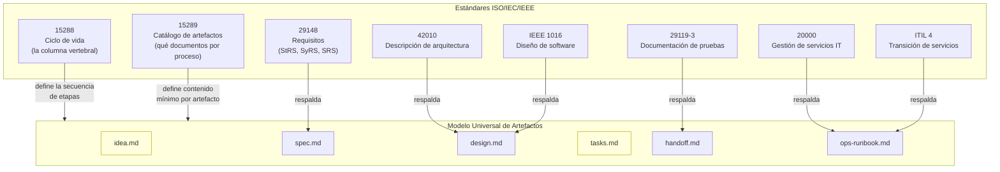

> Los artefactos en amarillo (`idea.md`, `tasks.md`) no tienen respaldo ISO
> — son territorio libre que el framework define. El resto tiene contenido
> mínimo respaldado por estándares internacionales.

---

## La Columna Vertebral: ISO/IEC/IEEE 15288

El estándar 15288 (System Life Cycle Processes) define las etapas del ciclo
de vida de un sistema. Es **agnóstico a la metodología** — no menciona
sprints, backlogs ni cadencias. Define procesos y sus outputs.

Nuestro modelo mapea directamente a sus procesos técnicos:

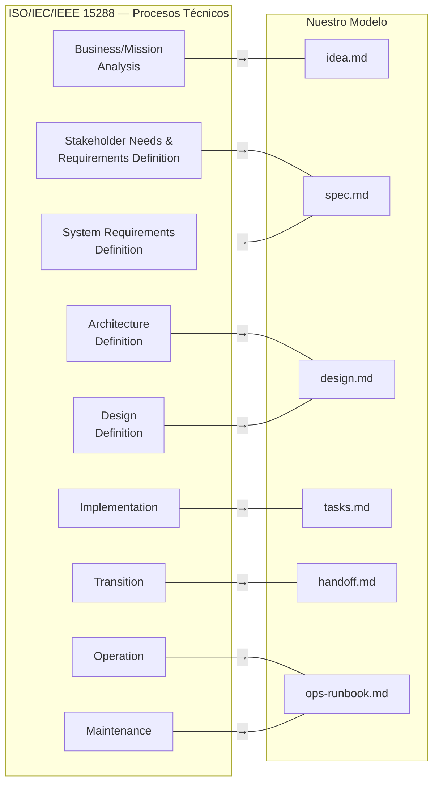

**Nota**: el estándar define más procesos (Integration, Verification,
Validation, Disposal). Esos se mapean a las etapas post-ejecución (Verify,
Accept, Retro) que se definen por separado.

---

## Los 6 Artefactos Universales

Cada artefacto tiene: propósito, respaldo de estándar, contenido mínimo,
quién lo produce, quién lo consume, y reglas de ownership.

### 1. `idea.md` — Análisis de Negocio/Misión

| Atributo | Valor |
|----------|-------|
| **Proceso 15288** | Business/Mission Analysis |
| **Respaldo ISO** | Sin estándar formal (territorio libre) |
| **Propósito** | Capturar el problema, el valor esperado, las restricciones conocidas, y las preguntas pendientes |
| **Owner** | SM (orquesta la captura) → PO (formula y estructura) |
| **Consumido por** | Fase de spec |

**Contenido mínimo**:

```
# Idea: {nombre del proyecto}

## Problema
Qué se necesita resolver y por qué.

## Valor esperado
Para quién y qué beneficio.

## Restricciones conocidas
Timebox, presupuesto, stack obligatorio, plataforma, etc.

## Decisiones tomadas
Roles activos para este proyecto, tier de activación, etc.

## Preguntas pendientes
Lo que falta resolver antes de especificar.

## Metadata
- Fecha de creación
- Fuente del input (idea vaga, challenge, ticket, spec parcial)
- Estado: borrador | completo
```

> **Por qué no tiene estándar**: ISO 15288 produce un "Business/Mission
> Analysis Report" para este proceso, pero su contenido asume un contexto
> organizacional complejo. Para un framework ágil de desarrollo asistido
> por IA, un formato más ligero es más práctico. El estándar valida la
> NECESIDAD del artefacto, no el formato exacto.

---

### 2. `spec.md` — Especificación de Requisitos

| Atributo | Valor |
|----------|-------|
| **Proceso 15288** | Stakeholder Needs & Requirements Definition + System Requirements Definition |
| **Respaldo ISO** | **ISO/IEC/IEEE 29148** (Requirements Engineering) |
| **Propósito** | Definir QUÉ se construye: acceptance criteria, contratos de API, constraints, límites de alcance |
| **Owner** | PO (define valor y prioridad) → QA (valida testeabilidad) |
| **Consumido por** | Fase de diseño, fase de verificación |

**Contenido mínimo** (alineado a 29148 — StRS/SRS simplificado):

```
# Spec: {nombre del proyecto}

## Requisitos funcionales
Listado con acceptance criteria (given/when/then).

## Requisitos no funcionales
Performance, seguridad, accesibilidad, compatibilidad.

## Contratos de interfaz
APIs, schemas, protocolos de comunicación.

## Restricciones y asunciones
Lo que se da por hecho, lo que NO se va a hacer.

## Priorización
MoSCoW o equivalente.

## Trazabilidad
Cada requisito traza a idea.md (qué problema resuelve).

## Metadata
- Fecha de creación
- Estado: borrador | revisado | aprobado
- Revisores: [roles que aprobaron]
```

> **29148 define 3 niveles**: StRS (stakeholder), SyRS (sistema), SRS
> (software). Para proyectos simples, los 3 se fusionan en un solo
> `spec.md`. Para proyectos complejos, se pueden separar. ISO 15289
> permite merge/split de documentos — el contenido es lo que importa.

---

### 3. `design.md` — Descripción de Arquitectura y Diseño

| Atributo | Valor |
|----------|-------|
| **Proceso 15288** | Architecture Definition + Design Definition |
| **Respaldo ISO** | **ISO/IEC/IEEE 42010** (Architecture Description) + **IEEE 1016** (Software Design) |
| **Propósito** | Definir CÓMO se construye: arquitectura, patrones, tradeoffs, decisiones técnicas |
| **Owner** | Dev Lead (arquitectura y patrones) → DevSecOps (seguridad e infra) |
| **Consumido por** | Fase de tareas, fase de ejecución |

**Contenido mínimo** (alineado a 42010 viewpoints + 1016 design entities):

```
# Design: {nombre del proyecto}

## Stack tecnológico
Lenguaje, framework, base de datos, servicios externos.
Justificación de cada elección.

## Arquitectura del sistema
Viewpoints (42010): lógico, de despliegue, de datos, de seguridad.
Diagramas Mermaid obligatorios.

## Decisiones de diseño (ADR)
Cada decisión con: contexto, alternativas evaluadas, decisión, consecuencias.

## Patrones aplicados
CQRS, Event Sourcing, Hexagonal, etc. Con justificación.

## Superficie de seguridad
Autenticación, autorización, secrets, OWASP top 10.

## Restricciones de infraestructura
Hosting, CI/CD, monitoreo, limits.

## Trazabilidad
Cada decisión traza a spec.md (qué requisito resuelve).

## Metadata
- Fecha de creación
- Estado: borrador | revisado | aprobado
- Revisores: [roles que aprobaron]
```

> **42010** define el concepto de *viewpoints* — perspectivas desde las
> cuales se describe la arquitectura (stakeholders, concerns, views). No
> impone un formato específico, solo exige que cada viewpoint tenga
> stakeholders identificados, concerns que aborda, y convenciones de
> modelado. Esto se alinea con nuestro concepto de "lentes" del scrum team.

---

### 4. `tasks.md` — Desglose de Tareas

| Atributo | Valor |
|----------|-------|
| **Proceso 15288** | Implementation (preparación) |
| **Respaldo ISO** | Sin estándar formal (artefacto nativo ágil) |
| **Propósito** | Desglosar el diseño en unidades de trabajo ejecutables, ordenadas por dependencias |
| **Owner** | Dev Lead (desglose técnico) → SM (secuencia y dependencias) |
| **Consumido por** | Fase de handoff, modo ejecución |

**Contenido mínimo**:

```
# Tasks: {nombre del proyecto}

## Tareas
Cada tarea con:
- ID único
- Título
- Descripción (qué hacer)
- Dependencias (IDs de tareas previas)
- Criterios de aceptación (given/when/then)
- Estimación de complejidad (S/M/L)
- Archivos afectados (si se conocen)

## Orden de ejecución
Grafo de dependencias resuelto.

## Metadata
- Fecha de creación
- Estado: borrador | revisado | aprobado
- Total de tareas, estimación agregada
```

> **Por qué no tiene estándar**: el concepto de "tarea" es nativo ágil.
> ISO 15288 cubre *Implementation* como proceso, pero no prescribe cómo
> desglosar el trabajo en unidades discretas — eso lo define la metodología.
> Sin embargo, el ARTEFACTO (la lista de tareas) es universal: existe en
> Scrum (backlog items), Kanban (cards), Shape Up (scopes), y PI Planning
> (features). Lo que cambia es cómo se agrupan y secuencian, no qué
> contienen.

---

### 5. `handoff.md` — Contrato de Transición

| Atributo | Valor |
|----------|-------|
| **Proceso 15288** | Transition |
| **Respaldo ISO** | **ISO/IEC/IEEE 15289** (transition information item) + **ISO/IEC/IEEE 29119-3** (test documentation) |
| **Propósito** | Contrato autocontenido entre planificación y ejecución. Quien lo lea puede actuar sin hacer preguntas. |
| **Owner** | TPM (compila bajo instrucción del SM) |
| **Consumido por** | Modo ejecución (orquestador + sub-agentes) |

**Contenido mínimo** (alineado a 15289 transition + 29119-3 test plan):

```
# Handoff: {nombre del proyecto}

## Resumen ejecutivo
Qué se construye y por qué, en 3-5 oraciones.

## Stack y arquitectura
Referencia a design.md, decisiones clave resumidas.

## Tareas a ejecutar
Referencia a tasks.md, orden de ejecución, dependencias.

## Estrategia de pruebas
Qué tipo de pruebas, cobertura esperada, herramientas.

## Criterios de aceptación globales
Qué debe ser verdad para que el proyecto se considere completo.

## Restricciones de ejecución
Convenciones del repo (AGENTS.md), reglas de commits, hooks.

## Contexto que NO se incluye
Qué se decidió NO hacer y por qué (para evitar scope creep).

## Metadata
- Fecha de generación
- Artefactos fuente: [idea.md, spec.md, design.md, tasks.md]
- Estado: generado | entregado | en ejecución | completado
```

> **El handoff es el CONTRATO entre modos**. Cuando el modo ejecución lo
> recibe, debe poder operar sin consultar otros artefactos de planificación
> excepto como referencia de detalle. La autocontención es la propiedad
> clave — validable mecánicamente por el TPM.

---

### 6. `ops-runbook.md` — Guía Operativa (Handoff a NOC/Ops)

| Atributo | Valor |
|----------|-------|
| **Proceso 15288** | Operation + Maintenance |
| **Respaldo ISO** | **ISO/IEC 20000-1/2** (IT Service Management) + **ITIL 4** (Service Transition) |
| **Propósito** | Todo lo que un equipo de operaciones necesita para mantener el sistema vivo sin recurrir a los desarrolladores |
| **Owner** | DevSecOps (infraestructura y monitoreo) → Dev Lead (troubleshooting técnico) |
| **Consumido por** | Equipo de operaciones, NOC, on-call |

**Contenido mínimo** (alineado a ITIL 4 Service Transition + Google SRE PRR):

```
# Ops Runbook: {nombre del proyecto}

## Descripción del servicio
Qué hace, quién lo usa, SLA esperado.

## Arquitectura de despliegue
Infraestructura, servicios, dependencias externas.
Diagrama de despliegue (Mermaid obligatorio).

## Monitoreo y alertas
Métricas clave, dashboards, umbrales de alerta.

## Procedimientos operativos
- Deploy / rollback
- Escalamiento horizontal/vertical
- Backup / restore
- Rotación de secrets

## Troubleshooting
Problemas conocidos y soluciones (known-error database).

## Contactos y escalación
Quién es responsable, cadena de escalación.

## Metadata
- Fecha de generación
- Versión del servicio
- Estado: borrador | validado | en producción
```

> **Este artefacto cierra el ciclo completo**: de la idea hasta la
> operación en producción. ISO 20000 define los requisitos formales del
> sistema de gestión de servicios. ITIL 4 provee el checklist práctico
> de transición. Google SRE Production Readiness Review es la
> implementación más concreta del gate "¿está listo para producción?".

---

## Cadena de Artefactos — Flujo Completo

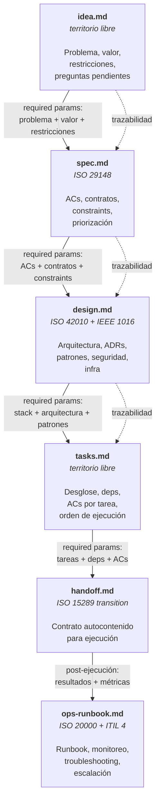

---

## Ownership — Quién Produce, Quién Consume, Quién Valida

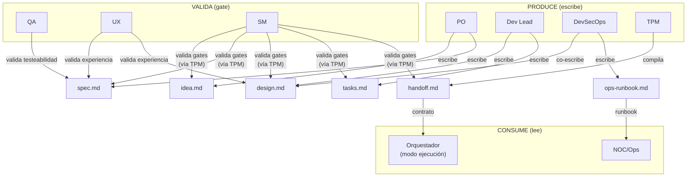

### Matriz de Ownership Detallada

| Artefacto | Produce | Co-produce | Valida (gate) | Consume |
|-----------|---------|------------|---------------|---------|
| `idea.md` | PO | SM (preguntas) | SM (completitud vía TPM) | Fase spec |
| `spec.md` | PO | — | QA (testeabilidad), UX (experiencia), SM (gate) | Fase design |
| `design.md` | Dev Lead | DevSecOps (seguridad, infra) | UX (experiencia), SM (gate) | Fase tasks |
| `tasks.md` | Dev Lead | SM (secuencia, deps) | SM (gate) | Fase handoff |
| `handoff.md` | TPM | — | SM (autocontención) | Modo ejecución |
| `ops-runbook.md` | DevSecOps | Dev Lead (troubleshooting) | SM (gate) | NOC/Ops |

### Reglas de Ownership

1. **Quien produce NUNCA valida su propio artefacto** — el PO escribe
   spec, QA valida. Dev Lead escribe design, UX valida. Separación de
   concerns entre producción y validación.

2. **El SM nunca produce contenido** — orquesta, valida gates (vía TPM),
   pero no escribe dentro de ningún artefacto. Regla cardinal sin
   excepciones.

3. **El TPM es el ÚNICO que toca el RAG** — todos los artefactos pasan
   por el TPM para persistencia. Los roles producen contenido; el TPM
   lo persiste con criterio editorial (formato, completitud, consistencia).

4. **El handoff lo compila el TPM, no un rol productivo** — es una
   síntesis de artefactos previos, no contenido nuevo. El TPM aplica
   su criterio editorial para compilar un documento autocontenido.

5. **ops-runbook es POST-ejecución** — se produce después de que el código
   existe, no durante la planificación. DevSecOps lo escribe porque tiene
   visibilidad de infraestructura, monitoreo y seguridad.

---

## El TPM como DBMS del Modelo de Artefactos

El TPM (Technical Program Manager) es al modelo de artefactos lo que un
DBMS es a los datos: no decide qué datos crear (eso lo hacen los roles),
pero sí decide CÓMO se almacenan, valida integridad, y sirve consultas.

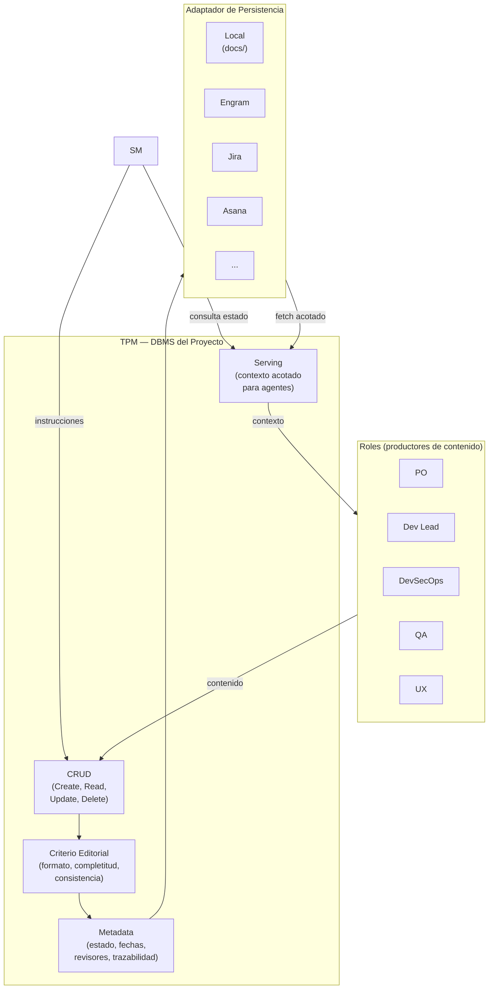

### Operaciones del TPM sobre el modelo

| Operación | Qué hace | Quién la invoca | Ejemplo |
|-----------|----------|-----------------|---------|
| **Create** | Crea un artefacto nuevo con metadata inicial | SM (instrucción) | "Crea idea.md para el proyecto X" |
| **Read** | Retorna un slice acotado del artefacto | SM, Roles | "Dame la sección de ACs de spec.md" |
| **Update** | Modifica contenido existente, mantiene trazabilidad | SM (instrucción) | "Actualiza el ADR #3 en design.md" |
| **Delete** | Elimina contenido obsoleto (raro, con justificación) | SM (instrucción) | "Elimina la tarea T-07, fue descartada" |
| **Mark complete** | Cambia el estado del artefacto a `completo` | SM (vía gate) | "spec.md pasó el gate, marcar completo" |
| **Verify consistency** | Verifica integridad referencial entre artefactos | SM (pre-gate) | "¿Todos los ACs de spec trazan a ideas?" |
| **Serve context** | Sirve el contexto ACOTADO que un agente necesita | SM (pre-delegación) | "Dame solo las tareas T-01..T-03 para el minion" |

---

## Adaptadores de Persistencia — La Interfaz Universal

Porque el modelo de artefactos sigue estándares internacionales, los
*information items* son portables. Cualquier sistema que pueda almacenar
y servir estos items puede ser un adaptador.

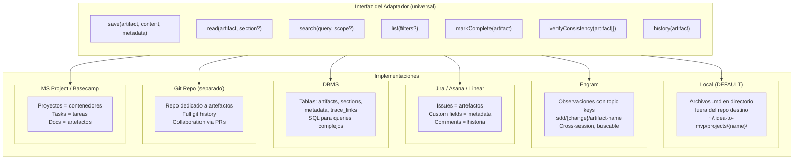

### Mapeo de artefactos por adaptador

| Artefacto | Local (default) | Engram | Jira | DBMS | Git Repo |
|-----------|----------------|--------|------|------|----------|
| `idea.md` | archivo .md | observation `sdd/{name}/idea` | Epic description | row en `artifacts` | `ideas/name.md` |
| `spec.md` | archivo .md | observation `sdd/{name}/spec` | Epic + child stories (ACs) | row + child rows | `specs/name.md` |
| `design.md` | archivo .md | observation `sdd/{name}/design` | Confluence page linked | row + JSON content | `designs/name.md` |
| `tasks.md` | archivo .md | observation `sdd/{name}/tasks` | Child issues del Epic | rows en `tasks` | `tasks/name.md` |
| `handoff.md` | archivo .md | observation `sdd/{name}/handoff` | Release ticket | row en `handoffs` | `handoffs/name.md` |
| `ops-runbook.md` | archivo .md | observation `sdd/{name}/ops` | Runbook page | row en `runbooks` | `runbooks/name.md` |

### Por qué los estándares habilitan los adaptadores

Sin el respaldo de estándares, cada adaptador tendría que inventar su
propia estructura. Con estándares:

1. **`spec.md` sigue 29148** → un adaptador de Jira sabe que "Requisitos
   funcionales" mapea a Stories con ACs, "No funcionales" a Labels, y
   "Trazabilidad" a Links entre issues.

2. **`design.md` sigue 42010** → un adaptador de Confluence sabe que
   cada *viewpoint* es una sección con diagrama, y cada ADR es una
   *decision page*.

3. **`handoff.md` sigue 15289 transition** → cualquier adaptador sabe
   que debe incluir: resumen, stack, tareas, estrategia de pruebas, y
   criterios de aceptación. Si falta uno, el artefacto está incompleto.

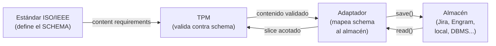

### Adaptador por defecto: `docs/` como RAG local

- **Path**: `~/.idea-to-mvp/projects/{nombre-proyecto}/`
- **Formato**: archivos markdown, uno por artefacto
- **Ventajas**: cero dependencias, legible por humanos, versionable con git
- **Desventaja**: sin acceso cross-machine, sin búsqueda semántica
- **Suficiente para**: proyectos individuales, challenges, MVPs

Los demás adaptadores son **TBD**. El modelo de artefactos los habilita
por diseño, pero la implementación es futura. El adaptador local es el
MVP de persistencia.

---

## Metodología como Capa Intercambiable

La metodología define CÓMO se organiza el trabajo. Los artefactos definen
QUÉ se produce. Son capas independientes.

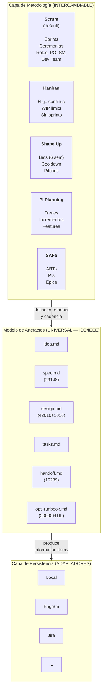

### Qué cambia con la metodología, qué NO cambia

| Aspecto | ¿Cambia con la metodología? | Ejemplo |
|---------|---------------------------|---------|
| **Qué artefactos se producen** | NO — siempre los mismos 6 | spec.md existe en Scrum, Kanban, y Shape Up |
| **Qué contiene cada artefacto** | NO — contenido definido por estándares ISO | Los ACs de spec.md son iguales sin importar si se definen en un sprint planning o en un pitch |
| **En qué orden se producen** | NO — la cadena idea→spec→design→tasks→handoff→ops es lógica, no metodológica | No puedes diseñar sin requisitos, sin importar la metodología |
| **Cómo se agrupa el trabajo** | SÍ | Scrum: sprints. Kanban: flujo. Shape Up: bets |
| **Qué ceremonia acompaña la producción** | SÍ | Scrum: sprint planning. Kanban: replenishment. Shape Up: betting table |
| **Qué roles participan y cómo** | SÍ (parcialmente) | Scrum: PO + SM + Dev Team. Kanban: sin roles fijos. Shape Up: shapers + builders |
| **Cadencia de revisión** | SÍ | Scrum: cada sprint. Kanban: continua. PI Planning: cada PI |
| **Cómo se gestionan las tareas** | SÍ | Scrum: sprint backlog. Kanban: board con WIP. Shape Up: hill chart |

### Mapeo rápido: mismos artefactos, diferente ceremonia

| Artefacto | En Scrum | En Kanban | En Shape Up | En PI Planning |
|-----------|----------|-----------|-------------|---------------|
| `idea.md` | Product Backlog Item refinado | Card en "Ideas" | Raw idea antes del pitch | Feature en el backlog |
| `spec.md` | Sprint Planning output (ACs) | Definition of Ready | Pitch document | PI Objectives |
| `design.md` | Spike / Architecture Decision | Diseño al momento del pull | Solution sketch | Enabler |
| `tasks.md` | Sprint Backlog | Cards en el board | Scopes en el hill chart | Stories en el PI |
| `handoff.md` | Sprint Review package | — (flujo continuo) | Hand-off post bet | System Demo package |
| `ops-runbook.md` | Post-release runbook | Post-release runbook | Post-release runbook | Post-PI runbook |

---

## Gobierno de Metodología — Lock, Cambio y Trazabilidad

### Principio: la metodología se LOCKEA por iteración

La metodología vigente **no se puede cambiar a medio ciclo**. Se lockea
al inicio de cada iteración y solo se puede cambiar cuando el ciclo
cierra. Esto previene:

- Compromisos rotos a mitad de sprint/bet/PI
- Métricas invalidadas (velocity, cycle time, throughput)
- Confusión sobre qué reglas aplican
- Artefactos en estados ambiguos

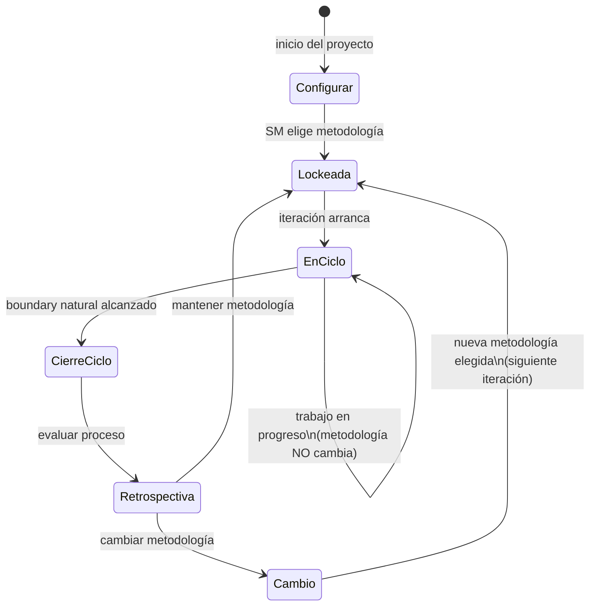

### Boundary natural por metodología

Cada metodología tiene su propio concepto de "ciclo cerrado". El SM
detecta el boundary y solo ahí habilita el cambio:

| Metodología | Boundary natural | Cuándo se puede cambiar | Duración típica |
|-------------|-----------------|------------------------|-----------------|
| **Scrum** | Fin del sprint (Sprint Review + Retro) | Antes del siguiente Sprint Planning | 1-4 semanas |
| **Kanban** | Replenishment meeting o WIP = 0 | En el siguiente replenishment | Continuo (boundary artificial) |
| **Shape Up** | Fin del bet cycle + cooldown | En la siguiente betting table | 6 + 2 semanas |
| **PI Planning** | Fin del Program Increment | En el siguiente PI Planning | 8-12 semanas |
| **SAFe** | Fin del PI (System Demo + I&A) | En el siguiente PI Planning | 8-12 semanas |

> **Caso especial — Kanban**: no tiene sprints, así que el boundary es
> más difuso. Opciones: (1) el SM declara un "review point" cada N días,
> (2) cuando el WIP llega a cero, (3) en el replenishment meeting
> periódico. Cualquiera es válido — lo que importa es que exista un
> boundary explícito.

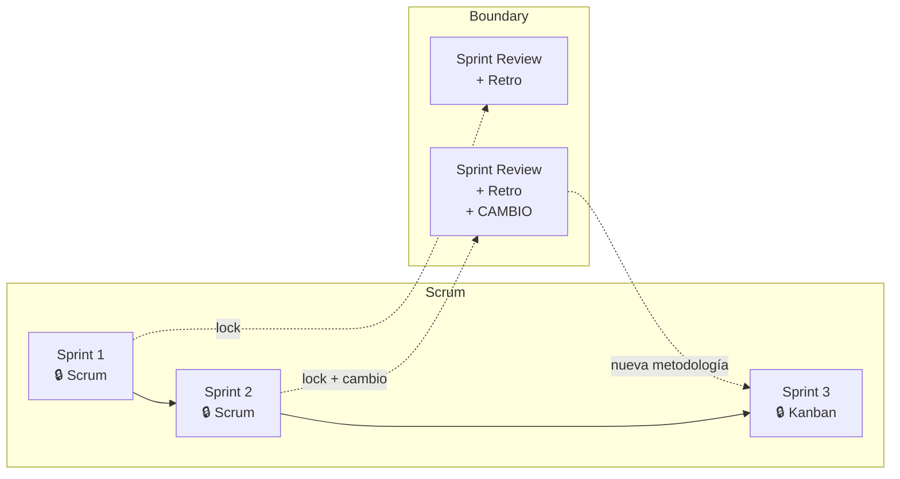

### Cambio de metodología — protocolo

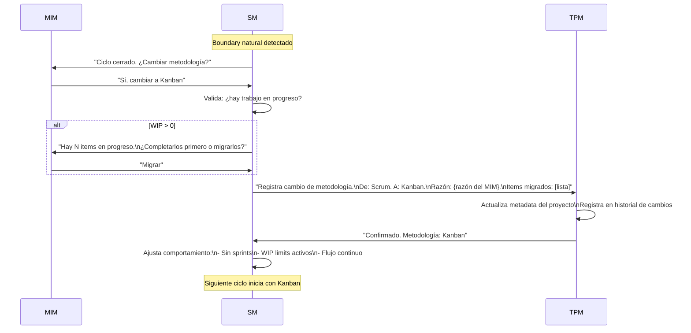

### Lo que pasa con los artefactos cuando cambia la metodología

**Respuesta corta: NADA.** Los artefactos son los mismos. Solo cambia
la ceremonia alrededor de su producción.

Esto está validado por múltiples frameworks de la industria:

| Framework | Qué dice sobre artefactos y cambio de metodología |
|-----------|--------------------------------------------------|
| **Disciplined Agile (PMI)** | El goal es constante; la práctica/artefacto que lo implementa es la opción variable. Cambiar de WoW no requiere re-crear artefactos. |
| **Scrumban** | "Start with what you have" — el backlog y sus items sobreviven la transición. Solo cambian sprints → flujo y velocity → cycle time. |
| **SAFe** | Epic → Feature → Story mantiene el mismo formato cruzando niveles con diferentes metodologías. La identidad del artefacto es constante. |
| **PMBOK 7** | Artifacts son "tools you select per context" — independientes del delivery approach. |
| **Práctica real (Jira)** | Migrar de Scrum board a Kanban board no reescribe issues. Se desactivan sprints, se agregan WIP limits. Los items quedan intactos. |
| **ISO 15288/12207** | Proceso outcomes son fijos; life-cycle model es variable y tailorable. Los information items que produce un proceso no dependen del modelo de ciclo de vida. |

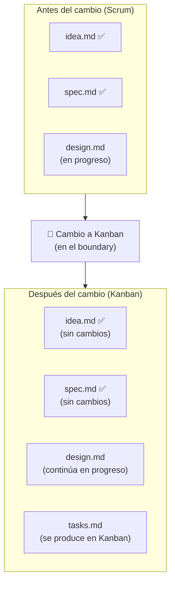

### Metadata — estampa de metodología por artefacto

Cada artefacto registra BAJO QUÉ metodología fue producido. Esto no
cambia el contenido — es metadata de trazabilidad.

```
## Metadata
- Fecha de creación: 2026-07-15
- Estado: completo
- Iteración: Sprint 3
- Metodología vigente: scrum
- Revisores: [PO, QA]
```

Si la metodología cambia y un artefacto nuevo se produce después:

```
## Metadata
- Fecha de creación: 2026-08-02
- Estado: borrador
- Iteración: Kanban cycle 1
- Metodología vigente: kanban
- Revisores: [Dev Lead]
```

**El TPM estampa esto automáticamente.** Los roles no necesitan saberlo
ni preocuparse — el TPM es el DBMS y la estampa es metadata, no
contenido.

### Metadata del proyecto — historial de metodología

El proyecto mantiene un historial de cambios de metodología en el RAG.
Esto es metadata del PROYECTO, no de un artefacto individual.

```
# Metadata del Proyecto: {nombre}

## Metodología vigente
- Actual: kanban
- Desde: 2026-08-01
- Boundary: replenishment cada 5 días

## Historial de cambios
| Fecha | De | A | Razón | Boundary |
|-------|------|--------|-------|----------|
| 2026-07-01 | — | scrum | Inicio de proyecto | Sprint 2 semanas |
| 2026-08-01 | scrum | kanban | Equipo prefiere flujo continuo post-MVP | Replenishment 5 días |

## Roles activos
- [PO, SM, Dev Lead, QA] (UX desactivado: proyecto CLI)
```

### Artefactos mixtos — el caso real

En la práctica, un proyecto puede tener artefactos producidos bajo
diferentes metodologías. Esto NO es un problema porque el contenido
es universal (ISO-backed). Lo que varía es solo el contexto ceremonial
en que fue producido:

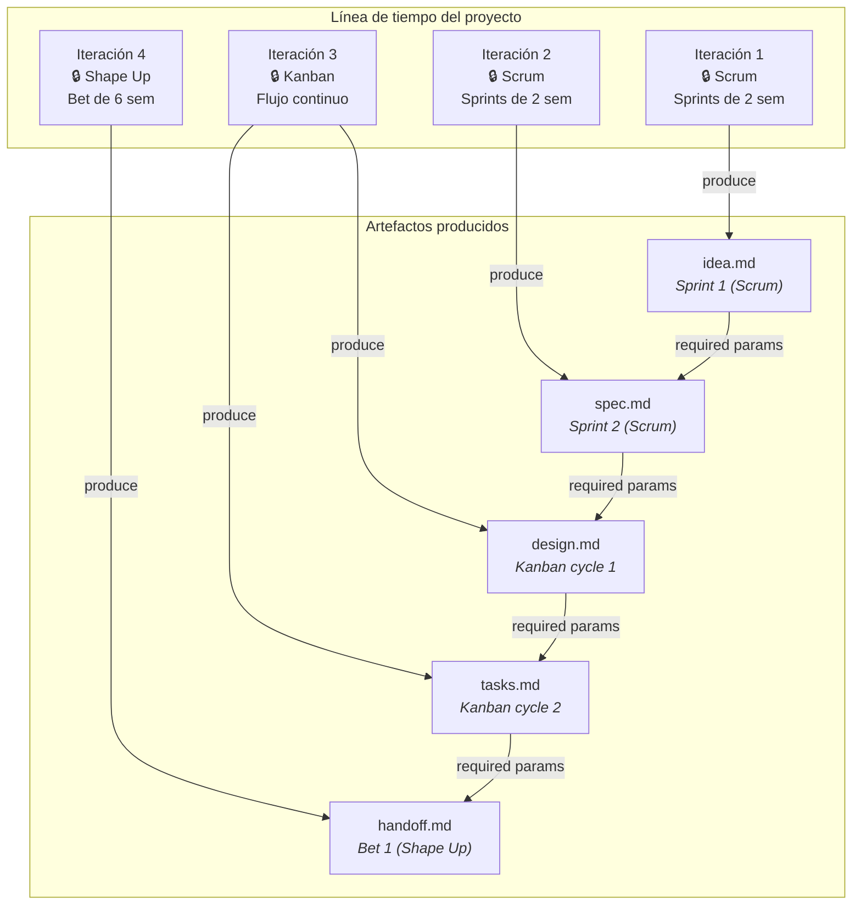

**La cadena de dependencias (required params) no se rompe.** Un
`design.md` producido bajo Kanban consume el `spec.md` producido bajo
Scrum sin ningún problema, porque ambos siguen el mismo schema ISO.

### Reglas del SM para gobierno de metodología

1. **LOCK al inicio** — el SM establece la metodología al inicio de cada
   iteración. Durante la iteración, la metodología NO cambia.

2. **Solo cambia en boundary** — el SM solo propone cambio de metodología
   cuando detecta el boundary natural del ciclo vigente.

3. **El MIM decide** — el SM puede RECOMENDAR un cambio basándose en
   métricas o fricción observada, pero la decisión es del MIM.

4. **WIP se resuelve primero** — si hay trabajo en progreso, el SM
   pregunta: ¿completar o migrar? No se abandona trabajo.

5. **El TPM registra TODO** — cada cambio queda en el historial con:
   fecha, metodología anterior, nueva, razón, items afectados.

6. **Sin efecto retroactivo** — los artefactos ya producidos conservan
   su metadata original. No se re-estampan.

7. **Emergencia como excepción** — si el MIM declara una emergencia
   (producción caída, deadline movido), el SM puede hacer un "emergency
   break" del lock. Se registra como excepción en el historial con
   justificación.

### Contribución novel del framework

> **Nota importante**: la granularidad de "metodología como metadata por
> artefacto" es una **extensión genuina** más allá de la literatura PM
> existente. Los frameworks establecidos (DA, SAFe, PMBOK) operan a
> nivel de equipo, nivel de programa, o por deliverable — no por
> artefacto individual.
>
> Nuestro modelo lleva esto un paso más allá: cada artefacto sabe
> bajo qué metodología fue producido, permitiendo trazabilidad completa
> incluso cuando la metodología cambia múltiples veces durante un
> proyecto. Esto es posible porque el modelo de artefactos es universal
> (ISO-backed) y la metodología es solo metadata, no estructura.
>
> **Precedente de validación**: SAFe demuestra que artefactos cruzan
> boundaries de metodología sin conversión (Epic → Feature → Story
> sobrevive Scrum ↔ Kanban en diferentes equipos). Disciplined Agile
> demuestra que el goal es constante y la práctica es variable.
> Scrumban demuestra que los items sobreviven la transición. Nuestro
> modelo generaliza estos patrones a una metadata explícita por
> artefacto.

---

## Resumen de Estándares Referenciados

| Estándar | Nombre | Qué aporta al modelo |
|----------|--------|---------------------|
| ISO/IEC/IEEE 15288 | System Life Cycle Processes | La columna vertebral: secuencia de etapas del ciclo de vida |
| ISO/IEC/IEEE 12207 | Software Life Cycle Processes | Overlay específico para software (procesos técnicos + organizacionales) |
| ISO/IEC/IEEE 15289 | Content of Life-Cycle Information Items | El catálogo: qué documentos produce cada proceso, contenido mínimo |
| ISO/IEC/IEEE 29148 | Requirements Engineering | Contenido de `spec.md`: StRS, SyRS, SRS |
| ISO/IEC/IEEE 42010 | Architecture Description | Contenido de `design.md`: viewpoints, stakeholders, concerns |
| IEEE 1016 | Software Design Descriptions | Contenido de `design.md`: design entities, rationale |
| IEEE 828 | Configuration Management | Trazabilidad entre artefactos (transversal) |
| ISO/IEC/IEEE 29119-3 | Test Documentation | Contenido de pruebas en `handoff.md`: test plan, strategy |
| IEEE 1063 | Software User Documentation | Documentación de usuario (si aplica) |
| ISO/IEC 20000-1/2 | IT Service Management | Contenido de `ops-runbook.md`: SLAs, monitoreo, procedimientos |
| ITIL 4 | Service Transition | Checklist práctico de transición a operaciones |
| Google SRE PRR | Production Readiness Review | Gate práctico: ¿listo para producción? |

### Frameworks de referencia para gobierno de metodología

| Framework | Qué valida |
|-----------|-----------|
| Disciplined Agile (PMI) | WoW variable por equipo, evolucionable via GCI. Goal constante, práctica variable. |
| Scrumban (Ladas) | Transición gradual Scrum→Kanban. Items sobreviven sin conversión. |
| SAFe | Diferentes metodologías por nivel. Artefactos cruzan boundaries sin cambio de formato. |
| PMBOK 7th ed. | Tailoring: approach seleccionable por deliverable, no solo por proyecto. |
| ISO 15288/12207 | Proceso outcomes fijos, life-cycle model tailorable. Information items independientes del modelo. |

---

## Relación con Otros Documentos

- [operational-model.md](operational-model.md) — define los dos modos
  (planificación y ejecución). Este documento define los artefactos que
  el modo planificación produce.
- [behavior-scrum-master-routing.md](behavior-scrum-master-routing.md) —
  define cómo el SM orquesta la producción de artefactos. El SM usa este
  modelo como referencia para saber qué artefactos deben existir en cada
  fase.

---

## Preguntas Abiertas

1. **¿Debe `ops-runbook.md` producirse en modo planificación o
   post-ejecución?** — el contenido depende de que el código exista, pero
   la estructura puede anticiparse desde el diseño.

2. **¿Cómo escala el modelo hacia abajo?** — para un challenge de 45 min,
   ¿se omiten artefactos o se comprimen en uno solo? Los tiers de
   activación deben definir esto.

3. **¿Debe el TPM validar contra los estándares ISO mecánicamente?** —
   es decir, ¿tener un schema formal por artefacto que se valida
   automáticamente? O ¿basta con el criterio editorial del TPM?
