# Modelo Universal de Artefactos

> El modelo de artefactos define QUÉ documentos produce un proyecto y qué
> contiene cada uno. Es **independiente de la metodología** (Scrum, Kanban,
> Shape Up, PI Planning, SAFe, etc.) y está respaldado por estándares
> internacionales ISO/IEC/IEEE.
>
> La metodología define CÓMO se organiza el trabajo (ceremonia, cadencia,
> roles). Los artefactos son los mismos sin importar la metodología elegida.

---

## Por Qué Estándares Internacionales

El modelo de artefactos NO es una invención del framework. Está alineado
con estándares ISO/IEC/IEEE porque:

1. **Portabilidad de adaptadores** — si los artefactos siguen un estándar,
   cualquier sistema que implemente ese estándar puede ser adaptador:
   archivos locales, Jira, Asana, Basecamp, MS Project, un DBMS, un RAG
   remoto, engram, Confluence, Linear, o cualquier herramienta futura.

2. **Interoperabilidad** — un `spec.md` que sigue ISO/IEC/IEEE 29148 es
   entendible por cualquier equipo, herramienta o proceso que conozca el
   estándar. No es un formato propietario.

3. **Completitud verificable** — los estándares definen qué secciones debe
   tener cada artefacto. Eso nos da un schema verificable mecánicamente
   (el TPM puede validar completitud contra el estándar).

4. **Independencia de la metodología** — los estándares describen
   *information items*, no ceremonias. Un `spec.md` es un `spec.md` sin
   importar si se produjo en un sprint planning o en un bet de Shape Up.

```mermaid
flowchart TD
    subgraph STANDARDS["Estándares ISO/IEC/IEEE"]
        ISO15288["15288\nCiclo de vida\n(la columna vertebral)"]
        ISO15289["15289\nCatálogo de artefactos\n(qué documentos por proceso)"]
        ISO29148["29148\nRequisitos\n(StRS, SyRS, SRS, BRS §9.3)"]
        ISO42010["42010\nDescripción de arquitectura"]
        IEEE1016["IEEE 1016\nDiseño de software"]
        ISO29119["29119-3\nDocumentación de pruebas"]
        ISO20000["20000\nGestión de servicios IT"]
        ITIL["ITIL 4\nTransición de servicios"]
        ISO21502["21502 §7.6\nSchedule Management"]
        PMBOK_DA["PMBOK\nDefine Activities"]
    end

    subgraph MODEL["Modelo Universal de Artefactos"]
        IDEA["idea.md"]
        SPEC["spec.md"]
        DESIGN["design.md"]
        TASKS["tasks.md"]
        HANDOFF["handoff.md"]
        OPS["ops-runbook.md"]
    end

    ISO15288 -->|"define la secuencia\nde etapas"| MODEL
    ISO15289 -->|"define contenido\nmínimo por artefacto"| MODEL
    ISO29148 -->|"respalda §9.3 BRS"| IDEA
    ISO29148 -->|"respalda §StRS/SRS"| SPEC
    ISO42010 -->|"respalda"| DESIGN
    IEEE1016 -->|"respalda"| DESIGN
    ISO21502 -->|"respalda mecanismo\nde descomposición"| TASKS
    PMBOK_DA -->|"respalda Activity List\n+ Activity Attributes"| TASKS
    ISO29119 -->|"respalda"| HANDOFF
    ISO20000 -->|"respalda"| OPS
    ITIL -->|"respalda"| OPS
```

> **Los 6 artefactos tienen respaldo de estándares internacionales.**
> `idea.md` se respalda con ISO/IEC/IEEE 29148 §9.3 (BRS). `tasks.md` no
> tiene un estándar que defina el artefacto como tal, pero el mecanismo de
> descomposición que implementa está respaldado por ISO 21502 §7.6 y PMBOK
> "Define Activities." Los demás siguen directamente sus estándares ISO.

---

## La Columna Vertebral: ISO/IEC/IEEE 15288

El estándar 15288 (System Life Cycle Processes) define las etapas del ciclo
de vida de un sistema. Es **agnóstico a la metodología** — no menciona
sprints, backlogs ni cadencias. Define procesos y sus outputs.

Nuestro modelo mapea directamente a sus procesos técnicos:

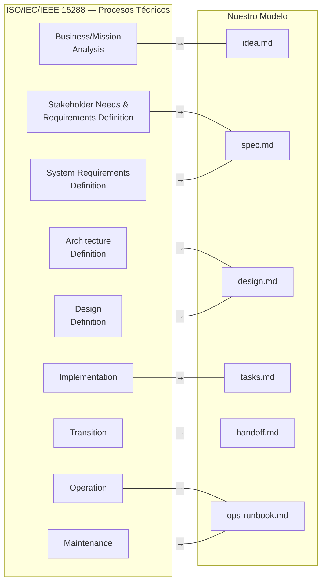

**Nota**: el estándar define más procesos (Integration, Verification,
Validation, Disposal). Esos se mapean a las etapas post-ejecución (Verify,
Accept, Retro) que se definen por separado.

---

## Los 6 Artefactos Universales

Cada artefacto tiene: propósito, respaldo de estándar, contenido mínimo,
quién lo produce, quién lo consume, y reglas de ownership.

### 1. `idea.md` — Análisis de Negocio/Misión

| Atributo | Valor |
|----------|-------|
| **Proceso 15288** | Business/Mission Analysis |
| **Respaldo ISO** | **ISO/IEC/IEEE 29148 §9.3 (BRS)** — tailoring ligero permitido por §9.3.1 |
| **Respaldo adicional** | IEEE 1362 (ConOps) — absorbido como Annex A/B de 29148 |
| **Propósito** | Capturar el problema, el valor esperado, las restricciones conocidas, y las preguntas pendientes |
| **Owner** | Produce: PO (formula y estructura). Co-produce: SM (formula preguntas, no escribe contenido) |
| **Consumido por** | Fase de spec |

**Mapeo a 29148 §9.3 (BRS)**:

| Sección 29148 BRS | Nuestro equivalente en `idea.md` |
|-------------------|--------------------------------|
| §9.3.2 Business purpose | Problema |
| §9.3.3 Business scope | Valor esperado (alcance) |
| §9.3.5 Major stakeholders | Usuario final, stakeholders |
| §9.3.7 Mission, goals, objectives | Valor esperado (objetivos) |
| §9.3.12 Business operational constraints | Restricciones conocidas |
| §9.3.16 High-level operational concept | Flujo core del producto |
| §9.3.19 Project constraints | Timebox, presupuesto, stack obligatorio |

**Contenido mínimo** (tailoring de 29148 §9.3 — permitido por §9.3.1:
*"Organization of the content such as the order and section structure
may be selected in accordance with the project's information management
policies"*):

```
# Idea: {nombre del proyecto}

## Problema                        ← 29148 §9.3.2 Business purpose
Qué se necesita resolver y por qué.

## Valor esperado                  ← 29148 §9.3.7 Mission/goals/objectives
Para quién y qué beneficio.

## Restricciones conocidas         ← 29148 §9.3.12 + §9.3.19
Timebox, presupuesto, stack obligatorio, plataforma, etc.

## Concepto operativo de alto nivel ← 29148 §9.3.16 High-level operational concept
Flujo core del producto, escenarios principales.

## Decisiones tomadas
Roles activos para este proyecto, tier de activación, metodología.

## Preguntas pendientes
Lo que falta resolver antes de especificar.

## Metadata
- Fecha de creación
- Fuente del input (idea vaga, challenge, ticket, spec parcial)
- Estado: borrador | completo
- Iteración y metodología vigente
```

> **Corrección**: la versión anterior de este documento declaraba
> `idea.md` como "territorio libre sin estándar." Esto era **incorrecto**.
> 29148 §9.3 (BRS) cubre directamente este artefacto. IEEE 1362 (ConOps),
> que se creía muerto, fue absorbido como Annexes A/B de 29148 y sigue
> activo. Nuestro formato es un tailoring ligero — más conciso que el
> BRS completo, pero alineado a sus secciones normativas.

---

### 2. `spec.md` — Especificación de Requisitos

| Atributo | Valor |
|----------|-------|
| **Proceso 15288** | Stakeholder Needs & Requirements Definition + System Requirements Definition |
| **Respaldo ISO** | **ISO/IEC/IEEE 29148** (Requirements Engineering) |
| **Propósito** | Definir QUÉ se construye: acceptance criteria, contratos de API, constraints, límites de alcance |
| **Owner** | PO (define valor y prioridad) → QA (valida testeabilidad) |
| **Consumido por** | Fase de diseño, fase de verificación |

**Contenido mínimo** (alineado a 29148 — StRS/SRS simplificado):

```
# Spec: {nombre del proyecto}

## Requisitos funcionales
Listado con acceptance criteria (given/when/then).

## Requisitos no funcionales
Performance, seguridad, accesibilidad, compatibilidad.

## Contratos de interfaz
APIs, schemas, protocolos de comunicación.

## Restricciones y asunciones
Lo que se da por hecho, lo que NO se va a hacer.

## Priorización
MoSCoW o equivalente.

## Trazabilidad
Cada requisito traza a idea.md (qué problema resuelve).

## Metadata
- Fecha de creación
- Estado: borrador | revisado | aprobado
- Revisores: [roles que aprobaron]
```

> **29148 define 3 niveles**: StRS (stakeholder), SyRS (sistema), SRS
> (software). Para proyectos simples, los 3 se fusionan en un solo
> `spec.md`. Para proyectos complejos, se pueden separar. ISO 15289
> permite merge/split de documentos — el contenido es lo que importa.

---

### 3. `design.md` — Descripción de Arquitectura y Diseño

| Atributo | Valor |
|----------|-------|
| **Proceso 15288** | Architecture Definition + Design Definition |
| **Respaldo ISO** | **ISO/IEC/IEEE 42010** (Architecture Description) + **IEEE 1016** (Software Design) |
| **Propósito** | Definir CÓMO se construye: arquitectura, patrones, tradeoffs, decisiones técnicas |
| **Owner** | Dev Lead (arquitectura y patrones) → DevSecOps (seguridad e infra) |
| **Consumido por** | Fase de tareas, fase de ejecución |

**Contenido mínimo** (alineado a 42010 viewpoints + 1016 design entities):

```
# Design: {nombre del proyecto}

## Stack tecnológico
Lenguaje, framework, base de datos, servicios externos.
Justificación de cada elección.

## Arquitectura del sistema
Viewpoints (42010): lógico, de despliegue, de datos, de seguridad.
Diagramas Mermaid obligatorios.

## Decisiones de diseño (ADR)
Cada decisión con: contexto, alternativas evaluadas, decisión, consecuencias.

## Patrones aplicados
CQRS, Event Sourcing, Hexagonal, etc. Con justificación.

## Superficie de seguridad
Autenticación, autorización, secrets, OWASP top 10.

## Restricciones de infraestructura
Hosting, CI/CD, monitoreo, limits.

## Trazabilidad
Cada decisión traza a spec.md (qué requisito resuelve).

## Metadata
- Fecha de creación
- Estado: borrador | revisado | aprobado
- Revisores: [roles que aprobaron]
```

> **42010** define el concepto de *viewpoints* — perspectivas desde las
> cuales se describe la arquitectura (stakeholders, concerns, views). No
> impone un formato específico, solo exige que cada viewpoint tenga
> stakeholders identificados, concerns que aborda, y convenciones de
> modelado. Esto se alinea con nuestro concepto de "lentes" del scrum team.

---

### 4. `tasks.md` — Desglose de Tareas

| Atributo | Valor |
|----------|-------|
| **Proceso 15288** | Implementation (preparación) |
| **Respaldo ISO** | **ISO 21502 §7.6** (Schedule Management — descomposición en actividades) |
| **Respaldo adicional** | PMBOK "Define Activities" (Activity List + Activity Attributes). ISO 21511 (WBS) es un nivel ARRIBA — cubre deliverables, no tasks. |
| **Propósito** | Desglosar el diseño en unidades de trabajo ejecutables, ordenadas por dependencias |
| **Owner** | Dev Lead (desglose técnico) → SM (secuencia y dependencias) |
| **Consumido por** | Fase de handoff, modo ejecución |

**Mapeo a ISO 21502 §7.6 y PMBOK Define Activities**:

| Concepto del estándar | Nuestro equivalente en `tasks.md` |
|----------------------|----------------------------------|
| Activity (unidad de trabajo programable) | Tarea con ID único |
| Activity Attributes (descripción, tipo, predecessors) | Descripción + dependencias + archivos afectados |
| Activity Dependencies (FS/FF/SS/SF) | Dependencias (IDs de tareas previas) |
| Milestone (punto de verificación) | Gate implícito en el grafo de dependencias |
| Duration estimate | Estimación de complejidad (S/M/L) |

> **Distinción clave**: el WBS (PMI Practice Standard, ISO 21511)
> descompone **deliverables** — "qué se entrega". `tasks.md` descompone
> **actividades** — "qué se ejecuta". Son niveles diferentes:
>
> ```
> WBS (deliverable) → Work Package → Activity (nuestra tarea)
> ISO 21511            PMI WBS        ISO 21502 §7.6 / PMBOK Define Activities
> ```
>
> Nuestro `tasks.md` vive en el nivel de Activity, no de WBS.

**Contenido mínimo** (alineado a ISO 21502 §7.6 + PMBOK Activity List):

```
# Tasks: {nombre del proyecto}

## Tareas
Cada tarea con:
- ID único                               ← Activity ID
- Título                                 ← Activity name
- Descripción (qué hacer)               ← Activity Attributes
- Dependencias (IDs de tareas previas)   ← Activity Dependencies
- Criterios de aceptación (given/when/then) ← Verification criteria
- Estimación de complejidad (S/M/L)      ← Duration estimate
- Archivos afectados (si se conocen)     ← Activity Attributes (resources)

## Orden de ejecución                    ← Schedule (dependency graph)
Grafo de dependencias resuelto.

## Metadata
- Fecha de creación
- Estado: borrador | revisado | aprobado
- Total de tareas, estimación agregada
- Iteración y metodología vigente
```

> **Corrección**: la versión anterior declaraba `tasks.md` como
> "artefacto nativo ágil sin estándar." Esto era impreciso. El artefacto
> como documento standalone no tiene estándar propio, pero el MECANISMO
> de descomposición que implementa SÍ está respaldado por ISO 21502 §7.6
> (Schedule Management) y PMBOK "Define Activities." La estructura de
> contenido (actividades con dependencias, atributos, estimaciones) está
> formalmente definida en ambos estándares.

---

### 5. `handoff.md` — Contrato de Transición

| Atributo | Valor |
|----------|-------|
| **Proceso 15288** | Transition |
| **Respaldo ISO** | **ISO/IEC/IEEE 15289** (transition information item) + **ISO/IEC/IEEE 29119-3** (test documentation) |
| **Propósito** | Contrato autocontenido entre planificación y ejecución. Quien lo lea puede actuar sin hacer preguntas. |
| **Owner** | TPM (compila bajo instrucción del SM) |
| **Consumido por** | Modo ejecución (orquestador + sub-agentes) |

**Contenido mínimo** (alineado a 15289 transition + 29119-3 test plan):

```
# Handoff: {nombre del proyecto}

## Resumen ejecutivo
Qué se construye y por qué, en 3-5 oraciones.

## Stack y arquitectura
Referencia a design.md, decisiones clave resumidas.

## Tareas a ejecutar
Referencia a tasks.md, orden de ejecución, dependencias.

## Estrategia de pruebas
Qué tipo de pruebas, cobertura esperada, herramientas.

## Criterios de aceptación globales
Qué debe ser verdad para que el proyecto se considere completo.

## Restricciones de ejecución
Convenciones del repo (AGENTS.md), reglas de commits, hooks.

## Contexto que NO se incluye
Qué se decidió NO hacer y por qué (para evitar scope creep).

## Metadata
- Fecha de generación
- Artefactos fuente: [idea.md, spec.md, design.md, tasks.md]
- Estado: generado | entregado | en ejecución | completado
```

> **El handoff es el CONTRATO entre modos**. Cuando el modo ejecución lo
> recibe, debe poder operar sin consultar otros artefactos de planificación
> excepto como referencia de detalle. La autocontención es la propiedad
> clave — validable mecánicamente por el TPM.

---

### 6. `ops-runbook.md` — Guía Operativa (Handoff a NOC/Ops)

| Atributo | Valor |
|----------|-------|
| **Proceso 15288** | Operation + Maintenance |
| **Respaldo ISO** | **ISO/IEC 20000-1/2** (IT Service Management) + **ITIL 4** (Service Transition) |
| **Propósito** | Todo lo que un equipo de operaciones necesita para mantener el sistema vivo sin recurrir a los desarrolladores |
| **Owner** | DevSecOps (infraestructura y monitoreo) → Dev Lead (troubleshooting técnico) |
| **Consumido por** | Equipo de operaciones, NOC, on-call |

**Contenido mínimo** (alineado a ITIL 4 Service Transition + Google SRE PRR):

```
# Ops Runbook: {nombre del proyecto}

## Descripción del servicio
Qué hace, quién lo usa, SLA esperado.

## Arquitectura de despliegue
Infraestructura, servicios, dependencias externas.
Diagrama de despliegue (Mermaid obligatorio).

## Monitoreo y alertas
Métricas clave, dashboards, umbrales de alerta.

## Procedimientos operativos
- Deploy / rollback
- Escalamiento horizontal/vertical
- Backup / restore
- Rotación de secrets

## Troubleshooting
Problemas conocidos y soluciones (known-error database).

## Contactos y escalación
Quién es responsable, cadena de escalación.

## Metadata
- Fecha de generación
- Versión del servicio
- Estado: borrador | validado | en producción
```

> **Este artefacto cierra el ciclo completo**: de la idea hasta la
> operación en producción. ISO 20000 define los requisitos formales del
> sistema de gestión de servicios. ITIL 4 provee el checklist práctico
> de transición. Google SRE Production Readiness Review es la
> implementación más concreta del gate "¿está listo para producción?".

---

## Jerarquía de Work Items — Sprints, Epics, Stories, Tasks

Los 6 artefactos producen **unidades de trabajo** a diferentes niveles de
granularidad. Esta sección define la jerarquía universal de work items, sus
dependencias, y cómo habilitan el paralelismo en modo ejecución.

### Por qué es necesario

Sin jerarquía explícita, los equipos (humanos o IA) enfrentan tres
problemas recurrentes:

1. **No hay paralelismo** — sin dependencias formales, todo se ejecuta en
   serie porque no se sabe qué es seguro paralelizar.
2. **No hay visibilidad de bloqueos** — los impedimentos se descubren tarde,
   cuando ya bloquearon la ruta crítica.
3. **No hay trazabilidad vertical** — no se puede responder "¿qué tareas
   implementan este requisito?" ni "¿qué épica cubre esta idea de negocio?"

### Niveles universales

La jerarquía tiene 5 niveles. La metodología determina los **nombres** y las
**ceremonias**, pero los niveles son constantes:

| Nivel | Nombre universal | Scrum | Kanban | Shape Up | SAFe |
|-------|-----------------|-------|--------|----------|------|
| L0 | **Initiative** | Theme / Initiative | — | Bet (appetite) | Epic |
| L1 | **Feature** | Epic | Category | Scope | Feature |
| L2 | **Requirement** | User Story | Card | Task (Shape Up) | Story |
| L3 | **Activity** | Task | Sub-card | Sub-task | Task |
| L4 | **Sub-activity** | Subtask | — | — | Subtask |

> **Respaldo**: la jerarquía L0→L4 refleja la descomposición progresiva
> de ISO 21502 §7.6 (Schedule Management) y el WBS Dictionary de
> PMBOK/ISO 21511. L0-L1 son deliverable-oriented (WBS), L2 es el puente
> requisito→trabajo, L3-L4 son activity-oriented (Define Activities).

### Quién produce qué nivel

| Nivel | Artefacto origen | Rol productor | Ejemplo |
|-------|-----------------|---------------|---------|
| L0 Initiative | `idea.md` | PO | "Sistema de autenticación" |
| L1 Feature | `idea.md` / `spec.md` | PO | "Login con OAuth2" |
| L2 Requirement | `spec.md` | PO + QA (ACs) | "Como usuario puedo logearme con Google" |
| L3 Activity | `tasks.md` | Dev Lead | "Implementar callback handler OAuth2" |
| L4 Sub-activity | `tasks.md` | Dev Lead | "Parsear token JWT del provider" |

### Schema universal de Work Item

Cada work item, independientemente de su nivel, tiene este schema:

```yaml
work_item:
  id: string          # Único. Formato: {nivel}-{secuencial}. Ej: L2-003
  type: L0|L1|L2|L3|L4
  title: string
  description: string
  parent_id: string?  # Referencia al item padre (jerarquía). null para L0
  artifact_source: string  # Artefacto que lo produjo (idea.md, spec.md, etc.)

  # — Dependencias y bloqueos —
  depends_on:         # Otros work items que deben completarse ANTES
    - item_id: string
      type: FS|SS|FF  # Finish-to-Start, Start-to-Start, Finish-to-Finish
  blocked_by:         # Impedimentos EXTERNOS (no son work items)
    - id: string
      description: string
      owner: string   # Quién puede resolverlo
      since: date

  # — Estado —
  state: todo|ready|in_progress|review|blocked|done|cancelled
  iteration: string?  # Sprint N, Cycle N, PI N (según metodología)

  # — Criterios —
  acceptance_criteria:
    - given: string
      when: string
      then: string
  complexity: XS|S|M|L|XL

  # — Trazabilidad —
  traces_to: string[] # IDs de items en otros niveles (trazabilidad vertical)
  methodology_stamp:
    name: string
    iteration: string
```

### Tipos de dependencia

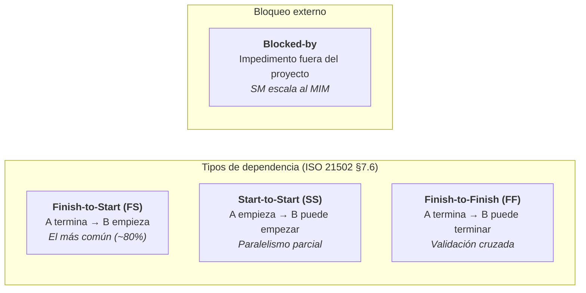

**Reglas de dependencia**:

1. Las dependencias pueden ser **cross-level** — un L3 puede depender de un L1 completo.
2. Las dependencias **circulares son un error** — el SM debe detectarlas al
   construir el grafo y escalar al MIM.
3. Un **blocker** es un impedimento externo (API de tercero caída, decisión
   pendiente del stakeholder, licencia). No es un work item — es metadata
   que congela el item hasta resolverse.
4. Las dependencias de tipo SS habilitan **paralelismo parcial** — B puede
   empezar cuando A empieza, no cuando A termina.

### Detección de paralelismo — la regla

El SM (o el orquestador en modo ejecución) usa el grafo de dependencias
para identificar **lanes paralelos**:

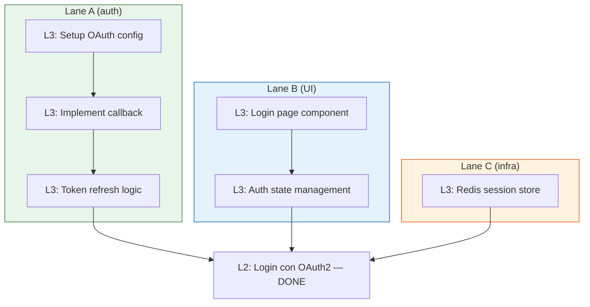

**Algoritmo de paralelismo**:

1. Construir el DAG (Directed Acyclic Graph) de todos los work items con
   estado `ready` o `todo`.
2. Identificar items sin dependencias pendientes → **ejecutables ahora**.
3. Agrupar por recurso/skill requerido → **lanes**.
4. Calcular **ruta crítica** (la cadena más larga de dependencias FS).
5. Items fuera de la ruta crítica tienen **holgura** — pueden retrasarse sin
   afectar la fecha de entrega.

> **Respaldo**: Critical Path Method (CPM) — ISO 21502 §7.6, PMBOK
> "Develop Schedule." El DAG + CPM es estándar en gestión de proyectos
> desde 1957 (DuPont/PERT). Lo que el framework aporta es hacerlo
> EJECUTABLE por agentes IA.

### Estado de un Work Item — máquina de estados

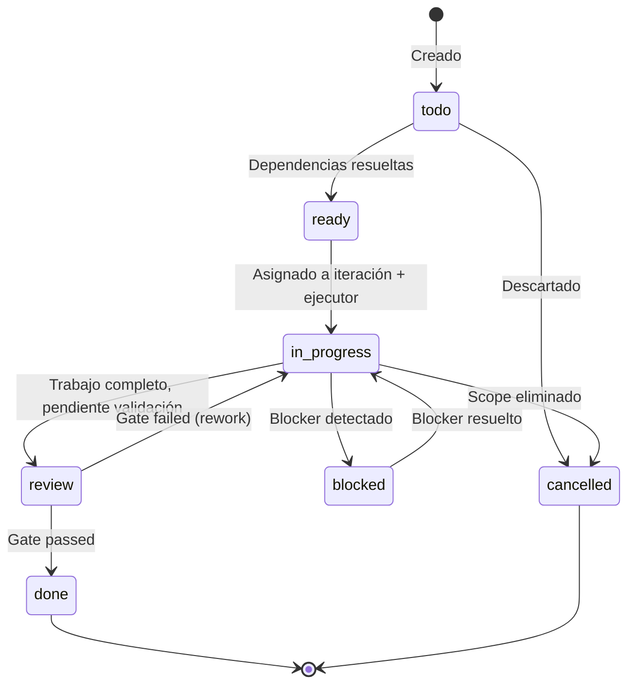

**Transiciones automáticas del SM**:

| Evento | Transición | Quién decide |
|--------|-----------|-------------|
| Todas las dependencias FS de un item están `done` | `todo` → `ready` | SM (automático) |
| Item `ready` asignado a iteración activa | `ready` → `in_progress` | SM |
| Sub-agente reporta trabajo completo | `in_progress` → `review` | SM (vía Status Report) |
| Blocker reportado por sub-agente o MIM | `in_progress` → `blocked` | SM |
| Gate de QA/UX/DevSecOps aprueba | `review` → `done` | SM (vía PDC) |
| Gate rechaza | `review` → `in_progress` | SM (con feedback) |
| MIM cancela scope | cualquier estado → `cancelled` | MIM → SM |

### Trazabilidad vertical

La trazabilidad vertical conecta niveles y permite responder preguntas como:

- "¿Qué tareas implementan la story L2-003?" → `traces_to` de L3 items
- "¿Está completa la feature L1-001?" → verificar que TODOS sus hijos
  estén `done`
- "¿Cuál es el progreso del initiative L0-001?" → porcentaje de
  descendientes `done` / total

```
L0-001: Sistema de autenticación
├── L1-001: Login con OAuth2
│   ├── L2-001: Como usuario puedo logearme con Google
│   │   ├── L3-001: Setup OAuth config ✓
│   │   ├── L3-002: Implement callback handler [in_progress]
│   │   └── L3-003: Token refresh logic [ready]
│   └── L2-002: Como usuario puedo logearme con GitHub
│       ├── L3-004: GitHub OAuth provider [todo]
│       └── L3-005: Unify token handling [todo] (depends_on: L3-003)
└── L1-002: Gestión de sesiones
    └── L2-003: Como usuario mi sesión persiste 30 días
        ├── L3-006: Redis session store [ready]
        └── L3-007: Session refresh middleware [todo] (depends_on: L3-006)
```

### Iteraciones — el contenedor temporal

Las iteraciones son el **contenedor temporal** donde se asignan work items.
El nombre y la duración dependen de la metodología:

| Metodología | Contenedor | Duración | Capacidad |
|------------|-----------|----------|-----------|
| Scrum | Sprint | Fija (1-4 semanas) | Velocity-based |
| Kanban | — (flujo continuo) | — | WIP limits |
| Shape Up | Cycle | Fija (6 semanas) | Appetite-based |
| SAFe | PI / Iteration | PI: 8-12 semanas, Iteration: 2 semanas | Capacity allocation |

**Lo que el framework trackea por iteración**:

```yaml
iteration:
  id: string          # sprint-1, cycle-2, pi-1-iter-3
  methodology: string # La que esté vigente (locked per iteration)
  state: planning|active|review|closed
  work_items: string[] # IDs asignados
  capacity: string    # Methodology-specific (story points, appetite, slots)
  goal: string        # Objetivo de la iteración
  start_date: date?
  end_date: date?
```

> En Kanban no hay iteración formal — el framework usa un pseudo-contenedor
> "continuous" que agrupa items por período de reporte (semanal, quincenal).
> Las métricas (cycle time, throughput) reemplazan velocity.

### Impacto en `tasks.md` — evolución del artefacto

Con la jerarquía definida, `tasks.md` evoluciona de "lista plana de tareas"
a "vista materializada del DAG de actividades (L3-L4)":

```
# Tasks: {nombre del proyecto}

## Work Items (L3-L4)
Cada item con schema universal: id, type, parent_id, depends_on,
blocked_by, state, iteration, acceptance_criteria, complexity.

## Dependency Graph
DAG completo con tipos (FS/SS/FF).
Parallelism lanes identificados.
Ruta crítica marcada.

## Blockers activos
Items bloqueados con impedimento, owner, antigüedad.

## Resumen de iteración
Items por estado. Progreso de features padre.
Lanes paralelos disponibles para ejecución.

## Metadata
- Fecha de creación
- Total items por nivel y estado
- Iteración y metodología vigente
```

### Impacto en `idea.md` y `spec.md`

- `idea.md` produce items L0 (initiatives) y opcionalmente L1 (features)
  cuando el MIM los identifica desde el input inicial.
- `spec.md` produce items L2 (requirements/stories) con acceptance criteria
  formales. Cada L2 traza a su L1 padre.

Estos items se crean DENTRO de los artefactos respectivos y se referencian
en `tasks.md` mediante `traces_to`.

### Impacto en `handoff.md`

El handoff incluye:
- El DAG completo de work items con sus dependencias
- Los lanes paralelos pre-calculados
- La ruta crítica identificada
- Los blockers conocidos (para que el modo ejecución sepa qué evitar)

Esto permite al orquestador de ejecución iniciar trabajo en paralelo desde
el primer momento, sin tener que analizar dependencias en runtime.

---

## Cadena de Artefactos — Flujo Completo

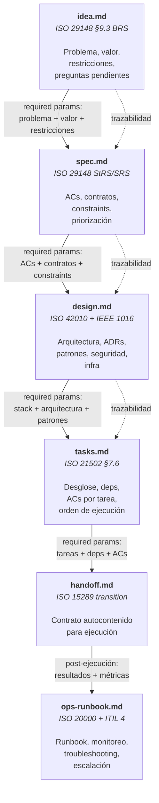

---

## Ownership — Quién Produce, Quién Consume, Quién Valida

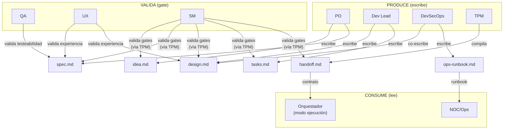

### Matriz de Ownership Detallada

| Artefacto | Produce | Co-produce | Valida (gate) | Consume |
|-----------|---------|------------|---------------|---------|
| `idea.md` | PO | SM (preguntas) | SM (completitud vía TPM) | Fase spec |
| `spec.md` | PO | — | QA (testeabilidad), UX (experiencia), SM (gate) | Fase design |
| `design.md` | Dev Lead | DevSecOps (seguridad, infra) | UX (experiencia), SM (gate) | Fase tasks |
| `tasks.md` | Dev Lead | SM (secuencia, deps) | SM (gate) | Fase handoff |
| `handoff.md` | TPM | — | SM (autocontención) | Modo ejecución |
| `ops-runbook.md` | DevSecOps | Dev Lead (troubleshooting) | SM (gate) | NOC/Ops |

### Reglas de Ownership

1. **Quien produce NUNCA valida su propio artefacto** — el PO escribe
   spec, QA valida. Dev Lead escribe design, UX valida. Separación de
   concerns entre producción y validación.

2. **El SM nunca produce contenido** — orquesta, valida gates (vía TPM),
   pero no escribe dentro de ningún artefacto. Regla cardinal sin
   excepciones.

3. **El TPM es el ÚNICO que ESCRIBE en el RAG** — todas las operaciones
   de escritura (create, update, delete, mark-complete) pasan por el TPM
   con criterio editorial (formato, completitud, consistencia). Las
   **lecturas son libres** — cualquier rol puede consultar el RAG
   directamente vía Pattern B (topic_keys) sin intermediario. Ver
   sección "Estrategia de Retrieval."

4. **El handoff lo compila el TPM, no un rol productivo** — es una
   síntesis de artefactos previos, no contenido nuevo. El TPM aplica
   su criterio editorial para compilar un documento autocontenido.

5. **ops-runbook es POST-ejecución** — se produce después de que el código
   existe, no durante la planificación. DevSecOps lo escribe porque tiene
   visibilidad de infraestructura, monitoreo y seguridad.

---

## El TPM como DBMS del Modelo de Artefactos

El TPM (Technical Program Manager) es al modelo de artefactos lo que un
DBMS es a los datos: no decide qué datos crear (eso lo hacen los roles),
pero sí decide CÓMO se almacenan, valida integridad, y sirve consultas.

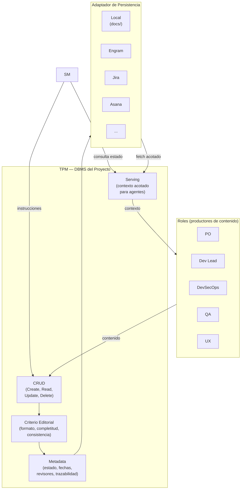

### Operaciones del TPM sobre el modelo

| Operación | Qué hace | Quién la invoca | Ejemplo |
|-----------|----------|-----------------|---------|
| **Create** | Crea un artefacto nuevo con metadata inicial. **Precondición**: verifica que todos los artefactos upstream estén marcados como `completo` antes de crear. Si un upstream falta o está incompleto, rechaza y reporta al SM. | SM (instrucción) | "Crea idea.md para el proyecto X" |
| **Read** | Retorna un slice acotado del artefacto | SM, Roles | "Dame la sección de ACs de spec.md" |
| **Update** | Modifica contenido existente, mantiene trazabilidad | SM (instrucción) | "Actualiza el ADR #3 en design.md" |
| **Delete** | Elimina contenido obsoleto (raro, con justificación) | SM (instrucción) | "Elimina la tarea T-07, fue descartada" |
| **Mark complete** | Cambia el estado del artefacto a `completo` | SM (vía gate) | "spec.md pasó el gate, marcar completo" |
| **Verify consistency** | Verifica integridad referencial entre artefactos | SM (pre-gate) | "¿Todos los ACs de spec trazan a ideas?" |
| **Serve context** | Sirve el contexto ACOTADO que un agente necesita | SM o sub-agente directo | "Dame solo las tareas T-01..T-03" |

---

## Estrategia de Retrieval — Quién Consulta el RAG

### El problema: el SM como middleman de contexto quema tokens

Cuando el SM lee contenido del RAG y lo re-inyecta en el prompt del
sub-agente, paga un **impuesto de regeneración**: el contenido se
serializa como output tokens del SM (~5x más caros que input tokens)
antes de llegar al sub-agente como input.

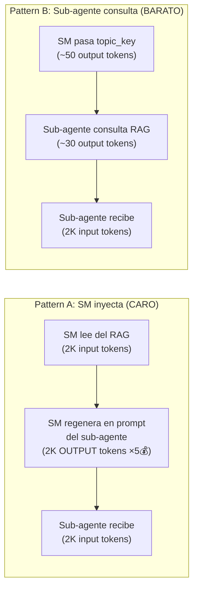

### Números concretos

Para **2,000 tokens de contexto** por delegación:

| Paso | Pattern A (SM inyecta) | Pattern B (agente consulta) |
|------|----------------------|---------------------------|
| SM lee del RAG | 2,000 tokens input | — |
| SM regenera en prompt del agente | 2,000 tokens **output** (5x costo) | ~50 tokens output (topic_key) |
| Sub-agente recibe contexto | 2,000 tokens input | 2,000 tokens input |
| Sub-agente emite query al RAG | — | ~30 tokens output |
| **Costo total** | **~$0.042** | **~$0.007** |
| **Relación** | **6x más caro** | **baseline** |

Para **20,000 tokens** (un `spec.md` o `design.md` completo):
Pattern A ≈ $0.42 vs Pattern B ≈ $0.066 — **la diferencia escala
linealmente con el tamaño del artefacto**.

> **El driver principal NO es "leer dos veces"** — es que el SM tiene
> que GENERAR el contenido como output tokens para ponerlo en el prompt
> del sub-agente. Output tokens cuestan ~5x más que input tokens en
> todos los modelos actuales (Claude, GPT-4). Ese impuesto de
> regeneración es el 71% del costo de Pattern A.

### La regla: híbrido (no todo es Pattern B)

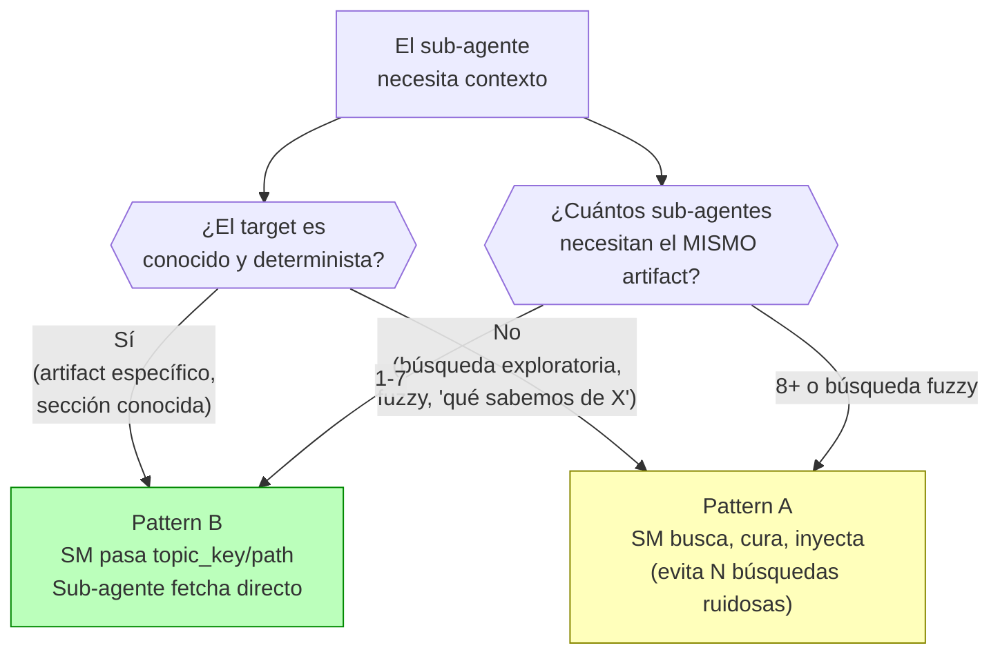

| Situación | Pattern | Por qué |
|-----------|---------|---------|
| **Fase normal**: Dev Lead necesita `spec.md` para diseñar | **B** (topic_key) | Target determinista. El agente fetcha solo lo que necesita. 6x más barato. |
| **Verificación**: QA necesita `spec.md` + resultados de ejecución | **B** (topic_keys) | Targets conocidos. El agente puede hacer queries incrementales (primero §3, luego §3.2 si necesita detalle). |
| **Búsqueda exploratoria**: SM busca "qué decisiones se tomaron sobre auth" | **A** (SM inyecta) | Búsqueda fuzzy. Los resultados pueden ser ruidosos. Mejor que el SM cure una vez a que 5 agentes hagan la misma búsqueda vaga. |
| **Fan-out alto**: 8+ agentes o búsqueda fuzzy compartida | **A** (SM inyecta) | Justificación principal: **calidad, no costo**. Cuando N agentes hacen la misma búsqueda fuzzy independientemente, obtienen resultados ruidosos y divergentes. El SM cura una vez y distribuye. Nota: Fase 7 tiene 5 roles → Pattern B aplica (bajo el umbral). Pattern A se reserva para escenarios reales de alto fan-out (multi-team reviews, custom roles). |
| **Mid-task discovery**: sub-agente descubre que necesita más contexto | **B** (agente fetcha) | El SM no puede anticipar qué necesitará el agente a mitad de tarea. El agente hace queries precisas conforme razona. |

### Cómo funciona Pattern B en la práctica

El SM NO pasa contenido — pasa **referencias**:

```
Contrato de delegación:
─────────────────────────────────────────────
Rol:           Dev Lead
Personalidad:  Arquitecto (ver role-profiles.md Fase 3)
Contexto:      Lee del RAG usando estas referencias:
               - topic_key: "sdd/{project}/idea"  (restricciones)
               - topic_key: "sdd/{project}/spec"   (ACs y contratos)
               Usa mem_search(query: "{topic_key}") → mem_get_observation(id)
               para obtener el contenido completo.
Input:         Diseñar la arquitectura que satisfaga los ACs
Output:        design.md (schema del artifact model)
Status Report: Obligatorio
─────────────────────────────────────────────
```

El sub-agente recibe ~100 tokens de instrucción en vez de ~5,000 tokens
de contexto inyectado. Consulta el RAG directamente y obtiene exactamente
lo que necesita, cuando lo necesita.

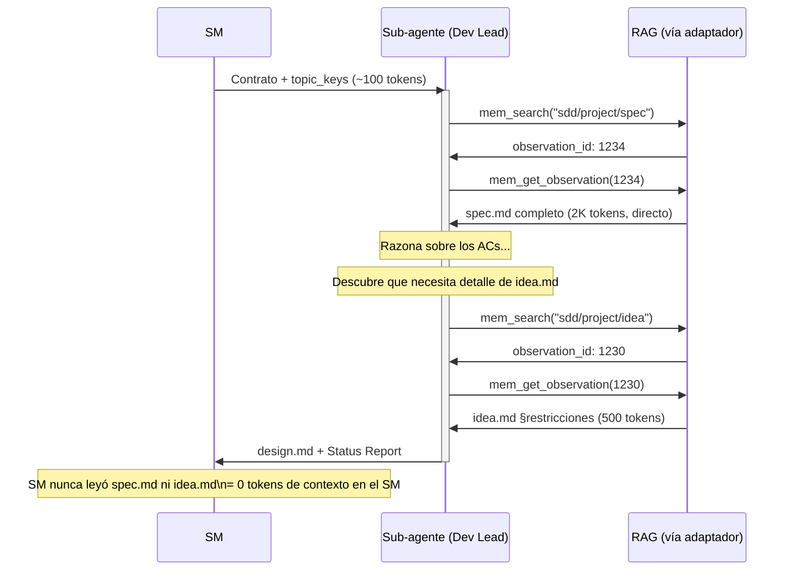

### Retrieval adaptativo: el agente sabe mejor qué necesita

Una ventaja clave de Pattern B: **el sub-agente descubre su necesidad de
información MIENTRAS razona**, no antes.

El SM no puede anticipar que el Dev Lead va a necesitar la sección de
"error codes" de `spec.md` — eso lo descubre el Dev Lead al diseñar el
manejo de errores. Con Pattern B, el agente hace queries incrementales
conforme avanza:

1. Lee `spec.md` completo → identifica ACs principales
2. Descubre que necesita detalle de restricciones → lee `idea.md` §restricciones
3. Nota que hay un AC sobre rate limiting → re-lee `spec.md` §no-funcionales

Cada query es precisa y acotada. Con Pattern A, el SM tendría que
adivinar TODO lo que el agente va a necesitar de antemano — y por
seguridad, inyectaría de más.

### Requisito de auditabilidad

Para no perder visibilidad sobre qué leyó el agente, el Status Report
debe incluir un campo de **fuentes consultadas**:

```
Status Report:
  Status: SUCCESS
  Progress: design.md completo (5/5 secciones)
  Blocker: ninguno
  Artifacts: design.md
  Sources:                          ← NUEVO
    - sdd/project/spec (obs:1234)
    - sdd/project/idea (obs:1230, §restricciones)
```

Esto da al SM un audit trail sin pagar el costo de leer el contenido.

### Impacto proyectado en un ciclo completo

Ejemplo: proyecto con 5 fases, ~3 delegaciones por fase con ~3K tokens
de contexto promedio por delegación:

| Métrica | Pattern A (todo inyectado) | Híbrido (B default, A para fan-out) |
|---------|--------------------------|-------------------------------------|
| Delegaciones | 15 | 15 |
| Tokens de contexto movidos | 45K (15 × 3K) | 45K |
| Costo del contexto | ~$0.94 (dominado por output-tax) | ~$0.16 |
| **Ahorro** | — | **~83%** en costo de retrieval |

> El ahorro es en la CAPA DE RETRIEVAL, no en el total del proyecto.
> Los sub-agentes siguen consumiendo tokens para razonar y producir. Pero
> eliminar el middleman de contexto quita el gasto más absurdo: pagar
> 5x por regenerar contenido que ya existe en el RAG.

---

## Adaptadores de Persistencia — La Interfaz Universal

Porque el modelo de artefactos sigue estándares internacionales, los
*information items* son portables. Cualquier sistema que pueda almacenar
y servir estos items puede ser un adaptador.

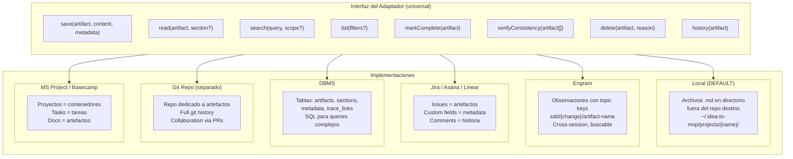

### Mapeo de artefactos por adaptador

| Artefacto | Local (default) | Engram | Jira | DBMS | Git Repo |
|-----------|----------------|--------|------|------|----------|
| `idea.md` | archivo .md | observation `sdd/{name}/idea` | Epic description | row en `artifacts` | `ideas/name.md` |
| `spec.md` | archivo .md | observation `sdd/{name}/spec` | Epic + child stories (ACs) | row + child rows | `specs/name.md` |
| `design.md` | archivo .md | observation `sdd/{name}/design` | Confluence page linked | row + JSON content | `designs/name.md` |
| `tasks.md` | archivo .md | observation `sdd/{name}/tasks` | Child issues del Epic | rows en `tasks` | `tasks/name.md` |
| `handoff.md` | archivo .md | observation `sdd/{name}/handoff` | Release ticket | row en `handoffs` | `handoffs/name.md` |
| `ops-runbook.md` | archivo .md | observation `sdd/{name}/ops` | Runbook page | row en `runbooks` | `runbooks/name.md` |

### Por qué los estándares habilitan los adaptadores

Sin el respaldo de estándares, cada adaptador tendría que inventar su
propia estructura. Con estándares:

1. **`spec.md` sigue 29148** → un adaptador de Jira sabe que "Requisitos
   funcionales" mapea a Stories con ACs, "No funcionales" a Labels, y
   "Trazabilidad" a Links entre issues.

2. **`design.md` sigue 42010** → un adaptador de Confluence sabe que
   cada *viewpoint* es una sección con diagrama, y cada ADR es una
   *decision page*.

3. **`handoff.md` sigue 15289 transition** → cualquier adaptador sabe
   que debe incluir: resumen, stack, tareas, estrategia de pruebas, y
   criterios de aceptación. Si falta uno, el artefacto está incompleto.

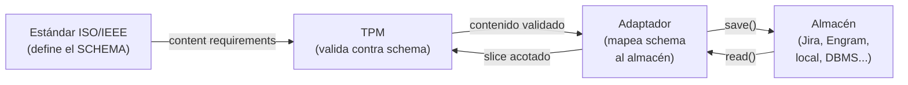

### Adaptador por defecto: `docs/` como RAG local

- **Path**: `~/.idea-to-mvp/projects/{nombre-proyecto}/`
- **Formato**: archivos markdown, uno por artefacto
- **Ventajas**: cero dependencias, legible por humanos, versionable con git
- **Desventaja**: sin acceso cross-machine, sin búsqueda semántica
- **Suficiente para**: proyectos individuales, challenges, MVPs
- **Concurrencia**: sesión activa única asumida. No hay locking ni
  merge conflict handling. Si dos sesiones escriben al mismo artefacto,
  la última gana. Concurrent-write safety es responsabilidad de
  adaptadores futuros (DBMS, Jira, Git repo).

Los demás adaptadores son **TBD**. El modelo de artefactos los habilita
por diseño, pero la implementación es futura. El adaptador local es el
MVP de persistencia.

---

## Metodología como Capa Intercambiable

La metodología define CÓMO se organiza el trabajo. Los artefactos definen
QUÉ se produce. Son capas independientes.

> **Alcance del claim**: la intercambiabilidad está **implementada a
> nivel de artefactos** — los 6 artifacts son idénticos sin importar la
> metodología. A nivel de **orquestación (routing, gates, convocatoria)**,
> el framework implementa **Scrum como default**. El routing para
> Kanban, Shape Up, y SAFe es extensible pero **no está implementado
> aún** — requiere routing tables alternativas (ej: WIP-limit checks
> en vez de sprint gates). Los roles (PO, SM, Dev Lead, QA, DevSecOps,
> UX) son funciones constantes con nombres methodology-specific.

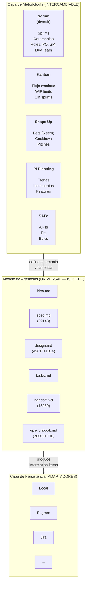

### Qué cambia con la metodología, qué NO cambia

| Aspecto | ¿Cambia con la metodología? | Ejemplo |
|---------|---------------------------|---------|
| **Qué artefactos se producen** | NO — siempre los mismos 6 | spec.md existe en Scrum, Kanban, y Shape Up |
| **Qué contiene cada artefacto** | NO — contenido definido por estándares ISO | Los ACs de spec.md son iguales sin importar si se definen en un sprint planning o en un pitch |
| **En qué orden se producen** | NO — la cadena idea→spec→design→tasks→handoff→ops es lógica, no metodológica | No puedes diseñar sin requisitos, sin importar la metodología |
| **Cómo se agrupa el trabajo** | SÍ | Scrum: sprints. Kanban: flujo. Shape Up: bets |
| **Qué ceremonia acompaña la producción** | SÍ | Scrum: sprint planning. Kanban: replenishment. Shape Up: betting table |
| **Qué roles participan y cómo** | NO — las funciones son constantes; los **nombres** son methodology-specific | Scrum: PO + SM + Dev Team. Kanban: mismas funciones sin títulos formales. Shape Up: shapers (≈PO+SM) + builders (≈Dev Lead+QA). Las 6 funciones (PO, SM, Dev Lead, QA, DevSecOps, UX) existen en todas las metodologías; lo que cambia es cómo se nombran y cuánta ceremonia acompaña su invocación. |
| **Cadencia de revisión** | SÍ | Scrum: cada sprint. Kanban: continua. PI Planning: cada PI |
| **Cómo se gestionan las tareas** | SÍ | Scrum: sprint backlog. Kanban: board con WIP. Shape Up: hill chart |

### Mapeo rápido: mismos artefactos, diferente ceremonia

| Artefacto | En Scrum | En Kanban | En Shape Up | En PI Planning |
|-----------|----------|-----------|-------------|---------------|
| `idea.md` | Product Backlog Item refinado | Card en "Ideas" | Raw idea antes del pitch | Feature en el backlog |
| `spec.md` | Sprint Planning output (ACs) | Definition of Ready | Pitch document | PI Objectives |
| `design.md` | Spike / Architecture Decision | Diseño al momento del pull | Solution sketch | Enabler |
| `tasks.md` | Sprint Backlog | Cards en el board | Scopes en el hill chart | Stories en el PI |
| `handoff.md` | Sprint Review package | — (flujo continuo) | Hand-off post bet | System Demo package |
| `ops-runbook.md` | Post-release runbook | Post-release runbook | Post-release runbook | Post-PI runbook |

---

## Gobierno de Metodología — Lock, Cambio y Trazabilidad

### Selección inicial de metodología

En el primer ciclo del proyecto, el SM debe determinar la metodología:

1. **Si el MIM la especifica** → usar la especificada.
2. **Si el MIM no la especifica** → el SM aplica **Scrum como default**
   e informa al MIM: *"Se usará Scrum como metodología. Puedes cambiar
   a Kanban/Shape Up/PI Planning al cierre del primer sprint."*
3. **Si el MIM tiene dudas** → el SM presenta la tabla comparativa
   (sección "Mapeo rápido") y pregunta explícitamente.

La decisión se registra en `idea.md` → sección "Decisiones tomadas" →
campo `methodology_stamp`.

### Principio: la metodología se LOCKEA por iteración

La metodología vigente **no se puede cambiar a medio ciclo**. Se lockea
al inicio de cada iteración y solo se puede cambiar cuando el ciclo
cierra. Esto previene:

- Compromisos rotos a mitad de sprint/bet/PI
- Métricas invalidadas (velocity, cycle time, throughput)
- Confusión sobre qué reglas aplican
- Artefactos en estados ambiguos

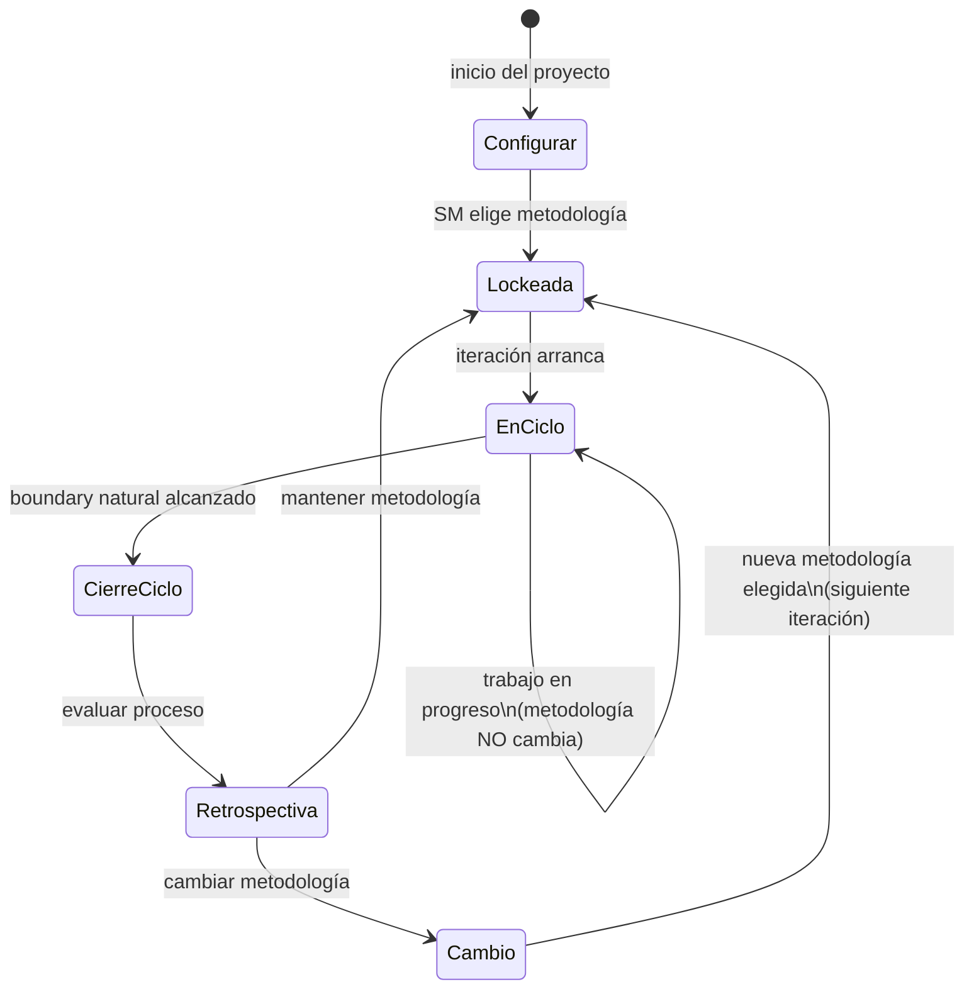

### Boundary natural por metodología

Cada metodología tiene su propio concepto de "ciclo cerrado". El SM
detecta el boundary y solo ahí habilita el cambio:

| Metodología | Boundary natural | Cuándo se puede cambiar | Duración típica |
|-------------|-----------------|------------------------|-----------------|
| **Scrum** | Fin del sprint (Sprint Review + Retro) | Antes del siguiente Sprint Planning | 1-4 semanas |
| **Kanban** | Replenishment meeting o WIP = 0 | En el siguiente replenishment | Continuo (boundary artificial) |
| **Shape Up** | Fin del bet cycle + cooldown | En la siguiente betting table | 6 + 2 semanas |
| **PI Planning** | Fin del Program Increment | En el siguiente PI Planning | 8-12 semanas |
| **SAFe** | Fin del PI (System Demo + I&A) | En el siguiente PI Planning | 8-12 semanas |

> **Caso especial — Kanban**: no tiene sprints, así que el boundary es
> más difuso. Opciones: (1) el SM declara un "review point" cada N días,
> (2) cuando el WIP llega a cero, (3) en el replenishment meeting
> periódico. Cualquiera es válido — lo que importa es que exista un
> boundary explícito.

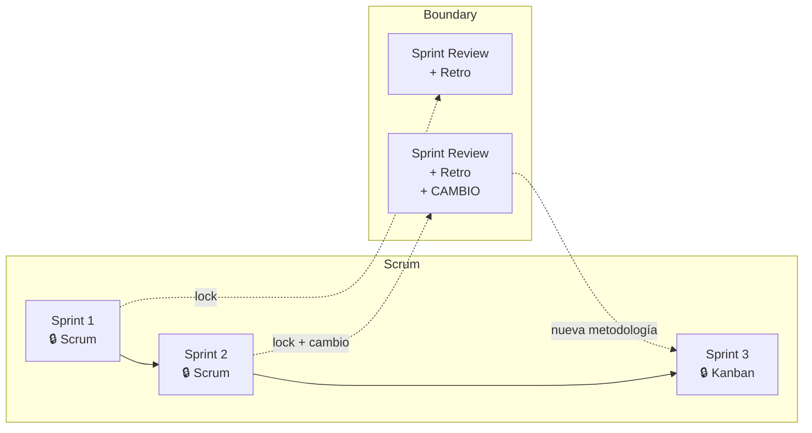

### Cambio de metodología — protocolo

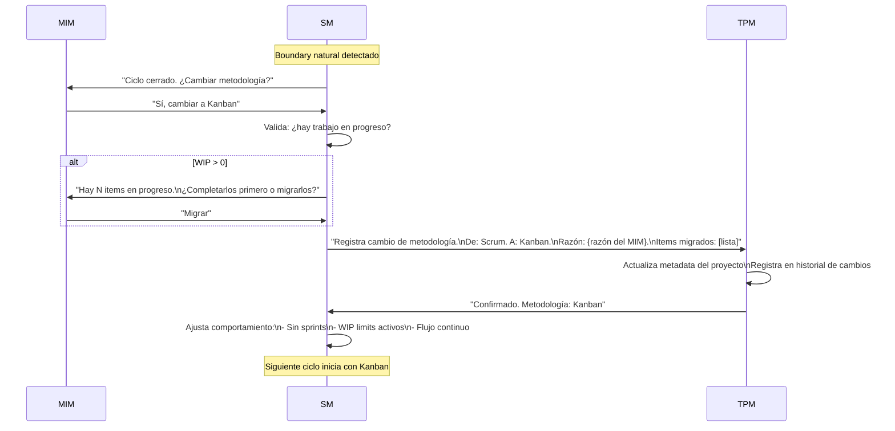

### Lo que pasa con los artefactos cuando cambia la metodología

**Respuesta corta: NADA.** Los artefactos son los mismos. Solo cambia
la ceremonia alrededor de su producción.

Esto está validado por múltiples frameworks de la industria:

| Framework | Qué dice sobre artefactos y cambio de metodología |
|-----------|--------------------------------------------------|
| **Disciplined Agile (PMI)** | El goal es constante; la práctica/artefacto que lo implementa es la opción variable. Cambiar de WoW no requiere re-crear artefactos. |
| **Scrumban** | "Start with what you have" — el backlog y sus items sobreviven la transición. Solo cambian sprints → flujo y velocity → cycle time. |
| **SAFe** | Epic → Feature → Story mantiene el mismo formato cruzando niveles con diferentes metodologías. La identidad del artefacto es constante. |
| **PMBOK 7** | Artifacts son "tools you select per context" — independientes del delivery approach. |
| **Práctica real (Jira)** | Migrar de Scrum board a Kanban board no reescribe issues. Se desactivan sprints, se agregan WIP limits. Los items quedan intactos. |
| **ISO 15288/12207** | Proceso outcomes son fijos; life-cycle model es variable y tailorable. Los information items que produce un proceso no dependen del modelo de ciclo de vida. |

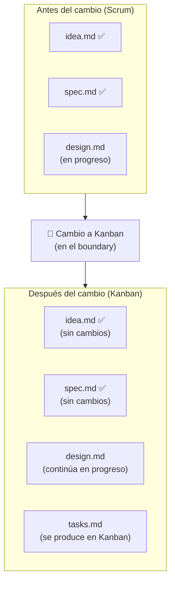

### Metadata — estampa de metodología por artefacto

Cada artefacto registra BAJO QUÉ metodología fue producido. Esto no
cambia el contenido — es metadata de trazabilidad.

```
## Metadata
- Fecha de creación: 2026-07-15
- Estado: completo
- Iteración: Sprint 3
- Metodología vigente: scrum
- Revisores: [PO, QA]
```

Si la metodología cambia y un artefacto nuevo se produce después:

```
## Metadata
- Fecha de creación: 2026-08-02
- Estado: borrador
- Iteración: Kanban cycle 1
- Metodología vigente: kanban
- Revisores: [Dev Lead]
```

**El TPM estampa esto automáticamente.** Los roles no necesitan saberlo
ni preocuparse — el TPM es el DBMS y la estampa es metadata, no
contenido.

### Metadata del proyecto — historial de metodología

El proyecto mantiene un historial de cambios de metodología en el RAG.
Esto es metadata del PROYECTO, no de un artefacto individual.

```
# Metadata del Proyecto: {nombre}

## Metodología vigente
- Actual: kanban
- Desde: 2026-08-01
- Boundary: replenishment cada 5 días

## Historial de cambios
| Fecha | De | A | Razón | Boundary |
|-------|------|--------|-------|----------|
| 2026-07-01 | — | scrum | Inicio de proyecto | Sprint 2 semanas |
| 2026-08-01 | scrum | kanban | Equipo prefiere flujo continuo post-MVP | Replenishment 5 días |

## Roles activos
- [PO, SM, Dev Lead, QA] (UX desactivado: proyecto CLI)
```

### Artefactos mixtos — el caso real

En la práctica, un proyecto puede tener artefactos producidos bajo
diferentes metodologías. Esto NO es un problema porque el contenido
es universal (ISO-backed). Lo que varía es solo el contexto ceremonial
en que fue producido:

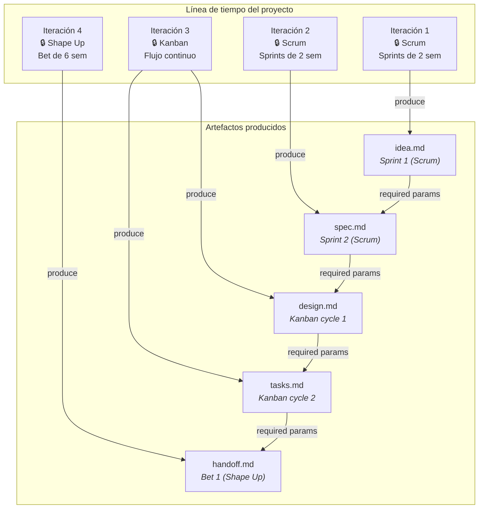

**La cadena de dependencias (required params) no se rompe.** Un
`design.md` producido bajo Kanban consume el `spec.md` producido bajo
Scrum sin ningún problema, porque ambos siguen el mismo schema ISO.

### Reglas del SM para gobierno de metodología

1. **LOCK al inicio** — el SM establece la metodología al inicio de cada
   iteración. Durante la iteración, la metodología NO cambia.

2. **Solo cambia en boundary** — el SM solo propone cambio de metodología
   cuando detecta el boundary natural del ciclo vigente.

3. **El MIM decide** — el SM puede RECOMENDAR un cambio basándose en
   métricas o fricción observada, pero la decisión es del MIM.

4. **WIP se resuelve primero** — si hay trabajo en progreso, el SM
   pregunta: ¿completar o migrar? No se abandona trabajo.

5. **El TPM registra TODO** — cada cambio queda en el historial con:
   fecha, metodología anterior, nueva, razón, items afectados.

6. **Sin efecto retroactivo** — los artefactos ya producidos conservan
   su metadata original. No se re-estampan.

7. **Emergencia como excepción** — si el MIM declara una emergencia
   (producción caída, deadline movido), el SM puede hacer un "emergency
   break" del lock. Se registra como excepción en el historial con
   justificación.

### Contribución novel del framework

> **Nota importante**: la granularidad de "metodología como metadata por
> artefacto" es una **extensión genuina** más allá de la literatura PM
> existente. Los frameworks establecidos (DA, SAFe, PMBOK) operan a
> nivel de equipo, nivel de programa, o por deliverable — no por
> artefacto individual.
>
> Nuestro modelo lleva esto un paso más allá: cada artefacto sabe
> bajo qué metodología fue producido, permitiendo trazabilidad completa
> incluso cuando la metodología cambia múltiples veces durante un
> proyecto. Esto es posible porque el modelo de artefactos es universal
> (ISO-backed) y la metodología es solo metadata, no estructura.
>
> **Precedente de validación**: SAFe demuestra que artefactos cruzan
> boundaries de metodología sin conversión (Epic → Feature → Story
> sobrevive Scrum ↔ Kanban en diferentes equipos). Disciplined Agile
> demuestra que el goal es constante y la práctica es variable.
> Scrumban demuestra que los items sobreviven la transición. Nuestro
> modelo generaliza estos patrones a una metadata explícita por
> artefacto.

---

## Resumen de Estándares Referenciados

| Estándar | Nombre | Qué aporta al modelo |
|----------|--------|---------------------|
| ISO/IEC/IEEE 15288 | System Life Cycle Processes | La columna vertebral: secuencia de etapas del ciclo de vida |
| ISO/IEC/IEEE 12207 | Software Life Cycle Processes | Overlay específico para software (procesos técnicos + organizacionales) |
| ISO/IEC/IEEE 15289 | Content of Life-Cycle Information Items | El catálogo: qué documentos produce cada proceso, contenido mínimo |
| ISO/IEC/IEEE 29148 | Requirements Engineering | Contenido de `idea.md` (§9.3 BRS) y `spec.md` (StRS, SyRS, SRS) |
| ISO/IEC/IEEE 42010 | Architecture Description | Contenido de `design.md`: viewpoints, stakeholders, concerns |
| IEEE 1016 | Software Design Descriptions | Contenido de `design.md`: design entities, rationale |
| ISO 21502 | Project Management Guidance (§7.6) | Mecanismo de descomposición de `tasks.md`: actividades, dependencias, duración |
| PMBOK 7th ed. | Define Activities (process) | Respaldo de `tasks.md`: Activity List, Activity Attributes, Milestones |
| IEEE 828 | Configuration Management | Trazabilidad entre artefactos (transversal) |
| ISO/IEC/IEEE 29119-3 | Test Documentation | Contenido de pruebas en `handoff.md`: test plan, strategy |
| IEEE 1063 | Software User Documentation | Documentación de usuario (si aplica) |
| ISO/IEC 20000-1/2 | IT Service Management | Contenido de `ops-runbook.md`: SLAs, monitoreo, procedimientos |
| ITIL 4 | Service Transition | Checklist práctico de transición a operaciones |
| Google SRE PRR | Production Readiness Review | Gate práctico: ¿listo para producción? |

### Frameworks de referencia para gobierno de metodología

| Framework | Qué valida |
|-----------|-----------|
| Disciplined Agile (PMI) | WoW variable por equipo, evolucionable via GCI. Goal constante, práctica variable. |
| Scrumban (Ladas) | Transición gradual Scrum→Kanban. Items sobreviven sin conversión. |
| SAFe | Diferentes metodologías por nivel. Artefactos cruzan boundaries sin cambio de formato. |
| PMBOK 7th ed. | Tailoring: approach seleccionable por deliverable, no solo por proyecto. |
| ISO 15288/12207 | Proceso outcomes fijos, life-cycle model tailorable. Information items independientes del modelo. |

---

## Relación con Otros Documentos

- [operational-model.md](operational-model.md) — define los dos modos
  (planificación y ejecución). Este documento define los artefactos que
  el modo planificación produce.
- [behavior-scrum-master-routing.md](behavior-scrum-master-routing.md) —
  define cómo el SM orquesta la producción de artefactos. El SM usa este
  modelo como referencia para saber qué artefactos deben existir en cada
  fase.

---

## Preguntas Abiertas

1. ~~**¿Debe `ops-runbook.md` producirse en modo planificación o
   post-ejecución?**~~ **RESUELTO**: post-ejecución. El ops-runbook
   se produce en Fase 6 (Verificar) o Fase 7 (Aceptar), cuando ya
   existe código desplegable. DevSecOps lo escribe con input del
   design.md (infra) y los resultados de ejecución (métricas, configs).
   La estructura puede anticiparse en Fase 3 (Design), pero el
   contenido requiere código existente.

2. **¿Cómo escala el modelo hacia abajo?** — para un challenge de 45 min,
   ¿se omiten artefactos o se comprimen en uno solo? Los tiers de
   activación deben definir esto.

3. **¿Debe el TPM validar contra los estándares ISO mecánicamente?** —
   es decir, ¿tener un schema formal por artefacto que se valida
   automáticamente? O ¿basta con el criterio editorial del TPM?
