# Modelo de Ejecucion --- Modo 2

> Del handoff al codigo funcional. Este modo consume el contrato producido
> por el Modo 1 (planificacion) y produce codigo implementado, probado y
> refactorizado en el working tree del repositorio destino.

---

## Vision General

El Modo 2 transforma un `handoff.md` aprobado en codigo funcional
mediante cuatro fases estructurales. La secuencia **Contrato - Red -
Green - Refactor** no es un ciclo micro por funcion --- es la columna
vertebral macro de toda la ejecucion.

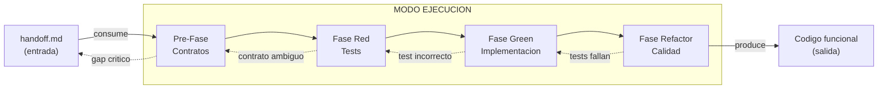

### Tabla de fases

| Fase | Entrada | Salida | Actores |
|------|---------|--------|---------|
| Pre-Fase: Contratos | `handoff.md` (spec, design, tasks) | Contratos formales (API, DB, interfaces) | Orquestador + Contract Architect |
| Red | Contratos + ACs de `spec.md` | Suite de tests (todos fallan) + cobertura configurada | Test Engineer |
| Green | Tests rojos + contratos | Codigo que pasa todos los tests | Implementor |
| Refactor | Codigo verde + tests | Codigo limpio, revisado, alineado a `design.md` | Reviewers (multiples) |

---

## Pre-Fase: Definicion de Contratos

### Por que Contract-First

El contrato es la fuente de verdad compartida entre todos los actores de
ejecucion. Antes de escribir una linea de test o de implementacion, el
equipo define la interfaz publica del sistema. Esto habilita **desarrollo
paralelo agil**:

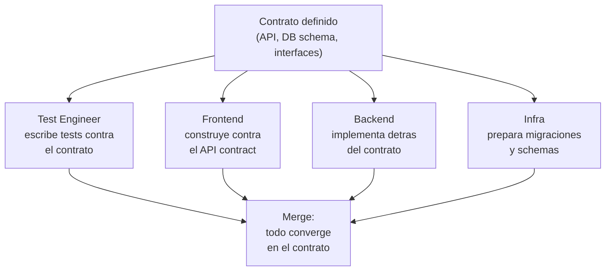

**Principio: Contract over Methodology.** El contrato importa mas que el
proceso. Como implementes detras del contrato es tu problema --- pero
DEBES cumplirlo. El contrato es el acuerdo verificable; la metodologia
es la ceremonia alrededor.

### Tipos de contrato

| Tipo | Formato | Cuando aplica | Ejemplo |
|------|---------|---------------|---------|
| API Contract | OpenAPI 3.x / AsyncAPI | Proyecto con endpoints HTTP o eventos | `POST /auth/login` con request/response schema |
| SDK / Library Interface | TypeScript interfaces, Rust traits | Librerias, modulos reutilizables | `interface AuthService { login(credentials): Token }` |
| Database Schema | SQL DDL + migraciones | Proyecto con persistencia | `CREATE TABLE users (...)` con constraints |
| Event Schema | JSON Schema / AsyncAPI | Sistemas event-driven | `UserCreatedEvent { id, email, timestamp }` |
| Component Interface | Props/inputs tipados | Frontend con componentes | `LoginFormProps { onSubmit, initialValues }` |
| Connector / Adapter Interface | Ports & adapters | Integraciones con terceros | `interface PaymentGateway { charge(amount): Receipt }` |

### Flujo de definicion de contratos

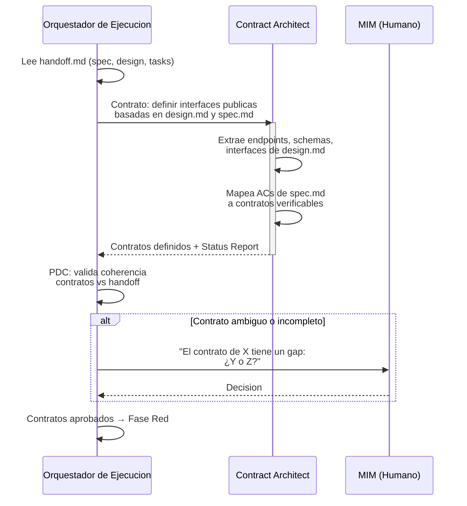

### Criterios de validacion del contrato

Un contrato esta listo cuando:

1. Cada AC de `spec.md` puede mapearse a al menos un contrato
2. Cada contrato tiene tipos definidos (request, response, error)
3. Los contratos son consistentes entre si (sin contradicciones)
4. Las dependencias entre contratos estan explicitas
5. El MIM aprobo los contratos que requieren decisiones de negocio

---

## Fase Red --- Estrategia y Suite de Pruebas

### Filosofia de testing

La piramide de testing clasica (muchos unit, pocos e2e) **NO aplica**
en este framework. La piramide esta invertida porque el objetivo es
verificar que el sistema FUNCIONA, no que las funciones individuales
retornan valores correctos.

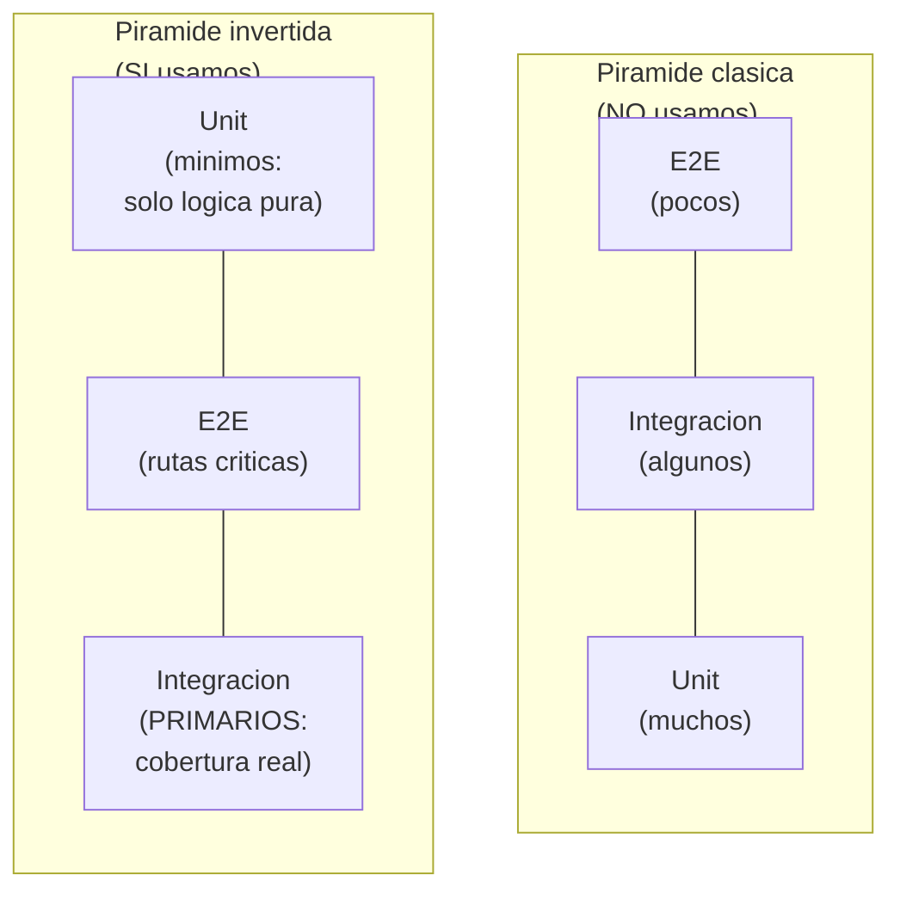

> **El meme del Titanic**: tests unitarios que pasan mientras el sistema
> se hunde son inservibles. Un test que no ejerce el stack real no
> demuestra nada.

### Jerarquia de tests

| Prioridad | Tipo | Caracteristicas | Cobertura esperada |
|-----------|------|-----------------|-------------------|
| **1 (primaria)** | Integracion | DBMS real (no mocks, no in-memory). Migraciones y seeders reales. Stack completo ejercitado. Detecta codigo muerto. | Alta (objetivo > 80%) |
| **2 (secundaria)** | E2E | Sin mocks internos (solo mock de terceros). Flujos de usuario completos. Valida contratos contra implementacion. | Rutas criticas cubiertas |
| **3 (minima)** | Unit | Solo para funciones puras con logica compleja (math, algoritmos, parsers). NO para glue code, CRUD, ni I/O. | Solo donde aplica |

### Reglas de la Fase Red

1. **Elegir herramientas** apropiadas para el stack definido en
   `design.md` (framework de testing, assertion library, coverage tool)
2. **Configurar cobertura** con collection operacional y thresholds
   definidos
3. **Disenar test plan** mapeado a:
   - ACs de `spec.md` (trazabilidad directa)
   - Decisiones de arquitectura de `design.md`
   - Work items de `tasks.md`
4. **Escribir la suite completa** --- todos los tests fallan porque no
   hay implementacion. Eso es RED.
5. La suite de tests ES la especificacion ejecutable del sistema

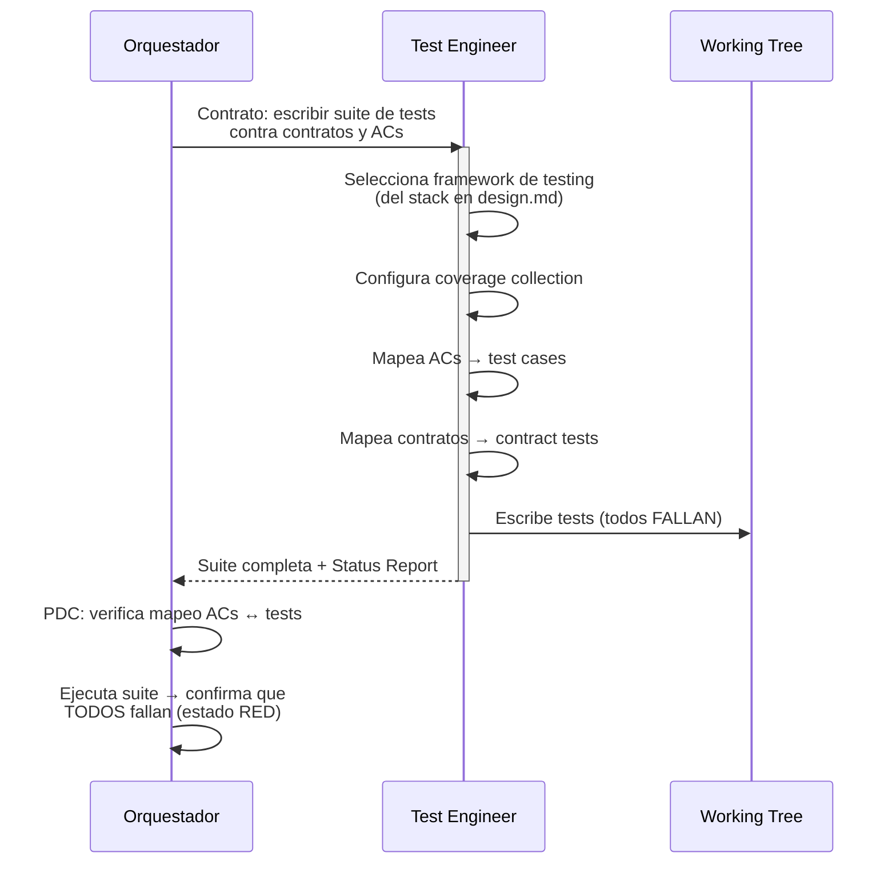

### Que significa "Red" operativamente

- Todos los tests existen y se ejecutan
- Todos los tests FALLAN (no hay implementacion)
- El coverage tool esta operativo y reportando
- Cada test traza a un AC o contrato especifico
- Si un test no puede escribirse, hay un gap en el contrato o el AC
  (escalar a Pre-Fase)

---

## Fase Green --- Implementacion

### Reglas de Green

La unica meta es hacer que los tests pasen. Nada mas.

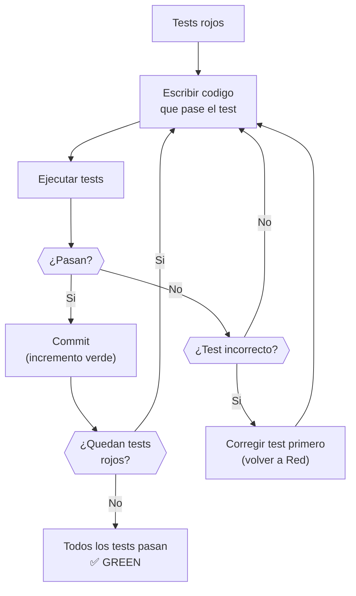

| Regla | Descripcion |
|-------|-------------|
| **Lo primero que funcione** | Codigo feo, duplicado, con magic numbers --- todo vale si los tests pasan |
| **Sin optimizacion prematura** | No abstraer, no generalizar, no "mejorar". Eso es la siguiente fase |
| **Cumplir contratos** | El codigo DEBE respetar los contratos definidos en la Pre-Fase |
| **Commits frecuentes** | Cada test que pasa = un posible commit. Incrementos verdes pequenos |
| **Test incorrecto → corregir test** | Si un test verifica algo equivocado, arreglarlo ANTES de implementar |

### Estrategia de commits

```plaintext
feat: implement login endpoint (passes auth-login-success test)
feat: implement login validation (passes auth-login-invalid-credentials test)
feat: implement token refresh (passes auth-token-refresh test)
```

Cada commit referencia que test(s) pasa. Esto crea trazabilidad entre
implementacion y especificacion ejecutable.

### Cuando corregir tests vs corregir codigo

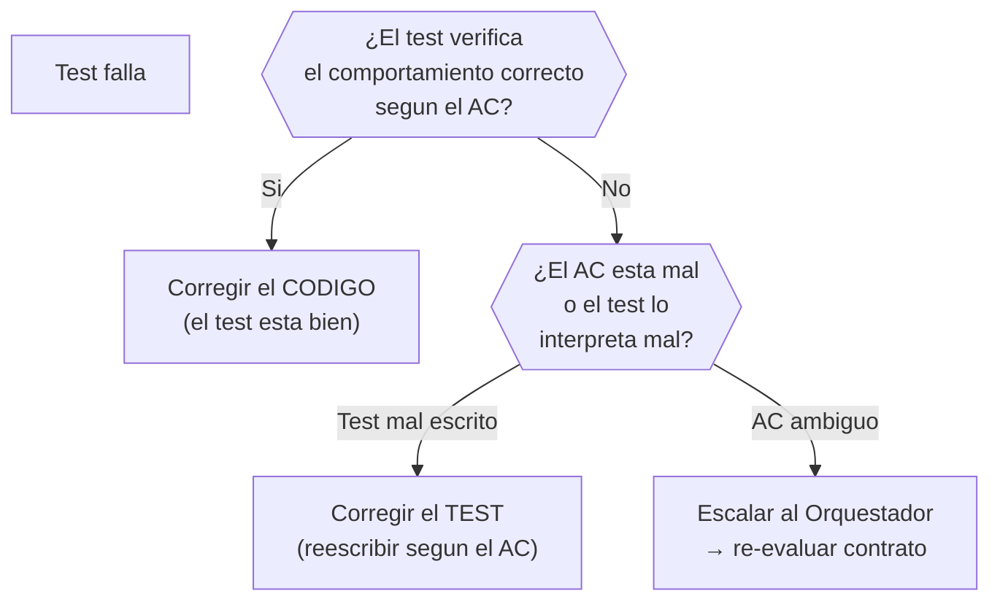

---

## Fase Refactor --- Gate de Calidad

### Principio

El codigo verde funciona pero puede ser feo. La Fase Refactor aplica
todas las disciplinas de calidad SIN romper tests. Si despues de un
refactor los tests fallan, el refactor introdujo una regresion y se
revierte.

### Dimensiones de revision

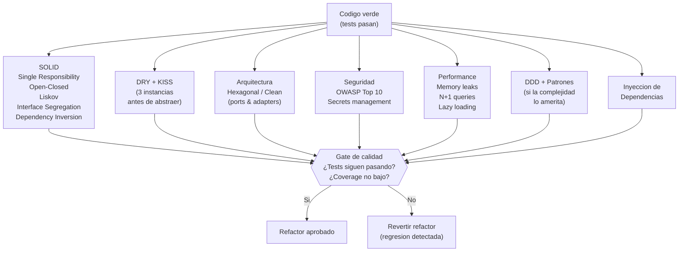

### Checklist de revision

| Dimension | Que se revisa | Criterio |
|-----------|---------------|----------|
| **SOLID** | Cada clase/modulo tiene una sola responsabilidad. Extensible sin modificar. Contratos respetados. | Violaciones documentadas con severidad |
| **DRY** | Duplicacion detectada. Regla de 3: no abstraer hasta tener 3 instancias del mismo patron. | Abstracciones prematuras son peor que duplicacion |
| **KISS** | Complejidad innecesaria. Sobre-ingenieria. Patrones aplicados sin justificacion. | Cada abstraccion debe resolver un problema real |
| **Arquitectura** | Alineacion con `design.md`. Ports & adapters. Capas respetadas. Dependencias en la direccion correcta. | Desviaciones documentadas con justificacion |
| **Seguridad** | OWASP Top 10. Secrets hardcodeados. SQL injection. XSS. CORS. Dependencias con CVEs. | Vulnerabilidades criticas bloquean aprobacion |
| **Performance** | Memory leaks. N+1 queries. Operaciones bloqueantes. Lazy loading donde aplica. | Problemas documentados con severidad |
| **DDD / Patrones** | Domain-Driven Design (si la complejidad lo amerita). Patrones aplicados donde resuelven un problema real, no por decoracion. | Solo donde la complejidad del dominio lo justifica |
| **DI** | Dependencias inyectadas, no hardcodeadas. Testeable. Reemplazable. | Dependencias directas a implementaciones concretas son violaciones |

### Reglas del refactor

1. **Tests DEBEN seguir pasando** despues de cada refactor --- si fallan,
   el refactor introdujo una regresion
2. **Coverage no debe bajar** --- el refactor no elimina tests ni reduce
   cobertura
3. **Alineacion con `design.md`** --- el refactor acerca el codigo a la
   arquitectura definida, no lo aleja
4. **Commit por refactor** --- cada refactor es un commit separado para
   facilitar reversion

---

## Ciclo Iterativo

### Red-Green-Refactor dentro de una iteracion

El ciclo macro (Contrato → Red → Green → Refactor) puede ejecutarse
multiples veces dentro de un proyecto:

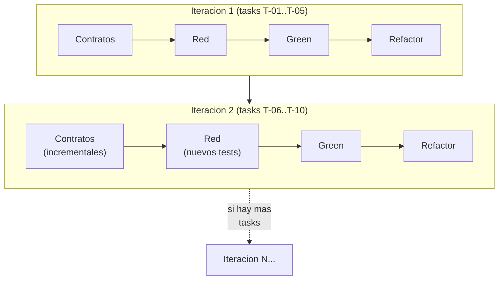

### Cuando re-entrar a Red

| Situacion | Accion |
|-----------|--------|
| Nuevos ACs descubiertos durante Green | Volver a Red: escribir tests para los nuevos ACs |
| Nuevo contrato necesario (integracion no prevista) | Volver a Pre-Fase: definir contrato, luego Red |
| Bug descubierto durante Refactor | Escribir test que reproduzca el bug (Red), corregir (Green) |
| Requisito cambiado por el MIM | Escalar a planificacion si es structural. Si es menor: actualizar contrato, Red, Green |

### Escalacion a Modo 1 (planificacion)

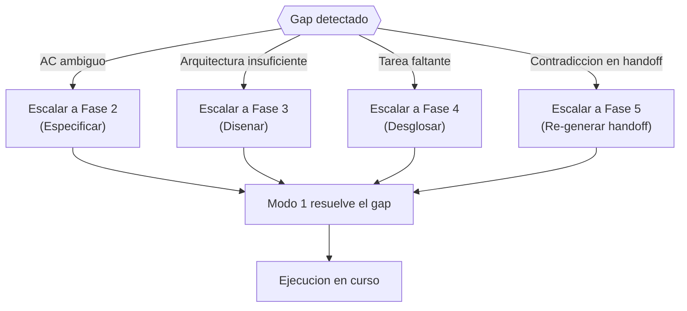

El Orquestador de Ejecucion NO resuelve gaps de planificacion --- los
escala. El Modo 1 tiene los roles y la ceremonia para resolverlos. El
Modo 2 opera con lo que recibe; si lo que recibe es insuficiente, lo
devuelve.

---

## Conexion con Modo 1

### Como el handoff alimenta la Pre-Fase

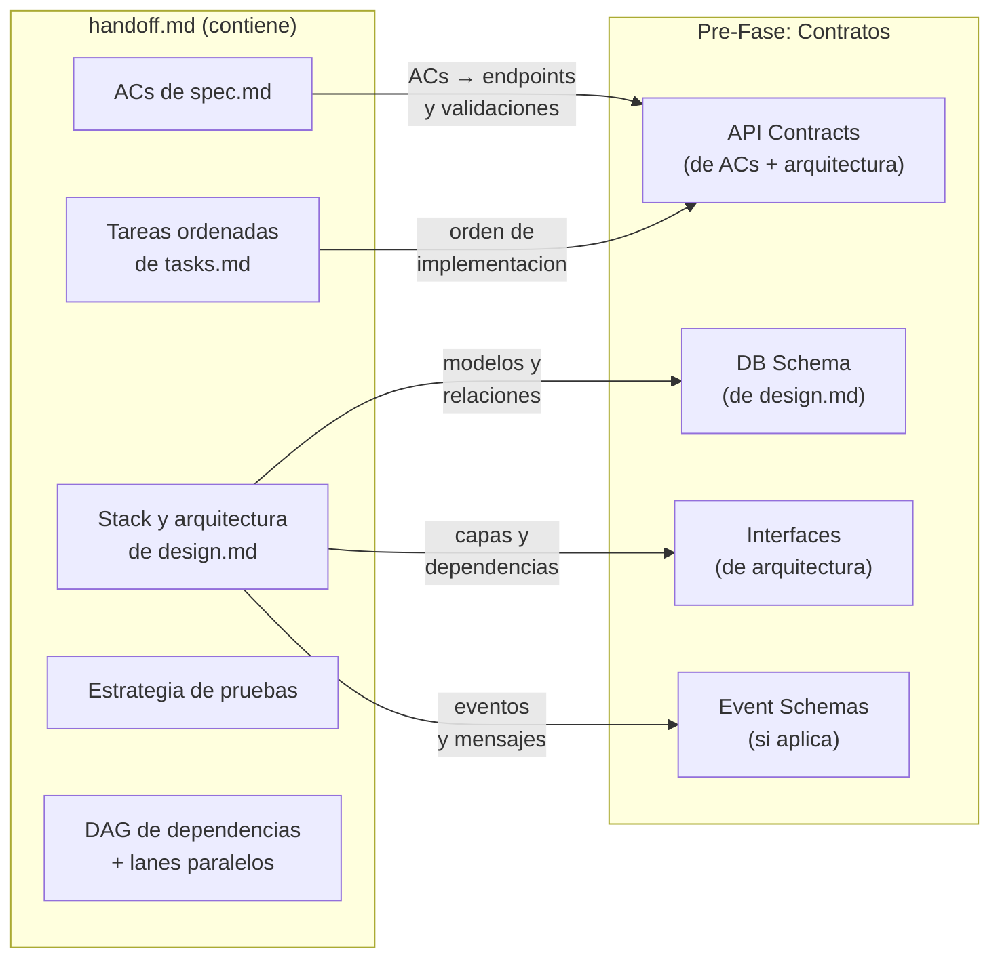

### Artefactos del Modo 1 que informan al Modo 2

| Artefacto Modo 1 | Como lo usa el Modo 2 |
|-------------------|----------------------|
| `spec.md` (ACs) | Cada AC se convierte en uno o mas tests. Trazabilidad directa. |
| `design.md` (arquitectura) | Define la estructura del codigo. El Refactor verifica alineacion. |
| `design.md` (ADRs) | Decisiones tecnicas que restringen la implementacion. |
| `tasks.md` (DAG) | Orden de ejecucion. Lanes paralelos. Ruta critica. |
| `tasks.md` (work items) | Cada L3/L4 es una unidad de trabajo en Green. |
| `handoff.md` | Contrato autocontenido. Punto de entrada del Modo 2. |

### Feedback loop: ejecucion → planificacion

| Evento en ejecucion | Feedback a planificacion |
|---------------------|-------------------------|
| AC no implementable como esta escrito | `spec.md` necesita reformulacion (Fase 2) |
| Arquitectura insuficiente para un AC | `design.md` necesita ADR adicional (Fase 3) |
| Tarea faltante descubierta | `tasks.md` necesita actualizacion (Fase 4) |
| Contradiccion entre ACs | `spec.md` tiene conflicto interno (Fase 2) |
| Dependencia externa no documentada | `design.md` necesita componente (Fase 3) |

---

## Roles del Modo de Ejecucion

### Tabla de roles

| Rol | Personalidad | Fase activa | Responsabilidad | Input | Output |
|-----|-------------|-------------|-----------------|-------|--------|
| **Orquestador de Ejecucion** | Metodico, orientado a flujo. Delega, no ejecuta. Analogo al SM en planificacion. | Todas | Lee handoff, coordina las 4 fases, delega a sub-agentes, valida resultados, gestiona commits. | `handoff.md` + AGENTS.md del repo | Codigo implementado en el working tree |
| **Contract Architect** | Preciso, orientado a interfaces. Piensa en consumidores del contrato. | Pre-Fase | Define contratos formales basados en la arquitectura y ACs. | `design.md` + `spec.md` (via handoff) | Contratos tipados (OpenAPI, schemas, interfaces) |
| **Test Engineer** | Esceptico, orientado a cobertura real. Prioriza integracion sobre unit. | Red | Escribe la suite completa de tests mapeada a ACs y contratos. | Contratos + ACs | Suite de tests (todos fallan) + coverage config |
| **Implementor** | Pragmatico, orientado a "que funcione". Sin perfeccionismo prematuro. | Green | Escribe codigo que pase los tests. Commits frecuentes. | Tests rojos + contratos | Codigo que pasa los tests |
| **Reviewer (Arquitectura)** | Critico, orientado a mantenibilidad. Compara contra design.md. | Refactor | Revisa alineacion arquitectonica, SOLID, DRY, KISS, patrones. | Codigo verde + design.md | Reporte de revision + sugerencias de refactor |
| **Reviewer (Seguridad)** | Paranoico constructivo. Busca vulnerabilidades. | Refactor | Revisa OWASP Top 10, secrets, dependencias, surface area. | Codigo verde + spec.md (no-funcionales) | Reporte de seguridad |
| **Reviewer (Performance)** | Analitico, orientado a metricas. Busca bottlenecks. | Refactor | Revisa memory leaks, N+1, operaciones bloqueantes. | Codigo verde | Reporte de performance |
| **MIM** | Humano. Decide, aprueba, desbloquea. | Todas (on-demand) | Aprueba contratos, resuelve ambiguedades, acepta resultado final. | Reportes del Orquestador | Decisiones y aprobaciones |

### Mapeo a roles de planificacion

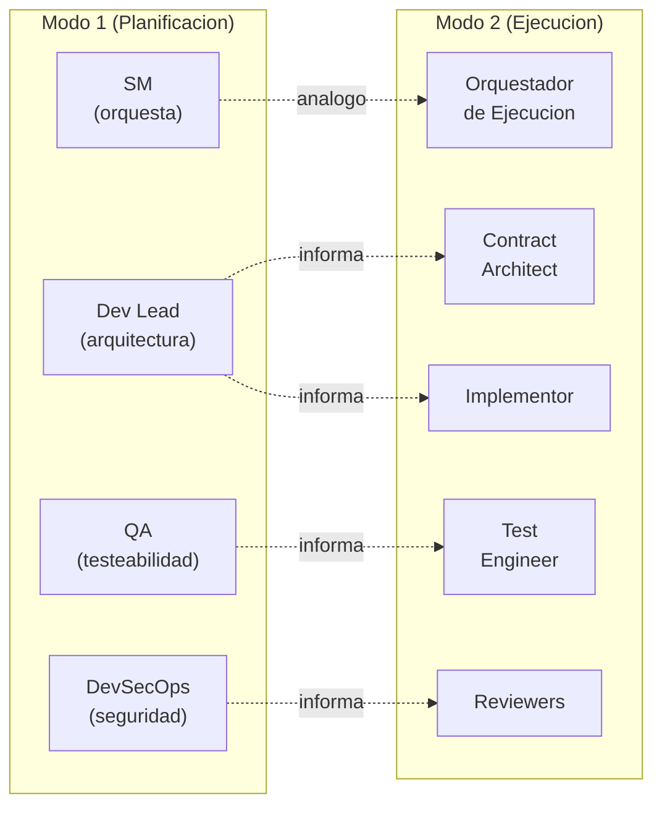

Los roles del Modo 2 NO son los mismos que los del Modo 1. En
planificacion, los roles son **lentes de revision** que evaluan
artefactos. En ejecucion, los roles son **ejecutores** que producen
codigo. La relacion es de **influencia** (las decisiones de planificacion
guian la ejecucion), no de identidad.

---

## Modelo de Delegacion del Orquestador

El Orquestador de Ejecucion sigue el mismo patron de delegacion
documentado en
[behavior-scrum-master-routing.md](behavior-scrum-master-routing.md):
contratos de delegacion con campos obligatorios, Status Report, y PDC
(Post-Delegation Checkpoint).

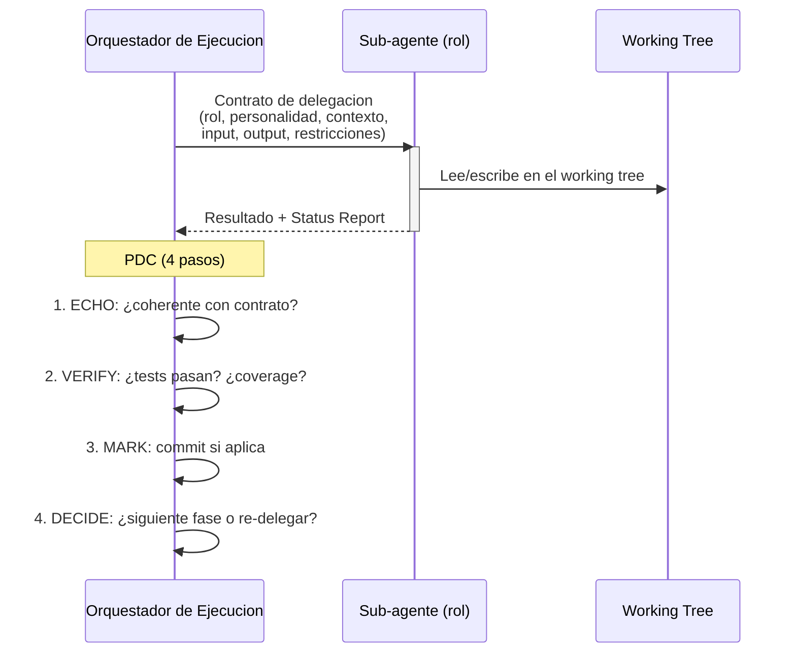

### Diferencias con el SM de planificacion

| Aspecto | SM (Modo 1) | Orquestador (Modo 2) |
|---------|-------------|---------------------|
| Donde escribe | Artifact store (fuera del repo) | Working tree del repo |
| Que produce | Artefactos de planificacion | Codigo, tests, commits |
| Roles que convoca | Scrum team (lentes) | Ejecutores (code writers) |
| Validacion | Gates de artefactos | Tests pasan + coverage |
| Escalacion | Al MIM | Al MIM o de vuelta a Modo 1 |

---

## Que Sigue

Areas dentro del Modo 2 que requieren definicion adicional:

| Area | Estado | Descripcion |
|------|--------|-------------|
| Contratos de delegacion detallados | TBD | Plantillas completas para cada rol del Modo 2 (como `role-profiles.md` en Modo 1) |
| Paralelismo en ejecucion | TBD | Como el Orquestador usa los lanes del DAG para ejecutar tareas en paralelo |
| Commit strategy | TBD | Convencion de commits durante Green y Refactor. Squash vs granular. |
| CI/CD integration | TBD | Como la suite Red se integra con pipelines de CI |
| Metricas de ejecucion | TBD | Coverage thresholds, tiempos de ciclo, tasa de re-delegacion |
| Modo 3 (Operacion) | TBD | Como el output del Modo 2 transiciona a operacion via `ops-runbook.md` |

---

## Indice de Documentos Relacionados

| Documento | Relacion con este |
|-----------|-------------------|
| [operational-model.md](operational-model.md) | Define los dos modos y sus limites |
| [artifact-model.md](artifact-model.md) | Define `handoff.md` (input de este modo) y los 6 artefactos |
| [behavior-scrum-master-routing.md](behavior-scrum-master-routing.md) | Patron de delegacion y PDC que el Orquestador adapta |
| [role-profiles.md](role-profiles.md) | Roles de planificacion que informan los roles de ejecucion |
| [high-level-overview.md](high-level-overview.md) | Mapa del framework completo |
