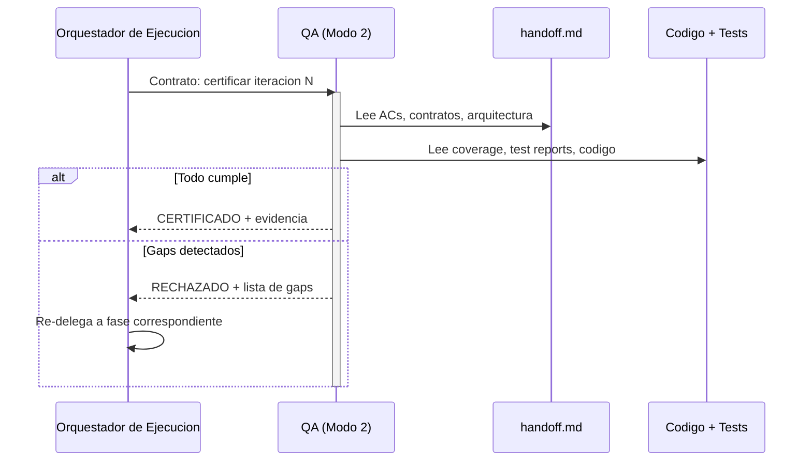

# Fase Accept — Certificación QA

← [Ejecución](README.md)

> La Fase Accept es el gate final antes de cerrar una iteración.
> QA verifica que el producto implementado cumple TODO lo que el
> handoff estipula — no solo que los tests pasen.

---

## Principio

QA no valida código — valida PRODUCTO contra CONTRATO (handoff). "Tests
pasan" es condición necesaria pero NO suficiente. QA certifica que:

- Cada AC del `spec.md` se cumple funcionalmente.
- Los contratos de la Pre-Fase se respetan.
- La cobertura no bajó respecto al baseline.
- El comportamiento de producto es el esperado (no solo el comportamiento
  de código).

---

## Qué verifica QA

| Dimensión | Fuente de verdad | Qué se verifica |
|-----------|-------------------|------------------|
| ACs funcionales | `spec.md` (via handoff) | Cada AC tiene test(s) que pasan Y el comportamiento observable es correcto |
| Contratos | Contratos de la Pre-Fase | APIs, schemas, interfaces respetan lo definido |
| Cobertura | Threshold del proyecto | No bajó. Código nuevo está cubierto. |
| Código droppable | Coverage report | Código con 0% cobertura identificado y reportado |
| Arquitectura | `design.md` (via handoff) | Refactor alineó la implementación con las decisiones arquitectónicas |
| Seguridad | Reportes de Reviewers | Vulnerabilidades críticas resueltas antes de certificar |

---

## Qué NO hace QA en esta fase

- No escribe tests (eso es Red).
- No corrige código (eso es Green/Refactor).
- No define contratos (eso es Pre-Fase).
- No resuelve gaps de planificación (escala a Modo 1).

---

## Mecanismo de certificación

> **Agnóstico por diseño**: El framework define QUÉ certifica QA, no CÓMO lo
> formaliza. El consumidor del framework elige el mecanismo apropiado para
> su contexto:
>
> - Tag firmado en git (`qa/approved/iter-1`)
> - Trailer en commit de merge (`Certified-By: QA`)
> - Gate en pipeline de CI/CD
> - Artefacto en el artifact store (reporte de aceptación)
> - Aprobación en herramienta de gestión (Jira, Linear, etc.)
>
> Lo que el framework EXIGE es que la certificación sea **formal, trazable
> y auditable** — no un "sí, se ve bien" informal.

---

## Flujo de la fase

---

## Resultado

| Resultado | Siguiente acción |
|-----------|-------------------|
| CERTIFICADO | Orquestador cierra iteración (merge → develop) |
| RECHAZADO — gap de implementación | Re-delegar a Green |
| RECHAZADO — gap de calidad | Re-delegar a Refactor |
| RECHAZADO — gap de tests | Re-delegar a Red |
| RECHAZADO — gap de contrato | Re-delegar a Pre-Fase |
| RECHAZADO — gap de planificación | Escalar a Modo 1 |
