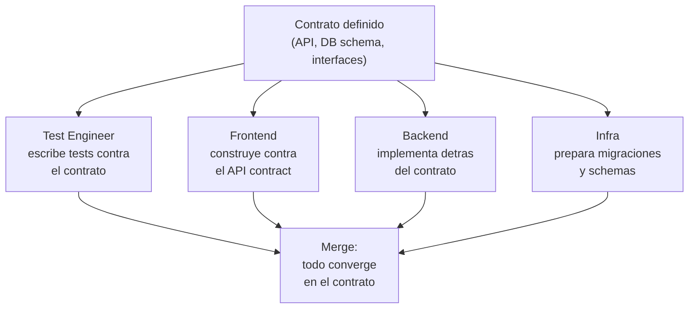
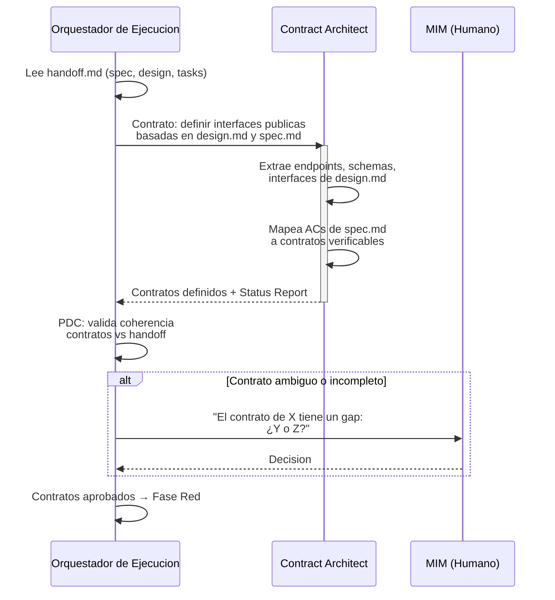

# Pre-Fase: Definición de Contratos

← [Ejecución](README.md)

## Por que Contract-First

El contrato es la fuente de verdad compartida entre todos los actores de
ejecucion. Antes de escribir una linea de test o de implementacion, el
equipo define la interfaz publica del sistema. Esto habilita **desarrollo
paralelo agil**:

**Principio: Contract over Methodology.** El contrato importa mas que el
proceso. Como implementes detras del contrato es tu problema --- pero
DEBES cumplirlo. El contrato es el acuerdo verificable; la metodologia
es la ceremonia alrededor.

---

## Tipos de contrato

| Tipo | Formato | Cuando aplica | Ejemplo |
|------|---------|----------------|---------|
| API Contract | OpenAPI 3.x / AsyncAPI | Proyecto con endpoints HTTP o eventos | `POST /auth/login` con request/response schema |
| SDK / Library Interface | TypeScript interfaces, Rust traits | Librerias, modulos reutilizables | `interface AuthService { login(credentials): Token }` |
| Database Schema | SQL DDL + migraciones | Proyecto con persistencia | `CREATE TABLE users (...)` con constraints |
| Event Schema | JSON Schema / AsyncAPI | Sistemas event-driven | `UserCreatedEvent { id, email, timestamp }` |
| Component Interface | Props/inputs tipados | Frontend con componentes | `LoginFormProps { onSubmit, initialValues }` |
| Connector / Adapter Interface | Ports & adapters | Integraciones con terceros | `interface PaymentGateway { charge(amount): Receipt }` |

---

## Flujo de definicion de contratos

---

## Criterios de validacion del contrato

Un contrato esta listo cuando:

1. Cada AC de `spec.md` puede mapearse a al menos un contrato
2. Cada contrato tiene tipos definidos (request, response, error)
3. Los contratos son consistentes entre si (sin contradicciones)
4. Las dependencias entre contratos estan explicitas
5. El MIM aprobo los contratos que requieren decisiones de negocio
