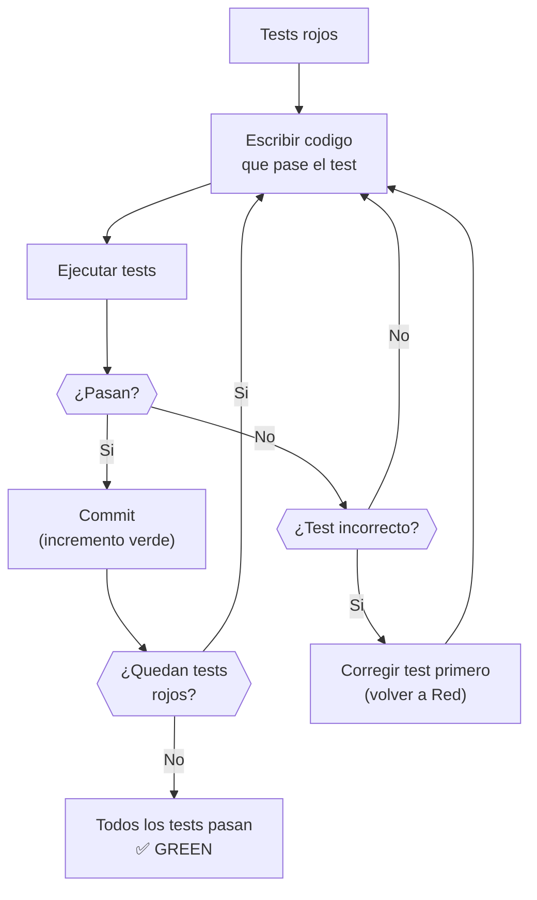
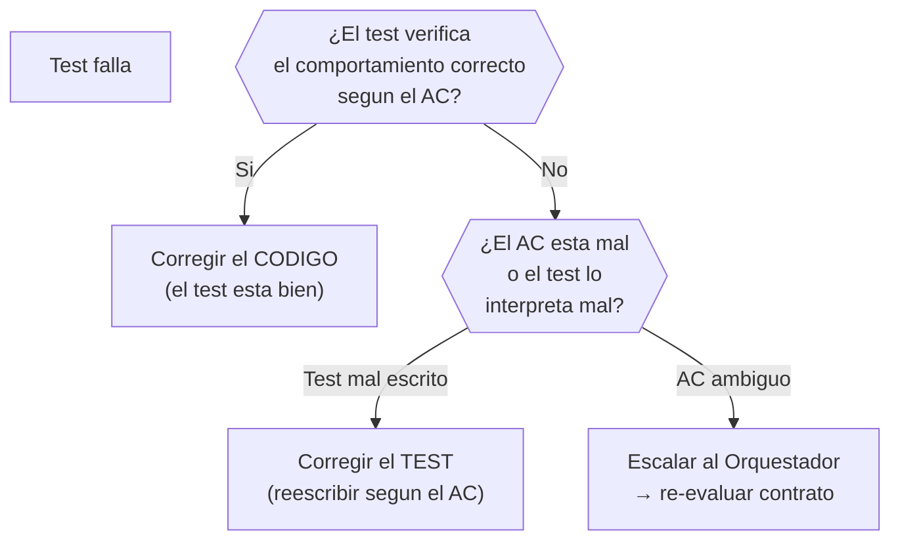

# Fase Green — Implementación

← [Ejecución](README.md)

## Reglas de Green

La unica meta es hacer que los tests pasen. Nada mas.



| Regla | Descripcion |
|-------|-------------|
| **Lo primero que funcione** | Codigo feo, duplicado, con magic numbers --- todo vale si los tests pasan |
| **Sin optimizacion prematura** | No abstraer, no generalizar, no "mejorar". Eso es la siguiente fase |
| **Cumplir contratos** | El codigo DEBE respetar los contratos definidos en la Pre-Fase |
| **Commits frecuentes** | Cada test que pasa = un posible commit. Incrementos verdes pequenos |
| **Test incorrecto → corregir test** | Si un test verifica algo equivocado, arreglarlo ANTES de implementar |

---

## Estrategia de commits

```plaintext
feat: implement login endpoint (passes auth-login-success test)
feat: implement login validation (passes auth-login-invalid-credentials test)
feat: implement token refresh (passes auth-token-refresh test)
```

Cada commit referencia que test(s) pasa. Esto crea trazabilidad entre
implementacion y especificacion ejecutable.

---

## Cuando corregir tests vs corregir codigo


