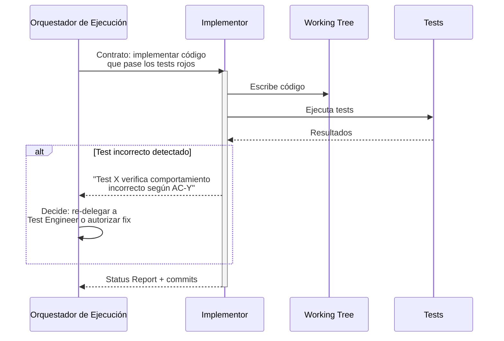
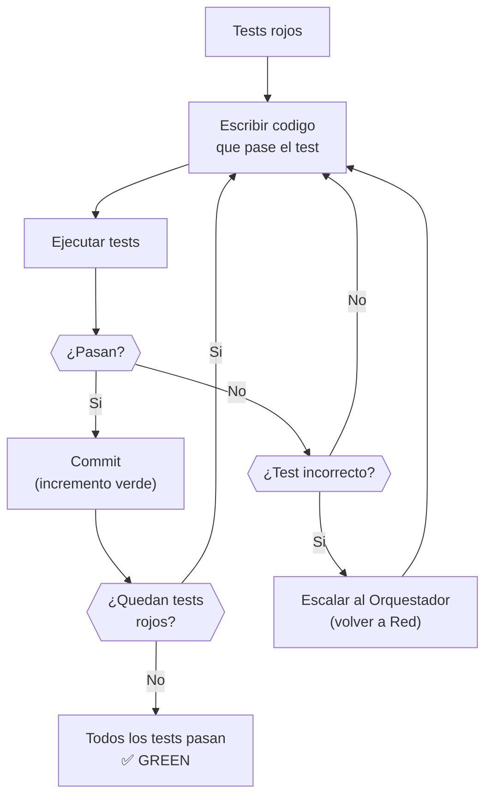
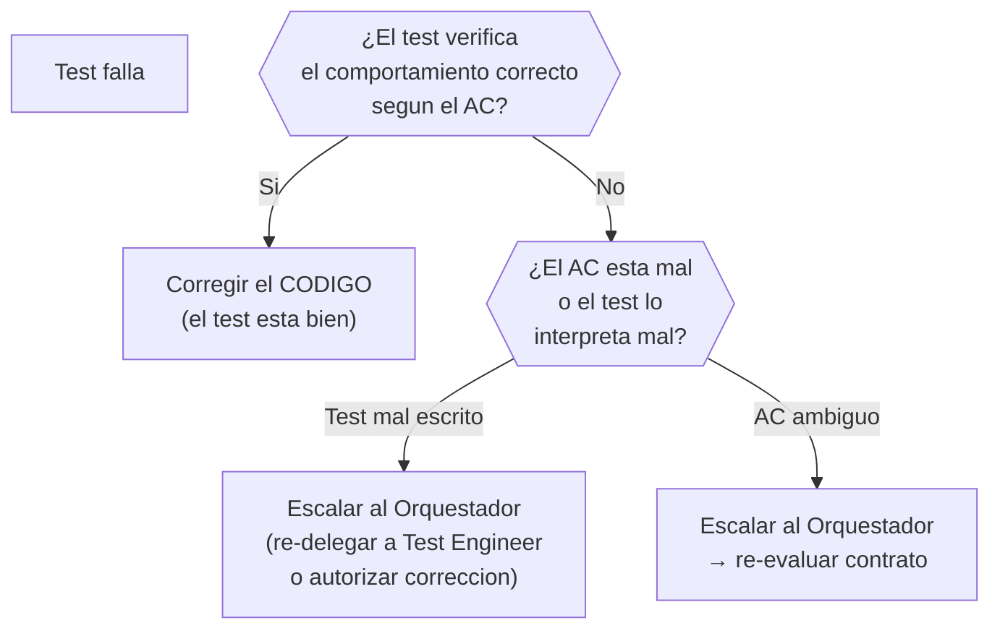

# Fase Green — Implementación

← [Índice principal](../README.md) | [Ejecución](README.md)



> **Input de Red**: El Implementor recibe la Capa 3 (Test Implementation)
> como entrada directa — los tests ejecutables que debe hacer pasar. Las
> Capas 1 (Test Plan) y 2 (Test Contract) proporcionan trazabilidad pero no
> son input operativo de Green.

## Reglas de Green

La unica meta es hacer que los tests pasen. Nada mas.



| Regla | Descripcion |
|-------|-------------|
| **Lo primero que funcione** | Codigo feo, duplicado, con magic numbers --- todo vale si los tests pasan |
| **Sin optimizacion prematura** | No abstraer, no generalizar, no "mejorar". Eso es la siguiente fase |
| **Cumplir contratos** | El codigo DEBE respetar los contratos definidos en la Pre-Fase |
| **Commits frecuentes** | Cada test que pasa = un posible commit. Incrementos verdes pequenos |
| **Test incorrecto → corregir test** | Si un test verifica algo equivocado, arreglarlo ANTES de implementar |

> **Excepción: TDD micro para complejidad algorítmica**: Para tareas de
> alta complejidad algorítmica (algoritmos, parsers, cálculos financieros),
> el Implementor puede usar TDD micro (test-implement-test por función)
> como herramienta complementaria dentro de Green. Esta excepción no
> aplica a código de aplicación estándar (CRUD, endpoints, flujos de UI).

---

## Estrategia de commits

```plaintext
feat: implement login endpoint (passes auth-login-success test)
feat: implement login validation (passes auth-login-invalid-credentials test)
feat: implement token refresh (passes auth-token-refresh test)
```

Cada commit referencia que test(s) pasa. Esto crea trazabilidad entre
implementacion y especificacion ejecutable.

---

## Cuando corregir tests vs corregir codigo



> **Separación de responsabilidades**: El Implementor NO corrige tests directamente. Si sospecha
> que un test es incorrecto, escala al Orquestador con evidencia (qué test, qué AC contradice,
> por qué). El Orquestador decide si re-delega al Test Engineer o autoriza la corrección in situ.
