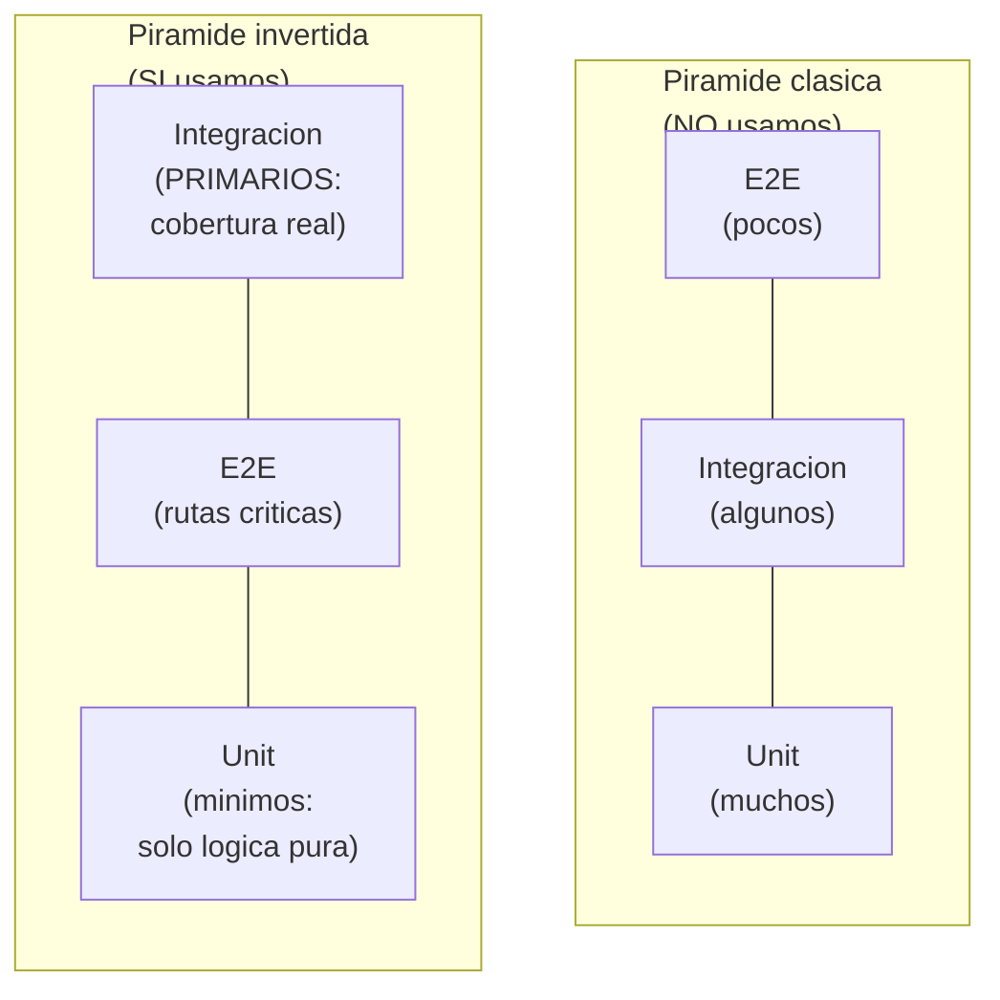
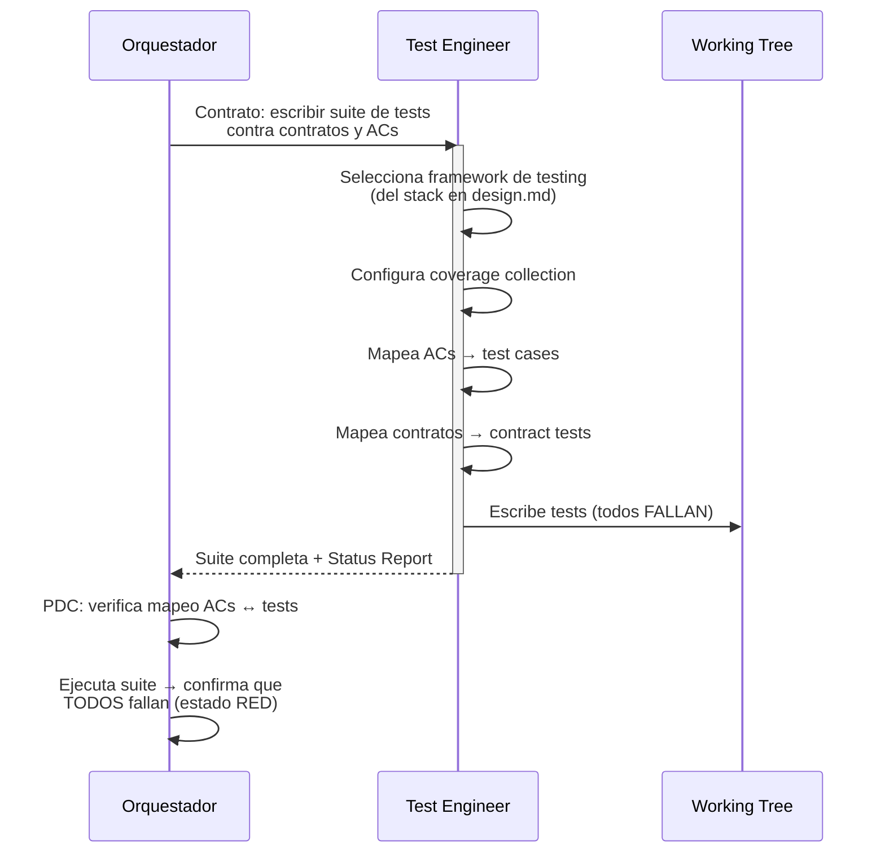

# Fase Red — Estrategia y Suite de Pruebas

← [Ejecución](README.md)

## Filosofia de testing

La piramide de testing clasica (muchos unit, pocos e2e) **NO aplica**
en este framework. La piramide esta invertida porque el objetivo es
verificar que el sistema FUNCIONA, no que las funciones individuales
retornan valores correctos.

> **El meme del Titanic**: tests unitarios que pasan mientras el sistema
> se hunde son inservibles. Un test que no ejerce el stack real no
> demuestra nada.
>
> **Matización por contexto**: la pirámide invertida (integración mayor
> que E2E, E2E mayor que unit) es el DEFAULT para proyectos de
> aplicación (APIs, web apps, servicios). Para librerías, utilidades y
> lógica de dominio compleja (algoritmos, parsers, cálculos financieros),
> la pirámide clásica sigue siendo apropiada — estos contextos se
> benefician de cobertura unitaria extensiva. El Test Engineer decide la
> proporción adecuada según el contexto, documentando la justificación
> en la estrategia de testing.

---

## Jerarquia de tests

| Prioridad | Tipo | Caracteristicas | Cobertura esperada |
|-----------|------|-------------------|----------------------|
| **1 (primaria)** | Integracion | DBMS real (no mocks, no in-memory). Migraciones y seeders reales. Stack completo ejercitado. Detecta codigo muerto. | Alta (objetivo > 80%) |
| **2 (secundaria)** | E2E | Sin mocks internos (solo mock de terceros). Flujos de usuario completos. Valida contratos contra implementacion. | Rutas criticas cubiertas |
| **3 (minima)** | Unit | Solo para funciones puras con logica compleja (math, algoritmos, parsers). NO para glue code, CRUD, ni I/O. | Solo donde aplica |

---

## Herramientas y configuracion de cobertura

### Reglas de la Fase Red

1. **Elegir herramientas** apropiadas para el stack definido en
   `design.md` (framework de testing, assertion library, coverage tool)
2. **Configurar cobertura** con collection operacional y thresholds
   definidos
3. **Disenar test plan** mapeado a:
   - ACs de `spec.md` (trazabilidad directa)
   - Decisiones de arquitectura de `design.md`
   - Work items de `tasks.md`
4. **Escribir la suite completa** --- todos los tests fallan porque no
   hay implementacion. Eso es RED.
5. La suite de tests ES la especificacion ejecutable del sistema

---

## Que significa "Red" operativamente

- Todos los tests existen y se ejecutan
- Todos los tests FALLAN (no hay implementacion)
- El coverage tool esta operativo y reportando
- Cada test traza a un AC o contrato especifico
- Si un test no puede escribirse, hay un gap en el contrato o el AC
  (escalar a Pre-Fase)
