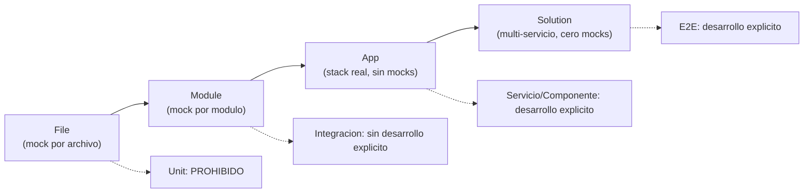
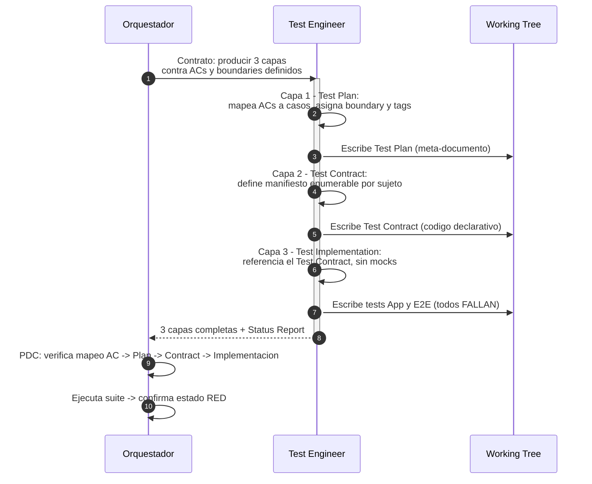
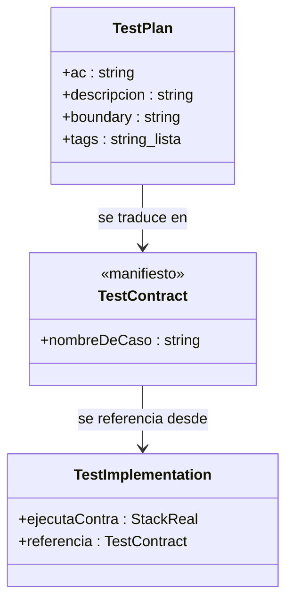
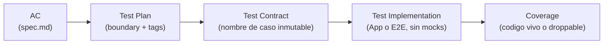
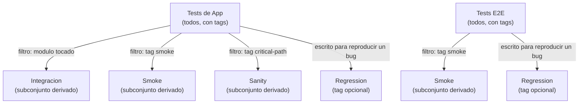
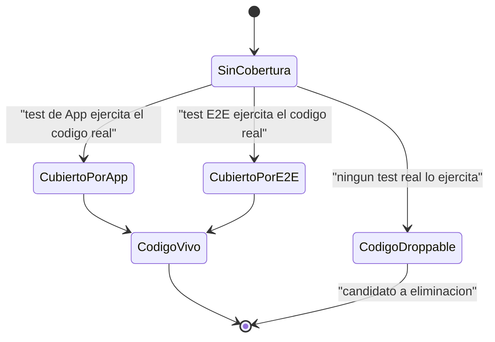
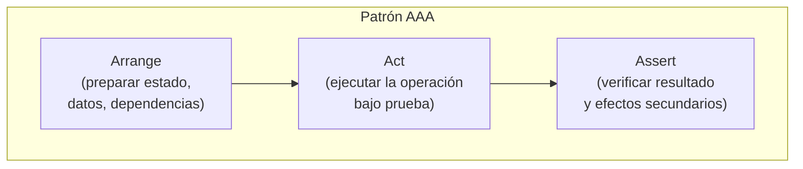
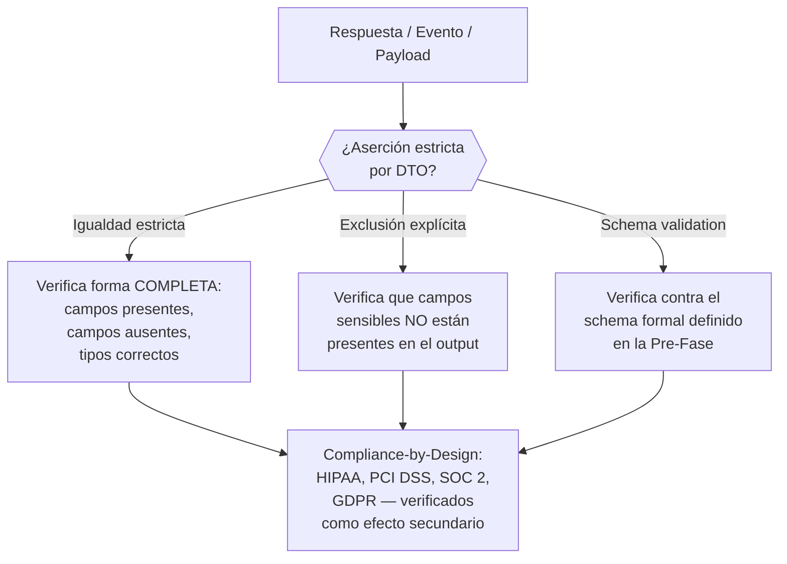

# Fase Red — Arquitectura de Testing

← [Ejecución](README.md)

Este documento define el modelo de testing de la Fase Red: qué tipos de test
existen, quién los escribe explícitamente, quién los deriva por filtrado, y
cómo se traza cada test hasta un AC de `spec.md`. El modelo es agnóstico de
lenguaje, framework y herramienta — define el QUÉ, no el CÓMO. El stack
concreto lo decide `design.md` en la planificación.

---

## Filosofía: Testing de Alto Valor

El criterio que determina el tipo de un test no es la pirámide clásica ni
su inversión — es **dónde se ubica la frontera del mock** (el "boundary").
Cuanto más cerca del stack real se ejecuta un test, mayor es su valor de
verificación; cuanto más aislado está mediante mocks, más redundante se
vuelve frente a un test de nivel superior con buena cobertura.

De este criterio se deriva una consecuencia estructural: **solo existen dos
tiers de testing con desarrollo explícito**. Todo lo demás — integración,
smoke, regresión, sanity — se obtiene por filtrado inteligente sobre esos
dos tiers, no por escritura de suites adicionales.

> **Testing de Alto Valor**: un test solo se escribe si ejercita una
> interacción real del producto (base de datos real, HTTP real, contenedor
> de inyección de dependencias real). Un test que solo verifica que una
> función retorna un valor, aislada del sistema mediante mocks, no aporta
> señal adicional cuando el nivel de App ya tiene cobertura alta — es
> mantenimiento sin retorno.

---

## Modelo de Boundaries

| Boundary | Tipo | Política |
|----------|------|----------|
| File | Unit | **PROHIBIDO** — valor cero, redundante cuando los tests de App tienen cobertura alta |
| Module | Integración | **Sin desarrollo explícito** — se deriva por filtros desde los tests de App cuando se toca un módulo |
| App (stack real, sin mocks) | Servicio/Componente | **DESARROLLO EXPLÍCITO** — tier primario, cobertura alta obligatoria, interacciones reales con el producto, detección de código droppable |
| Solution (multi-servicio, cero mocks) | E2E | **DESARROLLO EXPLÍCITO** — para deploys, tags, merges a main/develop |
| Cualquiera | Performance/stress/load | **TBD** — post-MVP, delegado como historias al propio framework |
| Cualquiera | Regression/smoke/sanity | **Sin desarrollo explícito** — se deriva por tags/nomenclatura desde los tests de App + E2E existentes |



A medida que el boundary se aleja del archivo aislado y se acerca a la
solución completa, el mock desaparece y la señal de verificación aumenta.
Los dos boundaries intermedios (File, Module) no requieren suite propia:
File está prohibido, Module se deriva del boundary App.

---

## Política de Testing

### Desarrollo explícito (los únicos 2 tiers escritos)

- **Tests de App** — boundary App, stack real completo, cobertura alta
  obligatoria. Tier primario.
- **Tests E2E** — boundary Solution, multi-servicio, cero mocks. Se
  ejecutan en deploys, tags y merges a `main`/`develop`.

### Prohibido

- **Tests de Unit** (boundary File) — no se escriben bajo ninguna
  circunstancia en este framework. Si un test necesita mockear el propio
  archivo bajo prueba para pasar, esa es la señal de que el test no
  pertenece a este modelo.

### Sin desarrollo explícito (derivado por filtrado)

- **Integración** (boundary Module) — un hook de repositorio detecta el
  módulo tocado y ejecuta el subconjunto de tests de App que lo cubren.
  Mismos tests, filtro distinto.
- **Regression / Smoke / Sanity** — subconjuntos de los tests de App y
  E2E existentes, seleccionados por tag o nomenclatura. Ver
  [Tests Derivados y Pipeline Placement](#tests-derivados-y-pipeline-placement).

### TBD (post-MVP)

- **Performance / Stress / Load** — no definido en el alcance del MVP.
  Se delega como historias de trabajo al propio framework en una
  iteración futura.

---

## Arquitectura de la Fase Red — 3 Capas

El Test Engineer no escribe "una suite de tests" — produce tres capas
encadenadas, cada una agnóstica de herramienta. Solo la Capa 3 es código
ejecutable; las Capas 1 y 2 son artefactos de trazabilidad.



### Capa 1: Test Plan

Meta-documento, no código. Responde "qué se va a probar":

- Mapea cada AC de `spec.md` a uno o más casos de test.
- Asigna a cada caso un boundary (App o E2E — los únicos dos válidos
  para desarrollo explícito).
- Asigna tags de filtrado (`smoke`, `critical-path`, `regression`) que
  luego alimentan la derivación de tests en el pipeline.
- Identifica matrices de test cuando aplica (combinaciones, casos límite).

### Capa 2: Test Contract

Código, pero declarativo — no contiene lógica de test, solo la
enumera. Un manifiesto por sujeto bajo prueba, donde cada entrada es un
caso con nombre inmutable, legible por humanos y ligado a un AC.

> El framework define el CONCEPTO, no la implementación. En
> nest-base/fullstack-base este concepto se materializó como clases con
> propiedades `static readonly`, pero cualquier mecanismo del lenguaje
> consumidor que produzca un manifiesto enumerable, inmutable y
> referenciable cumple el contrato.



El Test Contract es el puente entre el Test Plan y la implementación.
Su propósito es doble: impide que un agente de IA escriba nombres de test
como strings sueltos y dispersos (spaghetti de test naming), y habilita
trazabilidad por IDE — el sujeto de prueba y su superficie de casos son
visibles de un vistazo.

### Capa 3: Test Implementation

Tests ejecutables que referencian el Test Contract — nunca strings
inline para el nombre de un caso.

- **Tests de App**: interacciones reales contra el stack (base de datos
  real, HTTP real, contenedor de inyección de dependencias real). Cero
  mocks del propio producto.
- **Tests E2E**: contra la solución desplegada, multi-servicio.
- **Coverage como verdad**: umbral alto, jamás se reduce. Código sin
  cobertura es candidato droppable (ver
  [Código Droppable](#código-droppable)).

---

## Trazabilidad: AC → Test Plan → Test Contract → Implementación → Coverage



Cada eslabón de la cadena es verificable de forma independiente: dado un
AC, se puede encontrar su entrada en el Test Plan; dada esa entrada, su
caso en el Test Contract; dado ese caso, su implementación; dada esa
implementación, el archivo de producción que cubre y su porcentaje de
cobertura.

```text
AC-01 (spec.md)
  → Test Plan: caso "login exitoso", boundary: App, tags: [smoke, critical]
    → Test Contract: AuthTestCase.loginSuccess = "Should authenticate..."
      → it(AuthTestCase.loginSuccess, ...) → real HTTP + real DB
        → Coverage: src/auth/login.service.ts → 95% (codigo vivo)
        → Coverage: src/auth/legacy-adapter.ts → 0% (droppable)
```

> Ejemplo ilustrativo, no prescriptivo. La sintaxis concreta (`it(...)`,
> el nombre de la clase de contrato, la ruta de archivo) depende del
> stack que defina `design.md`. Lo que el framework exige es que la
> cadena sea reconstruible en ambas direcciones: de AC a línea de
> cobertura, y de línea de cobertura de vuelta a AC.

Si un AC no puede completar la cadena — no hay caso de Test Plan que lo
cubra, o el Test Contract no tiene entrada, o la implementación no
referencia el contrato — hay un gap que se escala a la Pre-Fase.

---

## Tests Derivados y Pipeline Placement

Ningún tipo de test fuera de App y E2E se escribe. Todos se obtienen
filtrando esos dos conjuntos por módulo tocado, por tag o por ubicación
en el pipeline.

| Necesidad | Cómo se resuelve |
|-----------|-------------------|
| "Tests unitarios" | No existen. Los tests de App con cobertura alta los vuelven redundantes. |
| "Tests de integración" | Un hook de git detecta el módulo tocado → ejecuta el subconjunto de tests de App de ese módulo. Mismos tests, filtro distinto. |
| "Smoke tests" | E2E seleccionados por tag. Post-deploy: "¿desplegó correctamente?" |
| "Regresión" | Todo test de App/E2E escrito para reproducir un bug ES regresión. Tag opcional. |
| "Sanity" | Subconjunto mínimo de tests de App (ruta crítica), seleccionable por tag. |
| "Performance/stress/load" | TBD post-MVP — historias dedicadas. |



### Ubicación en el pipeline

| Qué corre | Cuándo | Propósito |
|-----------|--------|-----------|
| Tests de App (solo módulo tocado) | Pre-commit / pre-push | Feedback rápido sobre lo que cambió |
| Tests de App (todos los módulos afectados) | CI (en PR) | Confianza completa antes del merge |
| Tests E2E | Deploys, tags, merges a develop/main | Confianza a nivel de solución completa |
| Subconjunto E2E (tag smoke) | Post-deploy a un ambiente | "¿Desplegó correctamente?" |

---

## Código Droppable

La cobertura no es una métrica de vanidad — es una HERRAMIENTA para
identificar código muerto.



- El umbral de cobertura es obligatorio y **nunca puede bajarse**.
- Código que ningún test de App ejercita mediante interacciones reales
  del producto no tiene justificación para existir.
- El framework llama a esto **código droppable**: código que puede
  eliminarse con seguridad porque ninguna prueba de alto valor lo toca.
- El concepto de **colección selectiva de cobertura** (medir solo
  archivos con lógica real, excluir boilerplate y configuración) aplica
  de forma universal, pero el consumidor del framework define qué
  archivos entran en esa colección según su propio stack.

---

## Herramientas y Configuración

Este documento define REQUISITOS, no herramientas. El stack de testing
concreto (framework de test, librería de aserciones, herramienta de
cobertura) lo define `design.md` en la planificación. La Fase Red exige
que ese stack cumpla las siguientes capacidades, sin importar cuál sea:

### Requisitos del test runner

- Debe permitir ejecutar tests contra un stack real (base de datos real,
  servidor HTTP real, contenedor de DI real) sin sustituir esas piezas
  por dobles de prueba.
- Debe soportar mocking limitado a dependencias de terceros dentro de
  tests E2E — nunca mocking del propio producto.
- Debe soportar un mecanismo de tags o nomenclatura que permita
  seleccionar subconjuntos de la suite (para derivar integración, smoke,
  sanity y regresión sin escribir suites nuevas).
- Debe poder ejecutarse tanto de forma acotada (módulo específico, para
  pre-commit/pre-push) como completa (toda la suite, para CI).

### Requisitos de la herramienta de cobertura

- Debe reportar cobertura por archivo y de forma agregada.
- Debe poder configurarse con un umbral mínimo que falle el build si no
  se alcanza.
- Debe soportar inclusión/exclusión selectiva de archivos (el concepto
  de `collectCoverageFrom`), para que la detección de código droppable
  mida solo lógica real y no boilerplate o configuración.
- El umbral configurado es el que la Fase Refactor usa como gate — no se
  negocia a la baja en ninguna fase posterior.

---

## Disciplina de Código de Test

Los patrones de esta sección aplican a TODA prueba escrita en la Capa 3,
sin importar el boundary (App o E2E). Definen la calidad interna del
código de test — no qué se prueba, sino cómo se escribe cada test. Son
agnósticos de lenguaje y herramienta.

### Patrones estructurales

Cada test sigue una estructura predecible que separa preparación,
ejecución y verificación:

| Patrón | Aplica a | Regla |
|--------|----------|-------|
| **AAA** (Arrange-Act-Assert) | Todos los tests | Tres bloques separados, sin mezclar. Arrange prepara estado y datos. Act ejecuta la operación bajo prueba. Assert verifica el resultado. Si un test necesita más de un Act, son dos tests. |
| **POM** (Page Object Model) | Tests con interfaz (UI, CLI) | Abstraer las interacciones con la interfaz en objetos reutilizables. El test describe intención ("login con credenciales válidas"), el POM ejecuta mecánica ("llenar campo X, click botón Y"). |
| **Builder Pattern** | Datos de test | Construir datos de prueba mediante builders o factories, nunca hardcodeados en el cuerpo del test. Un builder centraliza la creación y permite variar solo lo relevante al caso. |
| **Un assert lógico** | Todos los tests | Cada test verifica UNA cosa. Múltiples aserciones están permitidas solo si verifican facetas del mismo resultado lógico (ej. status code + body de la misma respuesta). |



### Higiene de mocks

Dentro del boundary model, los tests de App no usan mocks del propio
producto (stack real). Los tests E2E solo mockean dependencias de
terceros. Esta sección define las reglas para esos mocks permitidos:

| Regla | Qué previene |
|-------|-------------|
| **Verificación obligatoria** | Todo mock se verifica: ¿fue llamado? ¿Cuántas veces? ¿Con qué argumentos exactos? Un mock sin verificación es un mock invisible — oculta fallos en lugar de detectarlos. |
| **Reset entre tests** | Cada test arranca con mocks limpios. Sin estado residual de tests anteriores. Un mock que acumula llamadas entre tests produce falsos positivos. |
| **Verificación negativa** | Los mocks que NO deben llamarse se verifican explícitamente (ej. "el servicio de pago NO fue invocado cuando el usuario canceló"). La ausencia de llamada es tan importante como la presencia. |
| **Argumentos exactos** | No verificar solo que "fue llamado" — verificar CON QUÉ fue llamado. Un mock que se llamó con los argumentos incorrectos es peor que un mock que no se llamó. |

### Aserciones estrictas por DTO (Schema-Strict Assertions)

Esta es la regla más importante de la disciplina de test del framework.
Tiene implicaciones directas en compliance regulatorio.

> **Compliance-by-Design**: si cada test asierte la forma EXACTA del
> objeto de respuesta (no solo "contiene estos campos" sino "contiene
> SOLO estos campos"), se obtiene verificación de compliance como efecto
> secundario — sin suites de compliance separadas, sin rewrites, sin
> trabajo adicional.

**La regla**: toda aserción sobre un objeto de respuesta, un evento
emitido, un payload enviado a terceros o un registro persistido debe
verificar la **forma completa** del DTO — campos presentes, campos
ausentes y tipos.

| Tipo de aserción | Uso | Ejemplo conceptual |
|------------------|-----|--------------------|
| **Igualdad estricta** (todo el DTO) | Response bodies, eventos, payloads | "La respuesta es EXACTAMENTE `{id, name, email}` — ni más ni menos" |
| **Exclusión explícita** | Datos sensibles | "La respuesta NO contiene `password`, `ssn`, `cardNumber`" |
| **Schema validation** | Contratos de API | "La respuesta cumple el schema OpenAPI/JSON Schema definido en la Pre-Fase" |



**Por qué esto importa para compliance:**

| Regulación | Qué exige | Cómo la aserción estricta lo cubre |
|------------|-----------|-----------------------------------|
| **HIPAA** | No exponer PHI (Protected Health Information) fuera de contextos autorizados | Si el DTO de respuesta expone un campo no declarado, el test falla. Campos PHI que no pertenecen al endpoint se detectan automáticamente. |
| **PCI DSS** | No transmitir datos de tarjeta fuera de scope | Un payload con `cardNumber` donde el schema no lo declara rompe la aserción estricta. Sin auditoría manual. |
| **GDPR** | Minimización de datos — solo recolectar/exponer lo necesario | La igualdad estricta detecta campos extra (datos personales que no deberían estar en la respuesta). |
| **SOC 2** | Evidencia de controles sobre datos | Los tests con aserciones estrictas SON la evidencia. El reporte de cobertura demuestra que cada endpoint fue verificado contra su schema. |

> **Sin rewrites**: cuando una auditoría de compliance solicita evidencia
> de que un endpoint no expone datos fuera de scope, el test de App con
> aserción estricta por DTO ya lo demuestra. No se necesitan suites
> adicionales, no se necesitan herramientas de scanning, no se necesita
> reescribir nada. Los tests que verifican funcionalidad también
> verifican compliance — por diseño, no por accidente.

### Dependencias modernas

El Test Engineer usa las versiones actuales del ecosistema de testing del
stack definido en `design.md`. Sin dependencias legacy, sin polyfills
para APIs obsoletas, sin patrones de compatibilidad retroactiva.

| Regla | Razón |
|-------|-------|
| **Última versión estable** del framework de test | APIs modernas = menos boilerplate, mejores mensajes de error, mejor rendimiento |
| **Sin wrappers legacy** | Si el framework de test ofrece una API nativa para algo, usarla. No escribir utilidades propias que reimplementen funcionalidad del framework. |
| **Tipos estrictos en tests** | Si el lenguaje soporta tipos, los tests los usan. Un test sin tipos puede pasar con datos incorrectos sin que el compilador lo detecte. |

---

## Qué Significa "Red" Operativamente

- Las tres capas existen: Test Plan, Test Contract, Test Implementation.
- Todos los tests de la Capa 3 se ejecutan y todos FALLAN (no hay
  implementación).
- La herramienta de cobertura está operativa y reportando.
- Cada test traza a un AC específico a través del Test Plan y el Test
  Contract.
- No existen tests de boundary File (Unit) en el repositorio.
- Cada test sigue AAA (Arrange-Act-Assert) sin excepciones.
- Toda aserción sobre objetos de respuesta es estricta por DTO
  (compliance-by-design).
- Los mocks permitidos (solo dependencias externas) están verificados:
  llamadas, argumentos, frecuencia.
- Si un test no puede escribirse, hay un gap en el contrato o el AC
  (escalar a Pre-Fase).
