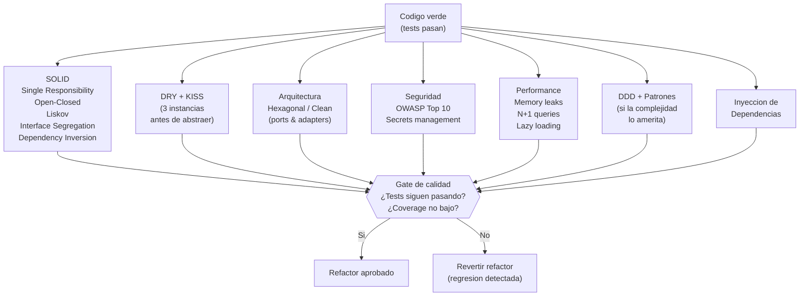

# Fase Refactor — Gate de Calidad

← [Índice principal](../README.md) | [Ejecución](README.md)

## Principio

El codigo verde funciona pero puede ser feo. La Fase Refactor aplica
todas las disciplinas de calidad SIN romper tests. Si despues de un
refactor los tests fallan, el refactor introdujo una regresion y se
revierte.

---

## Dimensiones de revision

---

## Checklist de revision

| Dimension | Que se revisa | Criterio |
|-----------|-----------------|----------|
| **SOLID** | Cada clase/modulo tiene una sola responsabilidad. Extensible sin modificar. Contratos respetados. | Violaciones documentadas con severidad |
| **DRY** | Duplicacion detectada. Regla de 3: no abstraer hasta tener 3 instancias del mismo patron. | Abstracciones prematuras son peor que duplicacion |
| **KISS** | Complejidad innecesaria. Sobre-ingenieria. Patrones aplicados sin justificacion. | Cada abstraccion debe resolver un problema real |
| **Arquitectura** | Alineacion con `design.md`. Ports & adapters. Capas respetadas. Dependencias en la direccion correcta. | Desviaciones documentadas con justificacion |
| **Seguridad** | OWASP Top 10. Secrets hardcodeados. SQL injection. XSS. CORS. Dependencias con CVEs. | Vulnerabilidades criticas bloquean aprobacion |
| **Performance** | Memory leaks. N+1 queries. Operaciones bloqueantes. Lazy loading donde aplica. | Problemas documentados con severidad |
| **DDD / Patrones** | Domain-Driven Design (si la complejidad lo amerita). Patrones aplicados donde resuelven un problema real, no por decoracion. | Solo donde la complejidad del dominio lo justifica |
| **DI** | Dependencias inyectadas, no hardcodeadas. Testeable. Reemplazable. | Dependencias directas a implementaciones concretas son violaciones |

---

### Asignación de dimensiones por rol

| Reviewer | Dimensiones que cubre |
|----------|----------------------|
| **Reviewer (Arquitectura)** | SOLID, DRY, KISS, Arquitectura, DDD/Patrones, DI |
| **Reviewer (Seguridad)** | Seguridad (OWASP Top 10, secrets, dependencias, CORS) |
| **Reviewer (Performance)** | Performance (memory leaks, N+1, lazy loading, operaciones bloqueantes) |

> En ejecución paralela con worktrees, el agente compuesto del lane
> ejecuta las 3 perspectivas secuencialmente. En ejecución secuencial,
> el Orquestador puede lanzar los 3 Reviewers en paralelo sobre el mismo
> código verde.

---

## Reglas del refactor

1. **Tests DEBEN seguir pasando** despues de cada refactor --- si fallan,
   el refactor introdujo una regresion
2. **Coverage no debe bajar** --- el refactor no elimina tests ni reduce
   cobertura
3. **Alineacion con `design.md`** --- el refactor acerca el codigo a la
   arquitectura definida, no lo aleja
4. **Commit por refactor** --- cada refactor es un commit separado para
   facilitar reversion
