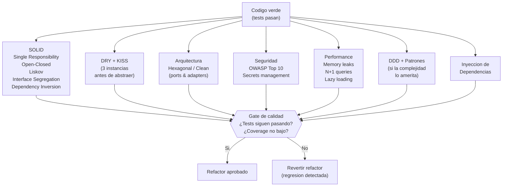

# Fase Refactor — Gate de Calidad

← [Índice principal](../README.md) | [Execution](README.md)

---

## Contenido

- [Principio](#principio)
- [Dimensiones de revision](#dimensiones-de-revision)
- [Checklist de revision](#checklist-de-revision)
- [Verificación Basada en Métricas](#verificación-basada-en-métricas)
- [Reglas del refactor](#reglas-del-refactor)

---

## Principio

El codigo verde funciona pero puede ser feo. La Fase Refactor aplica
todas las disciplinas de calidad SIN romper tests. Si despues de un
refactor los tests fallan, el refactor introdujo una regresion y se
revierte.

[↑ Contenido](#contenido)

---

## Dimensiones de revision



[↑ Contenido](#contenido)

---

## Checklist de revision

| Dimension | Que se revisa | Criterio |
|-----------|-----------------|----------|
| **SOLID** | Cada clase/modulo tiene una sola responsabilidad. Extensible sin modificar. Contratos respetados. | Violaciones documentadas con severidad |
| **DRY** | Duplicacion detectada. Regla de 3: no abstraer hasta tener 3 instancias del mismo patron. | Abstracciones prematuras son peor que duplicacion |
| **KISS** | Complejidad innecesaria. Sobre-ingenieria. Patrones aplicados sin justificacion. | Cada abstraccion debe resolver un problema real |
| **Arquitectura** | Alineacion con `design.md`. Ports & adapters. Capas respetadas. Dependencias en la direccion correcta. | Desviaciones documentadas con justificacion |
| **Seguridad** | OWASP Top 10. Secrets hardcodeados. SQL injection. XSS. CORS. Dependencias con CVEs. | Vulnerabilidades criticas bloquean aprobacion |
| **Performance** | Memory leaks. N+1 queries. Operaciones bloqueantes. Lazy loading donde aplica. Bundle analysis (tamaño, tree shaking) cuando aplica (ver [sistema de artifacts](../artifact-system.md)). | Problemas documentados con severidad |
| **DDD / Patrones** | Domain-Driven Design (si la complejidad lo amerita). Patrones aplicados donde resuelven un problema real, no por decoracion. | Solo donde la complejidad del dominio lo justifica |
| **DI** | Dependencias inyectadas, no hardcodeadas. Testeable. Reemplazable. | Dependencias directas a implementaciones concretas son violaciones |

---

### Asignación de dimensiones por rol

| Reviewer | Dimensiones que cubre |
|----------|----------------------|
| **Reviewer (Arquitectura)** | SOLID, DRY, KISS, Arquitectura, DDD/Patrones, DI |
| **Reviewer (Seguridad)** | Seguridad (OWASP Top 10, secrets, dependencias, CORS) |
| **Reviewer (Performance)** | Performance (memory leaks, N+1, lazy loading, operaciones bloqueantes) |

> En ejecución paralela con worktrees, el compositeAgent del lane
> ejecuta las 3 perspectivas secuencialmente. En ejecución secuencial,
> el Orquestador puede lanzar los 3 Reviewers en paralelo sobre el mismo
> código verde.

[↑ Contenido](#contenido)

---

## Verificación Basada en Métricas

> **Dogma v2**: "No reviso código escrito por agentes. Mido cobertura de
> tests, estructura de dependencias, complejidad ciclomática, tamaño de
> módulos, mutation testing." — Uncle Bob (julio 2026)

Virgil v2 reemplaza la revisión manual de código por verificación
basada en métricas. El binding layer (declarado en
[Fase Red](red.md#trazabilidad-ac-testplan-testcontract-implementación-coverage),
inferido en [Fase Green](green.md#inferencia-de-bindings)) rastrea
requirement → código → test; las herramientas de esta sección verifican
la FUERZA real de esos tests, no solo su existencia.

### virgil metrics

Durante o después del refactor, `virgil metrics` ejecuta el chequeo de:

- **Mutation score** — porcentaje de mutantes detectados por la suite
  de tests. Un mutation score bajo significa tests que pasan pero no
  detectan cambios reales en el comportamiento del código.
- **CRAP score** — Change Risk Anti-Patterns (ver fórmula abajo).
- **Complejidad ciclomática** — por función/método.

Virgil **orquesta** herramientas externas especializadas por lenguaje —
no las construye ni las reimplementa:

| Lenguaje | Mutation testing | Complejidad / CRAP |
|----------|-------------------|---------------------|
| Go | mutate4go | gocyclo, crap4go |
| JavaScript / TypeScript | Stryker | — |
| Java | pitest | — |

### CRAP score

```text
CRAP = comp^2 * (1 - cov/100)^3 + comp
```

Donde `comp` es la complejidad ciclomática de la función y `cov` es su
porcentaje de cobertura de tests. Un método complejo y sin cobertura
produce un CRAP score alto; el mismo método, bien cubierto, lo mantiene
bajo. El CRAP score castiga la combinación de complejidad y ausencia de
tests, no la complejidad por sí sola.

### Thresholds por tier

| Tier | Mutation score mínimo | CRAP máximo |
|------|------------------------|-------------|
| strict | ≥ 80% | ≤ 30 |
| standard | ≥ 60% | ≤ 45 |
| relaxed | ≥ 40% | ≤ 60 |

> El tier activo es parte del contrato del handoff (ver
> [contracts.md](contracts.md#contrato-de-métricas)). `virgil health`
> reporta contra ese tier en Accept — el binding pasa de `inferred` a
> `verified` solo cuando las métricas alcanzan su threshold.

[↑ Contenido](#contenido)

---

## Reglas del refactor

1. **Tests DEBEN seguir pasando** despues de cada refactor --- si fallan,
   el refactor introdujo una regresion
2. **Coverage no debe bajar** --- el refactor no elimina tests ni reduce
   cobertura
3. **Alineacion con `design.md`** --- el refactor acerca el codigo a la
   arquitectura definida, no lo aleja
4. **Commit por refactor** --- cada refactor es un commit separado para
   facilitar reversion
5. **Métricas dentro del threshold del tier** --- mutation score y CRAP
   cumplen el mínimo definido para el tier activo antes de considerar
   el refactor aprobado (ver
   [Verificación Basada en Métricas](#verificación-basada-en-métricas))

> Los quality gates del refactor están alineados con el paso 3 (Static
> Test) del [echo system](../echo-system.md) — el análisis estático
> es la primera línea de defensa que el echo formaliza como obligatorio.

[↑ Contenido](#contenido)
