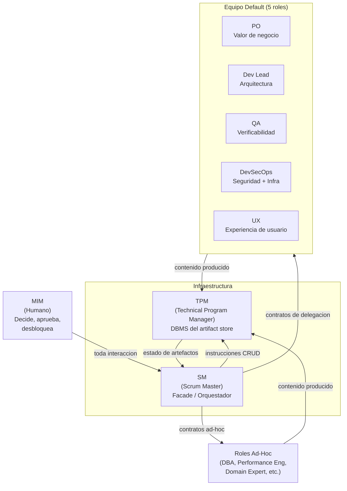
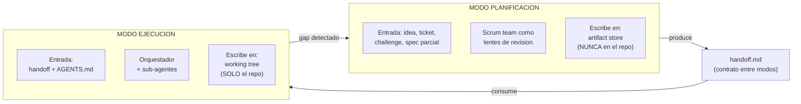
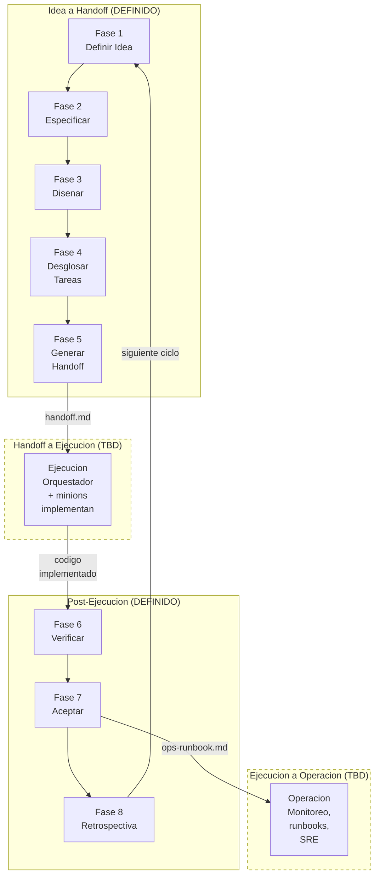
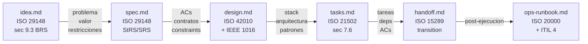
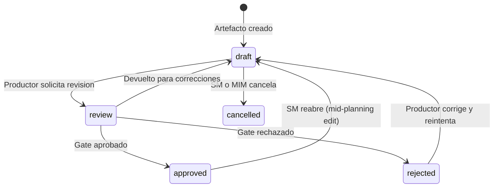
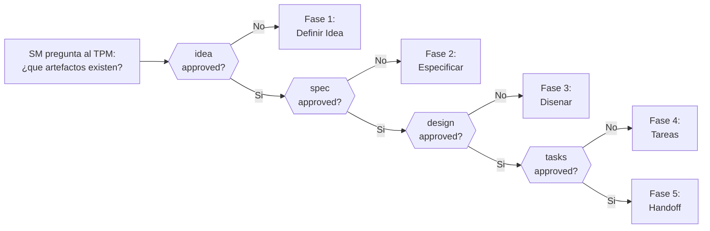
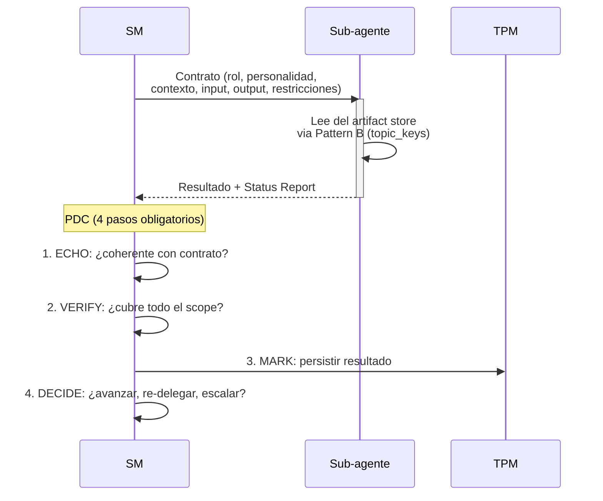
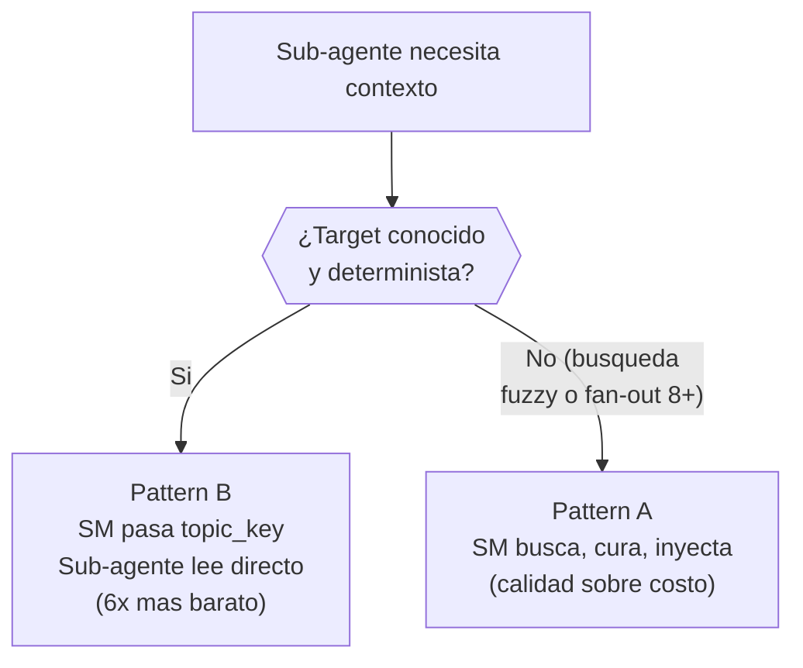
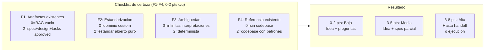
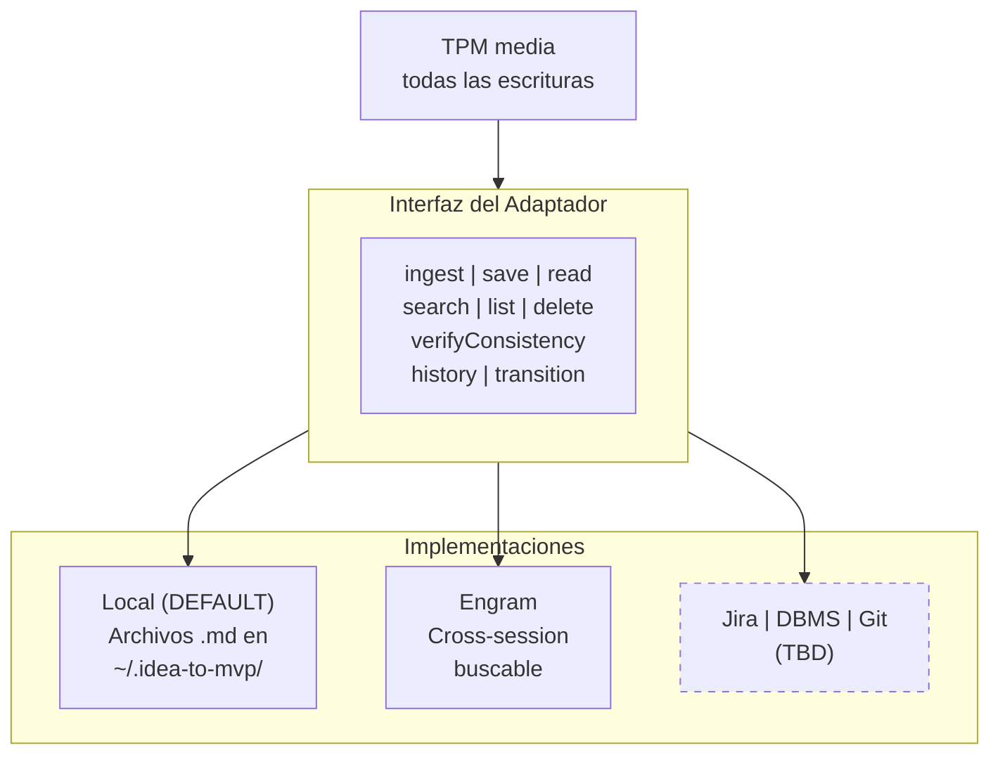

# idea-to-mvp --- Vista General del Framework

> Mapa de navegacion para entender el sistema completo antes de leer los
> documentos detallados. Los diagramas son la comunicacion principal; el
> texto es tejido conectivo.

---

## Actores y Roles

El framework opera con tres capas de actores: el humano (MIM), la
infraestructura de orquestacion (SM + TPM), y los roles productivos
(equipo default + ad-hoc).

Reglas clave:

- El SM **nunca produce contenido** --- solo orquesta, convoca y valida gates.
- El TPM **es el unico que escribe** en el artifact store --- con criterio editorial.
- Los roles son sub-agentes con personalidad que **cambia por fase**.
- El SM puede **extender el equipo** con roles ad-hoc justificados.

> Detalle: [role-profiles.md](role-profiles.md) (contratos por fase) y
> [behavior-scrum-master-routing.md](behavior-scrum-master-routing.md)
> (reglas del SM).

---

## Modos de Funcionamiento

El framework separa planificacion de ejecucion con un contrato formal
entre ambos modos: el handoff.

| Aspecto | Planificacion | Ejecucion |
|---------|---------------|-----------|
| Proposito | Producir fuentes de verdad | Implementar codigo |
| Participantes | Scrum team (lentes) | Orquestador + minions |
| Donde escribe | Artifact store (fuera del repo) | Working tree del repo |
| Estado actual | **DEFINIDO** | **TBD** |

> Detalle: [operational-model.md](operational-model.md).

---

## Pipeline Completo

El ciclo tiene 4 macro-fases. Solo la primera esta completamente
definida en el framework actual.

### Roles convocados por fase

| Fase | Roles activos |
|------|---------------|
| 1. Idea | PO |
| 2. Spec | PO + QA + UX (condicional) |
| 3. Diseno | Dev Lead + DevSecOps + UX (condicional) |
| 4. Tareas | Dev Lead + DevSecOps (cond) + QA (cond) |
| 5. Handoff | TPM (compila bajo instruccion del SM) |
| 6. Verificar | QA + Dev Lead + DevSecOps (condicional) |
| 7. Aceptar | Todos los roles activos (votacion paralela) |
| 8. Retro | Todos los roles activos |

> Detalle: [behavior-scrum-master-routing.md](behavior-scrum-master-routing.md)
> (fases 1-8) y [role-profiles.md](role-profiles.md) (contratos de cada
> rol por fase).

---

## Artefactos

El framework produce 6 artefactos universales respaldados por estandares
ISO/IEC/IEEE. Cada fase consume el output de la anterior y produce los
parametros requeridos para la siguiente.

### Quien produce y quien valida

| Artefacto | Produce | Valida (gate) |
|-----------|---------|---------------|
| `idea.md` | PO | SM (estructural via TPM) |
| `spec.md` | PO | QA (testeabilidad) + UX (experiencia) |
| `design.md` | Dev Lead + DevSecOps | SM (via TPM) + DevSecOps + UX |
| `tasks.md` | Dev Lead | QA (verificabilidad) + SM (via TPM) |
| `handoff.md` | TPM (compila) | SM (autocontencion) |
| `ops-runbook.md` | DevSecOps + Dev Lead | SM (gate) |

> Regla cardinal: **quien produce nunca valida su propio artefacto**.
>
> Detalle: [artifact-model.md](artifact-model.md) (schemas, contenido
> minimo, jerarquia de work items, adaptadores de persistencia).

---

## Maquina de Estados de Artefactos

Cada artefacto transiciona a traves de una state machine configurable.
El estado `approved` es el que habilita la siguiente fase.

La state machine del **proyecto** se deriva del estado de los artefactos
en el RAG. El SM no persiste estado --- lo reconstruye consultando al TPM:

> Detalle: [artifact-model.md](artifact-model.md) (seccion `transition`)
> y [behavior-scrum-master-routing.md](behavior-scrum-master-routing.md)
> (state machine del proyecto).

---

## Modelo de Delegacion

El SM delega trabajo via **contratos de delegacion** con campos
obligatorios. Despues de cada retorno, ejecuta el **PDC** (Post-Delegation
Checkpoint).

### Pattern A vs Pattern B (retrieval)

**Circuit breaker**: si 3 delegaciones consecutivas al mismo rol fallan, el SM detiene la cadena y escala al MIM.

> Detalle: [behavior-scrum-master-routing.md](behavior-scrum-master-routing.md)
> (PDC, circuit breaker, context resilience) y
> [role-profiles.md](role-profiles.md) (contratos por fase).

---

## Fast-Forward

El SM no avanza siempre una fase a la vez. Evalua un **gradiente de
certeza** con 4 factores (F1-F4) y avanza proporcionalmente.

Ejemplos:

| Input | Score | Certeza | Accion |
|-------|-------|---------|--------|
| "Hazme el uber de lanchas" | 0 | Baja | Idea + preguntas |
| "Agrega auth JWT" (codebase Express) | 4 | Media | Idea + spec parcial |
| "Crea modulo OTEL" (codebase NestJS) | 6 | Alta | Hasta handoff |
| Epic ya groomeado (todo en RAG) | 8 | Alta | Fast-forward a ejecucion |

El SM registra el score F1-F4 en `idea.md` para auditabilidad. El
fast-forward tambien aplica **mid-cycle** (bugs en produccion, epics
ya groomeados).

> Detalle: [behavior-scrum-master-routing.md](behavior-scrum-master-routing.md)
> (seccion fast-forward contextual).

---

## Artifact Store y Adaptadores

Los artefactos se persisten via una **interfaz universal de 9
operaciones**. El adaptador es pluggable --- el framework define la
interfaz, no la implementacion.

El TPM actua como DBMS: no decide que datos crear, pero decide como se
almacenan, valida integridad, y sirve consultas con criterio editorial.

> Detalle: [artifact-model.md](artifact-model.md) (interfaz universal,
> contrato de comportamiento, garantias ACID, adaptadores).

---

## Que Sigue (areas TBD)

El framework actualmente cubre la **macro-fase de planificacion** en
detalle. Las siguientes areas estan identificadas pero no definidas:

| Area | Estado | Descripcion |
|------|--------|-------------|
| Modo Ejecucion | TBD | Como el orquestador consume el handoff, delega a sub-agentes, y produce codigo. Patron orquestador-minion. |
| Modo Operacion | TBD | Para proyectos con servicios vivos: monitoreo, runbooks, SRE, alertas. Consumidor de `ops-runbook.md`. |
| Adaptadores avanzados | TBD | Jira, DBMS, Git repo, MS Project como adaptadores del artifact store. |
| Routing no-Scrum | TBD | Routing tables para Kanban (WIP limits), Shape Up (bets), SAFe (PIs). Los artefactos son universales; la orquestacion no. |
| Tiers de activacion | TBD | Como escala hacia abajo el modo planificacion para proyectos simples o challenges con timebox. |
| Transacciones del adaptador | TBD | Primitivas `begin`/`commit`/`rollback` para adaptadores sin soporte nativo. |

---

## Indice de Documentos Detallados

| Documento | Que define |
|-----------|-----------|
| [operational-model.md](operational-model.md) | Dos modos, ownership, limites, adaptador por defecto |
| [artifact-model.md](artifact-model.md) | 6 artefactos, TPM, interfaz de adaptadores, state machine, jerarquia de work items |
| [behavior-scrum-master-routing.md](behavior-scrum-master-routing.md) | SM como facade, state machine del proyecto, fast-forward, PDC, circuit breaker |
| [role-profiles.md](role-profiles.md) | Contratos de delegacion por fase, personalidades, activacion condicional, roles ad-hoc |
