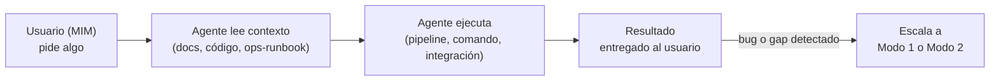
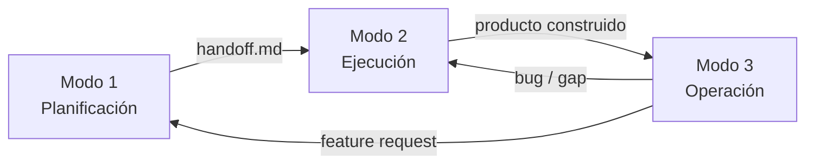

# Modelo de Operación — Modo 3

← [Índice principal](../README.md)

> El producto construido entrega valor: el MIM pasa de dirigir a usar, el
> agente pasa de construir a asistir.

---

## Principio

El Modo 3 arranca donde termina el Modo 2: el producto ya existe en el
working tree, certificado por QA. A partir de ahí, el MIM deja de ser
director del proyecto y se convierte en **usuario** del producto. El agente
deja de ser orquestador de construcción y se convierte en **asistente
operativo**: ejecuta lo que el usuario pide dentro del contexto del
producto ya construido.

A diferencia de los Modos 1 y 2, el Modo 3 no tiene fases, no tiene scrum
team convocado, y no produce artefactos de planificación. Es **reactivo**:
el agente responde a pedidos concretos del usuario, consultando la
documentación y el código del proyecto para entender qué puede hacer y
cómo hacerlo.

El Modo 3 es **opcional**. No todo proyecto tiene superficie operativa —
una librería se publica, no se opera; un entregable one-shot se entrega,
no se opera.

---

## Cuándo se activa

| Tipo de proyecto | ¿Aplica Modo 3? | Ejemplo |
|-------------------|-----------------|---------|
| CLI o herramienta con comandos | Sí | Ejecutar comandos, generar outputs |
| Servicio o API | Sí | Operar, invocar, interactuar con endpoints |
| Proyecto con integraciones externas | Sí | Jira, Confluence, sistemas de terceros |
| Librería o paquete | No | Se publica, no se opera |
| Entregable one-shot | No | Se entrega, no se opera |

---

## Actores

| Actor | En Modo 1 | En Modo 2 | En Modo 3 |
|-------|-----------|-----------|-----------|
| MIM | Dirige | Aprueba/desbloquea | **Usuario** — consume el producto |
| Agente | SM (orquesta planificación) | Orquestador (coordina ejecución) | **Asistente operativo** — ejecuta lo que el usuario pide |

---

## Input

- Producto construido (salida del Modo 2, en el working tree)
- `ops-runbook.md` (si el proyecto lo tiene — referencia operativa)
- Documentación del proyecto (README, guías, docs de API)
- `AGENTS.md` — las reglas del proyecto siguen aplicando

---

## Tipos de operación

No es una taxonomía a seguir rígidamente — son ejemplos de qué significa
"operar" un producto:

| Tipo | Ejemplo | Qué hace el agente |
|------|---------|---------------------|
| Generación de artefactos | "Genera un PDF con mi perfil" | Ejecuta el pipeline del proyecto, produce el output |
| Ejecución de tareas | "Lanza el challenge X" | Configura y ejecuta el flujo definido por el proyecto |
| Integración con sistemas externos | "Entra a Jira y comenta en US-123" | Usa las integraciones del proyecto para interactuar |
| Consulta operativa | "¿Cuántos challenges tengo pendientes?" | Lee el estado del proyecto y reporta |

---

## Flujo

---

## Lo que NO es el Modo 3

- No es SRE ni monitoreo de infraestructura — eso lo cubre `ops-runbook.md`
  como referencia, no el Modo 3 en sí.
- No es planificación — no hay fases ni artefactos de planificación.
- No es construcción — no hay ciclo Red-Green-Refactor.
- No hay scrum team — el usuario opera directamente con asistencia del
  agente, sin lentes de revisión convocados.

---

## Conexión con Modo 1 y Modo 2

| Evento en operación | Acción |
|----------------------|--------|
| Bug descubierto | Escalar a Modo 2 (Red → Green) |
| Feature request | Escalar a Modo 1 (nueva planificación) |
| Gap de documentación | Escalar a Modo 1 (Fase 6 — producir/actualizar `ops-runbook.md`) |
| Proyecto deprecado | Cerrar Modo 3 — archivar |

---

## Documentación operativa

El Modo 3 consume la documentación operativa que haya producido el ciclo
anterior. El `handoff.md` declara qué documentación se espera (sección
condicional). Si esa documentación no existe o es insuficiente, el Modo 3
puede escalar de vuelta a Modo 1 para producirla o completarla.
