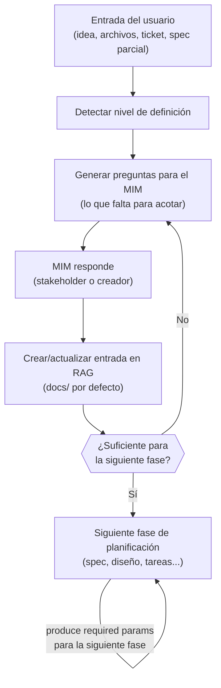
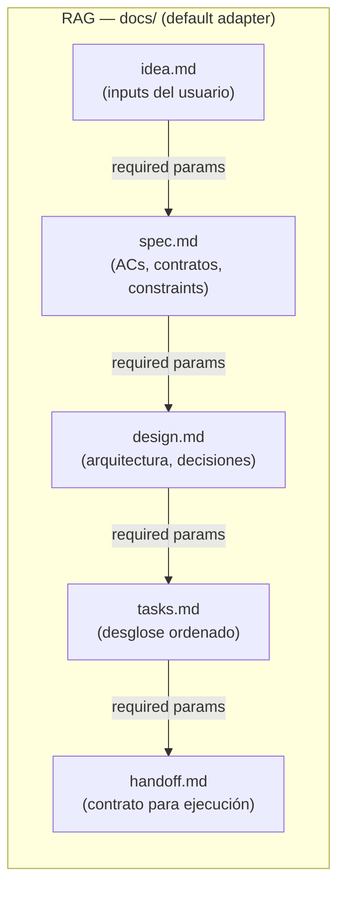
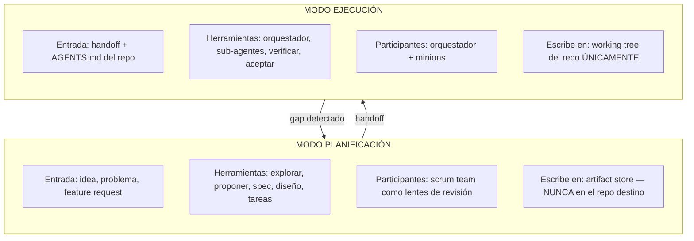

# Diseño del Modelo Operativo — idea-to-mvp

> Documento de trabajo. Objetivo: definir CÓMO opera el framework antes de
> decidir CÓMO implementarlo (skills, agentes, paquetes, etc.).

---

## El Problema

El framework actualmente mezcla tres concerns en un solo repositorio:

1. **Reglas de gobernanza** — axiomas de AGENTS.md, compact rules, fases del
   pipeline. Estas SÍ PERTENECEN a cada repo que adopta el framework.
2. **Tooling de planificación** — fases SDD (explorar, proponer, especificar,
   diseñar, tareas), roles del scrum team, persistencia de artefactos
   (engram, openspec, híbrido). Son OPERACIONALES y no deben contaminar los
   repos adoptantes.
3. **Tooling de ejecución** — patrón orquestador-minion, delegación a
   sub-agentes, inyección de personalidad/contexto, resolución de skills.
   Son de RUNTIME y no deben estar acoplados a las reglas de gobernanza.

Resultado: los repos adoptantes acumulan archivos `.tmp-*`, directorios
`openspec/`, documentos de feedback y estado SDD que no tienen nada que ver
con su codebase.

Cada repo tiene derecho a su propio AGENTS.md. El tooling que ayuda a CREAR
y HACER CUMPLIR ese AGENTS.md debe vivir en otro lugar.

---

## Dos Modos

### Modo 1 — Planificación (idea → handoffs)

**Propósito**: producir fuentes de verdad y planes. Sin ejecución de código.

**Quién participa**: el scrum team (PO, Dev Lead, SM, UX, QA, DevSecOps)
como lentes de revisión — no como agentes que escriben código.

#### Entradas aceptadas

El modo planificación arranca desde cualquier nivel de definición:

| Nivel de entrada | Ejemplo | Qué hace el sistema |
|-----------------|---------|---------------------|
| Idea vaga | "Haz el Uber de las lanchas" | Guía al MIM con preguntas para acotar |
| Archivos de un challenge | README.md + seeds + schema de un tech challenge | Extrae requisitos, constraints, stack |
| Ticket externo | Link a Jira, Linear, Confluence, GitHub Issue | Lee y estructura (vía adaptador TBD) |
| Especificación parcial | "API REST con auth JWT y CRUD de productos" | Identifica gaps y pregunta solo lo faltante |

El punto es: **no importa qué tan vago o preciso sea el input**. El sistema
detecta el nivel de definición y genera las preguntas necesarias para llegar
al siguiente nivel.

#### Flujo: de idea a handoff

#### El RAG como fuente de verdad progresiva

El artifact store NO es solo persistencia — es un **RAG** que los agentes
consultan para obtener contexto ACOTADO sin crawlear el codebase.

Principio fundamental: **cada fase consume el output de la anterior y
produce los required params de la siguiente**. Ningún agente necesita leer
"todo" — solo el slice que le corresponde.

Evolución del contexto en cada fase:

| Fase | Consume del RAG | Produce al RAG | Quién consulta después |
|------|----------------|---------------|----------------------|
| Definir idea | Nada (input fresco del usuario) | `idea.md` — el problema, alcance, restricciones | Fase de spec |
| Especificar | `idea.md` | `spec.md` — ACs, contratos, constraints | Fase de diseño |
| Diseñar | `idea.md` + `spec.md` | `design.md` — arquitectura, patrones, tradeoffs | Fase de tareas |
| Desglosar tareas | `spec.md` + `design.md` | `tasks.md` — tareas ordenadas con dependencias | Fase de handoff |
| Generar handoff | `spec.md` + `design.md` + `tasks.md` | `handoff.md` — contrato autocontenido | Modo ejecución |

**Clave**: cuando un agente de ejecución necesita contexto, no lee 15
archivos del repo — hace fetch al RAG y obtiene exactamente el slice que
necesita. Al principio (definir idea) el RAG solo contiene los inputs del
usuario. Al final (handoff) contiene toda la cadena de decisiones.

#### Guía al MIM (generación de preguntas)

El sistema no espera que el MIM sepa qué preguntar. Según el nivel de
entrada detectado, genera preguntas dirigidas:

Para una **idea vaga** ("Uber de lanchas"):
- ¿Quién es el usuario final? (pasajeros, lancheros, ambos)
- ¿Cuál es el flujo core? (reservar, pagar, rastrear)
- ¿Qué plataforma? (web, mobile, ambos)
- ¿Hay restricciones técnicas? (stack, hosting, presupuesto)
- ¿MVP o producto completo? ¿Deadline?

Para un **tech challenge** (archivos del repo):
- ¿Cuál es el timebox?
- ¿Hay restricciones de stack no documentadas?
- ¿Qué se evalúa? (código, proceso, arquitectura, todo)
- ¿Se puede usar tooling de AI? ¿Con qué restricciones?

Para un **ticket externo**:
- ¿Los ACs están completos o hay ambigüedad?
- ¿Hay dependencias bloqueantes?
- ¿Quién aprueba el resultado?

Las preguntas se adaptan: si el MIM ES el stakeholder/creador, las responde
directamente. Si no lo es, las usa como guía para obtener las respuestas.

#### Adaptador por defecto: `docs/` como RAG local

- Path por defecto: `docs/` en un directorio designado FUERA del repo
  destino (ejemplo: `~/.idea-to-mvp/projects/{nombre}/docs/`)
- Formato: archivos markdown, uno por fase
- Legible por humanos, versionable si se desea
- Los agentes hacen fetch de archivos específicos, no crawl completo
- Adaptadores adicionales (engram, Jira, Confluence, etc.): TBD

**Restricción clave**: el modo planificación NUNCA toca el working tree del
repo destino. Lee el codebase para informar decisiones, pero toda la salida
va al artifact store — no a archivos `.tmp-*` dispersos en el repo.

#### Scrum team en este modo

Cada rol es un LENTE que revisa artefactos de planificación desde su
perspectiva. PO valida alcance contra valor de usuario. QA valida
testeabilidad. DevSecOps valida superficie de seguridad. Producen
veredictos de revisión, no código.

Los lentes se activan DESPUÉS de que una fase produce su artefacto —
revisan lo producido, no participan en la generación. Si un lente
encuentra un gap, el sistema regresa al ciclo de preguntas para esa fase.

---

### Modo 2 — Ejecución (handoffs → código funcional)

**Propósito**: implementar lo que la planificación produjo. Se escribe código.

**Quién participa**: el orquestador y los sub-agentes (minions).

**Qué consume**:
- Documentos de handoff del Modo 1
- El AGENTS.md del repo destino (reglas de gobernanza)
- Compact rules resueltas y estándares del proyecto

**Qué produce**:
- Cambios de código en el repo destino
- Resultados de pruebas
- Reportes de verificación
- Commits (siguiendo las convenciones del repo)

**Cómo funciona**:
- El orquestador lee el handoff y el AGENTS.md del repo
- El orquestador delega a sub-agentes con:
  - Alcance específico de tarea (del handoff)
  - Personalidad/contexto (apropiado para el rol de la tarea)
  - Compact rules inyectadas (de AGENTS.md, resueltas una vez)
  - Axiomas del proyecto inyectados (de AGENTS.md, si están definidos)
- Los sub-agentes escriben código, ejecutan pruebas, reportan
- El orquestador verifica, hace commit, pasa a la siguiente tarea

**Restricción clave**: el modo ejecución SOLO escribe en el working tree del
repo destino. NO crea artefactos de planificación, documentos de feedback ni
archivos de estado SDD en el repo.

---

## Límites

---

## El Handoff como Contrato

El documento de handoff es la interfaz entre modos. Debe ser:

- **Autocontenido**: un ejecutor que nunca vio la conversación de
  planificación puede actuar sin hacer preguntas.
- **Portable**: funciona independientemente del adaptador que lo produjo.
- **Acotado**: dice exactamente qué hacer, qué NO hacer, y cómo se ve el
  éxito.

El handoff NO es un archivo en el repo destino. Vive en el artifact store
y es LEÍDO por el modo ejecución.

---

## Qué Vive DÓNDE

| Artefacto | Dónde vive | Por qué |
|-----------|-----------|---------|
| AGENTS.md | Repo destino (raíz) | La gobernanza es por repo. Cada proyecto posee sus reglas. |
| Artefactos de planificación (propuestas, specs, diseños, tareas) | Artifact store (depende del adaptador) | Informan el trabajo, no son el trabajo. |
| Documentos de handoff | Artifact store | Contrato entre planificación y ejecución. |
| Estado SDD (tracking de fases, DAG) | Artifact store | Estado operacional, no estado del proyecto. |
| Feedback de adoptantes | Artifact store (etiquetado al framework fuente) | Input para evolución del framework, no contenido del repo. |
| Código, pruebas, configs | Repo destino | El entregable real. |
| Archivos `.tmp-*` | EN NINGÚN LUGAR del repo destino | Eliminados. Los artefactos de planificación van al store. |

---

## Adaptadores del Artifact Store

El framework necesita una capa de persistencia pluggable. Cada adaptador
implementa la misma interfaz (guardar, leer, buscar, listar) pero almacena
de forma diferente.

### Adaptador local (por defecto)
- Almacena artefactos como archivos markdown en un directorio designado
  FUERA del repo destino.
- Ejemplo: `~/.idea-to-mvp/projects/{nombre-proyecto}/artifacts/`
- Ventajas: sin dependencias externas, trackeable con git si se desea,
  legible por humanos.
- Desventaja: sin acceso cross-machine.

### Adaptador engram
- Almacena artefactos como observaciones engram con topic keys estructurados.
- Ventajas: cross-session, buscable, sobrevive compaction.
- Desventaja: requiere servidor MCP de engram, contenido puede truncarse en
  resultados de búsqueda (se necesita `mem_get_observation` para contenido
  completo).

### Adaptador híbrido
- Escribe en ambos: local y engram.
- Ventajas: lo mejor de ambos — legibilidad local + persistencia
  cross-session.
- Desventaja: mayor costo de tokens por operación.

---

## Scrum Team — Cuándo y Cómo

El scrum team es una herramienta de PLANIFICACIÓN, no de ejecución.

| Rol | Cuándo se activa | Qué hace | Qué NO hace |
|-----|-----------------|----------|-------------|
| PO | Propuesta, Spec | Valida alcance, prioriza, define ACs | Escribir código, revisar PRs |
| Dev Lead | Diseño, Tareas | Valida arquitectura, estima, secuencia | Ejecutar tareas |
| SM | Todas las fases de planificación | Facilita, remueve bloqueos, valida proceso | Hacer cumplir en runtime |
| UX | Spec, Diseño | Valida decisiones que afectan al usuario | Implementar UI |
| QA | Spec, Tareas | Valida testeabilidad, define estrategia de pruebas | Escribir código de producción |
| DevSecOps | Diseño, Tareas | Valida superficie de seguridad, decisiones de infra | Desplegar |

En modo ejecución, el scrum team está EN SILENCIO. El orquestador y los
sub-agentes hacen el trabajo. Si la ejecución revela un gap de planificación,
el orquestador puede escalar DE VUELTA al modo planificación — pero el scrum
team nunca aparece dentro de la ejecución.

---

## Qué Permanece en AGENTS.md (gobernanza por repo)

Estas son las cosas que cada repo adoptante recibe:

- Axiomas (principios no negociables)
- Fases del pipeline (la secuencia de trabajo)
- Gates de fase (DOR, DOD, checkpoints MIM)
- Compact rules (estándares de código específicos del proyecto)
- Definiciones de roles (qué valida cada rol en los gates)
- Tiers de activación (cuánta ceremonia según la madurez del proyecto)

Estas son REGLAS, no HERRAMIENTAS. Dicen qué debe ser verdad, no cómo
hacerlo verdad.

---

## Qué NO Va en AGENTS.md

- Definiciones de fases SDD (explorar, proponer, spec, etc.)
- Configuración del artifact store
- Patrones de delegación del orquestador
- Templates de personalidad de sub-agentes
- Formatos de topic key de engram
- Protocolos de resolución de skills
- Tablas de asignación de modelos

Estos son OPERACIONALES. Pertenecen a la capa de tooling, no a la capa de
gobernanza.

---

## Preguntas Abiertas

1. **¿Dónde vive el tooling?**
   Opciones: skills de Claude Code (instalables), un paquete npm separado,
   una convención de dotfiles (`~/.idea-to-mvp/`), o una combinación.

2. **¿Cómo hace un repo "opt in" al framework?**
   Actualmente: copiar AGENTS.md. ¿Debería existir un comando bootstrap
   (`/sdd-init` o equivalente) que configure la capa de tooling sin
   contaminar el repo?

3. **¿Cómo fluye el feedback de vuelta al framework?**
   fullstack-base produjo feedback para idea-to-mvp. ¿Dónde vive ese
   feedback? ¿Cómo se rastrea? Actualmente es un archivo `.tmp-*` en el
   repo del framework — que es la misma contaminación que queremos eliminar.

4. **¿Debería estandarizarse el formato del handoff?**
   Si el handoff es el contrato entre modos, su estructura importa.
   ¿Un schema? ¿Un template? ¿Campos mínimos requeridos?

5. **¿Cómo afectan los tiers de activación a la separación de modos?**
   Un desarrollador solo en un proyecto de fin de semana no necesita una
   revisión de 6 roles. ¿Cómo escala hacia abajo el modo planificación de
   forma elegante?

6. **¿Verificación en modo ejecución — quién la hace?**
   Actualmente `sdd-verify` y `sdd-accept` difuminan la línea. Verify
   revisa implementación contra spec (concern de ejecución). Accept es una
   revisión scrum (concern de planificación aplicado post-ejecución).
   ¿Debería accept moverse a una "revisión post-ejecución" que alimente
   DE VUELTA a planificación?
