# idea-to-mvp --- Vista General del Framework

← [Índice](README.md)

> Mapa de navegación para entender el sistema completo antes de leer los
> documentos detallados. Los diagramas son la comunicación principal; el
> texto es tejido conectivo.

---

## Actores y Roles

El framework opera con tres capas de actores: el humano (MIM), la
infraestructura de orquestación (SM + TPM), y los roles productivos
(equipo default + ad-hoc).

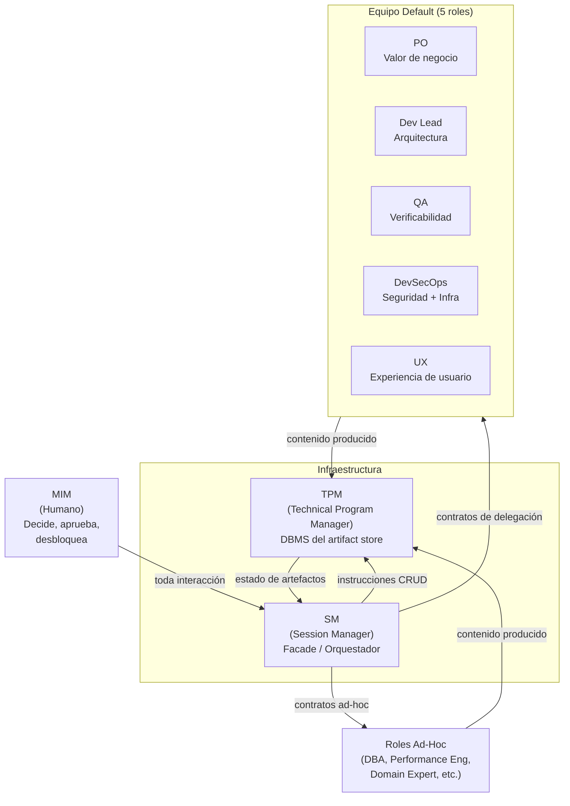

Reglas clave:

- El SM **nunca produce contenido** --- solo orquesta, convoca y valida gates.
- El TPM **es el único que escribe** en el artifact store --- con criterio editorial.
- Los roles son sub-agentes con personalidad que **cambia por fase**.
- El SM puede **extender el equipo** con roles ad-hoc justificados.

> Detalle: [roles](planning/roles/README.md) (contratos por fase) y
> [comportamiento SM](planning/behavior/README.md)
> (reglas del SM).

---

## Modos de Funcionamiento

El framework separa planificación de ejecución con un contrato formal
entre ambos modos: el handoff.

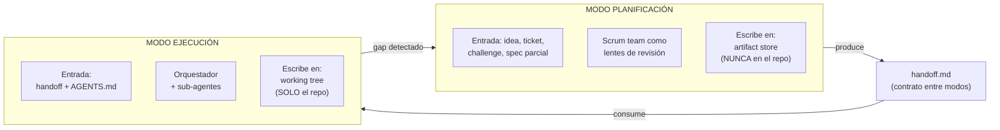

| Aspecto | Planificación | Ejecución |
|---------|---------------|-----------|
| Propósito | Producir fuentes de verdad | Implementar código |
| Participantes | Scrum team (lentes) | Orquestador + minions |
| Dónde escribe | Artifact store (fuera del repo) | Working tree del repo |
| Estado actual | **DEFINIDO** | **DEFINIDO** |

> Detalle: [modelo operativo](planning/operational-model.md).

---

## Pipeline Completo

El ciclo tiene 4 macro-fases, todas definidas. Las fases post-ejecución
están definidas como parte del Modo 1; la macro-fase de operación es el
Modo 3, opcional y reactivo.

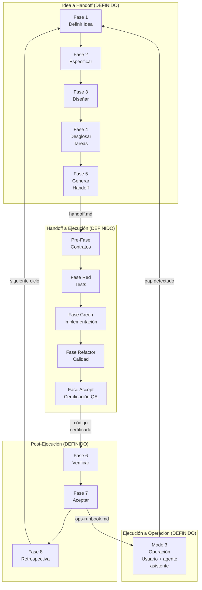

Vista alternativa: la línea de tiempo pone el foco en el **orden temporal**
de las fases dentro de cada macro-etapa, en vez de las dependencias entre
sub-fases.

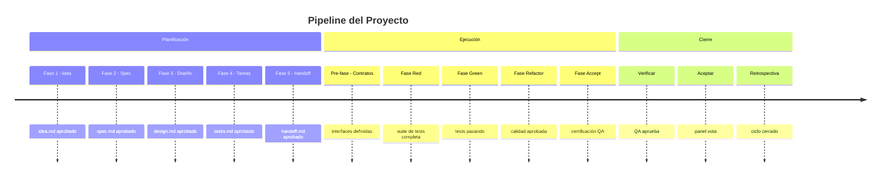

### Roles convocados por fase

| Fase | Roles activos |
|------|---------------|
| 1. Idea | PO |
| 2. Spec | PO + QA + UX (condicional) |
| 3. Diseño | Dev Lead + DevSecOps + UX (condicional) |
| 4. Tareas | Dev Lead + DevSecOps (cond) + QA (cond) |
| 5. Handoff | TPM (compila bajo instrucción del SM) |
| 6. Verificar | QA + Dev Lead + DevSecOps (condicional) |
| 7. Aceptar | Todos los roles activos (votación paralela) |
| 8. Retro | Todos los roles activos |

> Detalle: [comportamiento SM](planning/behavior/README.md)
> (fases 1-8) y [roles](planning/roles/README.md) (contratos de cada
> rol por fase).

---

## Artefactos

El framework produce 6 artefactos universales respaldados por estándares
ISO/IEC/IEEE. Cada fase consume el output de la anterior y produce los
parámetros requeridos para la siguiente.

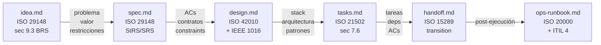

### Quién produce y quién valida

| Artefacto | Produce | Valida (gate) |
|-----------|---------|---------------|
| `idea.md` | PO | SM (estructural via TPM) |
| `spec.md` | PO | QA (testeabilidad) + UX (experiencia) |
| `design.md` | Dev Lead + DevSecOps | SM (via TPM) + DevSecOps + UX |
| `tasks.md` | Dev Lead | QA (verificabilidad) + SM (via TPM) |
| `handoff.md` | TPM (compila) | SM (autocontención) |
| `ops-runbook.md` | DevSecOps + Dev Lead | SM (gate) |

> Regla cardinal: **quién produce nunca valida su propio artefacto**.
>
> Detalle: [artefactos](planning/artifacts/README.md) (schemas, contenido
> mínimo, jerarquía de work items, adaptadores de persistencia).

---

## Máquina de Estados de Artefactos

Cada artefacto transiciona a través de una state machine configurable.
El estado `approved` es el que habilita la siguiente fase.

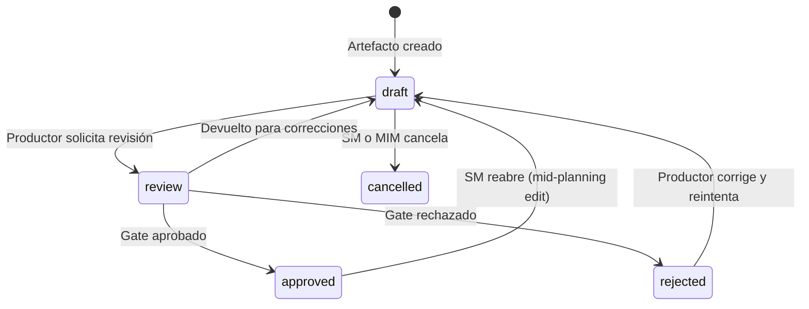

La state machine del **proyecto** se deriva del estado de los artefactos
en el RAG. El SM no persiste estado --- lo reconstruye consultando al TPM:

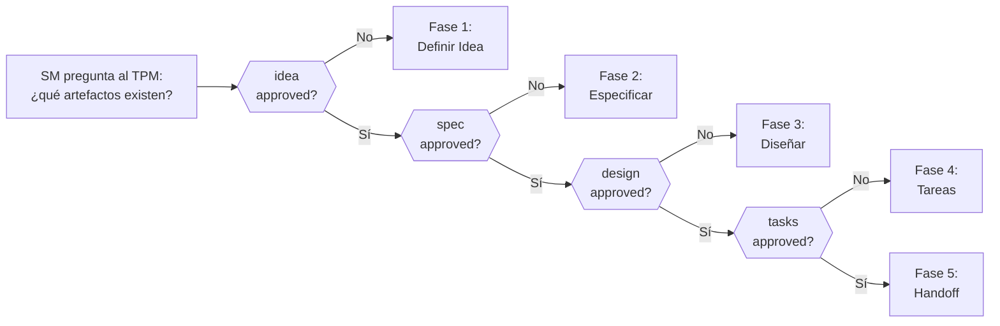

> Detalle: [artefactos](planning/artifacts/README.md) (sección `transition`)
> y [comportamiento SM](planning/behavior/README.md)
> (state machine del proyecto).

---

## Modelo de Delegación

El SM delega trabajo vía **contratos de delegación** con campos
obligatorios. Después de cada retorno, ejecuta el **PDC** (Post-Delegation
Checkpoint).

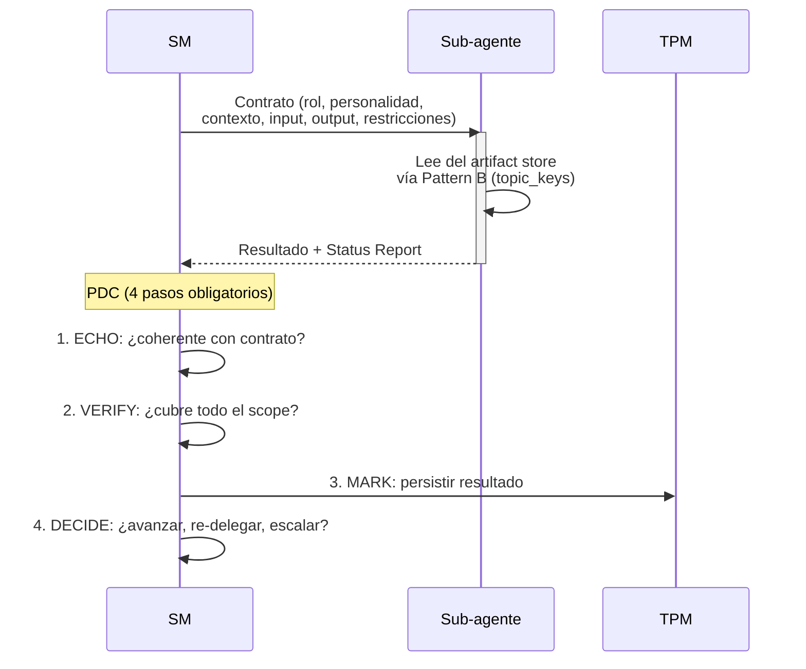

### Pattern A vs Pattern B (retrieval)

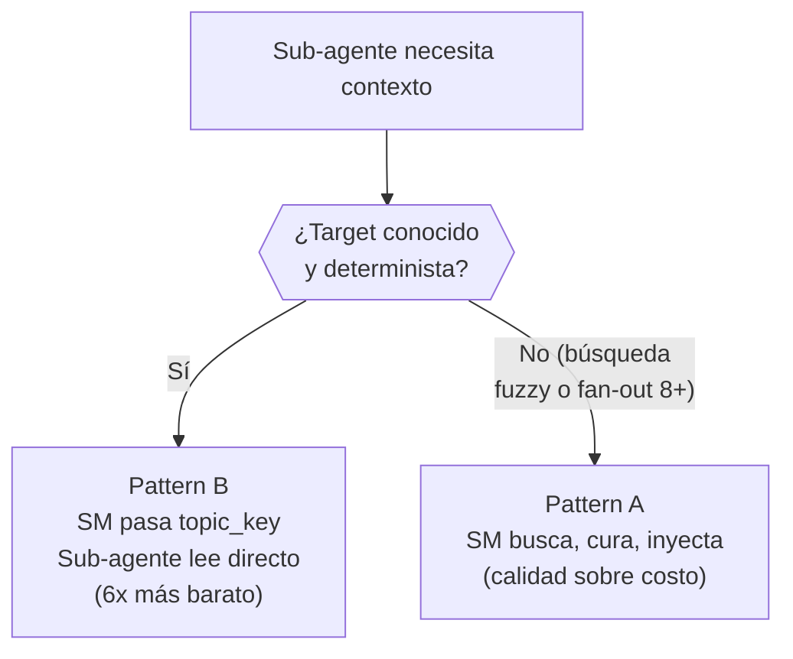

**Circuit breaker**: si 3 delegaciones consecutivas al mismo rol fallan, el SM detiene la cadena y escala al MIM.

> Detalle: [comportamiento SM](planning/behavior/README.md)
> (PDC, circuit breaker, context resilience) y
> [roles](planning/roles/README.md) (contratos por fase).

---

## Fast-Forward

El SM no avanza siempre una fase a la vez. Evalúa un **gradiente de
certeza** con 4 factores (F1-F4) y avanza proporcionalmente.

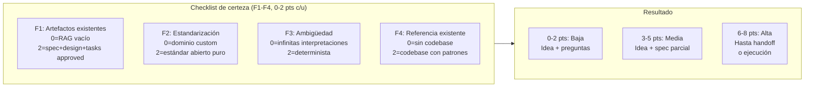

Ejemplos:

| Input | Score | Certeza | Acción |
|-------|-------|---------|--------|
| "Hazme el uber de lanchas" | 0 | Baja | Idea + preguntas |
| "Agrega auth JWT" (codebase Express) | 4 | Media | Idea + spec parcial |
| "Crea módulo OTEL" (codebase NestJS) | 6 | Alta | Hasta handoff |
| Epic ya groomeado (todo en RAG) | 8 | Alta | Fast-forward a ejecución |

El SM registra el score F1-F4 en `idea.md` para auditabilidad. El
fast-forward también aplica **mid-cycle** (bugs en producción, epics
ya groomeados).

> Detalle: [comportamiento SM](planning/behavior/README.md)
> (sección fast-forward contextual).

---

## Artifact Store y Adaptadores

Los artefactos se persisten vía una **interfaz universal de 9
operaciones**. El adaptador es pluggable --- el framework define la
interfaz, no la implementación.

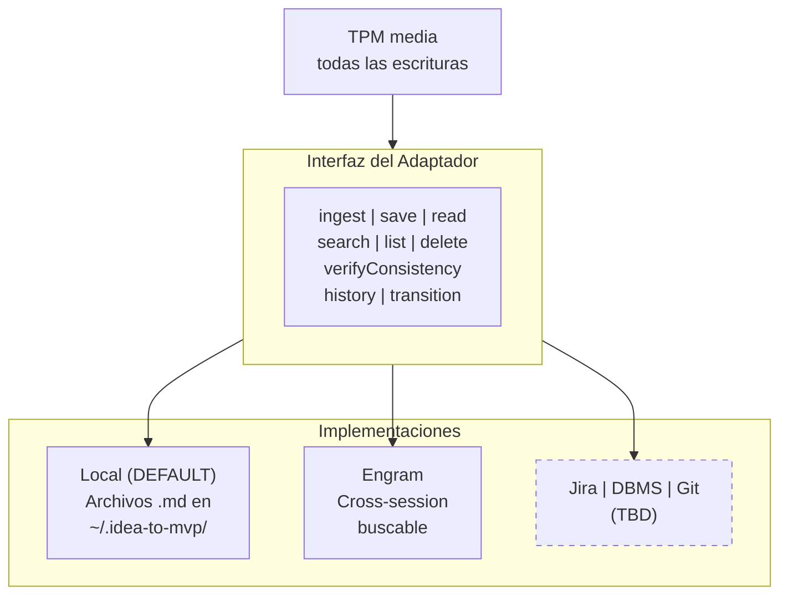

El TPM actúa como DBMS: no decide qué datos crear, pero decide cómo se
almacenan, valida integridad, y sirve consultas con criterio editorial.

> Detalle: [artefactos](planning/artifacts/README.md) (interfaz universal,
> contrato de comportamiento, garantías ACID, adaptadores).

---

## Qué Sigue (áreas TBD)

El framework cubre la macro-fase de planificación y la macro-fase de
ejecución en detalle. Las siguientes áreas están identificadas pero no
definidas:

| Área | Estado | Descripción |
|------|--------|-------------|
| Modo Ejecución | **DEFINIDO** | 5 fases (Contratos → Red → Green → Refactor → Accept). Contract-first, modelo de boundaries (App + E2E), revisión multi-dimensional. Ver [modelo de ejecución](execution/README.md). |
| Modo Operación | **DEFINIDO** | Opcional. Para proyectos con superficie operativa: el usuario consume el producto con asistencia del agente. Reactivo, sin fases. Ver [modelo de operación](operation/README.md). |
| Adaptadores avanzados | TBD | Jira, DBMS, Git repo, MS Project como adaptadores del artifact store. |
| Routing no-Scrum | TBD | Routing tables para Kanban (WIP limits), Shape Up (bets), SAFe (PIs). Los artefactos son universales; la orquestación no. |
| Tiers de activación | TBD | Cómo escala hacia abajo el modo planificación para proyectos simples o challenges con timebox. |
| Transacciones del adaptador | TBD | Primitivas `begin`/`commit`/`rollback` para adaptadores sin soporte nativo. |

---

## Índice de Documentos Detallados

| Documento | Qué define |
|-----------|-----------|
| [Modelo operativo](planning/operational-model.md) | Dos modos, ownership, límites, adaptador por defecto |
| [Artefactos](planning/artifacts/README.md) | 6 artefactos, TPM, interfaz de adaptadores, state machine, jerarquía de work items |
| [Comportamiento SM](planning/behavior/README.md) | SM como facade, state machine del proyecto, fast-forward, PDC, circuit breaker |
| [Roles](planning/roles/README.md) | Contratos de delegación por fase, personalidades, activación condicional, roles ad-hoc |
| [Modo Ejecución](execution/README.md) | Modo 2: Contract-first, Red-Green-Refactor macro, roles de ejecución, conexión con Modo 1 |
| [Modo Operación](operation/README.md) | Modo 3: opcional y reactivo, sin fases, usuario + agente asistente, conexión con Modo 1 y Modo 2 |
