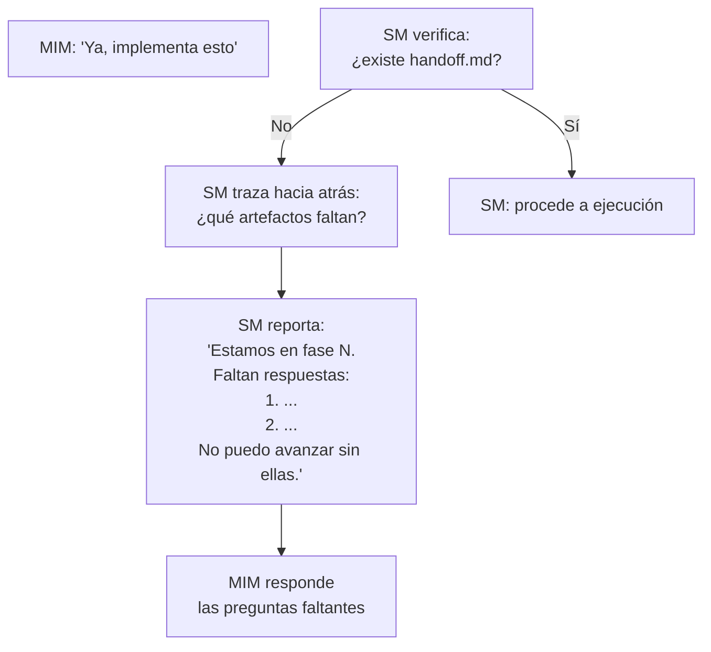
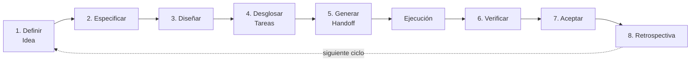
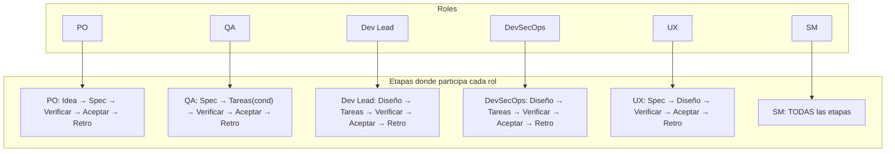
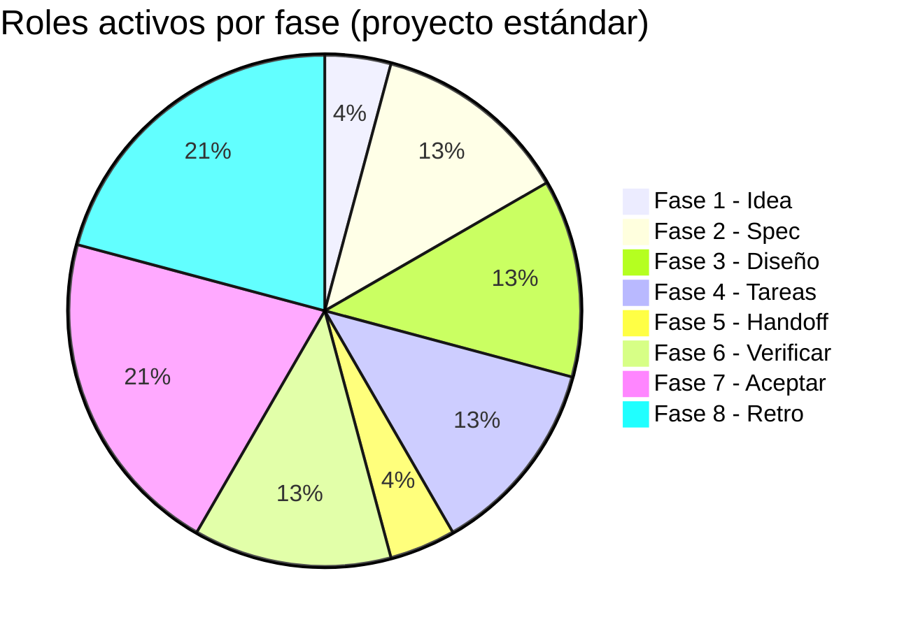

# Detalle de Fases 1-8

← [Índice principal](../../README.md) | [Planificación](../README.md) | [Comportamiento SM](README.md)

## Detalle por fase

### Fase 1 — Definir Idea

| | Detalle |
|---|---------|
| **Rol convocado** | PO (± SM si es un challenge con reglas de proceso) |
| **Función** | Formular preguntas de negocio al MIM para acotar alcance y valor |
| **NO hace** | NO decide stack. NO define arquitectura. NO estima esfuerzo. |
| **Artefacto de salida** | `idea.md` |
| **Gate** | Todas las preguntas de negocio respondidas |

Preguntas predefinidas que el PO debe resolver:

1. ¿Quién es el usuario final?
2. ¿Qué problema resuelve para el usuario?
3. ¿Cuál es el flujo core del producto?
4. ¿Es MVP o producto completo?
5. ¿Hay restricciones de tiempo o presupuesto?
6. ¿Quien aprueba el resultado final?

**Multi-stakeholder**: si la respuesta a pregunta 6 indica que
requester ≠ approver (ej: un dev pide el feature pero el PM aprueba),
el SM registra ambos en `idea.md` metadata y enruta las interacciones:
preguntas de contexto/scope → requester, gates de aceptacion →
approver. Default: MIM = requester = approver (persona unica).

**Ingesta de input del MIM**: cuando el MIM proporciona archivos,
capturas, URLs, o cualquier material de contexto (tech challenge,
brief de producto, wireframes), el SM instruye al TPM para **ingestar**
el material en el artifact store. El TPM:

1. Lee el material fuente (archivos, capturas, texto)
2. Sintetiza el contenido relevante (no copia verbatim)
3. Almacena con **citaciones a la fuente** (path, linea, URL, seccion)
4. Lo hace queryable para cualquier rol via `search()`

El SM NO lee archivos — la regla cardinal no tiene excepciones. El TPM
es el unico que toca material fuente. Cualquier rol que necesite
contexto lo obtiene del artifact store via Pattern B (query directo).

Si la entrada es un **tech challenge**, el TPM ingesta los archivos del
challenge y extrae: timebox, criterios de evaluacion, restricciones de
herramientas. El PO usa esa informacion (via query al RAG) para
formular las preguntas de negocio.

**Requests compuestos del MIM**: si el MIM envía múltiples
features/ideas en un solo mensaje ("agrega auth Y agrega i18n"), el SM
los descompone en L1 features independientes. Cada L1 sigue su propio
ciclo de planificación (idea → handoff). El SM puede ejecutarlos en
secuencia o, si no tienen dependencias entre sí, planificarlos en
paralelo. El SM informa al MIM de la descomposición antes de proceder.

### Fase 2 — Especificar

| | Detalle |
|---|---------|
| **Roles convocados** | PO + QA |
| **Función PO** | Definir criterios de aceptación y contratos funcionales |
| **Función QA** | Validar que cada AC sea verificable y testeable |
| **NO hacen** | NO eligen herramientas de testing. NO escriben pruebas. NO deciden arquitectura. |
| **Artefacto de salida** | `spec.md` |
| **Gate** | Cada AC es verificable. Sin ambigüedades. QA aprueba testeabilidad. |

Preguntas predefinidas:

1. ¿Cuáles son los criterios de aceptación por funcionalidad?
2. ¿Qué contratos debe cumplir el sistema? (APIs, schemas, interfaces)
3. ¿Qué restricciones no funcionales existen? (performance, seguridad, accesibilidad)
4. ¿Cada AC puede verificarse con una prueba concreta?
5. ¿Qué queda FUERA del alcance?

### Fase 3 — Diseñar

| | Detalle |
|---|---------|
| **Roles convocados** | Dev Lead + DevSecOps (+ UX si hay interfaz de usuario) |
| **Función Dev Lead** | Definir arquitectura, patrones, decisiones técnicas |
| **Función DevSecOps** | Evaluar superficie de seguridad, riesgos, requisitos de infra |
| **Función UX** | Validar decisiones que impactan la experiencia de usuario |
| **NO hacen** | NO implementan. NO escriben código. NO configuran infra. |
| **Artefacto de salida** | `design.md` |
| **Gate** | Decisiones arquitectónicas tomadas. Riesgos evaluados. Stack definido. |

Preguntas predefinidas:

1. ¿Qué stack técnico se usará y por qué?
2. ¿Cuál es la arquitectura de alto nivel?
3. ¿Qué patrones de diseño aplican?
4. ¿Cuáles son los riesgos técnicos y cómo se mitigan?
5. ¿Qué decisiones se tomaron y cuáles se descartaron (con razón)?

### Fase 4 — Desglosar Tareas

| | Detalle |
|---|---------|
| **Rol convocado** | Dev Lead + DevSecOps (condicional) + QA (condicional) |
| **Función Dev Lead** | Descomponer el diseño en tareas ordenadas por dependencia |
| **Función DevSecOps** | (Si activo) Inyectar tareas de seguridad/hardening faltantes |
| **Función QA** | (Si activo) Validar que cada tarea tenga criterio de verificación |
| **NO hacen** | NO implementan. NO asignan a personas específicas. |
| **Artefacto de salida** | `tasks.md` |
| **Gate** | Tareas con schema de work items (L3-L4, parent_id, depends_on con tipos FS/SS/FF, traces_to). Sin dependencias cíclicas. Cada tarea mapeada a al menos un AC. Dependency graph completo con lanes asignados. Completitud estructural (TPM) + semántica (QA valida verificabilidad por tarea). |

Preguntas predefinidas:

1. ¿Cuáles son las tareas y en qué orden se ejecutan?
2. ¿Qué dependencias existen entre tareas?
3. ¿Cada tarea puede mapearse a uno o más ACs de `spec.md`?
4. ¿Hay tareas que pueden ejecutarse en paralelo?

### Fase 5 — Generar Handoff

| | Detalle |
|---|---------|
| **Rol convocado** | TPM (bajo instrucción del SM) |
| **Función** | Compilar un contrato autocontenido a partir de los artefactos anteriores |
| **NO hace** | NO agrega información nueva. NO interpreta. NO toma decisiones. |
| **Artefacto de salida** | `handoff.md` |
| **Gate** | SM valida: handoff autocontenido. Un ejecutor que no vio la conversación puede actuar. |

El SM instruye al TPM sobre qué debe incluir el handoff:

1. Contexto del proyecto (de `idea.md`)
2. Criterios de aceptación (de `spec.md`)
3. Decisiones de arquitectura (de `design.md`)
4. Tareas ordenadas con dependency graph (de `tasks.md`)
5. Estrategia de pruebas (de `spec.md` requisitos no funcionales + QA)
6. Qué NO hacer (restricciones explícitas)
7. Cómo se ve el éxito (definición de done)

El TPM compila y aplica estándares de escritura.

**Validación de autocontención** (adversarial smoke test):

Después de que el TPM produce `handoff.md`, el SM NO lo valida
leyéndolo directamente (regla cardinal). En vez de eso, lanza un
sub-agente fresco que recibe **SOLO** `handoff.md` (sin acceso a ningún
otro artefacto ni contexto de conversación) con este contrato:

- **Input**: solo `handoff.md`
- **Tarea**: "Genera un plan de ejecución a partir de este documento."
- **Criterio**: si el sub-agente puede generar el plan sin hacer
  preguntas → handoff es autocontenido. Si necesita preguntar → falla.

Si el smoke test falla, el SM instruye al TPM sobre los gaps
detectados. Se itera hasta que el sub-agente fresco pueda planear
sin preguntas.

**Contrato del sub-agente de smoke test**:

| Campo | Valor |
|-------|-------|
| Rol | Ejecutor fresco (sin contexto previo) |
| Input | Solo `handoff.md` — ningún otro artefacto ni contexto de conversación |
| Tarea | Genera un plan de ejecución. Si falta información para tomar una decisión, NO asumas — lista la pregunta explícita en vez de adivinar. |
| Output | Plan de ejecución + lista de asunciones realizadas (puede ser vacía) |
| Criterio PASS | 0 preguntas bloqueantes Y 0 asunciones críticas |
| Criterio FAIL | 1+ preguntas bloqueantes O 1+ asunciones sobre decisiones de arquitectura/stack/scope |
| Status Report | Obligatorio (Status/Progress/Blocker/Assumptions) |

> **Nota sobre sesgo de confianza**: Los LLMs tienden a generar planes
> plausibles sin preguntar, incluso con información incompleta. El
> criterio operativo debe ser: el agente fresco LISTA explícitamente
> cada asunción que hizo. 0 asunciones críticas sobre
> arquitectura/stack/scope = PASS. 1+ asunciones críticas = FAIL.

**Gate de confirmación MIM**: antes de transicionar a Modo Ejecución,
el SM presenta al MIM un resumen del handoff y pide confirmación
explícita: "¿Procedemos a ejecución?" El MIM puede aprobar, pedir
ajustes, o detener. Esta transición NO es automática — el MIM siempre
tiene la última palabra antes de que se escriba código.

**Rollback de fast-forward**: si el MIM rechaza el resultado de un
fast-forward ("asumiste demasiado"), el SM: (1) solicita al MIM que
identifique los artefactos con asunciones incorrectas, (2) instruye al
TPM para marcar esos artefactos como `en revisión`, (3) re-evalúa el
score F1-F4 con la nueva información, (4) retoma el ciclo desde la
fase del primer artefacto afectado, ahora con las preguntas que el
fast-forward saltó. El MIM tiene la última palabra.

### Fase 6 — Verificar (QA + DevSecOps)

| | Detalle |
|---|---------|
| **Roles convocados** | QA + DevSecOps |
| **Función QA** | Verificar cada AC contra la implementación y producir un reporte de verificación |
| **Función DevSecOps** | Verificar seguridad, performance e infraestructura |
| **NO hacen** | NO implementan correcciones. NO redefinen ACs. |
| **Artefacto de salida** | Actualización de `tasks.md` con resultados de verificación |
| **Gate** | Todos los ACs tienen veredicto explícito (PASS/FAIL con justificación) |

El SM NO ejecuta tests — delega la verificación completa a QA y
DevSecOps. Cada AC debe quedar con un veredicto explícito: PASS o FAIL,
junto con la justificación correspondiente. Un AC sin veredicto no
satisface el gate.

### Fase 7 — Aceptar (Panel completo)

| | Detalle |
|---|---------|
| **Rol convocado** | Todos los roles del scrum team (default + ad-hoc con voto declarado) |
| **Función** | Votación formal sobre el entregable, cada rol evalúa desde su perspectiva |
| **NO hace** | NO re-ejecuta la verificación técnica (eso es Fase 6). NO redefine scope. |
| **Artefacto de salida** | Registro de votos y justificaciones en metadata |
| **Gate** | Mayoría simple aprueba. Un BLOCK de cualquier rol detiene la aceptación |

Cada rol evalúa desde su perspectiva: PO evalúa valor, Dev Lead evalúa
arquitectura, QA evalúa calidad, DevSecOps evalúa seguridad, UX evalúa
experiencia. Si el panel no aprueba, se especifica qué falta y se
regresa a la fase correspondiente para resolverlo.

> **Relación con Accept del Modo 2**: La Fase 7 de planificación y la Fase
> Accept de ejecución son gates DISTINTOS. Accept (Modo 2) certifica que el
> código cumple el handoff — opera dentro de cada iteración de ejecución.
> Fase 7 (Modo 1) acepta el entregable completo desde la perspectiva del
> scrum team — opera al cierre del ciclo de planificación. Ver
> [Fase Accept](../../execution/accept.md).

### Fase 8 — Retrospectiva

| | Detalle |
|---|---------|
| **Rol convocado** | Todos los roles que participaron en el ciclo (default + ad-hoc) |
| **Facilitador** | SM |
| **Función** | Evaluar el proceso, no el producto. Cerrar el ciclo con acuerdos concretos. |
| **NO hace** | NO re-abre defectos de producto (eso es Fase 6). NO redefine scope (eso es Fase 1). |
| **Artefacto de salida** | Metadata del proyecto → sección "Retrospectiva" (persistida vía TPM en el artifact store como metadata operacional, NO dentro de ninguno de los 6 artefactos de producto) |
| **Gate** | Al menos 1 acuerdo concreto registrado. MIM confirma cierre del ciclo. |

**Estructura de la sesion** (facilitada por el SM):

1. **Stop doing** — que hicimos este ciclo que no deberiamos repetir.
   El SM convoca a cada rol activo y pregunta: "Que parte del proceso
   te freno, te confundio, o produjo desperdicio?"

2. **Start doing** — que no hicimos y deberiamos incorporar.
   El SM pregunta: "Que falta en el proceso que habria evitado un
   problema o acelerado el resultado?"

3. **Continue doing** — que funciono bien y debemos mantener.
   El SM pregunta: "Que parte del proceso fue util, clara, o eficiente?"

4. **Agreements** — compromisos concretos para el siguiente ciclo.
   Cada acuerdo debe ser: accionable (verbo + objeto), asignable (quien
   lo ejecuta), y verificable (como se sabe que se cumplio).

**Delegacion por rol** (el SM convoca a cada rol con un prompt
especifico para su perspectiva):

| Rol | Prompt del SM | Ejemplo de output esperado |
|-----|---------------|---------------------------|
| PO | "Evalua si el valor entregado coincide con el valor esperado. El proceso de priorizacion funciono?" | "Start: validar ACs con usuarios antes de Fase 2" |
| Dev Lead | "Las decisiones arquitectonicas fueron acertadas? El desglose de tareas fue realista?" | "Stop: estimar sin medir complejidad de integraciones" |
| QA | "La estrategia de testing fue eficaz? Se detectaron defectos a tiempo?" | "Continue: gate semantico en Fase 4" |
| DevSecOps | "Las medidas de seguridad fueron adecuadas? Algo se descubrio tarde?" | "Start: threat model en Fase 3 en vez de Fase 4" |
| UX | "El feedback de usabilidad se incorporo a tiempo? El resultado es usable?" | "Stop: diferir feedback de UX hasta Fase 6" |
| Ad-hoc | "Tu contribucion impacto el resultado? El contrato fue claro?" | "Start: incluir Data Architect desde Fase 3" |

**Persistencia**: el SM instruye al TPM para registrar los resultados
en la metadata del proyecto (NO en `idea.md` — la retro es metadata
operacional, no un artefacto de producto ISO). Formato:

```markdown
## Retrospectiva

### Stop doing
- [item] — reportado por [rol]

### Start doing
- [item] — reportado por [rol]

### Continue doing
- [item] — reportado por [rol]

### Agreements
- [ ] [acuerdo accionable] — responsable: [rol/MIM] — verificable: [criterio]
```

> **Formato estructurado de acuerdos**: Para garantizar que el SM pueda
> interpretar y aplicar los acuerdos en el siguiente ciclo de forma
> determinista, cada acuerdo debe seguir este schema:
>
> ```yaml
> - action: start | stop | continue | change
>   target_phase: 1-8
>   target_role: PO | Dev Lead | QA | DevSecOps | UX | SM | all
>   description: "Descripción concreta del acuerdo"
>   responsible: rol | MIM
> ```

**Feedback del MIM sobre el proceso**: como cierre, el SM pregunta al
MIM directamente: "El proceso de planificacion fue util para este
proyecto? Fue excesivo? Que cambiarias?" La respuesta del MIM se
registra como item adicional en la seccion correspondiente (stop/start/
continue). Esto cierra el concern de review-001 M4 — el MIM tiene un
punto formal para dar feedback sobre el proceso, no solo sobre el
producto.

**Agreements como meta-configuracion**: los agreements NO son
entregables del producto — son ajustes al proceso que afinan como
opera el framework en el siguiente ciclo. Ejemplos:

- "Start: threat model en Fase 3" → el SM agrega DevSecOps como
  participante obligatorio en Fase 3 para el proximo ciclo.
- "Stop: estimar sin medir" → el SM agrega un check de complejidad
  al gate de Fase 4.
- "Start: incluir Data Architect desde Fase 3" → el SM crea un rol
  ad-hoc con contrato y lo pre-activa en la convocatoria de Fase 3.

El SM lee los agreements del ciclo anterior (via TPM, de la metadata
del proyecto seccion "Retrospectiva/Agreements") al iniciar un nuevo
ciclo y los
incorpora como reglas operativas. Esto es el **feedback loop del
proceso**: la retro no es ceremonial — produce cambios concretos en
el comportamiento del SM y del equipo.

Si un agreement contradice una regla documentada en
[este documento](README.md) o [Perfiles de Roles](../roles/README.md),
el SM lo escala al MIM: "Este agreement requiere modificar una regla
del framework. Confirmas?" El MIM decide si es un override local (solo
este proyecto) o una enmienda permanente.

**Cierre del ciclo**: el SM presenta los agreements al MIM y pregunta:
"Cerramos este ciclo?" El MIM confirma. El SM instruye al TPM para
marcar el ciclo como cerrado.

---

## Bloqueo: cómo el SM detiene avances prematuros

Cuando el MIM intenta saltar una fase (por ejemplo, pedir implementación
desde una idea vaga), el SM responde con:

1. **Fase actual** — dónde estamos
2. **Lo que falta** — lista de preguntas sin responder
3. **La cadena** — por qué no se puede saltar



Ejemplo concreto:

> **MIM**: "Ya, implementa esto"
>
> **SM**: Estamos en la fase de definición de idea. No puedo pasar a
> implementación porque la cadena está incompleta:
>
> - `idea.md` — **INCOMPLETO** (faltan 3 de 6 preguntas)
> - `spec.md` — no existe
> - `design.md` — no existe
> - `tasks.md` — no existe
> - `handoff.md` — no existe
>
> Preguntas pendientes para completar `idea.md`:
>
> 1. ¿Quién es el usuario final?
> 2. ¿Cuál es el flujo core del producto?
> 3. ¿Hay restricciones de tiempo o presupuesto?
>
> Respondamos estas y avanzamos.

---

## Reglas del SM

Reglas generales de operación:

1. **El SM NO produce contenido** — convoca a quien lo produce
2. **El SM NO toca archivos** — el TPM gestiona el RAG
3. **El SM NO toma decisiones de producto** — las facilita
4. **El SM NO toma decisiones técnicas** — las delega al Dev Lead
5. **El SM SÍ valida completitud** — con datos que el TPM le reporta
6. **El SM SÍ bloquea** — si el gate no pasa, no hay avance
7. **El SM SÍ traza** — el TPM le provee el estado de artefactos
8. **El SM persiste en todas las fases** — es el hilo conductor
9. **El SM SÍ extiende el equipo** — si el proyecto necesita expertise fuera de los 5 roles default, el SM define roles ad-hoc con contrato completo
   (ver [Roles Ad-Hoc](../roles/ad-hoc.md)). Justificación obligatoria. Registro en `idea.md`.

---

## Matriz Completa: Roles × Etapas

Esta matriz define las tareas que cada rol **default** PUEDE tomar en cada
etapa. Si una celda está vacía, ese rol NO participa en esa etapa. Si el
SM no lo convoca, el rol no se activa. Los roles ad-hoc no aparecen en
esta matriz — el SM define sus fases y tareas en el contrato al crearlos
(ver [Roles Ad-Hoc](../roles/ad-hoc.md)).

### Etapas del Ciclo Completo



### PO (Product Owner)

| Etapa | Tareas permitidas |
|-------|-------------------|
| 1. Definir Idea | Formular preguntas de negocio. Acotar alcance. Definir valor para el usuario. Priorizar funcionalidades. Identificar stakeholders. |
| 2. Especificar | Definir criterios de aceptación. Escribir contratos funcionales. Delimitar qué queda fuera del alcance. Priorizar ACs por valor. |
| 3. Diseñar | — |
| 4. Desglosar Tareas | — |
| 5. Generar Handoff | — |
| 6. Verificar | Validar que los ACs se cumplan desde la perspectiva de negocio. |
| 7. Aceptar | Dar aceptación formal del entregable contra los ACs originales. Aprobar, solicitar cambios, o bloquear. |
| 8. Retrospectiva | Evaluar si el valor entregado coincide con el valor esperado. Proponer ajustes de priorización. |

### QA (Quality Assurance)

> **Lifecycle**: QA participa desde "three amigos" (Fase 2, co-define
> ACs con PO) hasta "certificacion" (Fase 7, aprueba o bloquea el
> entregable). El SM decide cuando convocarlo en fases intermedias
> segun las necesidades del proyecto — no hay regla rigida de
> inclusion/exclusion por fase.

| Etapa | Tareas permitidas |
|-------|-------------------|
| 1. Definir Idea | — |
| 2. Especificar | **Three amigos**: validar que cada AC sea verificable con una prueba concreta. Identificar ACs ambiguos o no testeables. Proponer criterios de cobertura. |
| 3. Diseñar | (SM decide) Revisar diseño por testeabilidad. Identificar decisiones que complican testing. |
| 4. Desglosar Tareas | Validar que cada tarea tenga criterio de verificacion. Identificar tareas que necesitan pruebas especificas. Gate semantico obligatorio. |
| 5. Generar Handoff | — |
| 6. Verificar | Validar cobertura de pruebas. Verificar que los tests cubran los ACs. Identificar edge cases no cubiertos. |
| 7. Aceptar | **Certificacion**: dar veredicto sobre la calidad tecnica del testing. Aprobar, solicitar cambios, o bloquear. |
| 8. Retrospectiva | Evaluar eficacia de la estrategia de testing. Proponer mejoras al proceso de QA. |

### Dev Lead

| Etapa | Tareas permitidas |
|-------|-------------------|
| 1. Definir Idea | — |
| 2. Especificar | — |
| 3. Diseñar | Definir stack técnico (con justificación). Definir arquitectura de alto nivel. Elegir patrones de diseño. Evaluar tradeoffs técnicos. Documentar decisiones tomadas y descartadas. |
| 4. Desglosar Tareas | Descomponer el diseño en tareas atómicas. Ordenar por dependencias. Identificar tareas paralelizables. Estimar complejidad relativa. Mapear cada tarea a ACs de `spec.md`. |
| 5. Generar Handoff | — |
| 6. Verificar | Validar que la implementación respete las decisiones de arquitectura. Revisar calidad de código. **Co-producir `ops-runbook.md`** (secciones de troubleshooting y arquitectura operativa). |
| 7. Aceptar | Dar veredicto sobre la calidad técnica de la implementación. Aprobar, solicitar cambios, o bloquear. |
| 8. Retrospectiva | Evaluar si las decisiones arquitectónicas fueron acertadas. Proponer mejoras técnicas para el siguiente ciclo. |

### DevSecOps

| Etapa | Tareas permitidas |
|-------|-------------------|
| 1. Definir Idea | — |
| 2. Especificar | — |
| 3. Diseñar | Evaluar superficie de seguridad. Identificar riesgos de la arquitectura propuesta. Definir requisitos de infra. Validar que las decisiones no introduzcan vulnerabilidades conocidas. |
| 4. Desglosar Tareas | Identificar tareas que requieren consideraciones de seguridad. Agregar tareas de hardening si faltan. |
| 5. Generar Handoff | — |
| 6. Verificar | Validar que no se introdujeron vulnerabilidades. Revisar configuraciones de seguridad. Verificar manejo de secrets. **Producir `ops-runbook.md`** (secciones de infra, monitoreo, seguridad, deploy/rollback). |
| 7. Aceptar | Dar veredicto sobre la postura de seguridad. Aprobar, solicitar cambios, o bloquear. |
| 8. Retrospectiva | Evaluar si las medidas de seguridad fueron adecuadas. Proponer mejoras. |

### UX (User Experience)

| Etapa | Tareas permitidas |
|-------|-------------------|
| 1. Definir Idea | — |
| 2. Especificar | Validar que los ACs consideren la experiencia del usuario. Identificar flujos confusos o inconsistentes. |
| 3. Diseñar | Validar que las decisiones de diseño no degraden la UX. Proponer alternativas si detecta problemas de usabilidad. |
| 4. Desglosar Tareas | — |
| 5. Generar Handoff | — |
| 6. Verificar | Validar que la implementación respete los flujos de usuario definidos. |
| 7. Aceptar | Dar veredicto sobre la experiencia de usuario. Aprobar, solicitar cambios, o bloquear. |
| 8. Retrospectiva | Evaluar feedback de usabilidad. Proponer mejoras de UX. |

### SM (Scrum Master)

| Etapa | Tareas permitidas |
|-------|-------------------|
| 1. Definir Idea | Convocar PO. Si es challenge: delegar extracción de reglas de proceso a sub-agente SM-Process (timebox, evaluación, restricciones). Validar gate. |
| 2. Especificar | Convocar PO + QA. Facilitar resolución de ambigüedades. Validar gate. |
| 3. Diseñar | Convocar Dev Lead + DevSecOps (+ UX si aplica). Facilitar decisiones. Validar gate. |
| 4. Desglosar Tareas | Convocar Dev Lead. Validar que no haya dependencias cíclicas. Validar estimaciones. Validar gate. |
| 5. Generar Handoff | Instruir al TPM para compilar handoff. Validar completitud del resultado. |
| 6. Verificar | Convocar roles de verificación según tipo de cambio. Validar que el proceso se haya seguido. Instruir producción de `ops-runbook.md` (DevSecOps: infra/seguridad, Dev Lead: troubleshooting). |
| 7. Aceptar | Convocar panel de aceptación. Facilitar la revisión. Consolidar veredictos. |
| 8. Retrospectiva | Facilitar la retrospectiva. Documentar lecciones aprendidas. Proponer mejoras de proceso. |

### Matriz visual resumida



Complemento visual: el pie chart muestra cuántos roles activos convoca el
SM en cada fase de un proyecto estándar (tier Completo), evidenciando que
las fases de cierre (Aceptar, Retro) concentran la mayor participación.


