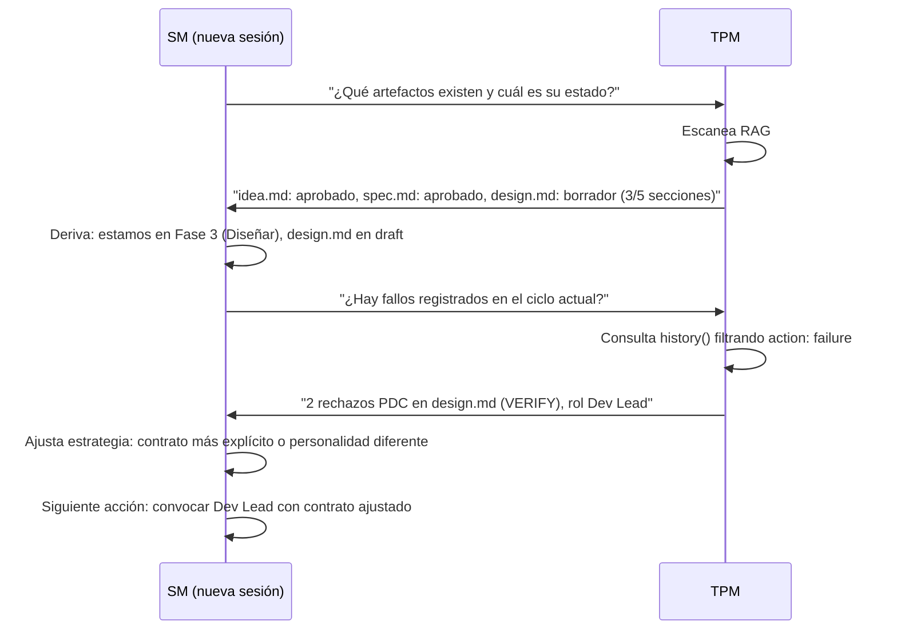

# Protocolo de Recuperación

← [Índice principal](../../README.md) | [Planificación](../README.md) | [Comportamiento SM](README.md)

## Recovery protocol (inicio de sesión)



---

## Historial de Fallos

El circuit breaker protege intra-sesion, pero los fallos tambien se
registran cross-session en `history()` del artefacto afectado (ver
[TPM e Interfaz del Adaptador](../artifacts/tpm-adapter.md#historyartifact)).
Esto permite al SM aprender
de fallos anteriores al recuperar estado.

**Que se registra**: cada fallo se almacena como entrada en `history()`
con `action: "failure"` y metadata especifica del tipo:

| Tipo | Campos adicionales | Ejemplo |
|------|-------------------|---------|
| `pdc_rejection` | `step` (ECHO/VERIFY/MARK/DECIDE), `role`, `reason` | Rechazo en VERIFY: output no cubre ACs |
| `circuit_breaker` | `role`, `consecutive` | 3 fallos consecutivos del rol QA |
| `escalation` | `role`, `description`, `resolution` | Gap en diseno de auth, MIM proveyo ADR |
| `redelegation` | `role`, `reason`, `contract_delta` | Scope demasiado amplio, acotado a ACs 1-3 |

Formato de registro (todos comparten campos base `action: "failure"`,
`phase`, `timestamp`):

```yaml
# Ejemplo: rechazo PDC
{ action: "failure", type: "pdc_rejection", step: "VERIFY",
  role: "Dev Lead", reason: "output no cubre 2 de 5 ACs", phase: 3 }

# Ejemplo: circuit breaker
{ action: "failure", type: "circuit_breaker",
  role: "QA", consecutive: 3, phase: 6 }
```

**Como el SM usa el historial en recovery**:

1. Despues de derivar la fase actual, el SM pregunta al TPM:
   "Hay fallos registrados en el ciclo actual?"
2. El TPM consulta `history()` de los artefactos en progreso filtrando
   `action: "failure"`.
3. Si existen fallos, el SM ajusta la estrategia antes de re-delegar:
   - **Rechazo PDC recurrente** — contrato mas explicito, personalidad
     del rol ajustada, scope mas acotado.
   - **Circuit breaker previo** — cambiar enfoque del rol o escalar
     tier desde el inicio.
   - **Escalacion resuelta** — inyectar la resolucion del MIM como
     contexto explicito en el nuevo contrato.
   - **Re-delegacion previa** — aplicar el `contract_delta` que
     funciono como baseline del nuevo contrato.
