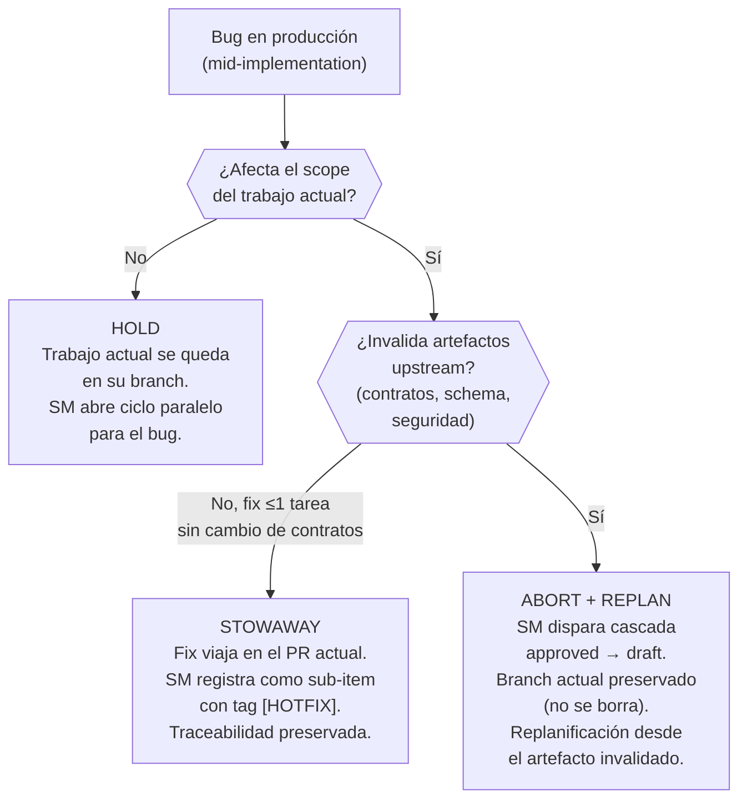
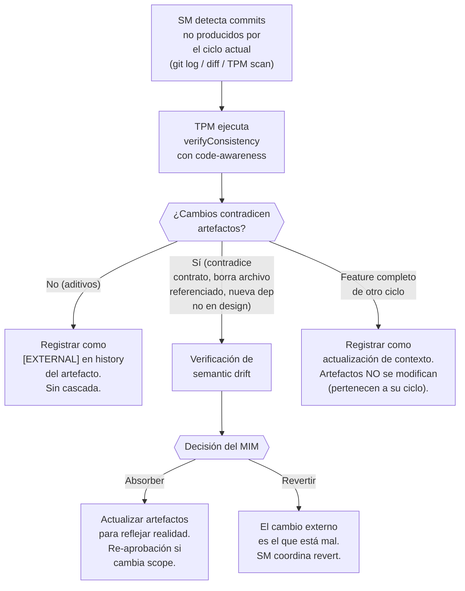
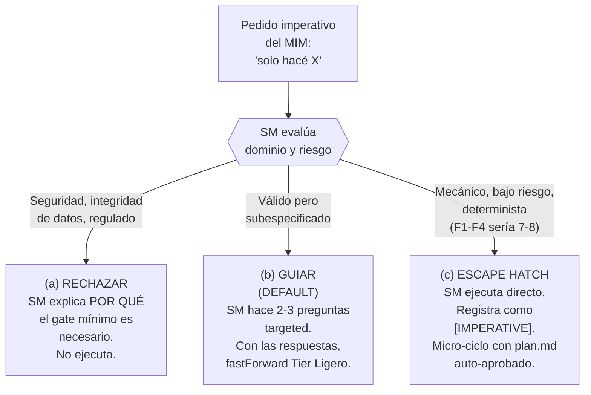
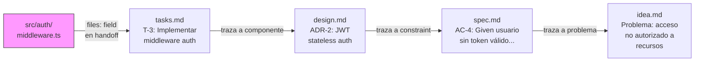

# Handoff — Virgil Gap Fixes

> **Ciclo de vida**: este archivo es efímero. Se elimina después de que
> el equipo de verificación apruebe los cambios. NO es un artefacto
> permanente del proyecto.

---

## Contexto

Los docs de metodología de Virgil (31 archivos bajo `docs/`, ~12K líneas)
tienen 4 gaps confirmados y 6 escenarios adicionales no cubiertos que
cualquier proyecto de web services va a encontrar. Los gaps existen en
la *definición de metodología*, no en código — todos los fixes son
cambios de documentación en archivos `.md` existentes.

---

## Registro de Gaps

### G1 — Protocolo de Interrupción

**Problema**: cuando un bug de producción llega mid-implementation,
`fast-forward.md` dice que el SM puede fastForward el bug a ejecución.
Pero no dice NADA sobre qué pasa con el trabajo ya en curso.

**Dónde arreglar**: `docs/planning/behavior/fast-forward.md` — nueva
sección después de "fastForward también aplica MID-CYCLE".

**Qué documentar**:

Árbol de decisión del SM:

Tres estrategias con condiciones de entrada:

| Estrategia | Condiciones | Riesgo | Acción del SM |
|------------|-------------|--------|---------------|
| **Hold** | Bug independiente del scope actual | Branch actual envejece si el bug tarda | Abrir ciclo paralelo. Registrar `[INTERRUPTION]` en idea.md/plan.md del ciclo actual |
| **Stowaway** | Bug en mismo dominio AND fix ≤1 tarea AND no cambia contratos | Contamina scope del PR; `verifyConsistency` debe detectar drift | Registrar sub-item con `[HOTFIX]` en handoff. El fix pasa por el echo del ciclo actual |
| **Abort + Replan** | Bug invalida suposiciones (schema, contratos, seguridad) | Trabajo potencialmente perdido | Cascada `approved → draft` en artefactos afectados. Branch preservado para cherry-pick post-replan |

**Gate obligatorio**: el SM DEBE registrar la decisión de interrupción y
su razonamiento como entrada `[INTERRUPTION]` en el `idea.md` o
`plan.md` del ciclo actual. Formato:
`[INTERRUPTION] Estrategia: {hold|stowaway|abort}. Razón: {resumen}.`

---

### G2 — Reconciliación de Cambios Externos

**Problema**: si otro agente, colaborador o pipeline de CI modifica el
codebase fuera del flujo de Virgil, no existe protocolo para detectar
divergencia entre artefactos (fuente de verdad del QUÉ) y código (fuente
de verdad del CÓMO).

**Dónde arreglar**: `docs/planning/behavior/recovery.md` — nueva sección
"Reconciliación tras cambios externos".

**Qué documentar**:

Adición al TPM: campo `lastVerifiedAt` (timestamp) por artefacto. Al
inicio de sesión, si `lastVerifiedAt` es anterior al último commit que
toca archivos en el scope del artefacto, el SM lo marca para
re-verificación.

---

### G3 — Modo Imperativo (escape hatch con guardrails)

**Problema**: el usuario dice "solo hacé X" sin pasar por la metodología.
No hay respuesta documentada del SM — ni rechazo, ni guía, ni escape
hatch.

**Dónde arreglar**: `docs/planning/behavior/phases.md` — nueva sección
antes de "Detalle por fase". Alternativamente, nuevo archivo
`docs/planning/behavior/imperative.md` enlazado desde el índice de SM
Behavior.

**Qué documentar**:

| Respuesta | Cuándo | Ejemplos | Qué hace el SM |
|-----------|--------|----------|----------------|
| **(a) Rechazar** | Request toca seguridad (auth, crypto, secrets), integridad de datos (migraciones, schema), o dominios regulados | "Cambiá la encriptación a MD5", "Borrá la tabla users" | Explica el riesgo concreto. NO ejecuta. Ofrece guía (b) como alternativa. |
| **(b) Guiar** | Request válido pero sin scope, ACs, o evaluación de impacto. **DEFAULT para pedidos imperativos.** | "Agregá un endpoint de health", "Poné rate limiting" | 2-3 preguntas targeted → fastForward Tier Ligero (plan.md) |
| **(c) Escape hatch** | Request mecánico, bajo riesgo, determinista. Score F1-F4 sería 7-8. | "Renombrá X a Y", "Actualizá ESLint a v9", "Corregí este typo" | Ejecuta directamente. Registra `[IMPERATIVE]` en ciclo actual o como micro-ciclo standalone. |

**Restricción del escape hatch**: NUNCA aplica a cambios que modifiquen
contratos, APIs públicas, schemas de base de datos, o boundaries de
seguridad. Si hay duda, el SM elige (b) guiar.

**Audit trail**: toda interacción imperativa (a, b, o c) se registra con
el razonamiento del SM sobre qué path eligió y por qué.

---

### G4 — Trazabilidad Código → Artefacto (binding inverso)

**Problema**: el binding layer traza artefacto-a-artefacto (idea → spec →
design → tasks → handoff). Pero no hay mecanismo para trazar DESDE
código HACIA el artefacto que lo motivó. Dado `src/auth/middleware.ts`,
no se puede determinar mecánicamente qué tarea, AC, o idea lo originó.

**Dónde arreglar**: `docs/planning/artifacts/README.md` — nueva sección
después de "Ownership". También tocar docs de ejecución para la
convención de anotación.

**Qué documentar**:

Tres mecanismos complementarios (no code annotations):

| Mecanismo | Dónde vive | Cómo funciona |
|-----------|-----------|---------------|
| **Binding annotation** | `handoff.md` / `tasks.md` | Durante Fase Green, el implementor anota cada tarea con los archivos creados/modificados. Campo `files:` por tarea. |
| **Git integration** | Historial de git | Commits referencian task IDs: `feat(T-3): implement auth middleware`. Trazabilidad secundaria vía `git log --grep`. |
| **Reverse query** | `verifyConsistency --reverse` | Dado un path, camina el grafo de binding hacia atrás: file → task → design → spec AC → idea. |

**Regla**: la trazabilidad vive en los artefactos y en git, NUNCA en
comentarios de código. Sin `// Task: T-3`. Sin `// See spec AC-4`.

---

## Escenarios Adicionales (Web Services)

### S1 — CVE en Dependencia Mid-Implementation

Supply chain comprometido. El SM lo trata como Hold (G1) a menos que el
CVE afecte el módulo que se está implementando (entonces Abort+Replan).
La actualización de dependencia puede requerir cambios de contrato si la
API del paquete cambió entre versiones parcheadas.

**Dónde documentar**: `docs/planning/behavior/fast-forward.md` como
sub-caso de G1.

---

### S2 — API Externa Rompe Contrato

API de tercero cambia su contrato (nuevo campo requerido, endpoint
deprecado, cambio de rate limit). Invalida suposiciones en `design.md` y
posiblemente en `spec.md`.

**Comportamiento esperado**: SM dispara verificación de semantic drift en
`design.md`. Si el cambio es backward-compatible (nuevo campo opcional)
→ drift menor (absorber). Si es breaking (endpoint removido) → drift
crítico, cascada hasta `design.md` y posiblemente `spec.md` para
re-aprobación.

**Dónde documentar**: `docs/planning/artifacts/state-machine.md` como
ejemplo bajo detección de semanticDrift.

---

### S3 — Conflicto de Migraciones de Base de Datos

Dos cambios concurrentes (o un cambio + un hotfix) requieren migraciones
de base de datos que conflictúan (ambos alteran la misma tabla, o uno
depende del estado del otro).

**Comportamiento esperado**: el SM detecta esto durante prePhase
Contratos — ambos cambios declaran sus modificaciones de schema. Si hay
conflicto, el SM serializa: uno va primero, el otro replanifica su
migración contra la nueva baseline.

**Dónde documentar**: `docs/execution/contracts.md` como nota sobre
detección de colisión de contratos.

---

### S4 — Rollback Post-Deploy

Un cambio desplegado pasa todos los gates (Accept, Verify) pero causa
problemas en producción no detectados. El cambio se revierte, pero el
SIGUIENTE cambio (ya en planificación o ejecución) depende de él.

**Comportamiento esperado**: SM trata el rollback como interrupción
Abort + Replan para el cambio dependiente. El cambio revertido re-entra
al ciclo en la fase apropiada (posiblemente Fase 6 Verify con nuevos
test cases que cubran el problema de producción). La Retrospectiva
(Fase 8) del cambio revertido DEBE capturar el gap que los gates no
detectaron.

**Dónde documentar**: `docs/planning/behavior/phases.md` en la sección
de Despliegue, como protocolo de rollback.

---

### S5 — Interacción de Feature Flags

Dos features detrás de feature flags son independientemente correctos
pero interactúan inesperadamente cuando ambos están habilitados. Los
tests de ningún feature cubren el estado combinado.

**Comportamiento esperado**: gap de verificación. `verifyConsistency`
debería verificar si múltiples ciclos activos comparten scopes de
archivos superpuestos. Si es así, SM marca interacción potencial y
recomienda integration testing con flags combinados. Esto es advisory,
no bloqueante.

**Dónde documentar**: `docs/execution/accept.md` como nota sobre testing
de interacción multi-ciclo.

---

### S6 — Drift de Ambientes (Staging ≠ Producción)

Staging y producción divergen en configuración, datos o estado de
infraestructura. Tests pasan en staging pero la implementación se
comporta diferente en producción.

**Comportamiento esperado**: el principio de "homogeneidad de ambientes"
del echo system ya cubre esto conceptualmente. Lo que falta es una
recomendación concreta: el gate de Despliegue (transición de ejecución a
operación) debería incluir una verificación de paridad de ambientes.
Esto NO es un enforcement de Virgil (Virgil no gestiona infraestructura)
sino un gate RECOMENDADO que el echo system puede orquestar.

**Dónde documentar**: `docs/echo-system.md` como verificación
recomendada en la transición de despliegue, y
`docs/planning/behavior/phases.md` en la sección de Despliegue.

---

## Scope de Trabajo

### Equipo Experto (escritores)

1. Arreglar G1-G4 en los docs existentes (editar archivos, agregar
   secciones)
2. Documentar S1-S6 en las ubicaciones indicadas (principalmente
   adiciones a secciones existentes)
3. Asegurar que todas las adiciones sigan las convenciones existentes:
   - Diagramas Mermaid para flujos y decisiones
   - Tablas para comparaciones estructuradas
   - Cross-references a docs relacionados usando links relativos
   - Terminología consistente con `docs/glossary.md`
4. Actualizar el glosario con nuevos términos introducidos

### Equipo de Verificación (Scrum Team)

Después de aplicar los fixes, verificar:

1. Cada gap (G1-G4) tiene documentación que responde la pregunta original
2. Cada escenario (S1-S6) está abordado o explícitamente marcado TBD con
   razonamiento
3. Sin semantic drift: contenido nuevo consistente con dogma y principios
   existentes
4. Cross-references válidos (sin links rotos)
5. Las 3 preguntas originales del MIM son respondibles solo con los docs

---

## Restricciones

- Todos los docs actualmente están en español. Los fixes DEBEN ser en
  español (la migración a inglés es Phase 0, sucede después de esto).
- NO reestructurar docs existentes. Agregar secciones, no reorganizar.
- NO crear archivos nuevos salvo que el contenido no quepa en ningún
  archivo existente. Preferir agregar secciones a docs existentes.
- Preservar todo el frontmatter (id, title, mode, type, tags).
- Seguir el estilo existente de diagramas Mermaid (comentarios con `%%`,
  naming consistente).
