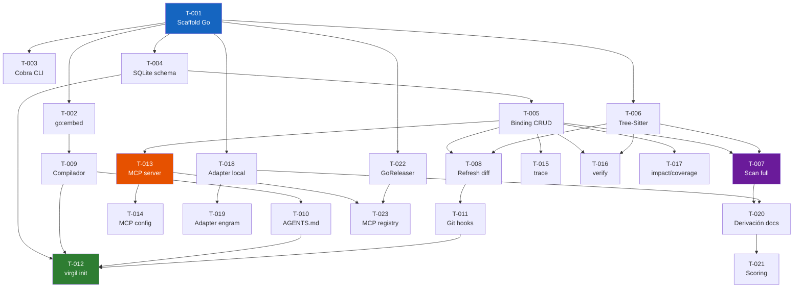

# Handoff: Virgil v2

## Resumen ejecutivo

Virgil v2 es una herramienta CLI en Go (100% pure, sin CGo) que provee
**metodología e2e y ownership** a proyectos de software asistidos por IA.

**Dogma** (6 principios): implementa la visión de Uncle Bob (julio 2026) —
no revisas código del agente, verificas trazabilidad Y fuerza (mutation,
CRAP, complexity), gestionas desde un nivel superior, el agente opera bajo
constraint (hooks + gates determinísticos), un handoff habilita ejecución
paralela con semántica de coordinación (claiming, execution state), y cada
transición de fase tiene validación mecánica. La metodología cubre desde la
idea hasta la operación del producto (operación es un facade opcional).

Reemplaza un AGENTS.md monolítico de 1,061 líneas con delivery modular (skills,
hooks, MCP server) y agrega un **binding layer** — un grafo de trazabilidad
SQLite que vincula requisitos con código y tests a nivel de símbolo, mantenido
por GoTreeSitter (pure Go) y git hooks incrementales. Se distribuye como
binario estático multiplataforma via GoReleaser + Homebrew. `go install` funciona
sin toolchain C.

---

## Stack y arquitectura

**Referencia completa**: `design-virgil-v2.md`

### Decisiones clave

| Decisión | Elección | Por qué |
|----------|----------|---------|
| Lenguaje | Go 1.23+ | Binario estático, go:embed, performance |
| Parsing | GoTreeSitter (pure Go) | Reimplementación Go, 205 grammars, sin CGo |
| Storage del grafo | SQLite (modernc.org/sqlite, pure Go) | Transpilación Go, queries SQL, tooling universal |
| Comunicación agente | MCP (JSON-RPC stdio) | Estándar interoperable, sin red |
| Assets | go:embed | Metodología versionada atómicamente con el binario |
| Distribution | GoReleaser → Homebrew / go install | Multi-plataforma, MCP registry |
| Skills | Markdown plano (.virgil/skills/) | Progressive disclosure, editable, diffable |
| Hooks | Shell delgado → virgil refresh | Testeable, fail-open, auditable |

### Módulos internos

```
virgil/
├── cmd/virgil/          # main.go + cobra wiring
├── internal/
│   ├── cli/             # comandos (init, scan, refresh, verify, trace, impact, coverage)
│   ├── compiler/        # 31 docs embebidos → skills + hooks + AGENTS.md
│   ├── scanner/         # Tree-Sitter → CodeArtifact / TestArtifact
│   │   └── grammar/     # Strategy: queries .scm por lenguaje
│   ├── binding/         # dominio: entidades, repositorios, staleness
│   │   └── sqlite/      # implementación Repository sobre SQLite
│   ├── mcpserver/       # tools MCP → queries del binding engine
│   ├── adapter/         # DocAdapter interface + local / engram / github
│   └── gitio/           # git plumbing wrapper (diff-tree, rev-parse)
└── assets/              # go:embed: docs, templates, schema.sql, hooks
```

### Stack 100% pure Go

`CGO_ENABLED=0` — sin dependencias C, sin zig, sin musl.
- GoTreeSitter: reimplementación Go de Tree-Sitter (no wrapper CGo)
- modernc.org/sqlite: transpilación Go del amalgamation C de SQLite
- Cross-compile trivial: `GOOS/GOARCH` estándar
- `go install github.com/.../virgil@latest` funciona en cualquier máquina con Go

---

## Tareas a ejecutar

**Referencia completa**: `tasks-virgil-v2.md`

### DAG de dependencias



### Ruta crítica

```
T-001 → T-004 → T-005 → T-007 → T-020 → T-021
              ↘ T-006 ↗
```

6 tareas en ruta crítica. El cuello es T-006 (GoTreeSitter) y T-007 (scan
completo) — la integración de las queries de extracción por lenguaje es
el riesgo técnico más alto (ya no hay riesgo CGo: stack 100% pure Go).

### Lanes paralelos

| Lane | Tareas | Tema |
|------|--------|------|
| A (crítico) | T-001 → T-004 → T-005 → T-007 → T-020 → T-021 | Binding + takeover |
| B | T-001 → T-006 → merge con A en T-007 | Tree-Sitter |
| C | T-001 → T-002 → T-009 → T-010 → T-012 | Compilador + init |
| D | T-005 → T-013 → T-014, T-023 | MCP server |
| E | T-005 → T-015, T-016, T-017, T-024, T-025, T-026 | CLI queries + metrics |
| F | T-001 → T-018 → T-019 | Adapters |
| G | T-001 → T-022 → T-023 | Distribution |
| H | T-005 → T-027 → T-028 | Handoff gates + coordination |

### Resumen de tareas

| ID | Título | Est. | Dep. | Lane |
|----|--------|------|------|------|
| T-001 | Scaffold módulo Go | S | — | Todas |
| T-002 | go:embed docs metodología | S | T-001 | C |
| T-003 | Cobra CLI commands | S | T-001 | — |
| T-004 | SQLite schema binding layer | M | T-001 | A |
| T-005 | Repository CRUD bindings | M | T-004 | A |
| T-006 | GoTreeSitter pure Go + grammars tier-1 | L | T-001 | B |
| T-007 | virgil scan --full | L | T-005, T-006 | A+B |
| T-008 | virgil refresh --diff | M | T-005, T-006 | — |
| T-009 | Compilador modular | L | T-002 | C |
| T-010 | AGENTS.md mínimo (40-80 líneas) | S | T-009 | C |
| T-011 | Instalación git hooks | M | T-008 | — |
| T-012 | virgil init completo | M | T-004,T-009,T-010,T-011 | C |
| T-013 | MCP server (JSON-RPC stdio) | L | T-005 | D |
| T-014 | MCP config generada por init | S | T-013 | D |
| T-015 | virgil trace | S | T-005 | E |
| T-016 | virgil verify | M | T-005, T-006 | E |
| T-017 | virgil impact + coverage | S | T-005 | E |
| T-018 | Adapter local (default) | S | T-001 | F |
| T-019 | Adapter engram | M | T-018 | F |
| T-020 | Derivación docs desde codebase | L | T-007, T-018 | A |
| T-021 | Scoring brownfield | M | T-020 | A |
| T-022 | GoReleaser multi-platform (pure Go, trivial) | S | T-001 | G |
| T-023 | MCP registry | S | T-013, T-022 | G |
| T-024 | virgil health (métricas Uncle Bob) | M | T-005, T-018 | E |
| T-025 | virgil coverage --min (gate CI) | S | T-017 | E |
| T-026 | virgil metrics (orquestación herramientas externas) | M | T-005, T-018 | E |
| T-027 | virgil handoff lint (gate determinístico) | M | T-005 | H |
| T-028 | execution state + claiming de tasks | M | T-004, T-027 | H |

**Total**: 28 tareas — 9S, 12M, 5L (estimación: ~140-190 horas).

### Blockers conocidos

1. **GoTreeSitter queries de extracción**: Las queries de símbolos varían por
   lenguaje. Los lenguajes tier-1 (Go, TS/JS, Python, Rust, Java, C#)
   necesitan testing exhaustivo con fixtures reales.
2. **MCP SDK estabilidad**: El SDK oficial de MCP para Go puede estar en early
   stage. Evaluar madurez antes de T-013; fallback: implementar JSON-RPC 2.0
   sobre stdio desde cero (protocolo simple).
3. **modernc.org/sqlite libc pinning**: Requiere versión exacta de
   `modernc.org/libc` en go.mod. Documentar en contributing guide.
4. **Adapters de métricas externas**: El output format de herramientas como
   mutate4go, Stryker, pitest varía. Los adapters de parsing deben
   versionarse y testearse contra fixtures reales de cada herramienta.

---

## Estrategia de pruebas

### Testing por módulo

| Módulo | Tipo de test | Herramienta | Cobertura esperada |
|--------|-------------|-------------|-------------------|
| `binding/` | Unit (in-memory repo) + Integration (SQLite real) | `go test` | ≥ 90% |
| `scanner/` | Unit (fixtures por lenguaje) | `go test` + archivos fixture | ≥ 80% |
| `compiler/` | Unit (output vs snapshot) + Integration | `go test` | ≥ 85% |
| `mcpserver/` | Integration (stdio pipe) | `go test` + MCP test client | ≥ 80% |
| `adapter/` | Unit (interface contract) + Integration (filesystem) | `go test` | ≥ 85% |
| `metrics/` | Unit (mock exec) + Integration (herramienta real) | `go test` | ≥ 80% |
| `handoff/` | Unit (linter rules) + Integration (handoff fixtures) | `go test` | ≥ 85% |
| `cli/` | Integration (exec.Command del binario) | `go test` | ≥ 70% |
| `gitio/` | Integration (repo fixture con commits) | `go test` + `git init` en tempdir | ≥ 75% |

### Testing de performance (RNF-01)

- Corpus fijo de 50K LOC (multi-lenguaje) en CI
- `virgil scan --full` < 30s
- `virgil refresh --diff` con delta de 100 líneas < 2s
- Query MCP < 500ms
- Memoria máxima < 512 MB (via GOMEMLIMIT + medición)

### Testing de integración E2E

- Proyecto fixture con: idea.md, spec.md, código, tests
- `virgil init` → `virgil scan --full` → `virgil trace AC-1` → verificar resultado
- `git commit` → verificar que post-commit hook actualiza bindings
- `virgil verify AC-1` → verificar status correcto

---

## Criterios de aceptación globales

El proyecto se considera completo cuando:

1. **`virgil init`** genera AGENTS.md (40-80 líneas), skills, hooks, binding DB
   y MCP config en < 5s — idempotente
2. **`virgil scan --full`** parsea un codebase de 50K LOC en < 30s y construye
   el grafo completo de CODE_ARTIFACTs y relaciones
3. **`virgil refresh --diff`** actualiza bindings en < 2s para diffs de 100 líneas,
   disparado automáticamente por los 4 git hooks
4. **MCP server** responde `virgil_trace`, `virgil_impact`, `virgil_coverage`,
   `virgil_stale` y `virgil_declare` en < 500ms via stdio
5. **`virgil verify`** re-escanea código via Tree-Sitter y retorna
   implemented|stale|broken con confidence: verified
6. **Skills** reemplazan el AGENTS.md monolítico: progressive disclosure,
   1 skill por fase, ≤ 150 líneas cada uno
7. **Binarios** para macOS (arm64, amd64), Linux (amd64, arm64), Windows (amd64)
   publicados via GoReleaser → Homebrew
8. **Test coverage** ≥ 80% agregado, con suite de performance en CI
9. **Coexistencia**: funciona junto a gentle-ai, Cursor rules y otros ecosistemas
   sin conflictos
10. **`virgil health`** reporta salud en 4 categorías: trazabilidad (binding),
    fuerza de tests (mutation/CRAP via herramientas externas), estructura
    (complexity), y salud documental — gestión desde nivel superior
11. **`virgil coverage --min`** funciona como gate de CI con exit code apropiado
12. **Operación opcional**: proyectos que lo necesiten activan la fase de
    operación (ops-runbook, usage-guide, api-reference según tipo de proyecto)
13. **`virgil metrics`** orquesta herramientas externas de mutation/CRAP/complexity
    por lenguaje detectado, degrada elegantemente cuando no están instaladas
14. **`virgil handoff lint`** valida completitud del contrato (ACs con ID, DAG
    sin ciclos, refs válidas) con errores reparables — gate determinístico
15. **`virgil claim`** permite claiming de tasks con precondiciones verificadas,
    `virgil status` muestra execution state para reanudación determinística

---

## Restricciones de ejecución

### Convenciones del repo

- Go module path: `github.com/{user}/virgil`
- Formato: `gofmt` + `golangci-lint`
- Commits: conventional commits (feat/fix/chore/refactor/test/docs)
- Branching: feature branches → main via PR
- Sin archivos generados en git (bindings.db gitignoreado)

### Reglas de commits

- Un commit por unidad de trabajo atómica
- Tests pasan antes de cada commit
- Pre-commit hook (linting) no bloqueado por Virgil
  (Virgil usa post-* exclusivamente)

### Hooks

- Echo hooks (pre-commit, pre-push): enforcement, bloqueantes
- Virgil hooks (post-commit, post-merge, post-rewrite, post-checkout):
  refresh del grafo, no bloqueantes, fail-open

---

## Contexto que NO se incluye

| Excluido | Razón |
|----------|-------|
| UI web para gestión de bindings | Won't Have — el grafo se consulta via CLI/MCP, no via browser |
| Generación automática de código | Virgil traza y verifica, no genera |
| Ejecución de tests | Virgil vincula tests a ACs, no los ejecuta |
| Gestión de branches/PRs | Responsabilidad de git/gh, no de Virgil |
| Adapter de Jira/Linear | Could Have v2.2+ — solo local y engram en v2.0 |
| Cross-repo binding | Could Have v2.2+ — scope actual es single repo |
| Integración CI bloqueante | Could Have v2.2+ — v2.0 es advisory |

---

## Documentación operativa esperada

Virgil v2 es un CLI de desarrollo (no un servicio desplegado). Documentación
requerida durante la ejecución:

| Documento | Audiencia | Formato |
|-----------|-----------|---------|
| README.md | Usuarios de Virgil | Markdown: instalación, quickstart, comandos |
| CLI reference | Usuarios avanzados | Generado por cobra (`virgil --help`, man pages) |
| Contributing guide | Contribuidores | Markdown: setup, testing, release process |
| Architecture overview | Contribuidores | Resumen de design-virgil-v2.md en docs/ |

No aplica: ops-runbook, SLAs, monitoreo, troubleshooting de producción
(Virgil no tiene servicios desplegados).

---

## Metadata

| Campo | Valor |
|-------|-------|
| Fecha de generación | 2026-08-05 |
| Artefactos fuente | idea-virgil-v2.md, spec-virgil-v2.md, design-virgil-v2.md, tasks-virgil-v2.md |
| Estado | generado |
| Pipeline | idea → spec → design → tasks → **handoff** |
| Aprobación pendiente | MIM |
