# Virgil v2 — Idea Document

## Identidad

Virgil es una herramienta de **metodología y ownership** para proyectos de
software asistidos por IA. No es un agente. No es un framework de UI. Es el
puente entre una metodología de desarrollo (idea-to-mvp) y cualquier agente
que la implemente.

### Dogma primordial

Virgil existe para hacer ejecutable la visión que Robert C. Martin ("Uncle
Bob") declaró en julio 2026:

> *"I don't review code written by agents. I measure things like test
> coverage, dependency structure, cyclomatic complexity, module sizes,
> mutation testing, etc. The code itself I leave to the AI. Humans are slow
> at code. To get productivity we humans need to disengage from code and
> manage from a higher level."*

Virgil es la respuesta operativa a esa declaración:

1. **Metodología e2e** — desde la idea hasta la operación del producto, cada
   fase produce artefactos verificables (idea → spec → design → tasks →
   handoff → implementación → operación). La fase de operación es **opcional**
   — un facade/plugin que cada proyecto activa si lo necesita.
2. **No revisas código del agente — verificas trazabilidad Y fuerza** — el
   binding layer confirma que los ACs están vinculados a código y tests
   (`virgil verify`, `virgil coverage`). El motor de métricas confirma que
   esos tests son **fuertes**: mutation score, CRAP (Change Risk
   Anti-Patterns), complejidad ciclomática. Sin ambas capas, la verificación
   es débil — un test vacuo (`assert(true)`) puede aparecer como "verified"
   en el binding pero no resiste mutation testing.
3. **Gestionas desde un nivel superior** — el dashboard de salud del proyecto
   (`virgil health`) orquesta herramientas de métricas existentes por
   lenguaje y persiste resultados junto al binding, con thresholds
   configurables por tier:
   - **Trazabilidad**: binding coverage, staleness, gaps (binding layer)
   - **Fuerza de tests**: mutation score, CRAP score (herramientas externas
     por lenguaje: mutate4go, Stryker, pitest, mutmut)
   - **Estructura**: complejidad ciclomática, dependency structure, module
     sizes (análisis estático)
   - **Salud documental**: completitud de docs funcionales, ACs sin binding
   Virgil no construye las herramientas de mutación — las orquesta. El
   ecosistema de Uncle Bob (mutate4go, crap4go) y sus equivalentes por
   lenguaje son los motores; Virgil es el tablero de control.
4. **El agente opera bajo constraint, no bajo confianza** — hooks, skills y
   binding declarations garantizan que la metodología se cumple.
5. **Un handoff, ejecución paralela con semántica de coordinación** — a
   diferencia de pipelines seriales entre agentes (Especificador →
   Codificador → Limpiador → Arquitecto → Hardener → QA con handoff en cada
   paso), Virgil produce UN handoff autocontenido que habilita ejecución
   paralela por lanes independientes. Sin cascadas inversas, sin
   mini-waterfall. Agile, no waterfall disfrazado.
   El handoff de Virgil no es un dump de código entre agentes — es una US
   completamente definida, justificada desde negocio, con ACs verificables,
   decisiones arquitectónicas documentadas, y tasks con dependencias
   resueltas. Groomeada por 5 fases antes de que se escriba una línea.
   El paralelismo tiene semántica operativa diseñada:
   - **Claiming**: cada task tiene estado (`pending | claimed | done`) con
     owner y timestamp — no hay dos lanes trabajando la misma task
   - **Concurrencia de store**: WAL mode + serialización de escrituras al
     grafo SQLite — hooks y lanes simultáneos no corrompen datos
   - **Merge discipline**: política explícita de integración entre lanes
     cuando tocan módulos compartidos
6. **Gates determinísticos, no advisory** — cada transición de fase tiene
   validación mecánica. `virgil handoff lint` verifica completitud del
   contrato antes de habilitar código: ACs con ID, tasks con dependencias
   resueltas, referencias a spec/design válidas. El gate "ZERO código hasta
   handoff aprobado" es enforcement real, no sugerencia. Esto incluye
   execution state versionado dentro del handoff (checklist con timestamps)
   para reanudación determinística tras crash o compaction del agente.

### Independencia

Virgil es **independiente** de cualquier ecosistema de agentes. gentle-ai,
Cursor rules, Copilot instructions u otros pueden coexistir en la máquina
— Virgil no los interfiere ni se deja interferir. Si el MIM usa herramientas
fuera del sistema de Virgil, el ownership funcional no se pierde pero le
costará reconectar el contexto (re-ownership).

---

## Contexto del Sistema

El proyecto destino **instala** Virgil (dev dependency o global) y jala de
él: metodología, skills, binding layer, gobernanza. No es Virgil empujando
hacia afuera — es el proyecto incorporando la capacidad.

```
# Ejemplo de uso — greenfield
cd ~/projects/nuevo-proyecto && claude
> "Tengo una /virgil-idea, ayúdame a desarrollarla en este repo vacío"

# Ejemplo de uso — brownfield
cd ~/projects/proyecto-existente && claude
> "Necesito hacer /virgil-takeover de este proyecto para hacer cambios"
```

Los slash commands (`/virgil-*`) son el entry point. El MIM no necesita
saber de CLIs ni de configuración — habla con su agente y Virgil se activa.

### Modelo mental del agente al activarse

Cuando Virgil se activa (via `/virgil-*` o al leer el bootstrap en
AGENTS.md), el agente reconoce su rol y sus herramientas:

```
"Soy el SM. Tengo acceso a:"

1. RAG de Virgil (metodología)     → skills en {path}, cargados on demand
2. RAG del proyecto (docs func.)   → adapter configurado (local /docs, engram, etc.)
3. Binding layer (docs ↔ código)   → MCP/tool consultable en tiempo real
4. El código                       → working tree del repo

"Las herramientas se usan como dicen los docs de Virgil
 (RAGgeables — no cargo todo al contexto, consulto cuando necesito)"
```

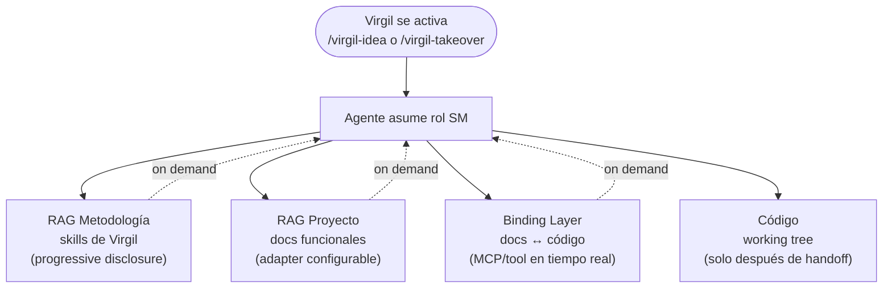

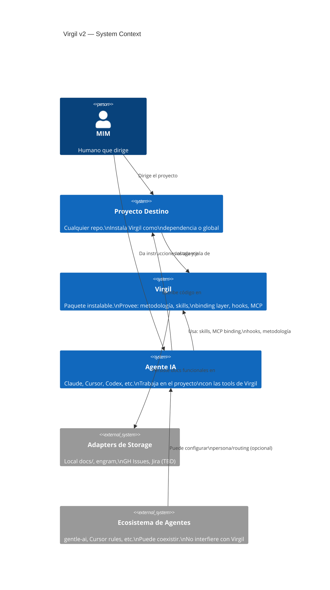

### Flujo de adopción

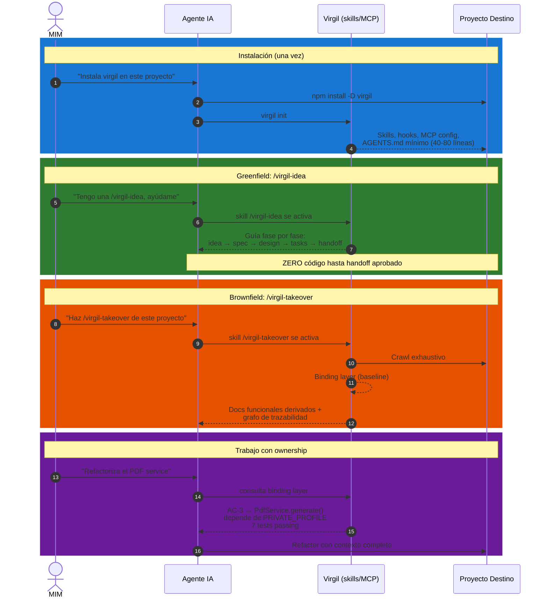

---

## Problema

El enfoque actual (virgil v0.1.x) compila 31 docs de metodología en un
AGENTS.md monolítico de 1,061 líneas. Esto falla porque:

1. **Monolítico**: archivos >150 líneas degradan rendimiento del agente
2. **Estático**: se compila una vez, no se adapta al contexto
3. **Plano**: ignora los mecanismos nativos del agente (skills, commands, sub-agents)
4. **Sin binding**: no hay vínculo entre docs funcionales y código real
5. **Sin enforcement**: el agente puede ignorar todo — es advisory puro

---

## Propuesta: 3 Capas + Binding Layer

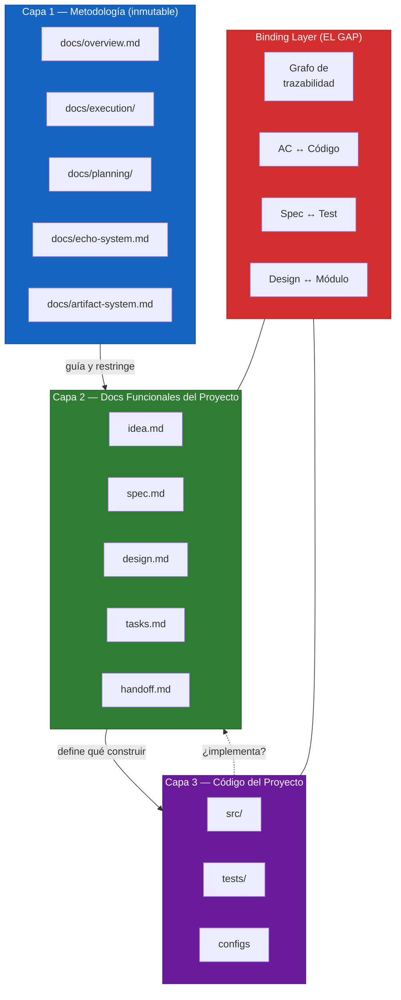

### Capa 1 — Metodología (fuente de verdad permanente)

Los 31 docs existentes en `docs/`. Describen la metodología y dan un norte
al agente sobre qué puede y qué no puede hacer según el estado de las fases.
Como un Scrum Master bloqueando al junior que quiere codear sin haber
groomeado.

**Delivery**: NO como AGENTS.md monolítico. Se entrega como:
- Skills modulares (progressive disclosure — solo nombre+descripción al inicio)
- Gobernanza mínima en AGENTS.md/CLAUDE.md (40-80 líneas: axiomas + build/test)
- Hooks para guardrails determinísticos

### Capa 2 — Docs Funcionales del Proyecto

Los artefactos que la metodología produce: `idea.md`, `spec.md`, `design.md`,
`tasks.md`, `handoff.md`. Específicos por proyecto. Almacenados en el adapter
configurado (local, engram, GitHub, Jira — TBD).

### Capa 3 — Código del Proyecto

El working tree del repo destino. Lo que el agente implementa una vez que
los docs funcionales existen y están aprobados.

### Binding Layer — EL GAP CRÍTICO

El vínculo lógico real entre requerimiento y código. Hoy no existe.
Sin este binding:
- El PDC no puede verificar que un AC está realmente implementado
- El takeover no puede conectar código existente con docs funcionales
- Los refactors no pueden evaluar impacto en requerimientos
- La desincronización entre docs y código es invisible

---

## Dos Flujos que Producen Ownership

### Flujo 1: Idea → Producto (greenfield)

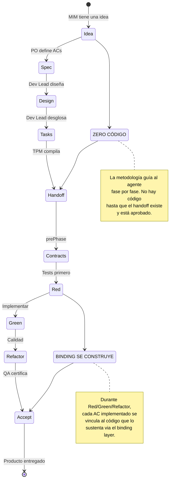

### Flujo 2: Takeover → Ownership (brownfield)

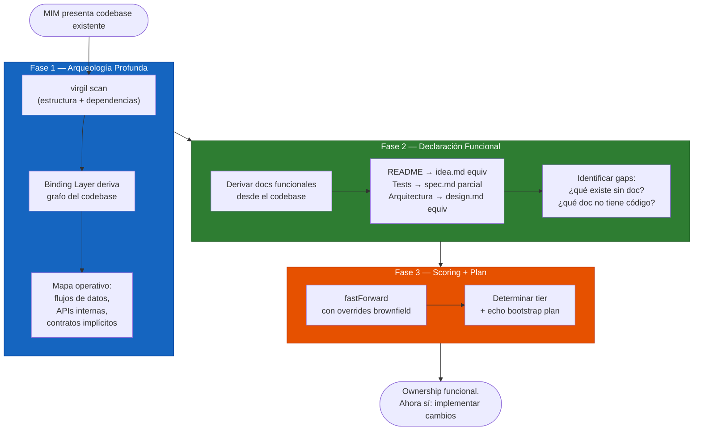

**Punto clave**: el takeover NO produce código. Produce los docs funcionales
equivalentes que un proyecto greenfield ya tendría. Cero código hasta que el
ownership funcional exista.

---

## Binding Layer — Diseño Conceptual

### Modelo de datos

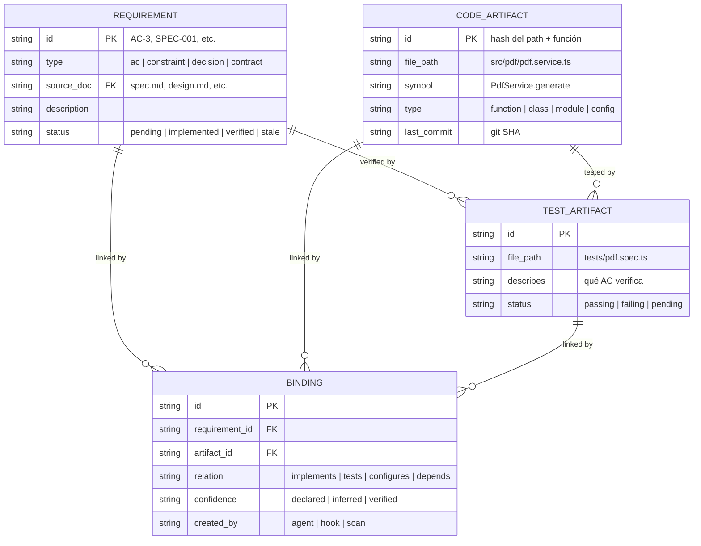

### Cómo se construye y mantiene el grafo

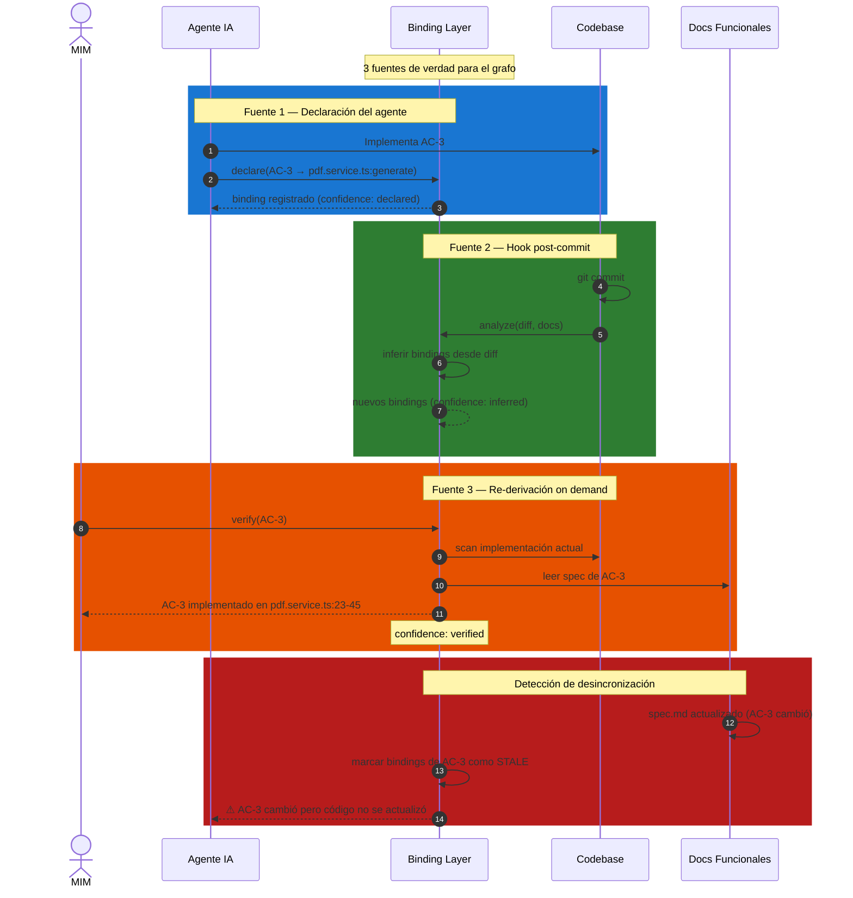

### Estrategia de crawl: exhaustivo una vez, incremental siempre

El crawl exhaustivo del codebase es **caro**. Solo debe ocurrir una vez:
en **takeover**. Después de eso, el binding layer se mantiene actualizado
incrementalmente via git hooks — sin re-crawl completo.

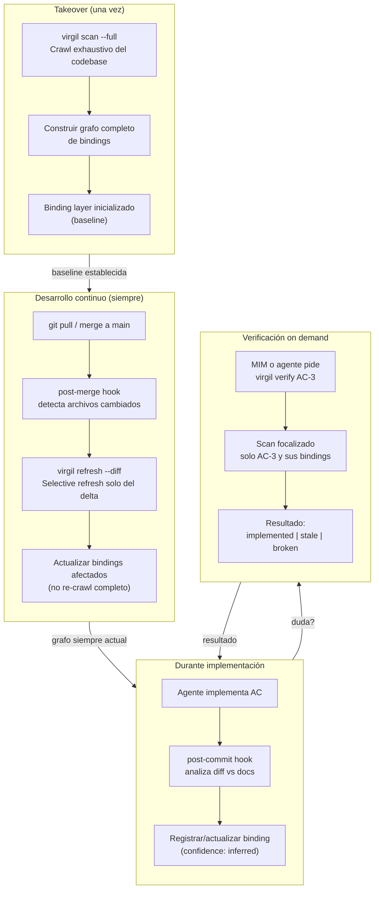

**Git hooks involucrados:**

| Hook | Cuándo dispara | Qué hace Virgil |
|------|---------------|-----------------|
| `post-merge` | Después de `git pull` / `git merge` | Selective refresh: analiza diff, actualiza bindings afectados |
| `post-commit` | Después de cada commit | Inferir bindings: analiza diff vs docs funcionales |
| `post-rewrite` | Después de `rebase` / `amend` | Re-verificar bindings de commits reescritos |
| `post-checkout` | Después de `git switch` / `checkout` | Detectar cambio de rama, marcar bindings como potentially stale |

**Consecuencia**: después del takeover inicial, el costo de mantener el
grafo es proporcional al tamaño del diff — no al tamaño del codebase.
Un proyecto de 100K líneas donde cambias 20 líneas solo re-analiza esas 20.

### Quién mantiene el grafo (estrategia híbrida)

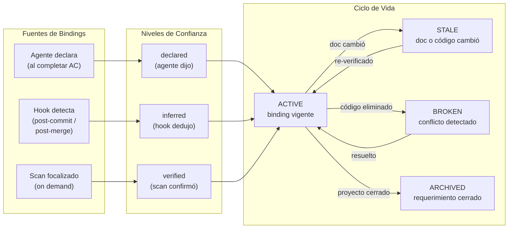

---

## Motor de Métricas — La Mitad Faltante del Dogma

El binding layer resuelve trazabilidad: "¿AC-3 tiene código y tests?". Pero
no resuelve **fuerza**: "¿esos tests realmente detectarían un bug?". Sin
esta segunda capa, `virgil verify` certifica presencia, no calidad.

### El problema del test vacuo

```
func TestGenerate(t *testing.T) {
    result := Generate()
    assert(result != nil)  // pasa siempre, no verifica comportamiento
}
```

El binding layer reporta: `AC-3 → TestGenerate → passing → confidence:
verified`. Pero mutation testing revelaría que el test sobrevive al 100% de
las mutaciones — no tiene poder discriminatorio. CRAP score lo penalizaría
por alta complejidad + baja cobertura efectiva.

### Virgil como orquestador, no como motor

Virgil NO construye herramientas de mutación ni análisis estático. Eso es
el ecosistema — cada lenguaje tiene las suyas:

| Métrica | Go | JS/TS | Python | Java | Rust |
|---------|-----|-------|--------|------|------|
| Mutation | mutate4go | Stryker | mutmut | pitest | cargo-mutants |
| CRAP | crap4go | — (custom) | radon+coverage | — (custom) | — (custom) |
| Complexity | gocyclo | eslint | radon | PMD | clippy |
| DRY | dry4go | jscpd | pylint | CPD | — |

Virgil orquesta: ejecuta la herramienta correcta por lenguaje detectado,
captura resultados estructurados, y los persiste junto al binding layer con
thresholds configurables por tier.

### Flujo de verificación completa

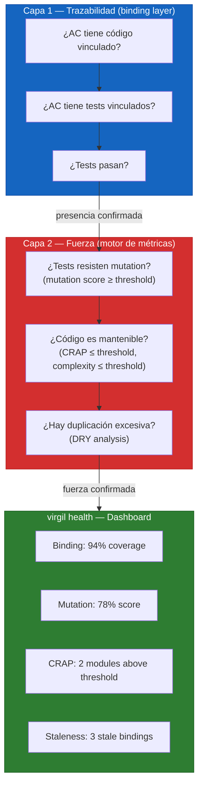

### Thresholds por tier

Los thresholds no son universales — cada proyecto elige su nivel de rigor:

| Tier | Mutation Score | CRAP Max | Complexity Max | Binding Coverage |
|------|---------------|----------|----------------|-----------------|
| **strict** | ≥ 80% | ≤ 30 | ≤ 10 | ≥ 95% |
| **standard** | ≥ 60% | ≤ 45 | ≤ 15 | ≥ 80% |
| **relaxed** | ≥ 40% | ≤ 60 | ≤ 20 | ≥ 60% |
| **custom** | configurable | configurable | configurable | configurable |

`virgil init` pregunta el tier; `virgil health` reporta contra esos
thresholds; `virgil coverage --min` actúa como gate de CI con exit code.

---

## Coordinación de Lanes Paralelos

El principio 5 del dogma ("un handoff, ejecución paralela") requiere
semántica de coordinación diseñada — no basta con declarar lanes.

### El problema de la coordinación

```
Lane A (Binding): T-004 → T-005 → T-007
Lane B (Scanner): T-001 → T-006 → T-007  ← colisión en T-007
Lane D (MCP):     T-005 → T-013           ← depende de Lane A
```

Sin coordinación: dos agentes pueden reclamar T-007, o Lane D puede
arrancar antes de que T-005 esté completa.

### Modelo de claiming

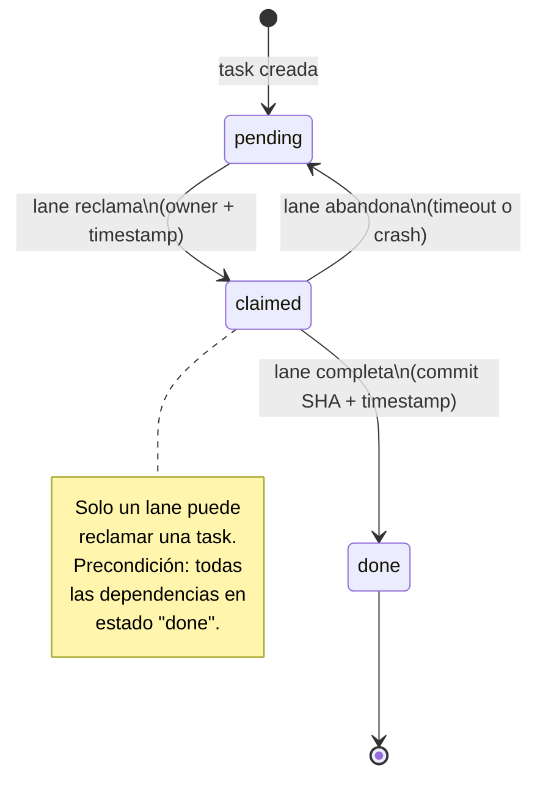

### Política de concurrencia del store

El grafo SQLite recibe escrituras de múltiples fuentes simultáneas:
- Hooks post-commit de cada lane
- `virgil refresh --diff` en paralelo
- Declaraciones del agente via MCP

**Política**: WAL mode (Write-Ahead Logging) + serialización de escrituras
por el binding engine. Las lecturas son no-bloqueantes; las escrituras se
serializan via un mutex del proceso Virgil. Si dos hooks disparan
simultáneamente, el segundo espera — el costo es milisegundos, no segundos.

### Merge discipline entre lanes

Cuando dos lanes tocan módulos compartidos (misma interfaz, misma tabla,
mismo contrato):

1. El binding layer detecta la colisión al recibir declaraciones de ambos
   lanes sobre el mismo `CODE_ARTIFACT`
2. `virgil health` reporta el conflicto como WARNING
3. El MIM resuelve: merge manual, prioridad por lane, o re-diseño de la
   partición

El caso normal (lanes independientes) no tiene overhead — la coordinación
solo interviene en colisiones reales.

---

## Gates Determinísticos

El enforcement por capas (advisory → contextual → determinístico) necesita
gates de máquina en las transiciones de fase, no solo sugerencias.

### virgil handoff lint

Antes de que cualquier lane escriba código, el handoff pasa validación
mecánica:

| Validación | Qué verifica | Error si falla |
|------------|-------------|----------------|
| ACs con ID | Todo AC tiene identificador único (`AC-{n}`) | `handoff:missing-ac-id` |
| Tasks con deps | Toda task referencia dependencias válidas | `handoff:broken-dep` |
| Refs a spec | Todo AC referencia un RF del spec | `handoff:orphan-ac` |
| Refs a design | Toda decisión arquitectónica tiene ADR | `handoff:unlinked-decision` |
| DAG válido | Sin ciclos en el grafo de dependencias | `handoff:cycle-detected` |
| Estimaciones | Toda task tiene estimación (S/M/L) | `handoff:missing-estimate` |

El linter emite errores con guía de reparación — al estilo de los mejores
linters de código: qué falló, dónde, y cómo arreglarlo.

### Execution state en el handoff

El handoff no es un documento estático — tiene estado de ejecución:

```yaml
execution:
  started_at: 2026-08-10T14:30:00Z
  tasks:
    T-001:
      status: done
      lane: A
      claimed_at: 2026-08-10T14:30:00Z
      completed_at: 2026-08-10T14:45:00Z
      commit: a1b2c3d4
    T-004:
      status: claimed
      lane: A
      claimed_at: 2026-08-10T14:46:00Z
    T-006:
      status: pending
```

Esto habilita:
- **Reanudación determinística**: tras crash o compaction, el siguiente
  agente sabe exactamente qué está hecho y qué no
- **Audit trail**: cuándo se reclamó, cuándo se completó, qué commit
  corresponde a cada task
- **Progreso observable**: `virgil status` muestra el estado de ejecución
  del handoff en tiempo real

---

## Delivery: Cómo la Metodología Llega al Agente

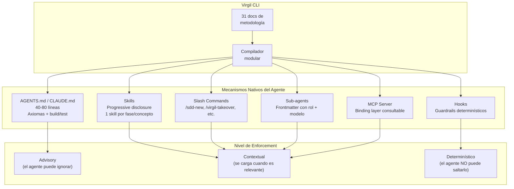

**Lo que cambia de v0.1.x:**
- Ya NO se compila en un archivo monolítico
- Cada concepto/fase se entrega como skill independiente
- Los axiomas van en AGENTS.md mínimo (40-80 líneas)
- Los guardrails críticos (commit por refactor, echo pre-commit) van como hooks
- El binding layer es un MCP o CLI consultable en tiempo real

---

## Stack Técnico

**Dirección**: Go 100% pure (sin CGo), binario estático multiplataforma.

- **Parsing**: GoTreeSitter v0.49+ — reimplementación pure Go de Tree-Sitter,
  205 grammars embebidas, sin dependencia C
- **Storage**: modernc.org/sqlite — transpilación pure Go de SQLite, sin
  driver C
- **Distribución**: GoReleaser → Homebrew (primario), `go install` (secundario).
  Cross-compile trivial: `GOOS=linux GOARCH=amd64 go build` — sin zig, sin
  musl, sin toolchain C
- **Assets**: go:embed para los 31 docs + templates + schema SQL

**No Python**. Performance real para codebases grandes. `CGO_ENABLED=0`.

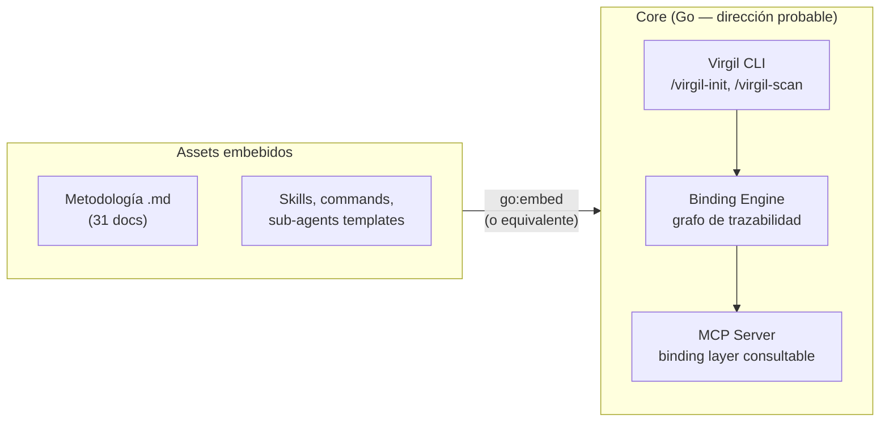

---

## Preguntas Abiertas para Refinamiento

### Resueltas (por iteraciones anteriores + validación vs swarm-forge)

1. ~~**¿Cómo se distribuye Virgil?**~~ → GoReleaser → Homebrew (primario),
   `go install` (secundario). Binario estático, CGO_ENABLED=0.
2. ~~**¿El binding layer es MCP, CLI subcommand, o ambos?**~~ → Ambos. MCP
   para el agente, CLI para el humano. MCP delega al engine interno.
3. ~~**¿Dónde vive el grafo de bindings?**~~ → Opción C: SQLite local
   gitignoreado, crawl exhaustivo en takeover, incremental via hooks.
4. ~~**¿Granularidad del binding?**~~ → Nivel símbolo via GoTreeSitter.
5. ~~**¿Qué se migra de v0.1.x?**~~ → Docs de metodología íntegros,
   compilador modular reemplaza al monolítico, AGENTS.md de 1,061 líneas
   se descontinúa.

### Abiertas (derivadas de la validación adversarial)

6. **¿Qué contrato expone Virgil para métricas externas?**
   Virgil orquesta, no ejecuta. Las herramientas de métricas (mutation,
   CRAP, complexity) son CLIs existentes del ecosistema — ejecutables por
   hooks, por la fase de refactor, o por CI. Virgil define el contrato
   de integración: qué espera recibir, en qué formato, y dónde lo
   persiste. Decisión de implementación, no de idea.

7. **¿Matriz de delivery por ecosistema?**
   Virgil declara independencia de ecosistema pero v1 implementa adapter
   de Claude. El contrato de qué mecanismo nativo de cada agente mapea
   a advisory/contextual/determinístico debe existir como diseño, aunque
   solo se implemente uno inicialmente.
