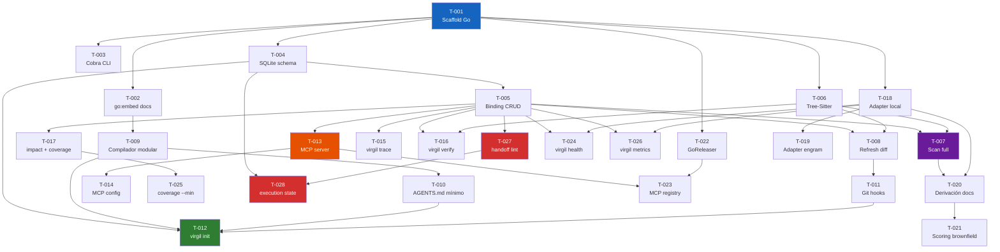

# Tasks: Virgil

## Tareas

### Fase 0 — Scaffold del proyecto Go

#### T-001: Inicializar módulo Go con estructura de directorios

- **Descripción**: Crear el módulo Go (`github.com/user/virgil`), estructura de directorios (`cmd/`, `internal/`, `pkg/`, `docs/`, `templates/`), y configuración básica (Makefile, GoReleaser, .goreleaser.yaml).
- **Dependencias**: ninguna
- **Criterios de aceptación**:
  ```
  GIVEN un repositorio git nuevo
  WHEN se ejecuta `go build ./cmd/virgil`
  THEN compila un binario funcional que imprime versión con `--version`
  ```
- **Estimación**: S
- **Archivos afectados**: `go.mod`, `go.sum`, `cmd/virgil/main.go`, `Makefile`, `.goreleaser.yaml`

#### T-002: Embeber docs de metodología con go:embed

- **Descripción**: Copiar los 31 docs de metodología a `internal/methodology/docs/` y exponerlos via `go:embed` como `embed.FS`. Crear función `GetDoc(name) → content`.
- **Dependencias**: T-001
- **Criterios de aceptación**:
  ```
  GIVEN los 31 docs embebidos en el binario
  WHEN se llama GetDoc("overview")
  THEN retorna el contenido de docs/overview.md sin error
  ```
- **Estimación**: S
- **Archivos afectados**: `internal/methodology/embed.go`, `internal/methodology/docs/`

#### T-003: Configurar CLI con Cobra

- **Descripción**: Implementar el CLI con Cobra: root command, subcommands vacíos (`init`, `scan`, `refresh`, `verify`, `trace`, `impact`, `coverage`, `status`), flags globales (`--verbose`, `--config`).
- **Dependencias**: T-001
- **Criterios de aceptación**:
  ```
  GIVEN el binario compilado
  WHEN se ejecuta `virgil --help`
  THEN lista todos los subcommands con descripción
  ```
- **Estimación**: S
- **Archivos afectados**: `cmd/virgil/main.go`, `internal/cli/root.go`, `internal/cli/init.go`, etc.

---

### Fase 1 — Binding Layer (core engine)

#### T-004: Definir schema SQLite para binding layer

- **Descripción**: Crear el schema SQLite con las 4 tablas del modelo de datos (REQUIREMENT, CODE_ARTIFACT, TEST_ARTIFACT, BINDING) más índices para queries frecuentes. Implementar migrations.
- **Dependencias**: T-001
- **Criterios de aceptación**:
  ```
  GIVEN una llamada a InitDB(path)
  WHEN se crea la base de datos
  THEN contiene las 4 tablas con PKs, FKs, e índices correctos
  AND schema es idempotente (re-ejecutar no falla)
  ```
- **Estimación**: M
- **Archivos afectados**: `internal/binding/schema.go`, `internal/binding/db.go`

#### T-005: Implementar repository CRUD para binding layer

- **Descripción**: Repository pattern sobre SQLite: Create/Read/Update/Delete para cada entidad, más queries compuestas (trace, impact, coverage, stale).
- **Dependencias**: T-004
- **Criterios de aceptación**:
  ```
  GIVEN un binding DB inicializado
  WHEN se ejecuta repo.Declare("AC-3", "src/pdf.go", "PdfService.Generate")
  THEN crea REQUIREMENT (si no existe), CODE_ARTIFACT, y BINDING
  AND repo.Trace("AC-3") retorna el binding creado
  ```
- **Estimación**: M
- **Archivos afectados**: `internal/binding/repository.go`, `internal/binding/queries.go`

#### T-006: Integrar GoTreeSitter para parsing AST (pure Go)

- **Descripción**: Integrar GoTreeSitter (`odvcencio/gotreesitter` v0.49+) — reimplementación pure Go de Tree-Sitter con 205 grammars embebidas. Sin CGo. Extraer símbolos (funciones, clases, módulos, interfaces) de un archivo fuente para los lenguajes tier-1 (Go, TypeScript, JavaScript, Python, Rust, Java).
- **Dependencias**: T-001
- **Criterios de aceptación**:
  ```
  GIVEN un archivo TypeScript con una clase PdfService y método generate()
  WHEN se ejecuta parser.ExtractSymbols("pdf.service.ts")
  THEN retorna [{symbol: "PdfService", type: "class"},
                {symbol: "PdfService.generate", type: "method"}]
  ```
- **Estimación**: L
- **Archivos afectados**: `internal/parser/treesitter.go`, `internal/parser/grammars.go`, `internal/parser/symbols.go`

#### T-007: Implementar scanner completo (`virgil scan --full`)

- **Descripción**: Combinar Tree-Sitter parser + binding repository para crawl exhaustivo: walk del codebase, extracción de símbolos, construcción del grafo de CODE_ARTIFACT, inferencia de relaciones internas.
- **Dependencias**: T-005, T-006
- **Criterios de aceptación**:
  ```
  GIVEN un codebase de proyecto TypeScript con 10 archivos
  WHEN se ejecuta `virgil scan --full`
  THEN .virgil/bindings.db contiene CODE_ARTIFACTs para todos
       los símbolos públicos, con relaciones de dependencia
  AND el progreso se muestra en stdout
  ```
- **Estimación**: L
- **Archivos afectados**: `internal/scanner/full.go`, `internal/scanner/walker.go`, `internal/cli/scan.go`

#### T-008: Implementar refresh incremental (`virgil refresh --diff`)

- **Descripción**: Dado un git diff, re-parsear solo los archivos cambiados, actualizar CODE_ARTIFACTs modificados, marcar STALE bindings donde el código cambió, inferir bindings nuevos si docs funcionales cambiaron.
- **Dependencias**: T-005, T-006
- **Criterios de aceptación**:
  ```
  GIVEN un diff que modifica pdf.service.ts
  WHEN se ejecuta `virgil refresh --diff`
  THEN re-parsea solo pdf.service.ts, actualiza CODE_ARTIFACTs,
       marca STALE los bindings del AC asociado si la firma cambió
  AND el tiempo es proporcional al diff, no al codebase
  ```
- **Estimación**: M
- **Archivos afectados**: `internal/scanner/incremental.go`, `internal/cli/refresh.go`

---

### Fase 2 — `virgil init` y delivery modular

#### T-009: Implementar compilador modular (docs → skills)

- **Descripción**: Transformar los 31 docs embebidos en skills individuales: 1 archivo por fase/concepto, con frontmatter (nombre, descripción, trigger), contenido auto-contenido. Output a `.virgil/skills/`.
- **Dependencias**: T-002
- **Criterios de aceptación**:
  ```
  GIVEN los 31 docs de metodología embebidos
  WHEN el compilador ejecuta
  THEN genera N skills en .virgil/skills/,
       cada uno con frontmatter válido y contenido < 150 líneas
  AND la suma de skills cubre el 100% del contenido de los 31 docs
  ```
- **Estimación**: L
- **Archivos afectados**: `internal/compiler/modular.go`, `internal/compiler/skill.go`, `internal/compiler/templates/`

#### T-010: Generar AGENTS.md mínimo (40-80 líneas)

- **Descripción**: Template para AGENTS.md con: axiomas (5-10 líneas), build/test, bootstrap SM, lista de skills (nombre + descripción). Configurable por proyecto.
- **Dependencias**: T-009
- **Criterios de aceptación**:
  ```
  GIVEN el compilador ejecutado
  WHEN genera AGENTS.md
  THEN tiene entre 40-80 líneas,
       contiene axiomas, build/test, bootstrap SM,
       y lista completa de skills disponibles
  ```
- **Estimación**: S
- **Archivos afectados**: `internal/compiler/agents.go`, `templates/AGENTS.md.tmpl`

#### T-011: Implementar instalación de git hooks

- **Descripción**: Detectar si existe husky/lefthook. Si sí, integrar via su config. Si no, instalar shell scripts en `.git/hooks/`. Cada hook delega a `virgil refresh --diff` con los argumentos apropiados.
- **Dependencias**: T-008
- **Criterios de aceptación**:
  ```
  GIVEN un proyecto con git pero sin husky
  WHEN virgil init ejecuta la fase de hooks
  THEN instala post-commit, post-merge, post-rewrite, post-checkout
       en .git/hooks/, cada uno invocando virgil refresh
  AND los hooks son ejecutables (chmod +x)
  ```
- **Estimación**: M
- **Archivos afectados**: `internal/hooks/installer.go`, `internal/hooks/templates/`

#### T-012: Comando `virgil init` completo

- **Descripción**: Orquestar: detectar proyecto, compilar skills, generar AGENTS.md, instalar hooks, crear binding DB vacío, generar MCP config. Idempotente.
- **Dependencias**: T-004, T-009, T-010, T-011
- **Criterios de aceptación**:
  ```
  GIVEN un directorio con git inicializado
  WHEN se ejecuta `virgil init`
  THEN crea: AGENTS.md, .virgil/skills/, .virgil/bindings.db,
       .virgil/mcp.json, hooks en .git/hooks/
  AND agrega .virgil/bindings.db a .gitignore
  AND re-ejecutar no duplica ni rompe nada (idempotente)
  ```
- **Estimación**: M
- **Archivos afectados**: `internal/cli/init.go`, `internal/init/orchestrator.go`

---

### Fase 3 — MCP Server

#### T-013: Implementar MCP server (JSON-RPC sobre stdio)

- **Descripción**: MCP server en Go que expone tools del binding layer. Protocolo: JSON-RPC sobre stdio. Tools: virgil_trace, virgil_impact, virgil_coverage, virgil_stale, virgil_declare.
- **Dependencias**: T-005
- **Criterios de aceptación**:
  ```
  GIVEN el MCP server corriendo via stdio
  WHEN se envía una request JSON-RPC para virgil_trace("AC-3")
  THEN retorna los bindings, code artifacts y test artifacts asociados
  AND el response time es < 500ms
  ```
- **Estimación**: L
- **Archivos afectados**: `internal/mcp/server.go`, `internal/mcp/tools.go`, `internal/mcp/protocol.go`

#### T-014: Generar configuración MCP para el proyecto

- **Descripción**: Generar `.virgil/mcp.json` durante `virgil init` con la configuración para que Claude Code (u otro agente) descubra y conecte con el MCP server.
- **Dependencias**: T-013
- **Criterios de aceptación**:
  ```
  GIVEN virgil init ejecutado
  WHEN un agente lee .virgil/mcp.json
  THEN contiene: command (path al binario), args (["mcp"]),
       tools disponibles con schemas JSON
  ```
- **Estimación**: S
- **Archivos afectados**: `internal/mcp/config.go`

---

### Fase 4 — CLI queries y verify

#### T-015: Implementar `virgil trace <AC-ID>`

- **Descripción**: Dado un AC identifier, mostrar en terminal: bindings, archivos de código vinculados, tests asociados, confidence level, status.
- **Dependencias**: T-005
- **Criterios de aceptación**:
  ```
  GIVEN un binding DB con datos
  WHEN se ejecuta `virgil trace AC-3`
  THEN muestra tabla formateada con: code artifacts, test artifacts,
       confidence (declared|inferred|verified), status (active|stale|broken)
  ```
- **Estimación**: S
- **Archivos afectados**: `internal/cli/trace.go`

#### T-016: Implementar `virgil verify <AC-ID>`

- **Descripción**: Scan focalizado de un AC: leer spec, escanear implementación actual via Tree-Sitter, comparar con bindings existentes, retornar implemented|stale|broken, actualizar confidence a verified.
- **Dependencias**: T-005, T-006
- **Criterios de aceptación**:
  ```
  GIVEN un AC con binding declared
  WHEN se ejecuta `virgil verify AC-3`
  THEN re-escanea el código vinculado,
       verifica que el símbolo existe y es coherente,
       actualiza confidence a verified,
       retorna status: implemented | stale | broken
  ```
- **Estimación**: M
- **Archivos afectados**: `internal/cli/verify.go`, `internal/binding/verifier.go`

#### T-017: Implementar `virgil impact <file>` y `virgil coverage`

- **Descripción**: `impact`: dado un archivo, retornar todos los ACs afectados. `coverage`: porcentaje de ACs con binding verified vs total.
- **Dependencias**: T-005
- **Criterios de aceptación**:
  ```
  GIVEN un binding DB con datos
  WHEN se ejecuta `virgil impact src/pdf.service.ts`
  THEN lista todos los ACs vinculados a ese archivo
  AND `virgil coverage` muestra: total ACs, verified, stale, broken, %
  ```
- **Estimación**: S
- **Archivos afectados**: `internal/cli/impact.go`, `internal/cli/coverage.go`

#### T-024: Implementar `virgil health` (métricas de proyecto)

- **Descripción**: Comando que reporta salud general del proyecto: binding coverage %, staleness %, docs completeness (qué artefactos existen de idea→handoff→operación), gaps detectados. Reemplaza code review con gestión desde nivel superior (dogma Uncle Bob).
- **Dependencias**: T-005, T-018
- **Criterios de aceptación**:
  ```
  GIVEN un proyecto con binding layer y docs funcionales
  WHEN se ejecuta `virgil health`
  THEN reporta: binding coverage %, staleness %, docs presentes
       (idea|spec|design|tasks|handoff|ops), gaps (código sin AC, AC sin código)
  ```
- **Estimación**: M
- **Archivos afectados**: `internal/cli/health.go`, `internal/binding/health.go`

#### T-025: Implementar `virgil coverage --min` (gate de CI)

- **Descripción**: Flag `--min` que hace exit(1) si el binding coverage está por debajo del umbral. Para uso como gate en pipelines de CI.
- **Dependencias**: T-017
- **Criterios de aceptación**:
  ```
  GIVEN binding coverage del proyecto en 65%
  WHEN se ejecuta `virgil coverage --min 80`
  THEN exit code 1 con lista de ACs no cubiertos
  AND `virgil coverage --min 60` retorna exit code 0
  ```
- **Estimación**: S
- **Archivos afectados**: `internal/cli/coverage.go`

#### T-026: Implementar `virgil metrics` (orquestación de herramientas externas)

- **Descripción**: Comando que detecta herramientas de métricas disponibles por lenguaje (mutation: mutate4go/Stryker/pitest, complexity: gocyclo/eslint, CRAP: crap4go), las ejecuta via os/exec, parsea resultados, y los persiste junto al binding layer. Degradación elegante cuando no hay herramientas instaladas. Thresholds configurables por tier.
- **Dependencias**: T-005, T-018
- **Criterios de aceptación**:
  ```
  GIVEN un proyecto Go con mutate4go y gocyclo instalados
  WHEN se ejecuta `virgil metrics`
  THEN ejecuta ambas herramientas, parsea resultados,
       reporta mutation score y complexity por módulo,
       y persiste en el binding layer
  AND si falta una herramienta, reporta "no disponible"
       con sugerencia de instalación por lenguaje
  ```
- **Estimación**: M
- **Archivos afectados**: `internal/metrics/orchestrator.go`, `internal/metrics/adapters/`, `internal/cli/metrics.go`

#### T-027: Implementar `virgil handoff lint` (gate determinístico)

- **Descripción**: Linter del contrato de handoff que valida completitud: ACs con ID, tasks con deps válidas, refs a spec/design, DAG sin ciclos, estimaciones presentes. Emite errores con guía de reparación. Gate mecánico para "ZERO código sin handoff aprobado".
- **Dependencias**: T-005
- **Criterios de aceptación**:
  ```
  GIVEN un handoff.md con un AC sin ID y una task con dep rota
  WHEN se ejecuta `virgil handoff lint`
  THEN reporta 2 errores con: qué falló, dónde, cómo arreglarlo
  AND exit code 1
  AND un handoff.md correcto retorna exit code 0
  ```
- **Estimación**: M
- **Archivos afectados**: `internal/handoff/linter.go`, `internal/handoff/rules.go`, `internal/cli/handoff.go`

#### T-028: Implementar execution state y claiming de tasks

- **Descripción**: Tabla execution_state en bindings.db para tracking de ejecución del handoff: task_id, status (pending|claimed|done), lane, timestamps, commit_sha. Comando `virgil claim T-XXX` con verificación de precondiciones. `virgil status` muestra progreso. Auto-claim cuando hay un solo lane.
- **Dependencias**: T-004, T-027
- **Criterios de aceptación**:
  ```
  GIVEN un handoff en ejecución con T-005 pendiente y T-004 done
  WHEN se ejecuta `virgil claim T-005 --lane A`
  THEN status cambia a claimed, con owner y timestamp
  AND `virgil claim T-005 --lane B` falla (ya claimed)
  AND `virgil claim T-007 --lane A` falla (dep T-006 no done)
  AND `virgil status` muestra estado de todas las tasks
  ```
- **Estimación**: M
- **Archivos afectados**: `internal/handoff/execution.go`, `internal/handoff/claiming.go`, `internal/cli/claim.go`, `internal/cli/status.go`

---

### Fase 5 — Adapter layer y doc storage

#### T-018: Implementar adapter local (default)

- **Descripción**: Adapter que lee/escribe docs funcionales como archivos markdown en la raíz del proyecto. Implementa la interfaz DocAdapter.
- **Dependencias**: T-001
- **Criterios de aceptación**:
  ```
  GIVEN configuración por default (sin adapter explícito)
  WHEN se llama adapter.Read("spec")
  THEN lee y retorna el contenido de spec.md desde la raíz del proyecto
  AND adapter.Write("spec", content) escribe a spec.md
  ```
- **Estimación**: S
- **Archivos afectados**: `internal/adapter/local.go`, `internal/adapter/interface.go`

#### T-019: Implementar adapter de engram

- **Descripción**: Adapter que lee/escribe docs funcionales en engram persistent memory via MCP calls. Para proyectos que prefieren memoria persistente sobre archivos.
- **Dependencias**: T-018
- **Criterios de aceptación**:
  ```
  GIVEN adapter configurado como "engram" en .virgil/config.yaml
  WHEN se llama adapter.Read("spec")
  THEN recupera el contenido desde engram via mem_search/mem_get_observation
  ```
- **Estimación**: M
- **Archivos afectados**: `internal/adapter/engram.go`

---

### Fase 6 — Takeover flow

#### T-020: Implementar derivación de docs funcionales desde codebase

- **Descripción**: Dado el grafo del scan completo, generar docs funcionales equivalentes: analizar README/docs → idea.md equiv, tests → spec.md parcial (ACs inferidos), arquitectura detectada → design.md equiv. Identificar gaps.
- **Dependencias**: T-007, T-018
- **Criterios de aceptación**:
  ```
  GIVEN un codebase escaneado con grafo de bindings
  WHEN se ejecuta la derivación funcional
  THEN produce idea.md, spec.md, design.md equivalentes
       con gaps marcados (código sin doc, doc sin código)
  AND los docs siguen el schema de la metodología
  ```
- **Estimación**: L
- **Archivos afectados**: `internal/takeover/derive.go`, `internal/takeover/gaps.go`

#### T-021: Implementar scoring brownfield (fastForward + overrides)

- **Descripción**: Aplicar el sistema de scoring del framework con overrides para brownfield: determinar tier de activación, generar echo bootstrap plan.
- **Dependencias**: T-020
- **Criterios de aceptación**:
  ```
  GIVEN docs funcionales derivados con gaps
  WHEN se ejecuta el scoring
  THEN determina tier (Ligero | Standard | Enterprise),
       produce echo bootstrap plan con prioridades,
       y aplica overrides brownfield del framework
  ```
- **Estimación**: M
- **Archivos afectados**: `internal/takeover/scoring.go`, `internal/takeover/bootstrap.go`

---

### Fase 7 — Distribution y packaging

#### T-022: Configurar GoReleaser para multi-platform builds

- **Descripción**: Configurar `.goreleaser.yaml` para: builds (linux/darwin/windows × amd64/arm64), Homebrew tap, GitHub releases, checksums, changelog automático.
- **Dependencias**: T-001
- **Criterios de aceptación**:
  ```
  GIVEN el código compilable
  WHEN se ejecuta `goreleaser release --snapshot`
  THEN produce binarios para 6 targets (3 OS × 2 arch),
       genera Homebrew formula, y README de release
  ```
- **Estimación**: S (simplificado: pure Go, CGO_ENABLED=0, sin zig/musl)
- **Archivos afectados**: `.goreleaser.yaml`, `Formula/virgil.rb`

#### T-023: Registrar Virgil como MCP server en el registry

- **Descripción**: Configurar GoReleaser para publicar Virgil en el MCP registry, permitiendo que Claude Code y otros agentes descubran Virgil automáticamente.
- **Dependencias**: T-013, T-022
- **Criterios de aceptación**:
  ```
  GIVEN Virgil publicado via GoReleaser
  WHEN un agente busca en el MCP registry
  THEN encuentra Virgil con: nombre, descripción, tools disponibles
  ```
- **Estimación**: S
- **Archivos afectados**: `.goreleaser.yaml` (sección mcp)

---

## Orden de ejecución



### Ruta crítica

```
T-001 → T-004 → T-005 → T-007 → T-020 → T-021
              ↘ T-006 ↗
```

La ruta crítica pasa por: scaffold → SQLite schema → binding CRUD → Tree-Sitter → scan completo → derivación → scoring. El takeover flow es el camino más largo porque depende de toda la infraestructura del binding layer.

### Lanes paralelos

| Lane | Tareas | Tema |
|------|--------|------|
| A (crítico) | T-001 → T-004 → T-005 → T-007 → T-020 → T-021 | Binding engine + takeover |
| B | T-001 → T-006 → (merge con lane A en T-007) | Tree-Sitter parser |
| C | T-001 → T-002 → T-009 → T-010 → T-012 | Compilador + init |
| D | T-005 → T-013 → T-014, T-023 | MCP server |
| E | T-005 → T-015, T-016, T-017, T-024, T-025, T-026 | CLI queries + metrics |
| F | T-001 → T-018 → T-019 | Adapters |
| G | T-001 → T-022 → T-023 | Distribution |
| H | T-005 → T-027 → T-028 | Handoff gates + coordination |

---

## Metadata

- Fecha de creación: 2026-08-05
- Estado: borrador
- Total de tareas: 28
- Estimación agregada: 9S + 12M + 5L = ~140-190 horas de implementación
- Fases: 8 (0-7)
- Lanes paralelos: 8 (A-H)
- Ruta crítica: 6 tareas (T-001 → T-004 → T-005 → T-007 → T-020 → T-021)
